### Overview

Required Reading

* Chapter-3 from A-L. Barabási, [Network Science](http://barabasi.com/networksciencebook/) 2015.
* Chapter-7 (sections 7.1, 7.2, 7.3, 7.5) from A-L. Barabási, [Network Science](http://barabasi.com/networksciencebook/) 2015.

Recommended Reading

* Simulated Epidemics in an Empirical Spatiotemporal Network of 50,185 [Sexual Contacts](https://journals.plos.org/ploscompbiol/article?id=10.1371/journal.pcbi.1001109#s2).Luis E. C. Rocha, Fredrik Liljeros, Petter, Holme (2011) 

### Degree Distribution

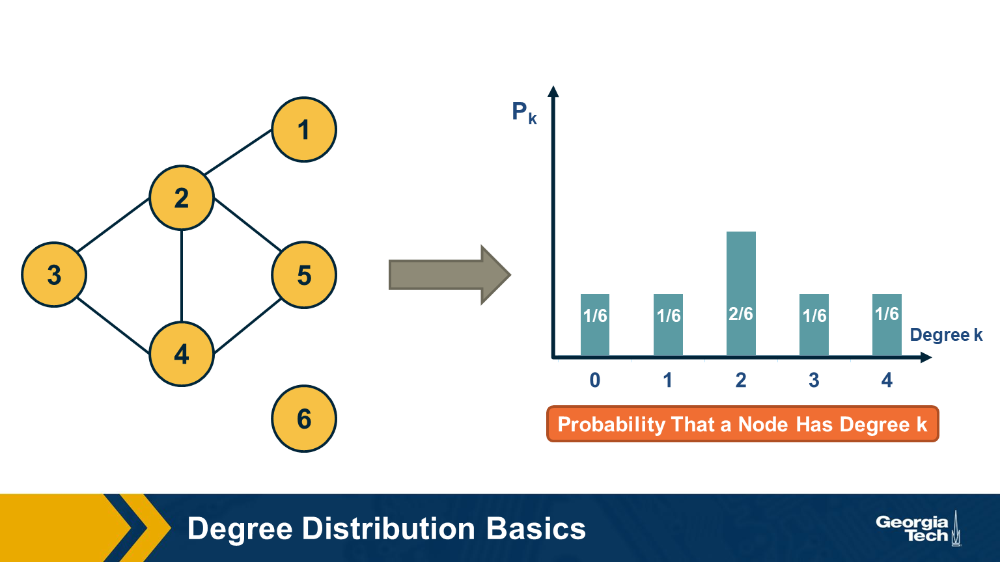

 The degree distribution of a given network shows the fraction of nodes with degree k. 

 If we think of networks as random samples from an ensemble of graphs, we can think of $p_k$ as the probability that a node has degree k, for k>=0. 

 The network in this visualization has six nodes and the plot shows the empirical probability density function (which is a histogram) for the probability $p_k$. 

### Degree Distribution Moments

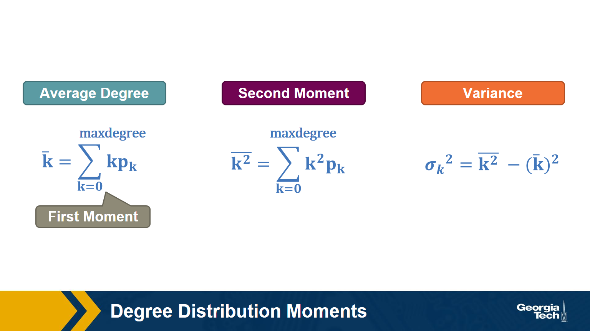

Recall that, given the probability distribution of a random variable, we can compute the first moment (mean), second moment, variance, etc. 

The above formulas show the moments that we will mostly use in this course: the average degree, the second moment of the degree (the average of the squared degrees), and the variance of the degree distribution. 

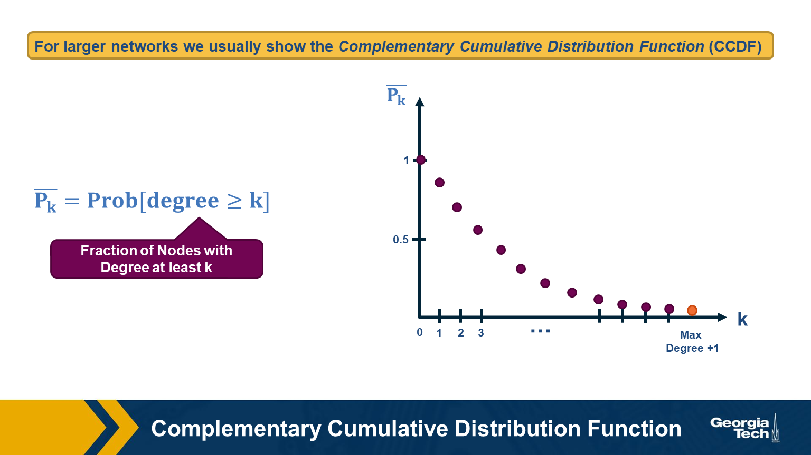

For larger networks, we usually do not show the empirical probability density function $p_k$.  Instead, we show the probability that the degree is at least k, for any k>=0.  

This is referred to as the Complementary Cumulative Distribution Function (denoted as C-CDF).  Note that $\bar{P}_k$= Prob[degree>=k] is the sum of all $p_x$ values for x>=k. 

### Two Special Degree Distributions

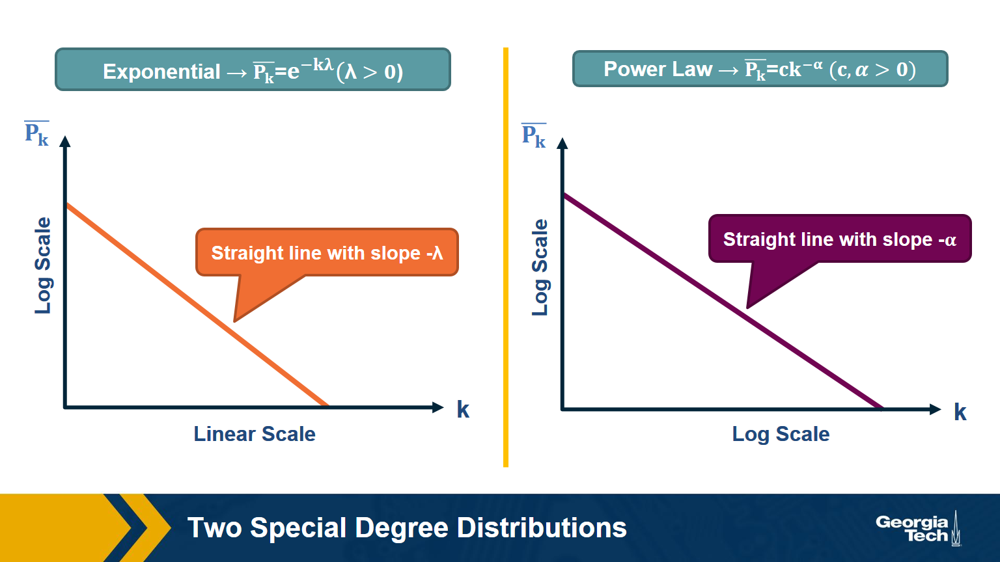

The C-CDF plots are often shown using a logarithmic scale at the x-axis and/or y-axis. Here is why.  

Suppose that the C-CDF decays exponentially fast. In a log-linear plot (as shown at the left in the image above), this distribution will appear as a straight line with slope $-\lambda$. The average degree in such networks is 1/$\lambda$. The probability that a node has degree at least k drops exponentially fast with k.  

On the other hand, in many networks, the C-CDF decays with a power-law of k. For example, if 
$\alpha=2$, the probability to see a node with a degree at least k drops proportionally to $1/k^2$
. In a log-log plot (as shown at the right), this distribution will appear as a straight line with slope $\alpha$. As we will see later in this course, such networks are referred to as “scale-free” and they are likely to have nodes with much larger degree than the average degree. 

> **Food for Thought**
> 
> Show why the previous two distributions give straight lines when we plot them in a log-linear and log-log scale, respectively.  Also show that, with the exponential degree distribution, the probability to see nodes with degree more than 10 times the average is about 1/10000 of the probability to see nodes with higher degree than the average.   On the other hand, with the power-law distribution, the probability to see nodes with degree more than 10 times the average is 1/100 of the probability to see nodes with higher degree than the average (when $\alpha =2$).
>
{: .prompt-info }

### Example: Degree Distribution of a Sex-Contact Network

Human sexual contacts for a special temporal network, the underlying structure over which sexually transmitted infections (STI) spread. By understanding the structure of the network, we can better understand the dynamics of such infections. Here we show you some results from a bipartite network between sex buyers and their escorts. The nodes in this bipartite network are either male sex buyers, about 17,000 of them or female escorts about 10,000 of them. An edge between them denotes sexual intercourse between a male sex buyer and the female escort.

The average degree of the male buyer is about 5. The average escort degree is about 7.6 and the maximum degree of nay node is actually 615. What you see in these plots is the probability density function of the node degrees, either for male clients or female escorts.

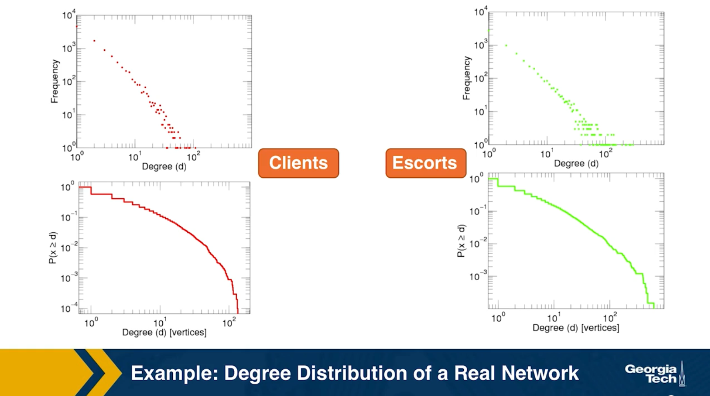

The plots at the lower part are the complimentary cumulative distribution functions of the degrees for this network in log log scale. These plots as you can see, they are not straight lines of course, but if we focus on the part of the distribution that extends up to the probability of 10 to the minus three, (0.001), They can be approximated as straight lines.

Note that even though 90% of the escorts have fewer than 20 clients there is a small number of hubs escorts that have a significantly larger number of clients. As we will see later in this course, such nodes that have a very very large degree can play a major role in epidemics.

[Simulated Epidemics in an Empirical Spatiotemporal Network of 50,185 Sexual Contacts](https://journals.plos.org/ploscompbiol/article?id=10.1371/journal.pcbi.1001109#s2).Luis E. C. Rocha, Fredrik Liljeros, Petter, Holme (2011) 

### Friendship paradox

Informally, the friendship paradox states: "On the average, your friends have more friends than you". 

In more general and precise terms, we will prove that: "The average degree of a node's neighbor is higher than the average node degree".

**The probability that a random edge connects to a node of degree k**

Let's start by deriving a simple fact that we will use repeatedly in this course. 

Suppose that we pick a random edge in the network – and we randomly select one of the two end-points of that edge -- *we refer to those end-points as the **stubs** of the edge.* What is the probability $q_k$ that a randomly chosen stub belongs to a node of degree k?  

This is easy to answer when the degrees of connected nodes are independent.  

$$
\begin{aligned}
q_k &= \text{(number of nodes of degree k)} \\
&\times \text{  (probability an edge connects to a specific node of degree k)} \\
&= np_k \frac{k}{2m} \\
&= \frac{ kp_k}{\frac{2m}{n}} \\
&= \frac{kp_k}{\bar{k}}
\end{aligned}
$$

Note that the probability that the randomly chosen stub connects to a node of degree k is proportional to both k and the probability that a node has degree k.  

This means that, for nodes with degree $k \ge \bar{k}$,  , it is more likely to sample one of their stubs than the nodes themselves. The opposite is true for nodes with degree $k \le \bar{k}$.

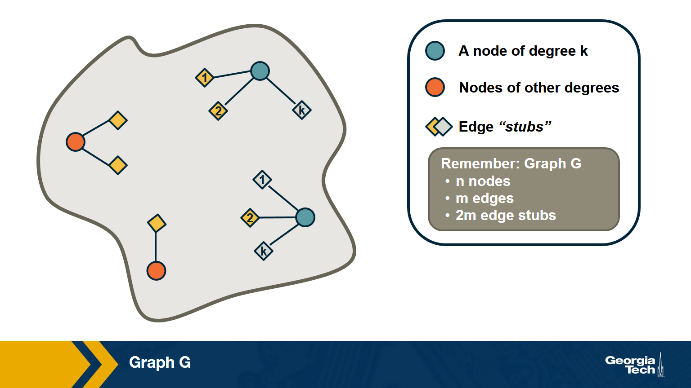

Based on the previous derivation, we can now ask: what is the expected value of a neighbor’s degree?  

Note that we are not asking for the average degree of a node. Instead, we are interested in the average degree of a node's neighbor.  

This is the same as the expected value of the degree of the node we select if we sample a random edge stub.  Lets denote this expected value as $\bar{k}_{nn}$.

The derivation is as follows:

$$\begin{aligned}
\bar{k}_{nn} &= \sum_{k=0}^{k_{\text{max}}} k \cdot q_k \\
&= \sum_k k \frac{kp_k}{\bar{k}} \\
&= \frac{\sum_k k^2p_k}{\bar{k}} \\
& = \frac{\bar{k^2}}{\bar{k}} \\
&= \frac{(\bar{k})^2+(\sigma_k)^2}{\bar{k}} \\
&= \bar{k} + \frac{\sigma_k^2}{\bar{k}}
\end{aligned}
$$

We can now give a mathematical statement of the friendship paradox: as long as the variance of the degree distribution is not zero, and given our assumption that neighboring nodes have independent degrees, the average neighbor’s degree is higher than the average node degree. 

The difference between the two expected values (i.e., $\sigma_k^2/\bar{k}$) increases with the the variability of the degree distribution.   

> **Food for Thought**
> 
> Can you explain in an intuitive way why the average neighbor’s degree is larger than the average node degree, as long as the degree variance is not zero?
>
{: .prompt-info }

### Two Extreme Cases of The Friendship Paradox

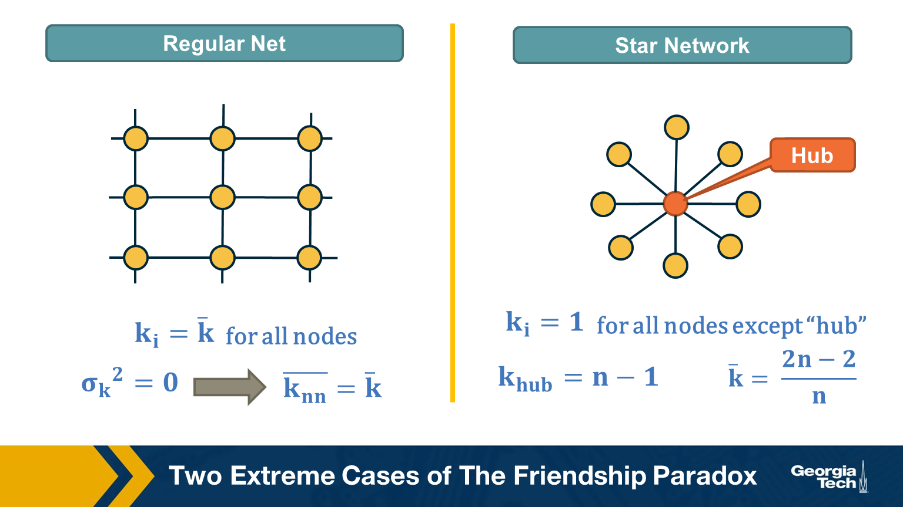

Think of two extremes in terms of degree distribution: an infinitely large regular network in which all nodes have the same degree (and thus the degree variance is 0), and an infinitely large star network with one hub node at the center and all peripheral nodes connecting only to the hub.   

In the regular network, the degree variance is zero and the average neighbor’s degree is not different than the average node degree. 

In the star network, on the other hand, the degree variance diverges as n increases, and so does the difference between the average node degree and the average neighbor degree.

> **Food for Thought**
> 
> Derive the second moment of the degree distribution for the star network as the size of the network tends to infinity.  
>
{: .prompt-info }

### Application of Friendship Paradox in Immunization Strategies

An interesting vaccination strategy that is based on friendship paradox is refer to as Acquaintance immunization. 

Instead of vaccinating random people, we select few few individuals, and ask each of them to identify his or her contact with a maximum number of connections. These contacts may be a sexual partner or other type of contact depending on the underlying virus. Now, based on the friendship paradox, we know that even network include some hubs, then they are probably connected to some of the random selected individuals we choose to survey.

### The G(n,p) model (ER Graphs)

Let's consider now the simplest random graph model and its degree distribution. 

This model is referred to as G(n, p) and it can be described as follows: the network has n nodes and the probability that any two distinct nodes are connected with an undirected edge is p.   

The model is also referred to as the Gilbert model, or sometimes the Erdős–Rényi  (ER) model, from the last names of the mathematicians that first studied its properties in the late 1950s. 

Note that the number of edges m in the G(n,p) is a random variable. The expected number of edges is  $p \cdot \frac{n(n-1)}{2}$, the average node degree is $p \cdot (n-1)$, the density of the network is $p$ and the degree variance is $p\cdot(1-p)\cdot(n-1)$. These formulas assume that we do not allow self-edges.  

The degree distribution of the G(n,p) model follows the Binomial(n-1,p) distribution because each node can be connected to n-1 other nodes with probability p.  

Note that the G(n,p) model does not necessarily create a connected network – we will return to this point a bit later. 

Also, in the G(n,p) model there are no correlations between the degrees of neighboring nodes. So, if we return to the friendship paradox, the average neighbor degree at a G(n,p) network is 

* $\bar{k}_{nn} = \bar{k} + (1-p)$ (using the Binomial distribution) 
* or $\bar{k}_{nn} = \bar{k} + 1$ (using the poisson approximation when $p \ll 1$ )

In other words, if we reach a node v by following an edge from another node, the expected value of v’s degree is one more than the average node degree. 

> **Food for Thought**
> 
> Derive the previous expressions for the average neighbor degree with both the Binomial and Poisson degree distributions.
>
{: .prompt-info }

### Degree Distribution of G(n,p) Model

Here is a well-known fact that you may have learned in a probability course: the Binomial distribution can be approximated by the Poisson distribution as long as $p$  is much smaller than 1. In other words, this approximation is true for sparse networks in which the average degree $p \cdot (n-1)$  is much lower than the size of the network n.  The Poisson distribution is described by:

$$
\begin{aligned}
p_k &= e^{-\bar{k}} \cdot \frac{\bar{k}^k}{k!}, k = 0,1,2, ...\\
\bar{k} &= p \cdot (n-1) \\
\sigma_k^2 &= \bar{k}
\end{aligned}
$$

Because of the $\frac{1}{k!}$ term, $p_k$ decreases with $k$ faster than expontentially.

You may ask, why to use the Poisson approximation instead of the Binomial(n-1,p) distribution?  

The reason is simple: the Poisson distribution has a single parameter, which is the average node degree $\bar{k}$.

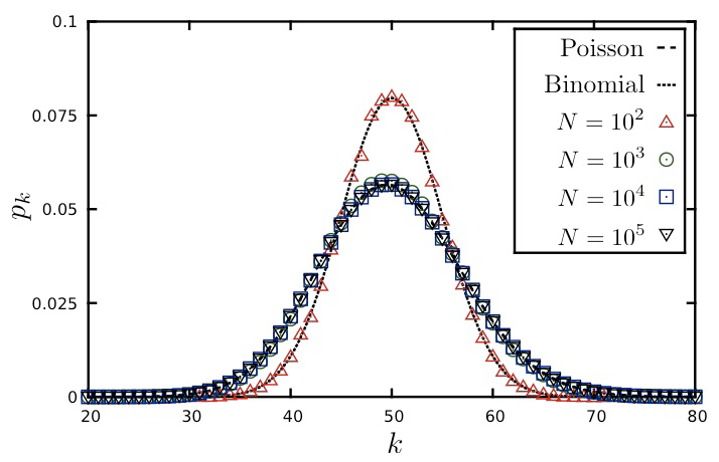

The visualization shows the degree distribution for a network in which the average degree is 50. As we increase the number of nodes n, we need to decrease the connection probability p so that their product remains constant. Note that the Poisson distribution is a rather poor approximation for n=100 (because the average node degree is half of n) but it is excellent as long as n is larger than 1000.  

> **Food for Thought**
> Try to derive mathematically the Poisson distribution from the Binomial distribution for the case that p is much smaller than 1 and n is large. If you cannot do it, refer to a textbook or online resource for help.  
>
{: .prompt-info }

### Connected Components in G(n,p)



Clearly, there is no guarantee that the G(n,p) model will give us a connected network. If $p$  is close to zero, the network may consist of many small components. So an important question is: **how large is the Largest Connected Component (LCC) of the G(n,p) model?**

Here is an animation that shows a network with n=1000 nodes, as we increase the average node degree $\bar{k}$  (shown at the upper-left of the animation). Recall that the connection probability is approximately $p \approx \frac{\bar{k}}{n}$.

As you see, initially we have only small groups of connected nodes -- typically just 2-3 nodes in every connected component.

After the first 5-10 seconds of the animation however, we start seeing larger and larger connected components. Most of them do not include any loops – they form tree topologies.

Gradually, however, as the average degree approaches the critical value of one, we start seeing some connected components that include loops.

Something interesting happens when the average degree exceeds one (about 40 seconds after the start of the animation): the largest connected component (LCC), which is identified with a different color than the rest of the nodes, starts covering a significant fraction of all network nodes. It starts becoming a “**giant component**”.

If you continue watching this animation until the end (it takes about five minutes), you will see that this giant component gradually changes color from dark blue to light blue to yellow to red – the color “temperature” represents the fraction of nodes in the LCC. Eventually, all the nodes join the LCC when the average node degree is about 6 in this example.

### Size of LCC in G(n,p) as Function of p

We can derive the relation between p and the size of the LCC as follows:  

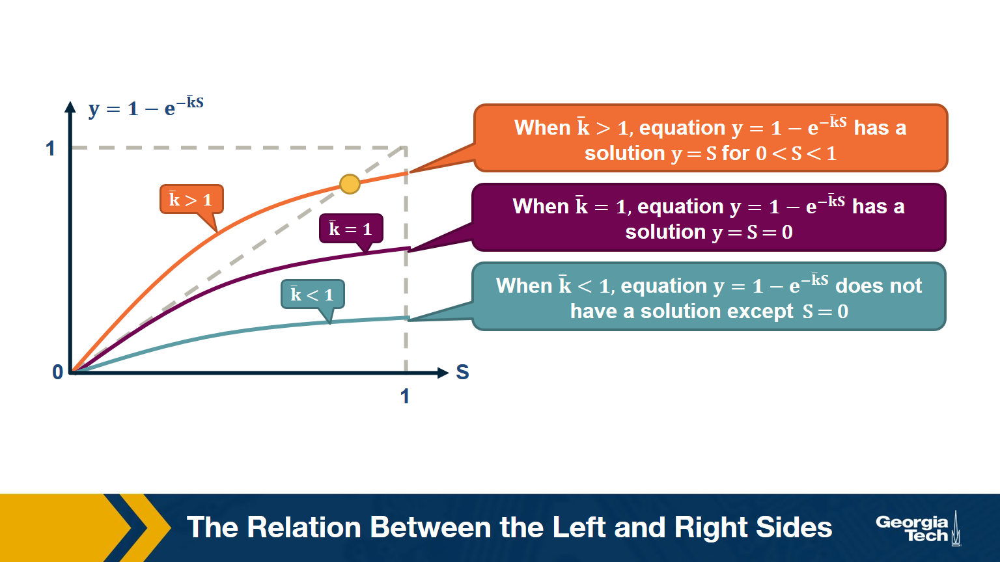

Suppose that S is the probability that a node belongs in the LCC. Another way to think of S is as the expected value of the fraction of network nodes that belong in the LCC.  

Then, $\bar{S} = 1- S$  is the probability that a node does NOT belong in the LCC.  

That probability can be written as:

$$
\bar{S} = \big( (1-p)  + p \cdot \bar{S} \big)^{n-1}
$$

The first term refers to the case that a node v is not connected to another node, while the second term refers to the case that v is connected to another node that is not in the LCC. 

Since, $p = \frac{\bar{k}}{n-1}$, , the last equation can be written as:

$$
\begin{aligned}
\bar{S} &= \bigg( 1- \frac{\bar{k}}{n-1} \bigg( 1- \bar{S}\bigg)\bigg)^{n-1} \\
ln \bar{S} &= (n-1) ln \bigg( 1- \frac{\bar{k}}{n-1} \bigg( 1- \bar{S}\bigg)\bigg) \\
&\approx -(n-1)\frac{\bar{k}}{n-1}\bigg(1-\bar{S}\bigg) (\text{by taylor expansion})\\
S &= 1-e^{-\bar{k}S}
\end{aligned}
$$

The visualization shows the relation between the left and right sides of the previous equation, i.e., the relation between S and $1-e^{-\bar{k}S}$.

The equality is true when the function $y = 1-e^{-\bar{k}S}$ crosses the diagonal x=y line.

Note that the derivative of y with respect to S is approximately $\bar{k}$  when S approaches 0.  

So, if the average degree is larger than one, the function y(S) starts above the diagonal. It has to cross the diagonal at a positive value of S because its second derivative of y(S) is negative. That crossing point is the solution of the equation $S=1-e^{-\bar{k}S}$. . **This means that if the average degree is larger than one ($\bar{k} > 1$), the size of the LCC is S>0.**

One the other hand, if the average node degree is less (or equal) than 1, the function y(S) starts with a slope that is less (or equal) than 1, and it remains below the diagonal y=x for positive S. This means that if the average node degree is less or equal than one, the average size of the LCC in a G(n,p) network includes almost zero nodes.  

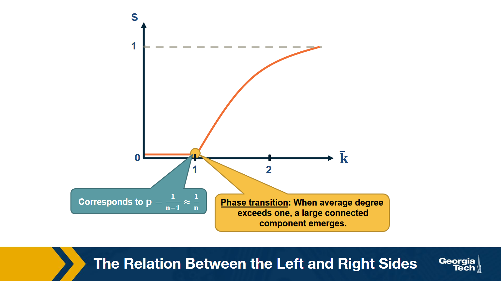

The visualization shows how S increases with the average node degree $\bar{k}$. Note how the LCC suddenly “explodes” when the average node degree is larger than 1. This is referred to as “phase transition”. A phase transition that we are all familiar with is what happens to water when its temperature reaches the freezing or boiling temperature: the macroscopic state changes abruptly from liquid to solid or gas. Something similar happens with G(n,p) when the average node degree exceeds the critical value $\bar{k}=1$: the network suddenly acquires a “giant connected component” that includes a large fraction of all network nodes.  

Note that the critical point corresponds to a connection probability of $p=\frac{1}{n-1}\approx \frac{1}{n}$ because $\bar{k} = (n-1) \times p $.

### When Does G(n,p) have a Single Connected Component?

Here is one more interesting question about the size of the LCC: how large should p (or $k$) be so that the LCC covers all network nodes?  

Note that the previous derivation did not answer this question – it simply told us that there is a phase transition when $k =1$

Suppose again that S is the probability that a node belongs in the LCC.  

Then, the probability that a node does NOT connect to ANY node in the LCC :

$$
\left(1-p\right)^{S \, n}\approx\left(1-p\right)^n\:if\:S\approx1
$$

The expected number of nodes not connecting to LCC:

$$
\overline{k_o}\:=\:n\cdot\left(1-p\right)^n\:=\:n\left(1-\frac{np}{n}\right)^n\approx n\cdot e^{-np}
$$

Recall that $\left(1-\frac{x}{n}\right)^n\approx e^{-x}$ when $x\ll n$. So we assume at this point of the derivation that the network is sparse ($p \ll 1$).

If we set $\overline{k_o}$  to less than one node, we get that:

$$
\begin{aligned}
\:n\cdot e^{-np}&\le\:1 \\
-np&\le\ln\left(\frac{1}{n}\right)=-\ln n \\
p&\ge\frac{\ln n}{n} \\
\overline{k}&=np\:\ge\ln n
\end{aligned}
$$

which means that when the **average degree is higher than the natural logarithm of the network size ($\bar{k}>\ln{n}$) we expect to have a single connected component.**

### Degree Correlations

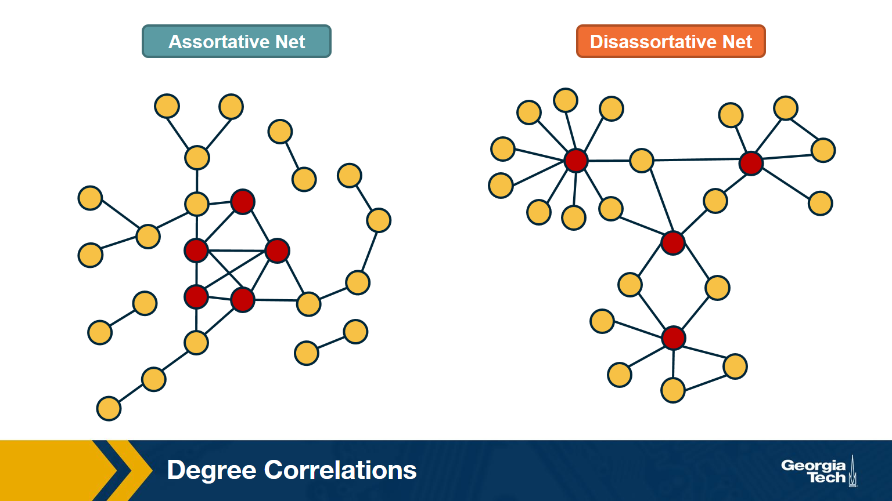

We assumed throughout this lesson that the degree of a node does not depend on the degree of its neighbors. In other words, **we assumed that there are no degree correlations.**

Mathematically, if nodes u and v are connected, we have assumed that:

* `Prob[degree(u) = k | degree(v) = k'] =`
* `Prob[degree(u) = k | u connects to another node] =`
* $q_k$ =
* $p_k \cdot \frac{k}{\bar{k}}$

Note: this probability does not depend on the degree k’ of neighbor v.  Such networks are referred to as **neutral**. 

In general, however, there are correlations between the degrees of neighboring nodes, and they are described by the conditional probability distribution: 

`P[k'|k] =  Prob[a neighbor of a k-degree node has degree k']`

The expected value of this distribution is referred to as the average nearest-neighbor degree $k_{nn}(k)$  of degree-k nodes:

$$
k_{nn}(k) = \sum_{k'} k' \cdot P(k'|k)
$$

In a neutral network, we have already derived that $k_nn(k)$ is independent of k (recall that we derived $k_{nn}(k) = \bar{k} + \frac{\sigma_k^2}{\bar{k}} = \bar{k}_{nn}$

In most real networks, $k_{nn}(k)$$  depends on k and it shows an increasing or decreasing trend with k.  

The network at the left shows an example in which small-degree nodes tend to connect with other small-degree nodes (and similarly for high-degree nodes). 

The network at the right shows an example of a network in which small-degree nodes tend to connect to high-degree nodes. 

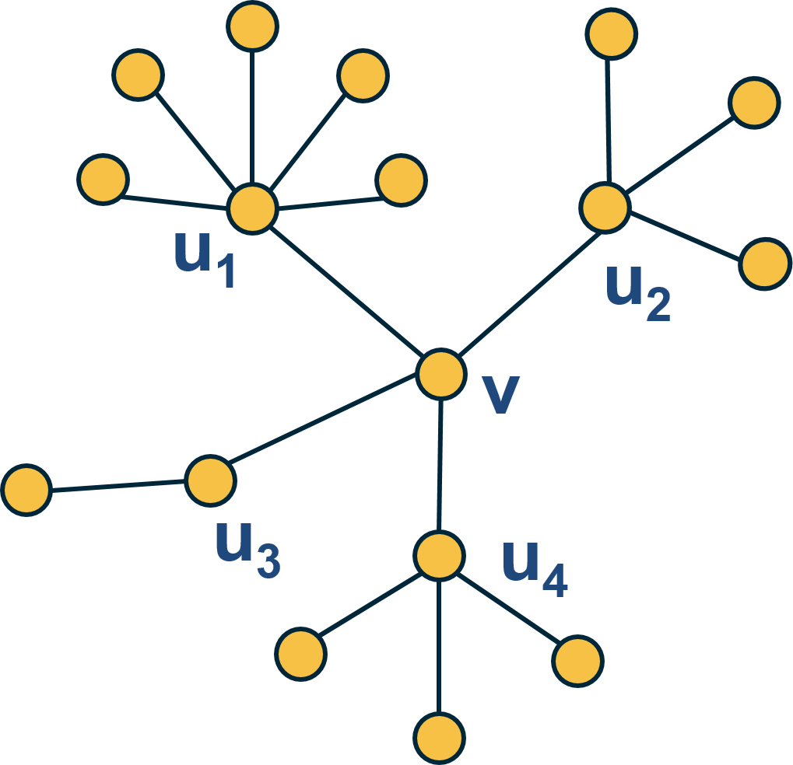{: width="200" height="400"}

Here is an example: what is the average nearest neighbor degree of node v in this network? 

$$
\overline{k_{nn}}\left(v\right)\:=\frac{\:1}{k\left(v\right)}\sum_{i=1}^{k\left(v\right)}k\left(u_i\right)=\frac{6+4+2+4}{4}\:=\:4
$$

To calculate $k_{nn}(k)$ we compute the average value of $k_{nn}(v)$ for all nodes v with $k(v)=x$
.  

Then, we plot $k_{nn}(k)$ versus k, and examine whether that plot shows a statistically significant positive or negative trend.  

### How to Measure Degree Correlations

One way to quantify the degree correlations in a network is by modeling (i.e., approximating) the relationship between the average nearest neighbor degree $k_{nn}(k)$ and the degree k with a power-law of the form:

$$
{k_{nn}}\left(k\right)\approx a\cdot k^{\mu}
$$

Then, we can estimate the exponent $\mu$ from the data.  

1. If $\mu >0$, we say that the network is Assortative: higher-degree nodes tend to have higher-degree neighbors and lower-degree nodes tend to have lower-degree neighbors. Think of celebrities dating celebrities, and loners dating other loners. 

2. If $\mu < 0$, we say that the network is Disassortative: higher-degree nodes tend to have lower-degree neighbors. Think of a computer network in which high-degree aggregation switches connect mostly to low-degree backbone routers.  

3. If $\mu$ is statistically not significantly different from zero, we say that the network is Neutral.  

> **Food for Thought**
> 
> Suppose that instead of this power-law relation between $k_{nn}(k)$ and k we had used a linear statistical model. How would you quantify degree correlations in that case?
> 
> **Hint**: How would you apply Pearson's correlation metric to quantify the correlation between degrees of adjacent nodes?
{: .prompt-info }

### Assortative, Neutral and Disassortative Networks

Let's look at some examples of science degree correlation plots from real world networks. The first network refers to the collaboration between a group of scientists, two nodes are connected if they have written at least one research paper together. Notice that the data is quite noisy especially when the degree K is more than 70. 

The reason is simply that we did not have a large enough sample of such nodes with large degrees. Nevertheless, we clearly see a positive correlation between the degree K and the degree of the nearest neighbor which is shown in the y axis.

If we model the data with a power law relation, the exponent $\mu$ is approximately 0.37 in this case. We can use this value to quantify and compare the sort of activity of different networks when the estimate is $\mu$ is statistically significant.

The second network refers to a portion of the power grid in the United States. the data in this case does not support a strong correlation between the degree K and the degree of the nearest neighbor. So it is safe to assume that this network is what we call neutral

The third network refers to a metabolic network where nodes here are metabolites and they are connected if two metabolites A and B appear in the opposite side of the same chemical reaction in a biological cell. The data shows a strong negative correlation in this case but only if the nodes have degree 5, 10, or higher. If we model the data with power law relation, the exponent $\mu$ is approximately minus 0.86. This suggests that complex metabolites such as glucose are either synthesized through a process called anabolism or broken down into through a process called catabolism into a large number of simpler molecules such as carbon dioxide.

### Lesson Summary

The main objective of this lesson was to explore the notion of “degree distribution” for a given network. The degree distribution is probably the first thing you will want to see for any network you encounter from now on. It gives you a quantitative and concise description of the network’s connectivity in terms of average node degree, degree variability, common degree modes, presence of nodes with very high degrees, etc.  

In this context, we also examined a number of related topics. First, the friendship paradox is an interesting example to illustrate the importance of degree variability. We also saw how the friendship paradox is applied in practice in vaccination strategies. 

We also introduced G(n,p), which is a fundamental model of random graphs – and something that we will use extensively as a baseline network from now on. We explained why the degree distribution of G(n,p) networks can be approximated with the Poisson distribution, and analyzed mathematically the size of the largest connected component in such networks.  

Obviously, the degree distribution does not tell the whole story about a network. For instance, we talked about networks with degree correlations. This is an important property that we cannot infer just by looking at the degree distribution. Instead, it requires us to think about the probability that two nodes are connected as a function of their degrees.  

We will return to all of these concepts and refine them later in the course.