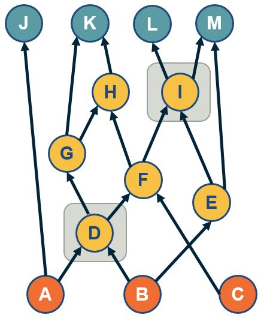

### Overview

Required Reading

* Chapter 7 (mostly sections 7.1-7.8) - M.E.J.Newman, [Networks: An Introduction](https://www.amazon.com/Networks-Mark-Newman/dp/0198805098)., Oxford University press. 
* Section 14.3 -  D. Easley and J. Kleinberg, [Networks, Crowds and Markets](https://www.cambridge.org/core/books/networks-crowds-and-markets/A70C7855A3003FE1079C25F8397AF641) , Cambridge Univ Press, 2010 (also available [online](https://www.cs.cornell.edu/home/kleinber/networks-book/networks-book.pdf))
* [“Rich-clubness test: how to determine whether a complex network has or doesn’t have a rich-club?”](https://gatech.instructure.com/courses/336054/files/41680931/download?wrap=1) By Alessandro Muscoloni and Carlo Vittorio Cannistraci

Recommended Reading

* Sabrin, K, Dovrolis, C. [The Hourglass Effect in Hierarchical Dependency Networks](https://www.cambridge.org/core/journals/network-science/article/hourglass-effect-in-hierarchical-dependency-networks/DDBCA83D16CA74B827DAB66A98CC906A), Journal of Network Science, (2017)
* Faskowitz, J., Yan, X., Zuo, X. et al. [Weighted Stochastic Block Models of the Human Connectome across the Life Span](https://www.nature.com/articles/s41598-018-31202-1). Sci Rep 8, 12997 (2018).

### Degree, Eigenvector and The Katz Centrality

#### Degree and Strength Centrality

{: width="400" height="400"}

The simplest way to define the importance of a network node is based on its number of connections – the more connections a node has, the more important it is. So, the degree centrality of a node is simply the degree of that node.

For weighted networks, the corresponding metric is the sum of the weights of all edges of that node, i.e., the **strength** of that node.

One problem with this definition of centrality however is that it only captures the “local role” of a node in the network. A node may have many connections within an isolated cluster of nodes that are completely disconnected from the rest of the network. On the other hand, an important node may have only a few direct connections but it can be the only node between two large groups of nodes that are otherwise disconnected.

Another issue with this centrality metric is that it is easy to manipulate locally. Back in the early days of the Web, some search engines used to rank results based on degree centrality (*how many other Web pages point to that page*). Some online firms quickly exploited that vulnerability: they would create 1000s of links from fake web pages so that they boost the centrality/rank of their sponsored web sites.

---

#### Eigenvector Centrality

{: width="400" height="400"}

A better centrality metric is to consider not only the number of neighbors of a node -- but also the centrality of those neighbors. So the basic idea is that a node is more central when its neighbors are also more central. Suppose that we are given an undirected network with adjacency matrix A. Let $v_i$ be the centrality of node i. We can then define that:

$$
v_i = \frac{1}{\lambda} \sum_j A_{i,j} \, v_j
$$

We can think of the term $\frac{1}{\lambda}$ as a normalization constant for now. Note that the centrality of a node is the (normalized) sum of the centralities of all its neighbors.

The previous equation can be written in matrix form as:

$$
\lambda v = A \, v
$$

where $v$ is the vector all node centralities. This equation, however, is simply the eigenvector definition of matrix A: $\lambda$ is the corresponding eigenvalue for eigenvector $v$. This is why we refer to this centrality metric as “eigenvector centrality”.

We wish to have non-negative centralities. In other words, the eigenvector $v$ corresponding to eigenvalue $\lambda$ should consist of non-negative entries. It can be shown (using the Perron–Frobenius theorem) that using the largest eigenvalue of $A$ satisfies this requirement.

---

#### The Katz Centrality

{: width="400" height="400"}

The Katz centrality metric is a variation of eigenvector centrality that is more appropriate for directed networks.

The eigenvector centrality may be zero even for nodes with non-zero in-degree and out-degree,  and so Katz starts from the same equation as eigenvector centrality but it also assigns a small centrality $\beta$  to every node.

So, the definition becomes:

$$
v_i = \beta + \frac{1}{\lambda} \sum_j A_{i,j} \, v_j
$$

where the summation is over all nodes j that connect with i.

Given that we are only interested in the relative magnitude of the centrality values, we can arbitrarily assign $\beta=1$.  

Then, we can rewrite the previous definition in matrix form:

$$
v = (I - \frac{1}{\lambda} A)^{-1} . {\bf 1}
$$

Where ${\bf 1}$ is a n-by-1 vector of all ones.

The value of $\lambda$ controls the relative magnitude between the constant centrality $\beta$ we assign to each node and the centrality that each node derives from its neighbors. If $\lambda$ is very large, then the former term dominates and all nodes have roughly the same centrality. If $\lambda$ is too small, on the other hand, the Katz centralities may diverge. This is the case when the determinant of the matrix $(I - \frac{1}{\lambda} A)$ is zero, which happens when $\lambda$ is equal to an eigenvalue of $A$. To avoid this divergence, the value of $\lambda$ is typically constrained to be larger than the maximum eigenvalue of $A$.

Note that the Katz centrality values given in the figure are normalized by the L2-norm of the centrality vector. 

> **Food for Thought**
> 
> Derive the matrix-form equation of Katz centrality from the initial definition.
>
{: .prompt-info }

### PageRank Centrality

{: width="400" height="400"}

PageRank, created by the co-founder of Google, Larry Page, is a famous centrality metric because it was the main algorithm that made Google the most successful search engine back in the late 1990s.

PageRank, created by the co-founder of Google, Larry Page, is a famous centrality metric because it was the main algorithm that made Google the most successful search engine back in the late 1990s.

In fact, PageRank is only a slight modification of the Katz centrality metric. It is based on the following idea: if a node j points to a node i (and thus $A_{i,j} =1$), and node $j$ has $k_{j,\text{out}}$ outgoing connections, then the centrality of node j should be ”split” among those $k_{j,\text{out}}$ neighbors. In other words, the “wealth” of node j should not be just inherited by all nodes it points to – but rather, the “wealth” of node j should be split among those nodes.

So, the defining equation of PageRank centrality becomes:

$$
v_i = \beta + \frac{1}{\lambda} \sum_j A_{i,j} \, \frac{v_j}{k_{j,out}}
$$

where the summation is over all nodes j that point to i (and thus, $k_{j,\text{out}}$ 
 is non-zero).

Please contrast this equation with the definition of Katz centrality.

In matrix form, similar to Katz centrality, the previous definition becomes (when $\beta=1$):

$$
v = (I - \frac{1}{\lambda} A \, D)^{-1} . {\bf 1}
$$

where **D** is a diagonal n-by-n matrix in which the j’th element is $\frac{1}{k_{j,\text{out}}}$ if $k_{j,\text{out}}$ is non-zero (the diagonal elements for which $k_{j,\text{out}}=0$ simply do not matter).

Undirected networks are typically transformed to directed networks by replacing each undirected edge with two directed edges.

In practice, the computation of both Katz and PageRank centralities is performed numerically, using a power-iteration method that iterates the computation of the centrality values until those values converge. Typical values for $\frac{1}{\lambda}$ and $\beta$ are 0.85 and $(1-\frac{1}{\lambda})/n$, respectively – but as in the case of Katz centrality, it is theoretically possible that the PageRank centrality computation does not converge if $\lambda$ is too low.

> **Food for Thought**
> 
> Recall the concept of random walks on networks, that we introduced in Lesson-2. How can you interpret the PageRank centrality equation based on random walks?
>
{: .prompt-info }

### Closeness Centrality and Harmonic Centrality

#### Closeness Centrality

{: width="400" height="400"}

The previous centrality metrics are all based on the direct connections of a node. Another group of centrality metrics focuses on network paths. Paths represent ”routes” over which something is transferred through a network (e.g., information, pathogens, materials). Consequently, another way to think about the centrality of a node is based on how good the routes are of that node to the rest of the network (or how many are the routes that traverse a node).

A commonly used path-based metric is closeness centrality. It is based on the length (number of hops) of the shortest-path between a node i and a node j, denoted by $d_{i,j}$. The closeness centrality of node i is defined as the inverse of the average shortest path length $d_{i,j}$, across all nodes j that i connects to:

$$
v_i = \frac{n-1}{\sum_j d_{i,j}}
$$

where j is any node in the same connected component with i, and n is the number of nodes in that connected component (including i). If the network is directed, then we typically focus on shortest-paths from any node j to node i (i.e., incoming paths to i). The range of closeness centrality values is limited between 0 and 1.

The closeness centrality has some shortcomings, including the fact that it does not consider all network nodes – only nodes that are in the same connected component with i. So an isolated cluster of nodes can have high closeness centrality values (close to 1) even though those nodes are not even connected to most other nodes.

---

#### Harmonic Centrality

{: width="400" height="400"}

An improved metric is harmonic centrality, defined as:

$$
v_i = \sum_{j\neq i} \frac{1}{d_{i,j}}
$$

Here, if nodes i and j cannot reach other, the corresponding distance can be thought of as infinite, and thus the term $\frac{1}{d_{i.j}}$ is $0$. Sometimes, the harmonic centrality is normalized by $\frac{1}{n-1}$ – but that does not affect the relative ordering of node centralities.

> **Food for Thought**
> 
> Can you think of some network analysis applications where it would make more sense to use the closeness centrality (or harmonic centrality) metric instead of the eigenvector/Katz/PageRank metrics? What about the opposite?
>
{: .prompt-info }

### Betweenness Centrality Variants

#### Shortest-path Betweenness Centrality

{: width="400" height="400"}

In some network analysis applications, the importance of a node is associated with how many paths go through a node: the more routes go through a node, the more central that node is.

The most common instance of this metric is the “shortest-path betweenness centrality”. Consider any two nodes s (source) and t (target) in the same connected component, and let us define that the number of shortest-paths between these two nodes is $n_{s,t}$. Also, suppose that the subset of these paths that traverses node i is $n_{s,t}(i)$, where node i is different than s and t.

The (shortest-path) betweenness centrality of node i is defined as:

$$
v_i = \sum_{s,t \neq i} \frac{n_{s,t}(i)}{n_{s,t}}
$$

If s and t are the same, we define that $n_{s,t}=1$.

The previous metric is often normalized by its maximum possible value (which is $(n-1)(n-2)$, for a star network with n nodes) so that the centrality values are between 0 and 1. This is not necessary however given that we only care about the relative magnitude of centralities.

Note that node E, in the visualization, has higher betweenness centrality than node C – even though the two nodes have the same closeness centrality (and node C has higher eigenvector centrality than node E). The reason is that node E is the only **“bridge”** between nodes F and G and the rest of the network.

For weighted networks, where the (non-negative) weight represents the cost of an edge, the shortest-paths can be computed using Dijkstra’s algorithm for weighted networks.

There are many variants of the betweenness centrality metric, depending on what kind of paths we use. One such variant is the **flow betweenness centrality** in which we compute the max-flow from any source node s to any target node t – and then replace the fraction $\frac{n_{s,t}(i)}{n_{s,t}}$ with the fraction of the max-flow that traverses node i – see Lesson-2 if you do not remember the definition of max-flow.

Yet another variant is the **random-walk betweenness centrality**, which considers the number of random walks from node-s to node-t that traverse node-i.

---

#### Edge Centrality Metrics

{: width="400" height="400"}

In some cases, we are interested in the centrality of edges, rather than nodes. For example, suppose you are given a communication network and you want to rank links based on how many routes they carry.

One such metric is the edge betweenness centrality. The definition is the same as for node betweenness centrality – but instead of considering the fraction of paths that traverse a node i, we consider the fraction of that traverse an edge (i,j). These paths can be shortest-paths or any other well-defined set of paths, as we discussed on the previous page.

Another way to define the centrality of an edge is to quantify the impact of its removal. For instance, one could measure the increase in the [Characteristic Path Length](https://gatech.instructure.com/courses/336054/pages/l5-diameter-characteristic-path-length-and-network-efficiency) (CPL, see Lesson-5) after removing edge (i,j) – the higher that CPL increase is, the more important that edge is for the network.

> **Food for Thought**
> 
> An interesting question is how to compute the shortest-path betweenness centrality metric efficiently. We recommend you review the following paper for an efficient algorithm: 
>
> [Ulrik Brandes: A Faster Algorithm for Betweenness Centrality. Journal of Mathematical Sociology 25(2):163-177, 2001](https://doi.org/10.1080/0022250X.2001.9990249)
>
{: .prompt-info }

### Path Centrality For Directed Acyclic Graphs

In directed acyclic graphs (DAGs), we can consider all paths from the set of sources to the set of targets. The visualization above shows a DAG with three sources (orange nodes) and four targets (blue nodes). Each source-target path (ST-path) represents one “**dependency chain**” through which that target depends on the corresponding source.

The path centrality of a node (including sources or targets) is defined as the total number of source-target paths that traverse that node.

It can be easily shown that the path centrality of node-i is the product of the number of paths from all sources to node-i, times the number of paths from node-i to all targets. The former term can be thought of as the **“complexity”** of node-i, while the second term can be thought of as the **“generality”** of node-i.

### The Notion of "Node Importance"

Now that we have defined a number of centrality metrics, the obvious question is: which metric should we use for each network analysis application?

To choose the right metric, it is important to understand the notion of **“node importance”** that each of these centrality metrics focuses on.

* **Degree (or strength) centrality**: these metrics are more appropriate when we are interested in the number or weight of direct connections of each node. For example, suppose that you try to find the person with most friends in a social network.
* **Eigenvector/Katz/PageRank centrality**: these metrics are more appropriate when we are mostly interested in the number of connections with other well-connected nodes. For example, suppose that you analyze a citation network and you try to identify research papers that are not just cited many times – but they are cited many times by other well-cited papers. For undirected networks, it is better to use Eigenvector centrality because it does not depend on any parameters. For directed networks, use Katz or PageRank depending on whether it makes sense to split the centrality of a node among its outgoing connections. For instance, this splitting may make sense in the case of Web pages but it may not make sense in the case of citation networks.
* **Closeness (or harmonic) centrality**: these metrics are more appropriate when we are interested in how fast a node can reach every other node. For example, in an epidemic network, the person with the highest closeness centrality is expected to cause a larger outbreak than a person with very low closeness centrality. If the network includes multiple connected components, it is better to use harmonic centrality.
* **Betweenness centrality metrics**: these metrics are more appropriate in problems that involve some form of transfer through a network, and the importance of a node relates to whether that node is in the route of such transfers. For example, consider a data communication network in which you want to identify the most central router. You should use a betweenness centrality that captures correctly the type of routes used in that network. For instance, if the network uses shortest-path routes, it makes sense to use shortest-path betweenness centrality. If however, the network uses equally all possible routes between each pair of nodes, the path centrality may be a more appropriate metric.

### k-core Decomposition

In some applications of network analysis, instead of trying to rank individual nodes in terms of centrality, we are interested in identifying the most important group of nodes in the network. There are different ways to think about the importance of groups of nodes. One of them is based on the notion of k-core:

A k-core (or “core of order-k”) is a maximal subset of nodes such that each node in that subset is connected to at least k others in that subset.

Note that, based on the previous definition, a node in the k-core also belongs to all lower cores, i.e., to any k'-core with $k'<k$.

{: width="400" height="400"}
*(Image from research paper: [Perturb and combine to identify influential spreaders in real-world networks](https://dl.acm.org/doi/abs/10.1145/3341161.3342866),AJP Tixier, MEG Rossi, FD Malliaros, J Read )*

The visualization shows a network in which the red nodes belong to a core of order-3 (the highest order in this example), the green and red nodes form a core of order-2,  while all nodes (except the black) form a core of order-1.

Note that there is a purple node with degree=5 – but its highest order is 1 because all its connections except one are to nodes of degree-1. Similarly, there are green nodes of degree-3 that are in the 2-core set.

A simple algorithm, known as “**k-core decomposition**”, can associate each node with the highest k-core order that that node belongs to. The algorithm proceeds iteratively by removing all nodes of degree k, for k=0, 1, 2, … During the iteration that the algorithm removes nodes of degree k, some higher-degree nodes may lose connections and become of degree-k. Those nodes would also be removed, joining the k-core until no further nodes can be removed in that iteration. The algorithm terminates when all nodes have been removed. Note that the maximum-order core set may not form a connected component.

One way to think about k-cores is as the successive layers of an onion, where k=1 corresponds to the external layer of the onion, while the highest value of k corresponds to the “heart” of the onion.  Using this metaphor, the k-core decomposition process gradually peels off the network layer by layer until it reaches its most internal group of nodes.

The nodes in the maximum core order are considered as the most well-connected group of nodes in the network.
Additionally, the k-core decomposition process is useful by itself because it allows us to assign a layer to each node, with nodes of lower order (lower values of k) considered as peripheral, and nodes of higher-order as more central in the overall network.

A related concept is:

The **k-shell** is the subgraph induced by nodes in the k-core that are not in the (k+1)-core. For example, the green nodes in the visualization form the 2-shell.

> **Food for Thought**
> 
> We claim that the k-core decomposition approach can rank nodes in terms of importance, and that the highest-order core consists of the most important nodes. Can you come up with an example in which this claim is probably true -- and maybe another example in which it is not?
>
{: .prompt-info }

### Core-Periphery Structure

Another related concept is that some networks have a core-periphery structure. Intuitively this means that the nodes of such networks can be partitioned into two groups, the core nodes and the periphery nodes. 

The core nodes are very densely connected to each other, and the rest of the network.

Periphery nodes are well connected only to core nodes - not to other periphery networks.

The visualization here contrasts it's synthetically generated core periphery network, with a random generated network of the same number of nodes and edges. The core nodes appear in red, and they are about 25% of all nodes. The block model matrix at the right, shows the probability that the core node connects to another core node is 75%. 

The probability that a core node connects to the periphery node is 33% and the probability that two periphery node connects to each other is only 10%. There are several algorithms in the literature that try to detect first, whether a network has a core periphery structure, and if so, to identify the set of core nodes.

It is important to do so for an arbitrary number of nodes in the core set and to establish the statistical significance of the detected core using an appropriate null model, meaning an ensemble of random networks that preserve the degree distribution and potentially other characteristics of the original network.

We will review a specific approach to detect if a network has a core periphery structure in the next page.

### Rich-Club Set of Nodes​

A common approach for the detection of core-periphery structure is referred to as the rich-club of a network.

The metaphor behind this concept comes from social networks: the very rich people are few and they have a large number of acquaintances, which include the rest of those few very rich people. So those few very rich people form a highly clustered small group of nodes (the “rich-club”) that is also very well-connected with the rest of the network.

To define this notion for general (but undirected) networks, suppose that the number of nodes with degree greater than $k$ is $n_k$. Let $e_k$ be the number of edges between those nodes. The maximum number of possible edges between those nodes is $\frac{n_k\,(n_k-1)}{2}$. The “rich-club coefficient” for degree k is defined as:

$$
\phi(k) = \frac{2\, e_k}{n_k\, (n_k-1)}
$$

and it quantifies the density of the connections between nodes of degree greater than k.

How can we tell however whether the value of $\phi(k)$ is statistically significant for a given k?  It could be that even randomly wired networks have about the same value of $\phi(k)$, at least for some degree values. To do so, we also generate an ensemble of random networks with the same number of nodes and degree distribution (as we did in Lesson-4 for the detection of network motifs). These random networks represent our null model. We can then compute the average value of $\phi(k)$ for each k, averaging across all random networks.

If the rich-club coefficient for degree k in the given network is much larger than the corresponding coefficient in the null model, we can mark that value of k as statistically significant for the existence of a rich-club. If there is at least one such statistically significant value of k, we conclude that the network includes a rich-club -- the set of nodes with degree greater than k. If there are multiple such values of k, the rich-club nodes can be identified based on the value of k for which we have the largest difference between the rich-club coefficient in the real network versus the null model (even though there is some variation about this in the literature).

The visualization shows a synthetic network (left). The plot at the right shows the rich-club coefficient as a function of the degree k for the given network (red) as well as for the null model. The value of k for which we are most confident that a rich-club exists is k=19. There are five nodes with degree greater than 19 –they are shown (separately than the rest of the network) at the center of the visualization. Note that the corresponding rich-club coefficient is 1, which means that these five nodes form a clique. If we had chosen a higher value of k, the rich-club would only consist of a subset of these five nodes.

> **Food for Thought**
> 
> Think about the similarities and differences between the following notions:
> 1. the rich-club set of nodes (if it exists)
> 2. the maximum order k-core group (this set of nodes always exists)
> 3. a group of nodes that can be described as hubs because their degree is higher than the average degree plus 3 standard deviations (they may or may not exist).
{: .prompt-info }

### Core Set of Nodes​ in DAGs

{: width="400" height="400"}

A path-based approach to identify a group of core nodes in a network is referred to as the “$\tau$-**core**”. ​

We define that a node v “covers” a path p when v is traversed by p. ​

The $\tau$-core is defined as follows: given a set of network paths P we are interested in, what is the minimal set of nodes that can cover at least a fraction 𝜏
 of all paths in P?​

In the context of DAGs, the set P can be the ST-paths from the set of all sources (orange nodes) to all targets (blue nodes). ​

The rationale for covering only a fraction $\tau$of paths (say 90%) instead of all paths is because in many real networks there are some ST-paths that do not traverse any intermediate nodes.​

The problem of computing the the “$\tau$-**core**” has been shown to be NP-Complete in the following paper. It can be approximated by a greedy heuristic that iteratively selects the node with the maximum number of remaining un-covered paths until the 𝜏
 constraint is met.

Sabrin, Kaeser M., and Constantine Dovrolis. "The hourglass effect in hierarchical dependency networks." Network Science 5.4 (2017): 490-528.​

The visualization shows the two core nodes (d and i) for the value of $\tau$=80%. Note that there are three ST-paths (a-j, b-e-m and c-f-h-k) that are not covered by this core set. 

### Applications

You can find additional details about the C.Elegans network analysis mentioned here in the following paper:  [The hourglass organization of the Caenorhabditis elegans connectome](https://journals.plos.org/ploscompbiol/article?id=10.1371/journal.pcbi.1007526) by K. Sabrin et al, PLOS Computational Biology, 2020.

### Lesson Summary

This lesson introduced you to a toolbox of network analysis that you can use any time you want to identify the most important nodes or edges of the network, to rank nodes or edges in terms of importance, or to identify the most important groups of nodes.  

The collection of centrality metrics and core-group detection algorithms we reviewed is not comprehensive of course. You can find many more such metrics in the literature, depending on the specific notion of importance in the problem you study. In some cases, you may even need to define your own metric.  

In practice, applying a wide collection of centrality metrics and core-group detection algorithms is one of the first steps we perform whenever we are given a new network dataset. Such a preliminary analysis helps to identify the nodes or edges that stand out in the network, at least according to one of these metrics.  

<!-- Dummy line -->
<!--  -->    