### Overview

Required Reading
* Chapter-9 from A-L. Barabási, [Network Science](http://barabasi.com/networksciencebook/) , 2015.

Recommended Reading

* [“Dynamic Community Detection”](https://doi.org/10.1007/978-1-4614-6170-8_383), by Rémy Cazabet, Frédéric Amblard, 05 October 2014.
* ["δ-MAPS: from spatio-temporal data to a weighted and lagged network between functional domains"](https://link.springer.com/article/10.1007/s41109-018-0078-z) by Fountalis, I., Dovrolis, C., Bracco, A. et al., 2018

###  Overlapping Communities and CFinder Algorithm

#### Overlapping Communities 

In practice, it is often the case that the network node may belong to more than one communities. Think of your social network. For instance, you probably belong to a community that covers mostly your family, another community of colleagues or classmates, a community of friends, and so on. This simple observation raises doubts about our fundamental assumption that we can partition the nodes of a network in non-overlapping communities. 

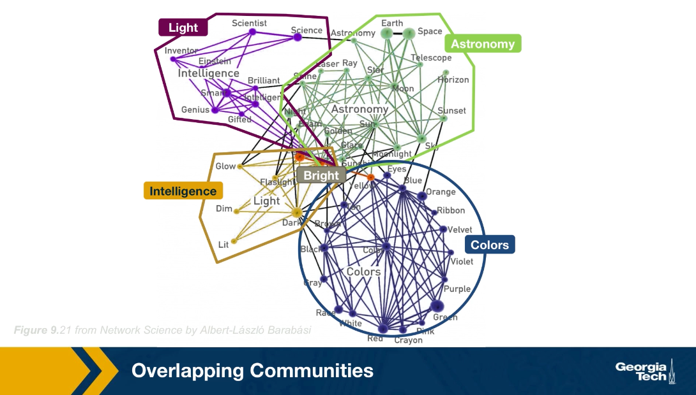
*typo: intelligence community marked as Light and Light community marked as Intelligence.*

For instance, look here at the network of words from the South Florida Free Association Network. Two words are connected here if their meaning is somehow related. For example, the word Einstein (above graph in purple) is associated with the word scientist, science, inventor, genius, gifted, smart and others. At the lower right part of hte figure, we see a dense community of those nodes in blue, most of them relate to colors. The green nodes, on the other hand, form another community, this time related to astronomy. It is important to note however, that there are few nodes that participate in more than one community. For example, the word bright is associated with the intelligence community, the astronomy community, the colors community and the light community. How can we identify communities in a network allowing the possibility that the node may belong to more than one community? 

In the following, we will review a couple of algorithms that can do exactly that 

#### CFinder Algorithm 

The CFinder algorithm was one of the first community detection methods that can discover overlapping communities. Even though its worst case run time is exponential with the size of the network, it can be effective in networks with few thousands of nodes. The CFinder algorithm is not based on Modularity maximization. Instead it is based on the idea that the community is a dense sub graph of nodes that includes many overlapping small cliques. its main parameters is the size $k$ of the small cliques. For example, if k is equal to 3, the CFinder algorithm tries to identify all triangles, which is what we see here.

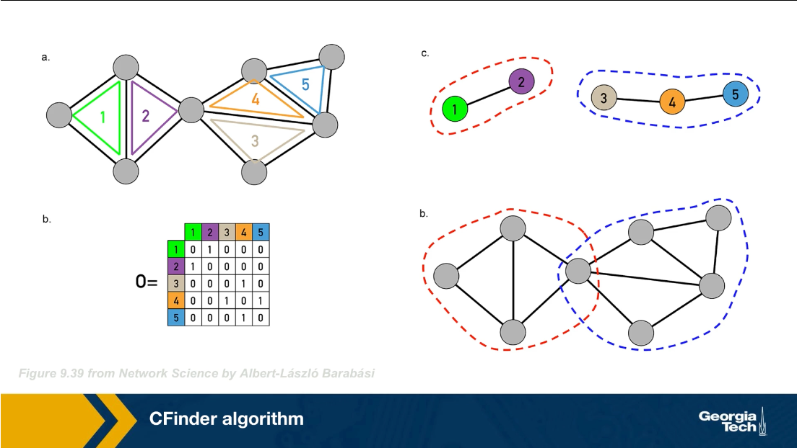
*typo: The bottom right should be d and not b*

Two k cliques are considered overlapping if they share $k-1$ nodes. Two triangles for instance are overlapping if they share a link. Consider the network in this visualization, there are five k cliques for k equal to 3. The overlap matrix O, shows which of these k cliques are overlapping. For example cliques 1 and 2 are overlapping. if two k cliques share at least k minus one nodes, they are considered overlapping and the corresponding element of matrix O is 1 otherwise iet is 0. 

Note that the green and purple k cliques are overlapping, as well as the gray, orange and blue cliques. The communities that the CFinder  algorithm discovers are the connected components in this k cliques network, which is what we see in part c. Part d shows the two discovered communities projected back to the original network. Note that there is one node in this case that belongs to two communities. That node participates in three k cliques. One k clique the purple belongs to the red community, while the two other k cliques the green and orange, belong to the blue community.  

Lets look now at a larger example, in part a, we said k=3 discovered all triangles in the network. Part c shows that when k=3, we identify three communities, the green, the gray, and the blue. Note that the green and the blue share a node. 

What would happen if we set k=4? Now we first compute all the four node cliques, part b shows just one of them. Recall that two four nodes cliques are adjacent if they share three nodes. 

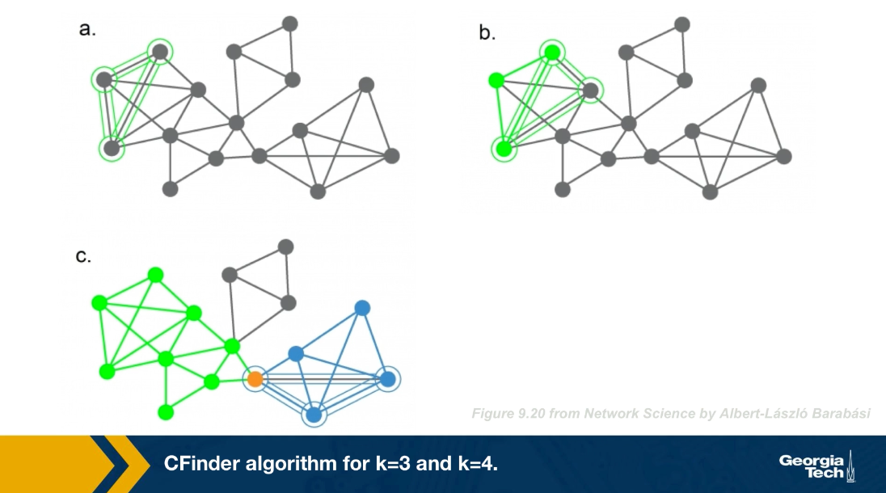

This visualization (below) shows a different toy network and the resulting set of communities when we set k=4. After computing all four node cliques, we see that here that there are four connected components of four cliques, each of them corresponding to a community. The four orange nodes here belong to more than one community.

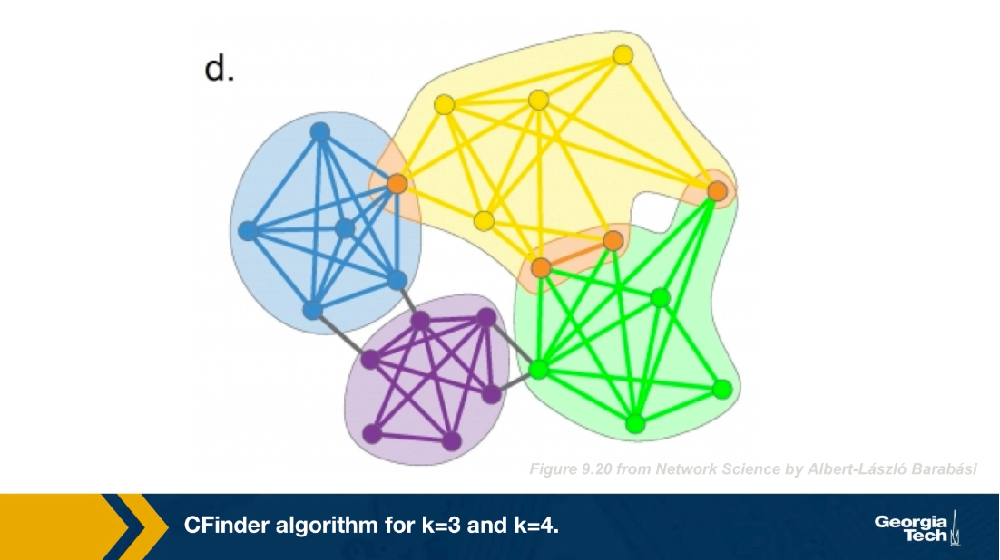

> **Food for Thought**
> 
> Suppose we run CFinder on the network of part-a with k=4? Which communities would the algorithm detect? Would every node belong to one and only one community?
>
{: .prompt-info }

###  Critical Density Threshold in CFinder

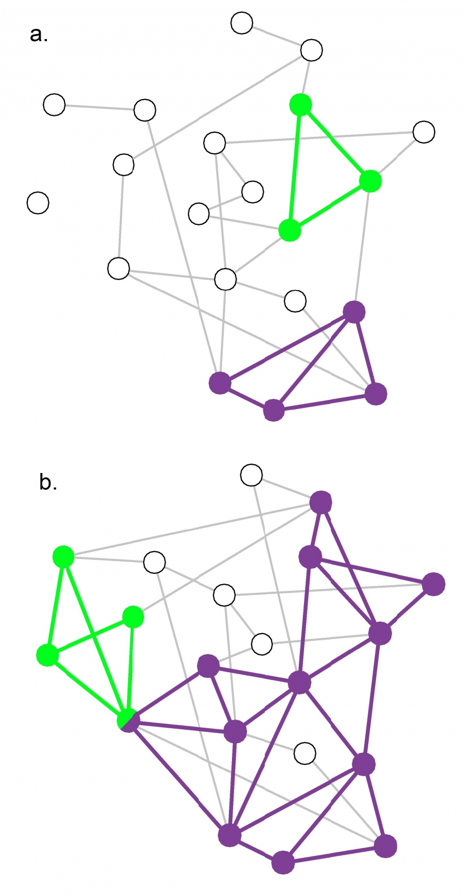{: width="200" height="500"}
*Figure 9.22 from Network Science by Albert-László Barabási*

An interesting question about the CFinder algorithm is whether it would detect communities even in completely random networks. A completely random network should not have any community structure.   

Suppose that k=3. If the network is sufficiently dense, it will have many triangles formed strictly based on chance, and so the algorithm would detect a number of communities even though the network structure is completely random.

So we can ask the following question: *for a given network size n and value of k, what is the maximum density of a random network of size n so that the appearance of k-cliques is unlikely? Let's call this density as the “critical density threshold”.*

Obviously, the higher k is, the higher the critical density threshold should be.  

It is not hard to prove that the critical density threshold is:  

$$
p_c(k) = {[(k-1)n]}^{\frac{-1}{k-1}}
$$

When the density is lower than $p_c(k)$ we expect only few isolated k-cliques. If the network density exceeds $p_c(k)$, we observe numerous cliques that form k-clique communities. 

For k=2 the k-cliques are simply individual links and the critical density threshold reduces to $p_c(k) = 1/n$, which is the condition for the emergence of a giant connected component in Erdős–Rényi networks. 

For k =3 the k-cliques become triangles and the critical density threshold is  $p_c(k) = 1/\sqrt{2n}$

The visualization shows two random networks: one with density p=0.13 (part-a) and the other with density p=0.22 (part-b). For this network size (n=20) and for k=3, the critical density threshold is 0.16.   This means that the network of part-a is below the threshold, and indeed there are only three triangles in that network. Cfinder would report in that case that most network nodes do not belong to any community.  

The network of part-b on the other hand is above the critical density threshold and it includes many triangles. Cfinder would report that all but four nodes of that network belong to communities. From the statistical perspective, this would be an incorrect conclusion.  

The moral of the story is that before we apply the Cfinder algorithm, we should also check whether the density of the network is below or above the critical threshold for the selected value of k. If it is larger than the threshold, we should consider larger values of k (even though this would make the algorithm more computationally intensive). 

> **Food for Thought**
> 
>Derive the previous expression for the critical density threshold.
>
> **Hint**: To have a giant connected component of k-cliques, the average k-clique should have at least two adjacent k-cliques (this is known as Molloy-Reed criterion -- further discussed in Lesson-11).  Any lower network density than the critical threshold will result in a lower average than two adjacent k-cliques to a randomly chosen k-clique.
>
>So, consider a given k-clique X and suppose it has an adjacent k-clique. At the critical density value the expected number of additional adjacent k-cliques to X should be one. So,  start by deriving the expression for the expected number of additional adjacent k-cliques to X, as a function of k and p. Then set that expectation equal to 1, and solve for p to derive the critical density threshold. You can simplify the expression assuming that n is very large.
>
{: .prompt-info }

###  Link Clustering Algorithm

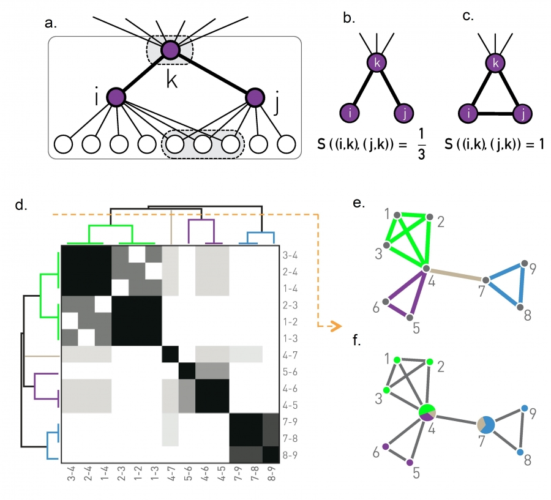
*Figure 9.23 from Network Science by Albert-László Barabási*

Another approach to compute overlapping communities is the link clustering algorithm. It is based on a simple idea: even though a node may belong to multiple communities, each link (representing a specific relation between two nodes) is usually part of only one community.  

For example, a connection between you and a family member is probably only part of your family community, while a connection between you and a co-worker is probably only part of your professional community (unless if your family members are also your co-workers!)  

So, instead of trying to compute communities by clustering nodes, we can try to compute communities by clustering links. However, how can we cluster links? We first need a similarity metric to quantify the likelihood that two links belong to the same community.  

Recall that if two nodes i and j belong to the same community, we expect that they will have several common neighbors (because a community is a dense subgraph). So the similarity $𝑆((𝑖,𝑘),(𝑗,𝑘))$ of two links (i,k) and (j,k)  that attach to a common node k can be evaluated based on the number of common neighbors that nodes i and j have – with the convention that the set of neighbors of a node i includes the node itself.   We normalize this number by the total number of distinct neighbors of i and j, so that it is at most equal to 1 (when the two nodes i and j have exactly the same set of neighbors). 

In other words, if N(i) is the set of  neighbors of node i (including i) and N(j) is the set of neighbors of node j, then the link similarity metric is defined as:

$$
S\left( (i,k),(j,k)\right) = \frac{N(i)\cap N(j)}{N(i)\cup N(j)}
$$

Now that we have a similarity metric for pairs of links, we can follow exactly the same hierarchical clustering process we studied in the previous lesson to create a dendrogram of links, based on their pairwise similarity. 

Cutting that dendrogram horizontally gives us different partitions of the set of network links – with each partition corresponding to a community assignment.  

These communities, however, even though they are non-overlapping in terms of links, they may be overlapping in terms of nodes.  

This is shown in the toy example of part-e: there are four clusters of links, corresponding to three communities of nodes. Note that two of the nodes belong to more than one community.  

The computational complexity of the link clustering algorithm depends on two operations;

1. the similarity computation for every pair of links, and
2. the hierarchical clustering computation.

The former depends on the maximum degree in the network, which we had derived earlier as $O(n^{2/{(\alpha-1)}})$[ in L4: Maximum Degree in a Power Law Network] for power-law networks with n nodes and degree exponent $\alpha$. The latter is $O(m^2)$, where m is the number of edges. For sparse networks, this last term is $O(n^2)$ and it dominates the former term.  

> **Food for Thought**
> 
> The link clustering algorithm follows a very different approach to perform community detection than all other algorithms we have discussed so far. Can you think of a potential issue with the interpretation of communities in this algorithm?
{: .prompt-info }

###  Application of Link Clustering Algorithm

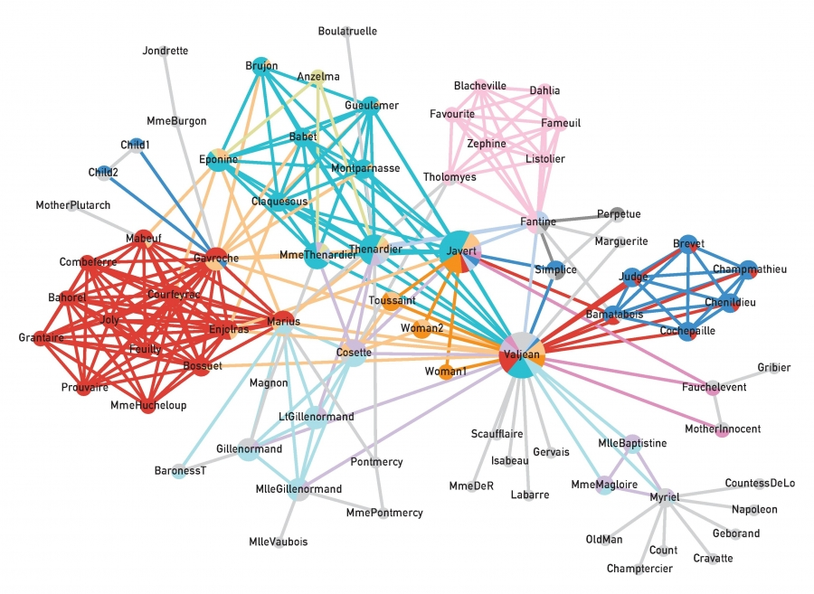
*Figure 9.24 from Network Science by Albert-László Barabási*
  
The visualization shows an application of the previous algorithm on the network that represents the pairwise interactions between the characters in Victor Hugo’s novel “Les Miserables”. 

Nodes that belong to more than one community are shown as pie-charts, providing us with additional information about their degree of participation in each community.  

The main character, Jean Valjean, participates in almost all communities, as we would expect.  

###  GN Benchmark

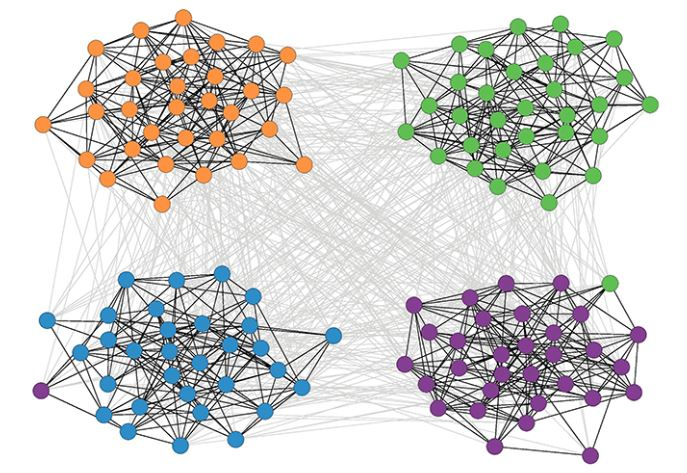
*Figure 9.25 from Network Science by Albert-László Barabási*

How can we test if a community detection algorithm can identify the right set of communities? In most real datasets and problems, we do not have such “**ground truth**” information.  

So, a first task is to create synthetically generated networks with known community structure – and then to check whether a community detection algorithm can discover that structure.  

Sometimes these synthetic networks are referred to as **“benchmarks”**.  

The simplest benchmark is referred to as **“Girvan-Newman (GN)”**. In this model, all communities have the same size. Additionally, any pair of nodes within the same community has the same connection probability $p_{int}$, and any pair of nodes in two different communities also has the same connection probability $p_{ext}$. Consequently, the GN benchmark cannot generate a heavy-tailed degree distribution. 

In more detail, we specify the number of communities $n_c$ and the number of nodes in each community $N_c$.

The total number of  nodes is $N = n_cN_c$. 

We also need to specify the following parameter $\mu$: 

$$
\mu = \frac{\mu^{ext}}{\mu^{ext}+\mu^{int}}
$$

where $k^{int}$ is the average number of internal connections in a community and $k^{ext}$ is the average number of external connections between communities. 

If $\mu$ is close to 0 almost all connections are internal and the community is very clearly separated.  

As $\mu$ increases, the community structure becomes weaker. After $\mu$ is greater than 0.5, it is more likely to see external connections that internal, meaning that there is no community structure.  

The visualization shows a GN network with 128 nodes, four communities, and 32 nodes per community when $\mu$ is 40%.  

###  Community Size Distribution

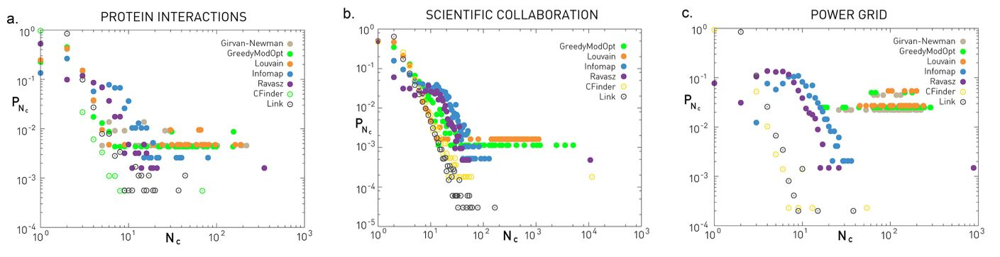{: width="500" height="300"}
*Figure 9.29 from Network Science by Albert-László Barabási*

The GN benchmark creates communities of identical size. How realistic is this assumption, however? 

Even though we typically do not have the ground-truth, there is increasing evidence that most networks have a power-law community size distribution.  

This implies that most communities are quite small, maybe a tiny percentage of all nodes, but there are also few large communities with comparable size to the whole network. 

The three plots shown here refer to three different networks *(the same datasets we have seen many times in the past – discussed in your textbook)*.  

The plots show the probability distribution of the discovered community sizes according to six different algorithms -- we have discussed all of them except Infomap.  

Even though there are major differences between the six algorithms *(we will return to this point later in this lesson)*, they all tend to agree about the Protein Interaction network and the Scientific Collaboration network that the size distribution is heavy-tailed and it can be approximated by a power-law.  

The situation is less clear with the Power Grid network – there are major differences between the six algorithms in terms of the shape of the community size distribution.

> **Food for Thought**
> 
> The previous plots show several points with the same y-axis value at the right tail of the distribution. What does this mean about the number of communities with that size?
{: .prompt-info }

###  LFR Benchmark

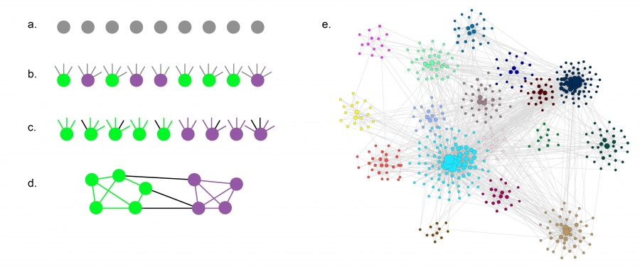{: width="500" height="300"}
*Figure 9.26 from Network Science by Albert-László Barabási*

The LFR benchmark (Lancichinetti-Fortunato-Radicchi) is more realistic because it generates networks with scale-free degree distribution – and additionally, the community size follows a power-law size distribution.  

We need to specify the total number of nodes n, the parameter $\mu$ that we also saw in the GN benchmark, two exponent parameters: $\gamma$ for the node degree distribution and $\zeta$ for the community size distribution, as well as the minimum and maximum values for the degree distribution and the community size distribution. 

LFR starts with n disconnected nodes, giving each of them a degree (number of stubs) based on the degree distribution. 

Also, each node is assigned to a community based on the community size distribution (see part-a and part-b).  

The stubs of each node are then classified as either internal, to be connected to other internal stubs of nodes in the same community – or external, to be connected to available external stubs of nodes in other communities (see part-c). This stub partitioning process is controlled by the parameter 𝜇
 of the GN benchmark.  

The connections between nodes are then assigned randomly as long as a node has available stubs of the appropriate type (internal vs external) (see part-d).  

The visualization part-e shows an LFR network with n=500, $\mu$=0.4, $\gamma$=2.5, and $\zeta$=2. Note that the 16 communities have very different sizes, and the nodes are also highly heterogeneous in terms of degree. 

###  Normalized Mutual Information (NMI) Metric

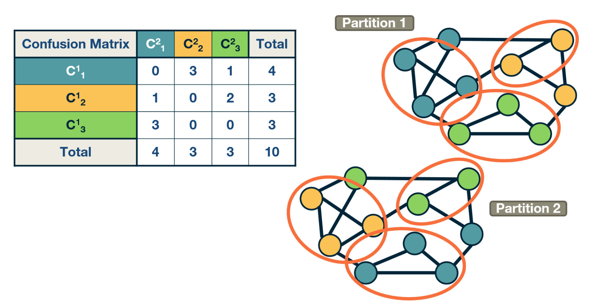{: width="500" height="300"}
*Example: Confusion matrix with two partitions.*

Suppose that we have two community partitions, $P_1$ and $P_2$, of the same network. It may be that each partition was generated by a different community detection algorithm – or that one of the two partitions corresponds to the ground truth.  

The question we now address is: how can we compare the two partitions?  

To make such comparisons in a statistical manner, we need the joint distribution 𝑝$P(C_i^1, C_j^2)$ of the two partitions, i.e., the probability that a node belongs to the i’th community $C_i^1$ of the first partition and the j’th community $C_j^2$ of the second partition.  

The marginal distribution $p(C_i^1)$ of the first partition represents the probability that a node belongs to community $C_i^1$ of the first partition. Similarly for the marginal $P(C_j^2)$ of the second partition.  

The “confusion matrix” (see the visualization) can be used to calculate the previous joint distribution – as well as the two marginal distributions (last row and last column).  

A common way to compare two statistical distributions in Information Theory is through the Mutual Information – this metric quantifies how much information we get for one of two random variables if we know the value of the other. If the two random variables are statistically independent, we do not get any information. If the two random variables are identical, we get the maximum information. 

When the two random variables represent the two community partitions of the same network, the definition of Mutual Information is written as: 

$$
\sum_{i,j} p(C^1_i, C^2_j) \, \log_2 \frac{p(C^1_i, C^2_j) }{p(C^1_i) p(C^2_j)}
$$

To get a metric that varies between 0 (statistically independent partitions) and 1 (identical partitions), we need to normalize the mutual information with the average entropy of the two partitions, 

$$
\frac{1}{2} [H(p(C^1)) + H(p(C^2))]
$$

Recall that $H(p(X))$ is the entropy of the distribution p(X) of random variable X, defined as: 

$$
H(X) = - \sum_x p(x) \, \log_2 p(x)
$$

So, to summarize, the Normalized Mutual Information metric (NMI) is defined as:

$$
\mbox{NMI} = I_n = \frac{\sum_{i,j} p(C^1_i, C^2_j) \, \log_2 \frac{p(C^1_i, C^2_j) }{p(C^1_i) p(C^2_j)}} {\frac{1}{2} [H(p(C^1)) + H(p(C^2))]}
$$

> **Food for Thought**
> 
> Show that the minimum value of the mutual information metric results when the two partitions are statistically independent, and that the maximum value results when they are identical. Also, what is that maximum value?.
{: .prompt-info }

###  Accuracy Comparison of Community Detection Algorithms

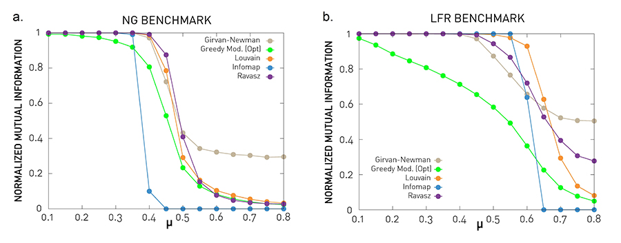{: width="500" height="300"}
*Figure 9.27 from Network Science by Albert-László Barabási*

Let's now compare some of the community detection algorithms we have seen  so far (at least those that result in non-overlapping communities).  

In the previous lesson, we covered the Girvan-Newman algorithm (top-down hierarchical clustering based on the edge betweenness centrality metric), the Ravasz algorithm (agglomerative hierarchical clustering), the greedy modularity optimization algorithm, and the Louvain algorithm (also based on modularity optimization). The plots also show results for Infomap, which is an algorithm that is based on the maximization of an information-theoretic metric of community structure rather than modularity.  

The comparisons use the NMI metric, and the two benchmarks we introduced earlier: GN and LFR. Recall that the parameter $\mu$ quantifies the strength of the community structure in the network – when $\mu$ < 0.5 the network has clearly separated communities, while $\mu$ is close to 1 there is no real community structure.  

The benchmark parameters are N=1,000 nodes, average degree: $\bar{k}$=20, degree exponent (LFR) $\gamma$=2, maximum degree (LFR): $k_{max}=50$, community size exponent (LFR) $\zeta$=1, maximum community size (LFR): 100, minimum community size (LFR): 20. Each curve is averaged over 25 independent realizations. 

The Louvain algorithm and the Ravasz algorithm (cutting the dendrogram based on maximum modularity) seem to behave consistently well in both benchmarks. The Girvan-Newman algorithms seem to report communities even where are no real communities (for high values of $\mu$).  

> **Food for Thought**
> 
> The greedy modularity maximization algorithm is less accurate even for low values of $\mu$
, when the communities are quite clearly defined. What do you think causes this inaccuracy?
{: .prompt-info}

###  Run Time Comparisons

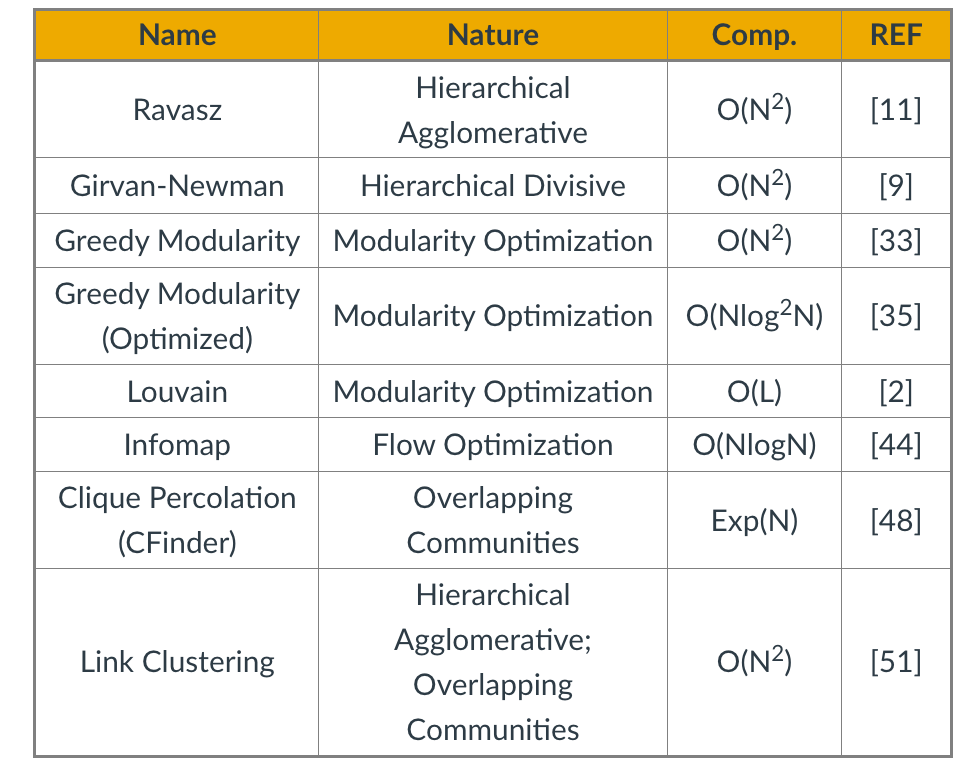

In terms of run-time, the table summarizes the worst-case run time of each of the algorithms we have reviewed so far (we have not covered Infomap in these lectures), including the two algorithms for overlapping community detection (Cfinder and Link Clustering). N is the number of nodes. The references refer to the textbook's bibliography. 

In sparse networks (where the number of links is $L=O(N))$ the Louvain algorithm is the fastest in terms of algorithmic complexity. In dense networks (where $L=O(N^2)$), the Infomap and greedy modularity maximization algorithms are faster.

Remember however that most networks are sparse in practice – and these are only  worst-case asymptotic bounds. What happens in practice when we compare the run-time of these algorithms?

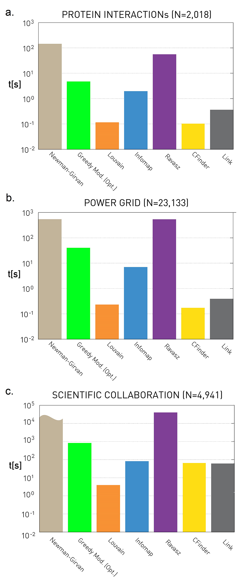{: width="300" height="500"}
*Figure 9.28 from Network Science by Albert-László Barabási*

These plots quantify the empirical run-time of the previous community detection algorithms for three small/medium network datasets. The y-axis values are in seconds.

As expected, the fastest algorithm is Louvain. Surprisingly, even though the Cfinder algorithm has an exponential worst-case run-time, it performs quite competitively in practice. The Newman-Girvan algorithm is the slowest among the seven algorithms.

> **Food for Thought**
> 
> Make sure that you know how to derive the worst-case run-time complexity of every community detection algorithm we have discussed.  
>
{: .prompt-info}

###  Dynamic Communities

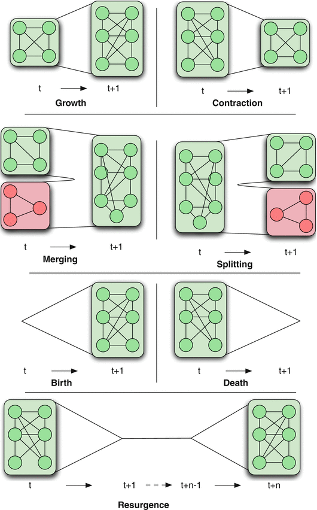{: width="300" height="300"}
*Figure 1 [Dynamic Community Detection](https://doi.org/10.1007/978-1-4614-6170-8_383).by Cazabet R., Amblard F.*

In practice, many networks change over time through the creation or removal of nodes and edges. This dynamic behavior also causes changes in the community structure of the network.

There are various ways in which the community structure may change from time t to time t+1, also shown in the visualization:

**Growth**: a community can grow through new nodes.

**Contraction**: a community can contract through node removals.

**Merging**: two or more communities can merge into a single community.

**Splitting**: one community can split into two or more communities.

**Birth**: a new community can appear at a given time.

**Death**: a community can disappear at any time.

**Resurgence**: a community can only disappear for a period and come back later.

The problem of detecting communities in dynamic networks is more recent and there is not a single method yet that is considered generally accepted. Most approaches in the literature follow one of the following three general approaches.

###  Dynamic Communities – Approach #1

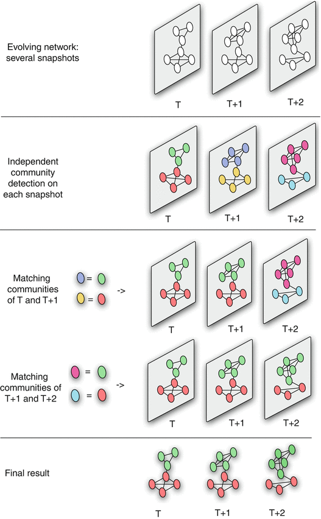{: width="300" height="300"}
*Figure 2 [Dynamic Community Detection](https://doi.org/10.1007/978-1-4614-6170-8_383).by Cazabet R., Amblard F.*

The first approach is that a community detection algorithm is applied independently on each network snapshot, without any constraints imposed by earlier or later network snapshots.

Then, the communities identified at time T+1 are matched to the communities identified at time T based on maximum node and edge similarity.

This process is illustrated in the visualization for three successive snapshots. Note that the green community experiences gradual growth while the red community experiences contraction.

The main advantage of this approach is its simplicity, given that we can apply any algorithm for community detection on static networks.

Its main disadvantage however is that the communities of successive snapshots can be significantly different, not because there is a genuine change in the community structure, but because the static community detection algorithm may be unstable, producing very different results even with minor changes in the topology of the input graph.

###  Dynamic Communities – Approach #2

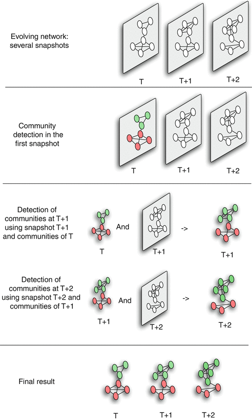{: width="300" height="300"}
*Figure 3 [Dynamic Community Detection](https://doi.org/10.1007/978-1-4614-6170-8_383).by Cazabet R., Amblard F.*

The second approach attempts to compute a good community structure at time T+1 also considering the community structure computed earlier at time T.

To do so, we need to modify the objective function of the community detection optimization problem: instead of trying to maximize modularity at time T+1, we aim to meet two goals simultaneously:  have both high modularity at time T+1 and maintain the community structure of time T as much as possible. 

This is a trade-off between the quality of the discovered communities (quantified with the modularity metric) and the ”smoothness” of the community evolution over time.

Such dual objectives require additional optimization parameters and trade-offs, raising concerns about the robustness of the results. 

> **Food for Thought**
> 
> Write down a mathematical expression for a dual optimization objective mentioned above. You know how modularity is defined. How would you define the smoothness of community evolution?
>
{: .prompt-info}

###  Dynamic Communities – Approach #3

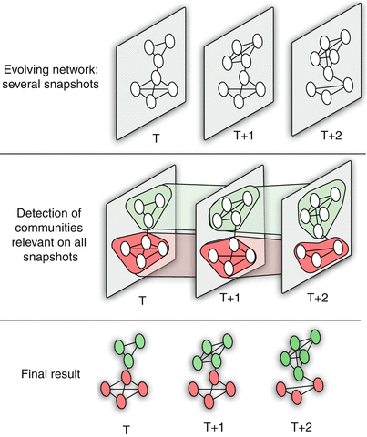{: width="300" height="300"}
*Figure 4 [Dynamic Community Detection](https://doi.org/10.1007/978-1-4614-6170-8_383).by Cazabet R., Amblard F.*

A third approach is to consider all network snapshots simultaneously. Or, a more pragmatic approach would be to consider an entire **“window”** of network snapshots $(𝑇,𝑇+1,𝑇+2,…𝑇+𝑊−1)$ at the same time,

Algorithms of this type create a single “**global network**" based on all these snapshots as follows:

1. A node of even a single snapshot is also a node of the global network, and an edge of even a single snapshot is also an edge between the corresponding two nodes at the global network.
2. Additionally, the global network includes edges between the instances of any node X at different snapshots (so if X appears at time T and at time T+1, there will be an edge between the corresponding two node instances in the global network).
3. After creating the global network, a community detection algorithm is applied on that network to compute a **“reference”** community structure.
4. Then, that reference community structure is mapped back to each snapshot, based on the nodes and edges that are present at that snapshot.

This approach usually produces the smoothest (or most stable) results – but it can miss major steps in the evolution of the community structure (such as communities that merge or split). This last point however also depends on the length of the window W.

> **Food for Thought**
> 
> Write down a mathematical expression for a dual optimization objective mentioned above. You know how modularity is defined. How would you define the smoothness of community evolution?
>
{: .prompt-info}

###  Participation Coefficient

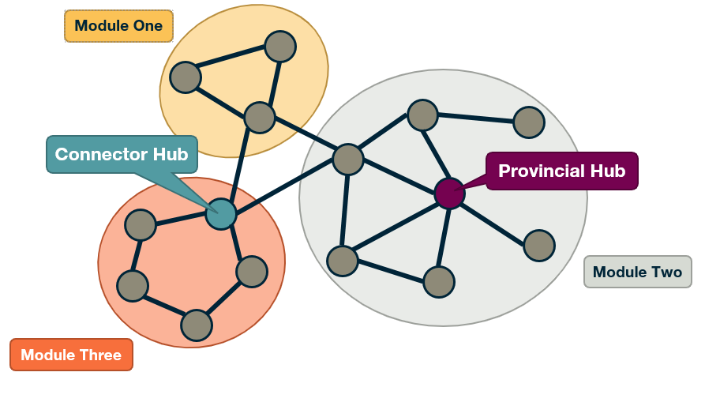{: width="300" height="300"}

An interesting question is to examine the role of individual nodes within the community they belong to.

Is a node mostly connected to other nodes of the same community? Or is it connected to several other communities, acting as a “bridge” between its own community and others? A commonly used metric to answer such questions is the Participation Coefficient of a node, measuring the participation of that node in other communities.

Suppose that we have already discovered that the network has $n_c$ communities (or modules). Also, let $k_{i,s}$ be the number of links of node i that are connected to nodes of community s, and $k_i$ the degree of node i.

The participation coefficient is then defined as:

$$
P_i = 1 - \sum_{s=1}^{n_c} \left(\frac{k_{i,s}}{k_i}\right)^2
$$

Note that if all the connections of node i are with other nodes in its own community, we have that $P_i=0$. An example of such a node is the highlighted node at module-two in the visualization.

On the other hand, if the connections of node i are uniformly distributed with all $n_c$ communities, the participation coefficient will be close to 1. This is the case with the highlighted node at module-three in the visualization.

The (loose) upper bound $P_i=1$ is approached for nodes with very large degree $k_i$, if their connections are uniformly spread to all $n_c$ communities.

> **Food for Thought**
> 
> What is the rationale for the "squaring operation" at the previous formula? Why not just take the summation of those fractions?
>
{: .prompt-info}

###  Within-module Degree

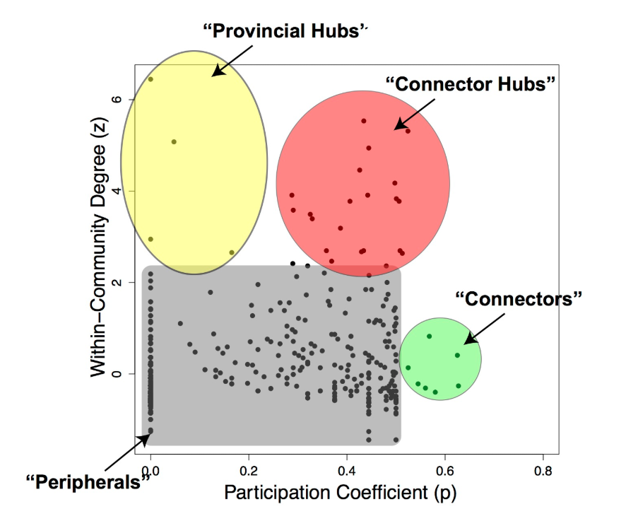{: width="300" height="300"}
*Figure from [Worked Example: Centrality and Community Structure of US Air Transportation Network](https://dshizuka.github.io/networkanalysis/example_usairports.html). by Dai Shizuka*

Another important question is whether a node is a hub or not within its own community.

A metric to answer this question is the normalized “**within-module degree**”:

$$
z_i = \frac{\kappa_i - \bar{\kappa}_{i}}{\sigma_{\kappa_i}}
$$

where $\kappa_i$ is the "internal" degree of node i, considering only connections between that node and other nodes in the same community, $\bar{\kappa_i}$ is the average internal degree of all nodes that belong in the community of node i, and $\sigma_{\kappa_i}$ is the standard deviation of the internal degree of those nodes.

So, if a node i has a large internal degree, relative to the degree of other nodes in its own community, we consider it a  hub within its module.

If we combine the information provided by both the participation coefficient and the within-community degree, as shown in the visualization, we can identify four types of nodes, based on the nodes that have unusually high values of $P_i$ and $z_i$:

1. **Connector Hubs**: nodes with high values of both $P_i$ and $z_i$. These are hubs within their own community that are also highly connected to other communities, forming bridges to those communities.
2. **Provincial Hubs**: nodes with high value of $z_i$ but low value of $P_i$. These are hubs within their own community but not well connected to nodes of other communities.
3. **Connectors**: nodes with high value of $P_i$ but low value of $z_i$. These are not hubs within their module – but they form bridges to other communities.
4. **Peripheral nodes**: nodes with low values of both $P_i$ and $z_i$. Everything else -- this is how the bulk of the nodes will be classified as. 

Clearly, these four types are heuristically defined and there are always nodes that would fall somewhere between these four roles.

###  Case Study: Metabolic Networks

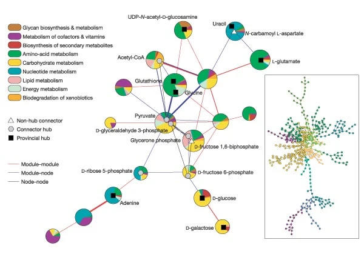
*Figure 3: Cartographic representation of the metabolic network of E. coli. from [Functional cartography of complex metabolic networks](https://www.nature.com/articles/nature03288). by Guimerà, R., Nunes Amaral, L.*

To illustrate these concepts, let us review the main results of a research article (“Functional cartography of complex metabolic networks” by Guimera and Luis A. Nunes Amaral, Nature 2005) that analyzed the metabolic networks of twelve organisms. They identified an average of 15 communities (the maximum was 19 communities for Homo sapiens and the minimum was 11 for Archaeoglobus fulgidus).

The visualization shows the network of these communities in the case of E.Coli (19 communities). Each circle corresponds to a community. The colors within each community are associated with a specific type of metabolic pathways, classified based on the KEGG database (see upper left).

The triangles, hexagons, or squares within some communities identify specific metabolites that play the role of non-hub connectors, connector hubs, or provincial hubs, respectively. For example, L-glutamate is a provincial hub within the amino-acid metabolism module.

The network at the right shows the E.Coli metabolic network (473 nodes, 574 edges, using the KEGG color code).

###  δ-MAPS

We will now look at an application of community detection in the analysis of spatiotemporal data, and in climate change in particular. The method that we'll be using to detect communities is called Delta maps and it was developed by the instructor and PhD student, llias Fountalis.

Delta maps is appropriate for any application in which we are given spatiotemporal data that 
show an activity time series of its point of a grid space. The goal delta maps is to detect contiguous blocks of space referred to as functional domains or simply domains. That behave in a very homogeneous manner over time. So its applications are common in climate science where the activity time series may be temperature, humidity, pressure at different points on the planet, or the atmosphere. 

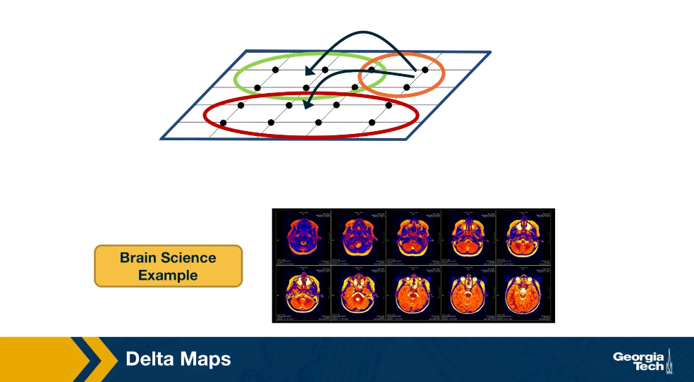

Delta maps can also be used to analyze spatiotemporal data that represents neural activity. Here the activity time may be EEG signals from different electrodes or FMRI measurements at different voxels. After delta maps detects the homogeneous communities or domains, it forms a weighted network between domains based on the strength of the statistical correlation between the aggregate signal of each domain pair. 

###  δ-MAPS – Domain Homogeneity Constraint

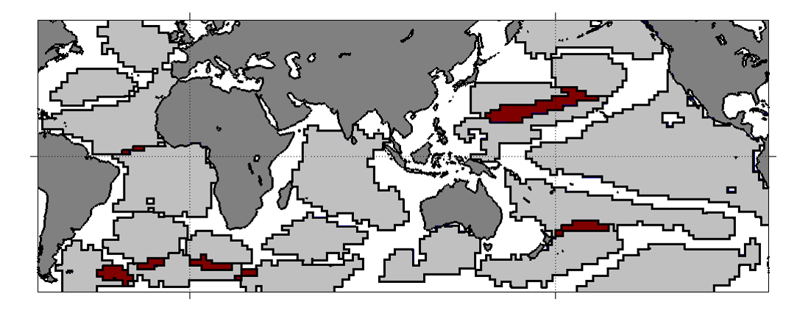{: width="400" height="300"}

In the following we simplify the presentation of the delta-MAPS method – the reader can find additional information in the following research paper:

[δ-MAPS: From spatio-temporal data to a weighted and lagged network between functional domains.](https://link.springer.com/article/10.1007/s41109-018-0078-z)

The input is a timeseries $x_i(t)$ for each grid point i.

The similarity between two grid points i and j is quantified using Pearson's cross-correlation $r_{i,j}$.

More advanced correlation metrics could be used instead (such as mutual information). Additionally, the correlation could be calculated at different lags. Links to an external site.

A domain A(s) with seed s (a specific grid point) is the largest possible spatially contiguous set of points including s such that their average pairwise correlation $\hat{r}(A)$ is greater than the parameter of the method $\delta$.

The objective of Delta-MAPS is to identify the minimum number of such maximal “domains” in the given data.

For example, the visualization shows the detected domains when Delta-MAPS is applied to Sea Surface Temperature (SST) monthly data (HadISST) for the time period of about 50 years (after removing the effects of seasonality). Each spatially contiguous region is a domain. You can think of a domain as a network community in which the nodes are grid points in space, and the edge weight between two nodes is equal to the cross-correlation of their activity time series.

Note that there are 18 such domains in this data. The red regions correspond to spatial overlaps between adjacent domains – Delta-MAPS allows for overlapping communities.

Another feature of the method is that not every node needs to belong to a community – as we see there are many grid points on the oceanic surface that do not belong to any domain.

> **Food for Thought**
> 
> Can you think of different ways to state (not solve) the optimization problem that Delta-MAPS focuses on? What could be another way to define a spatially contiguous domain (instead of using a constraint on the average pairwise correlation)? 
>
{: .prompt-info }

###  δ-MAPS: Algorithm Overview

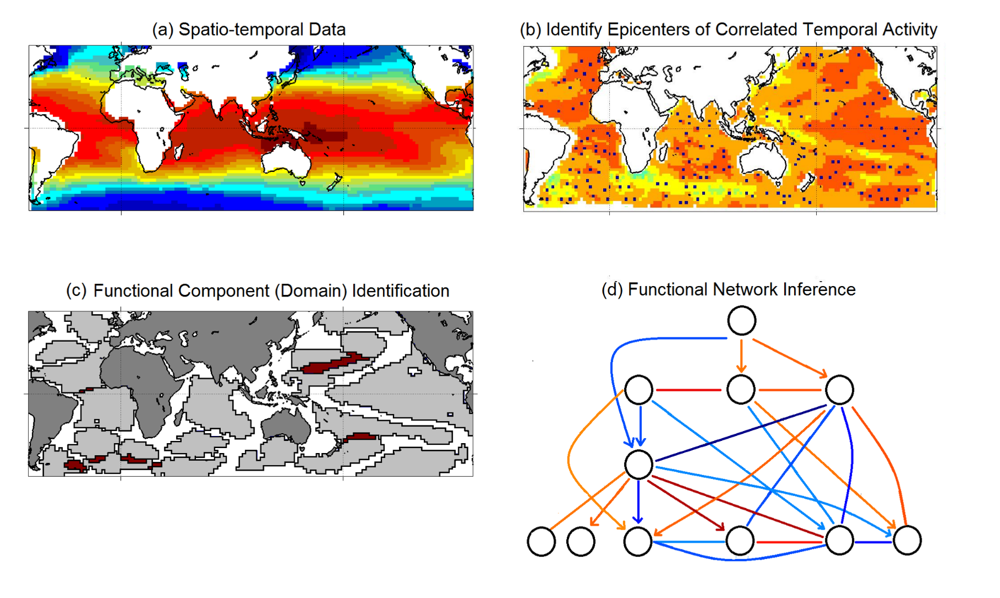
*Figure  from "[δ-MAPS: from spatio-temporal data to a weighted and lagged network between functional domains](https://link.springer.com/article/10.1007/s41109-018-0078-z)" by Fountalis, I., Dovrolis, C., Bracco, A. et al., 2018*

Here is a short overview of the Delta-MAPS algorithm:

The algorithm starts with a time series $x_i(t)$ for each point in space (part-a shows the average of that time series for each grid point).

Then, Delta-MAPS selects potential domain seeds. These points are local maxima of the spatial correlation field (part-b, “**epicenters of correlated temporal activity**”).

Then, the algorithm proceeds iteratively, identifying one domain at a time. The domain identification starts by selecting the next available seed of maximum spatial correlation. The algorithm then selects, in a greedy manner, as many points as possible around the chosen seed so that it forms a maximal spatially contiguous block of points that satisfy the homogeneity constraint $\delta$ (part-c, **“domain identification”**).

Finally, the algorithm identifies functional connections between domains, based on how strong their pairwise correlations are. These correlations can be positive (red) or negative (blue), and lagged (part-d, **“functional network inference”**).

###  Application in Climate Science

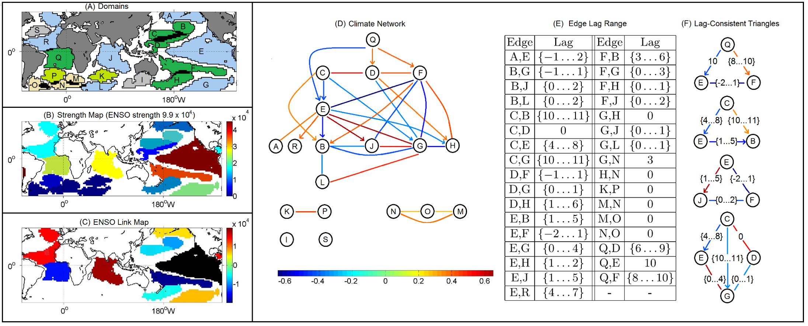
*Figure  from "[δ-MAPS: from spatio-temporal data to a weighted and lagged network between functional domains](https://link.springer.com/article/10.1007/s41109-018-0078-z)" by Fountalis, I., Dovrolis, C., Bracco, A. et al., 2018*

Here is a summary of the results when Delta-MAPS was applied on the Sea-Surface Temperate (SST) monthly data mentioned earlier (time period 1956-2005).  

The number of grid points is 6000. Delta-MAPS identified 18 domains, showing the great potential for dimensionality reduction using this method.   

35% of the grid cells do not belong to any domain.  

The largest and strongest (in terms of network connections) domain is the ENSO region at the Pacific ocean (domain E – see part-A and part-B). 

The connections between the ENSO domain and other domains are shown in part-C. Some of these connections are positive correlations while others are negative. For instance, ENSO is positively correlated with the domain at the Indian ocean as well as the North Atlantic, while it is negatively correlated with the domain at the South Atlantic.  

The complete functional network between domains is shown in part-D. Some edges are directional, meaning that the correlations are strongest at a certain lag. These lags are shown for each edge at part-E. For instance, the edge from Q to E means that the activity at domain Q precedes the activity of domain E with a time difference of about 10 months.  

The network of part-D forms a 3-4 layer hierarchy. Even though ENSO (domain E) is the most connected domain, it is not at the root of this hierarchy. Instead, region Q,  west of Africa in the South Atlantic, seems to be **”ahead”** of all other domains and it can be used to predict, to some extent, the activity of other domains months in advance.  

Finally, part-F shows a number of domain **“triangles”** in this network, showing that their lags are temporally consistent. For instance, Q is ahead of E by about 10 months, Q is ahead of F by about 8-10 months, while F and E do not have a clear precedence relation between them (the lag range is between -2 to +1 months). 

> **Food for Thought**
> 
> How would you identify the correct lag between two correlated timeseries? Why do you think Delta-MAPS report a range of such lags instead of a single value?
>
{: .prompt-info }

###  Lesson Summary

This lesson introduced you to several important topics about community detection: 

* Overlapping communities
* Dynamic communities
* Synthetically generated communities
* Evaluating community detection algorithms using the Normalized Mutual Information (NMI) metric
**The** notion of connector hubs and provincial hubs in the community structure of a network
* An application of overlapping community detection from spatio-temporal data in the context of climate science 
* The area of community detection is still an active research topic, especially in the context of dynamic or temporal networks, multi-layer networks, and inter-dependent networks.  

It also has many applications in a wide spectrum of disciplines, making it an excellent topic for applied research projects.  

<!-- Dummy line -->
<!--  -->    