### Overview

Required Reading
* Chapter 19 -  [D. Easley and J. Kleinberg, Networks, Crowds and Markets](https://www.cs.cornell.edu/home/kleinber/networks-book/networks-book-ch19.pdf) , Cambridge Univ Press, 2010 (also available online).

Recommended Reading

* [“The role of social networks in information diffusion”](https://dl.acm.org/doi/abs/10.1145/2187836.2187907) .by E.Bakhsy et al. WWW conference, 2012.
* [“Everyone's an influencer: quantifying influence on Twitter”](https://dl.acm.org/doi/abs/10.1145/1935826.1935845). by E.Bakshy et al. WSDM conference, 2011.
* ["Maximizing the spread of influence through a social network"](https://dl.acm.org/doi/abs/10.1145/956750.956769). by D.Kempe et al. ACM SIGKDD, 2003.
* [“.A simple rule for the evolution of cooperation on graphs and social networks”](https://www.nature.com/articles/nature04605) .by H. Ohtsuki et al, Nature, 2006. 
* ["Multisensory integration in the mouse cortical connectome using a network diffusion model"](https://www.mitpressjournals.org/doi/abs/10.1162/netn_a_00164?mobileUi=0). by K.Shadi et al., Network Neuroscience, 2020.

###  Not Just Viruses Spread On Networks​

{: width="200" height="200"}

**“Word of mouth”** is a powerful influence mechanism and it affects every aspect of our lives. ​

Think about behavior adoption: Do you like to exercise, eat healthy, party, smoke marijuana? It has been shown again and again that whether someone will adopt such behaviors or not mostly depends on his/her social network. And interestingly, it is not just strong contacts (such as family and close friends) that influence people. Our entire social network, including the crowd of acquaintances and indirect contacts that surround us, also have a strong effect on behavior adoption. ​

A great reference that summarizes many years of sociology research in this area is the book **“Connected” by Christakis and Fowler.**

Similar influence mechanisms are seen in other aspects of life. For example, in terms of technology adoption, **will you buy an iPhone or an Android device**? Think about your 10 closest people and ask: what phone do they own? You guessed right – your consumer and technology adoption choices are highly influenced by your social network. ​

Or, in the case of opinion formation: are you a Democrat or a Republican? What do you think about climate change? Abortion? Again, please think about your 10 closest people and ask the same question. Even though we like to think that we are the absolute owners of our opinions, the reality is that we would probably have very different opinions if we lived in a different social environment.​

For centuries, the word-of-mouth mechanism required physical interaction between people. In the last few years, however, online social media such as Facebook, Twitter, or TikTok have provided us with the platform to influence not only the small number of people in our physical proximity – but potentially millions of people around the world. 

YouTube or Twitter “influencers” today have tens of millions of followers – and it is often the case that their videos or tweets are being liked, commented on, or forwarded by millions of other people. Never before in the history of humankind, we found ourselves in the middle of so many sources of information (or misinformation), and never before every single one of us has at least the potential to influence pretty much any other person on the planet.​

###  Diffusion, Cascades and Adoption Models​

In sociology, a central concept is that of network diffusion. Given a social network and the specific node or nodes that act as the sources of some information, when will that information spread over the network?

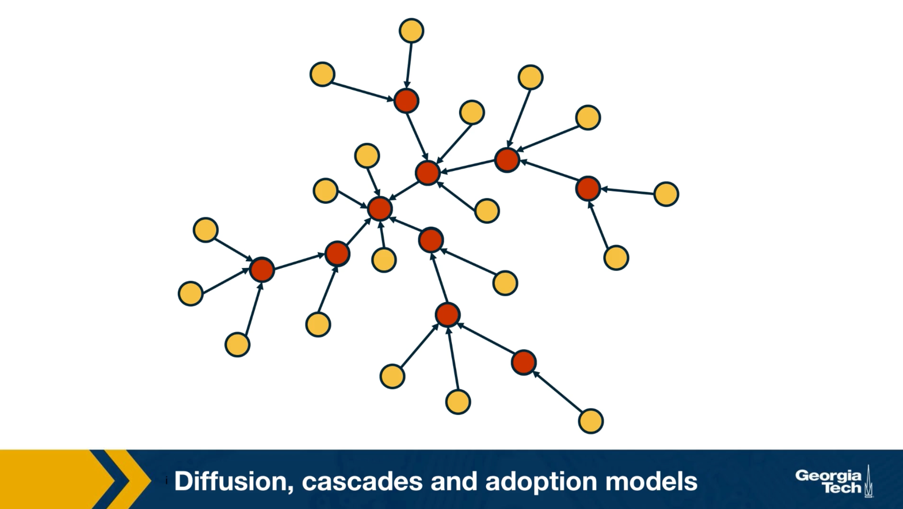

Which are the factors that determine whether someone will be influenced?What is the total number of influenced people? And how does that depend on the topology of the network? Suppose that the network is an online social network such as twitter, and the edges points from follows to followees. In other words, the information flows in the opposite directions than the edges. Imagine that the node at the center of the network with six followers tweet something. That information is received by all of his or her follows but only three of them decide to retweet. Some of the followers of those three nodes also retweet. This creates a network cascade which is shown by the red nodes. In this example the size of the cascade is ten nodes and the depth of the cascade which is the largest distance from the source to any other node of the cascade is three hops. How can we describe such influenced phenomenon in a statistical framework? 

What is the probability that someone in a social network will adopt a certain information or behavior? The greatest sociologist of hte 20th century, such as Granovetter or Schelling focused on this question and proposed interesting theoretical models of influence. 

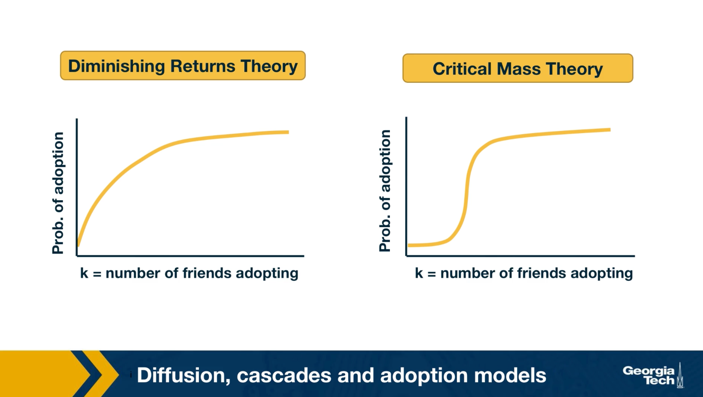

For instance, the visualization here shows two competing hypothesis the diminishing returns theory and the critical mass theory. They both postulate that the probability of adoption increases with the number of friends or direct social contacts that have adopted the same information. The diminishing returns theory, however, claims that this function is a concave function. On the other hand, the critical mass theory claims that the adoption probability remains small until we exceed a certain threshold of adopting friends. And that it quickly saturates after we pass that threshold. As you can imagine, these two models produce very different results in many cases, regarding the size, and depth of cascades. Unfortunately, the practical difficulties associated with monitoring large social networks in 70s or 80s did not allow the validation of these theoretical models with large data sets and controlled experiments. Only recently, in the last 20 years or so, the availability of online social networks have enabled sociologists to study influence and diffusion in more quantitative terms as we will see next. 

###  Some Empirical Findings About Cascades

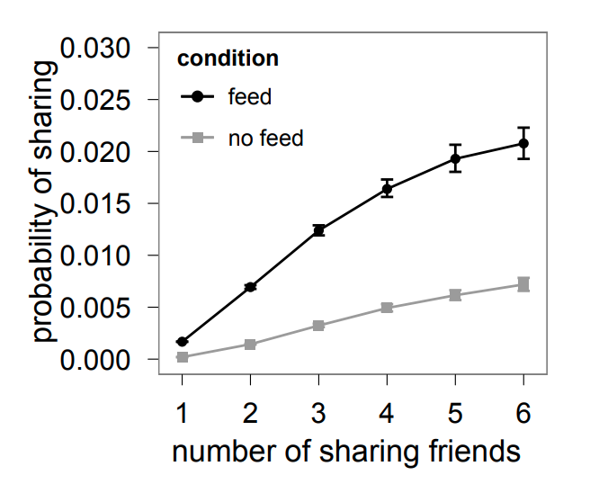{: width="300" height="300"}
*Figure 10.32 from Network Science by Albert-László Barabási*

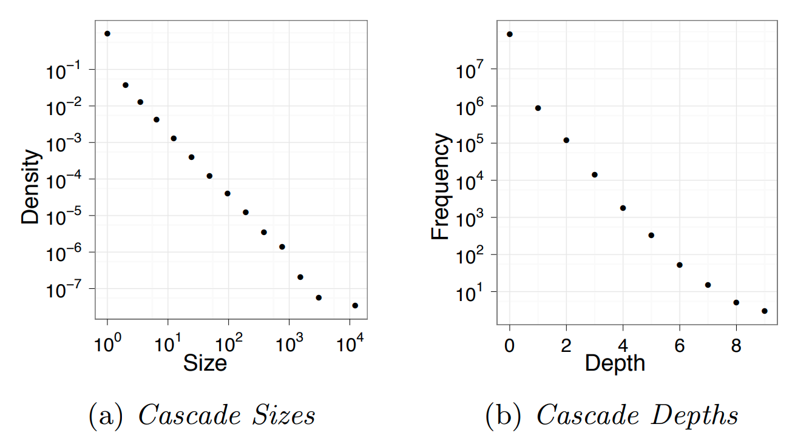{: width="500" height="300"}
*Figure 10.32 from Network Science by Albert-László Barabási*

###  Linear Threshold Model

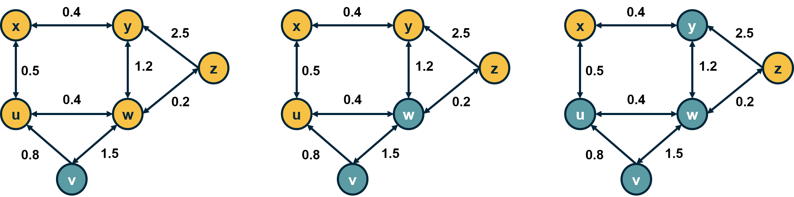{: width="500" height="300"}
*Figure 10.32 from Network Science by Albert-László Barabási*

###  Independent Contagion Model

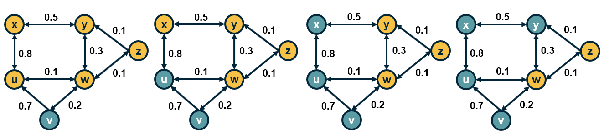{: width="500" height="300"}
*Figure 10.32 from Network Science by Albert-László Barabási*

> **Food for Thought**
> 
> 
{: .prompt-info }

###  Deffuant Model For Opinion or Consensus Formation

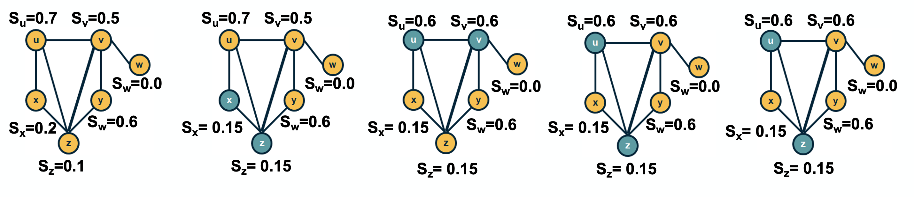{: width="500" height="300"}
*Figure 10.32 from Network Science by Albert-László Barabási*

###  Game Theoretic Diffusion Models

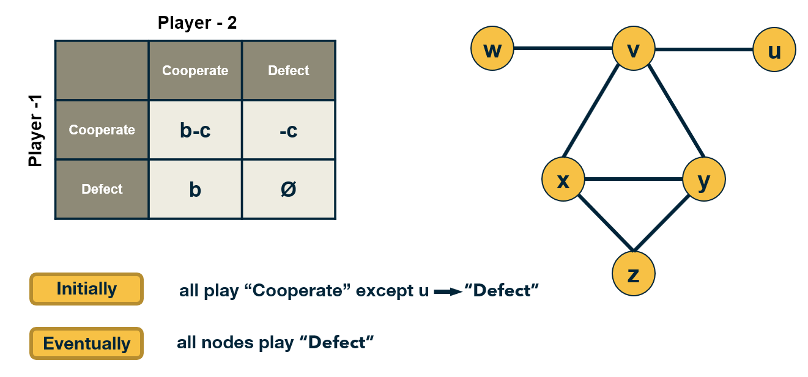{: width="500" height="300"}
*Figure 10.32 from Network Science by Albert-László Barabási*

###  Seeding for Maximum Network Cascade

TODO

###  Submodularity of Objective Function

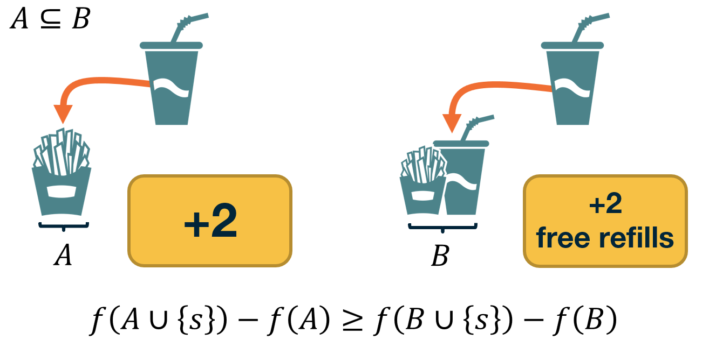{: width="500" height="300"}
*Figure 10.32 from Network Science by Albert-László Barabási*

###  Monotone and Submodular Function

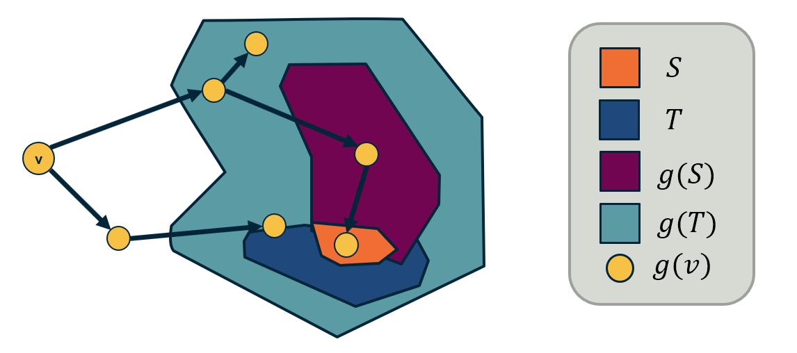{: width="500" height="300"}
*Figure 10.32 from Network Science by Albert-László Barabási*

###  Cascades in Networks with Communities

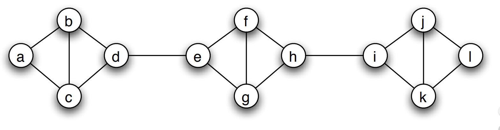{: width="500" height="300"}
*Figure 10.32 from Network Science by Albert-László Barabási*

###  Cascades in Networks with Communities-2

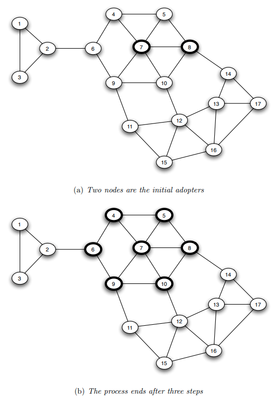{: width="500" height="300"}
*Figure 10.32 from Network Science by Albert-László Barabási*

###  How do Dense Clusters Affect Cascades?

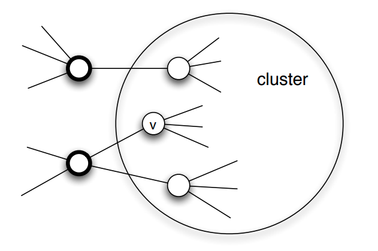{: width="500" height="300"}
*Figure 10.32 from Network Science by Albert-László Barabási*

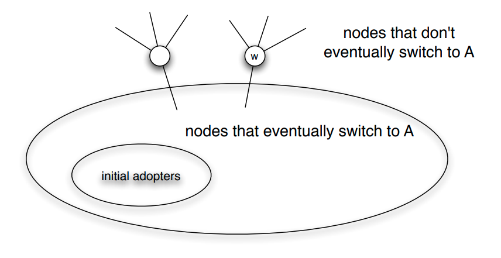{: width="500" height="300"}
*Figure 10.32 from Network Science by Albert-László Barabási*

###  Network Diffusion in the Brain

TODO

###  Asynchronous Linear Threshold (ALT) Model

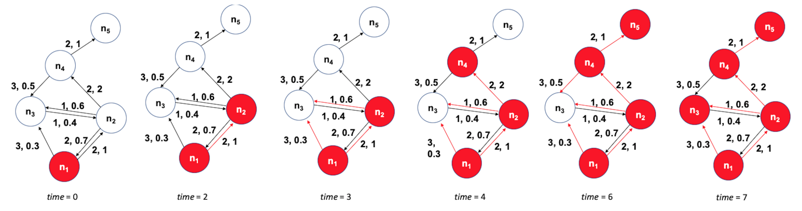{: width="500" height="300"}
*Figure 10.32 from Network Science by Albert-László Barabási*

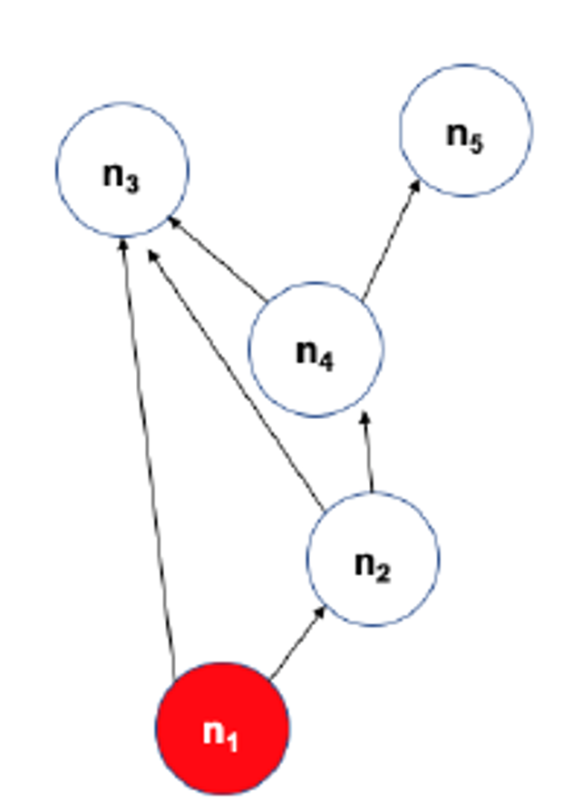{: width="200" height="200"}
*Figure 10.32 from Network Science by Albert-László Barabási*

###  Experimental Validation of ALT Model

TODO

###  Lesson Summary

This lesson focused on information diffusion processes on networks.

We started with some common empirical findings about the size and depth of the cascades that these diffusion processes create .

Then, we reviewed some common mathematical models, such as the Independent Cascade model, that are often used to study such network diffusion processes.

Then, we examined an important optimization problem in the context of network diffusion: if we can start a cascade from say k nodes, which nodes should we select to maximize the size of the cascade?

We also considered the effect of community structure on the extent of the diffusion process on a network.

Finally, we presented a case study of a network diffusion process on brain networks, in the context of multi-sensory integration.

<!-- Dummy line -->
<!--  -->    