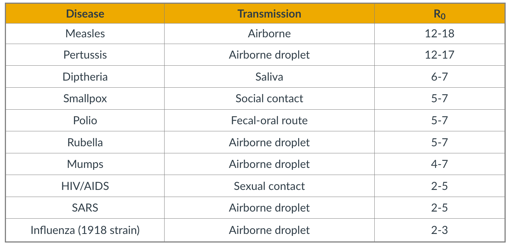

### Overview

Required Reading
* Chapter-10 from A-L. Barabási, [Network Science](http://barabasi.com/networksciencebook/) , 2015.

Recommended Reading

* [Super-spreaders in infectious](https://doi.org/10.1016/j.ijid.2010.06.020) and [Richard A.Stein, International Journal of Infectious Diseases](https://www.sciencedirect.com/science/article/pii/S1201971211000245), August 2011
* [Cellular Superspreaders: An Epidemiological Perspective on HIV Infection inside the Body](https://doi.org/10.1371/journal.ppat.1004092%C2%A0) Kristina Talbert-Slagle et al., 2014

###  Spreading Phenomena on Networks & Epidemics

The COVID-19 pandemic has changed our world in ways that we can still not comprehend. Millions of people have been infected and hundreds of thousands have died. Epidemics and pandemics are not new, however. They have been a major threat to humanity since the beginning of recorded history. In the last few decades, however, they are becoming more frequent and they spread faster because of overpopulation, increased mobility through air travel, and the human invasion in wild-life habitats. ​

You may wonder: why study epidemics in a network science course? The pathogens that cause epidemics spread through networks of humans. These networks may refer to sexual partners, breathing the same air when in close proximity, or touching the same materials. In all cases, there is an underlying network however and how the epidemic will spread depends on the structure of that network, as will see in more detail in this lesson. ​

#### Various Classes of Epidemic Models

Epidemiologists use a wide spectrum of models to study the spread of epidemic and to evaluate different intervention strategies such as quarantines, travel restrictions or vaccinations. This visualization shows some of hte more common modeling strategy. First, the compartmental model, here the models assume that individuals belong to a small number of compartments such as susceptible, exposed, infected, or removed recovered. 

Some of the models we will study mathematically later in this lesson belong in this class. Such models do not capture the network structure of the population. Instead, they assume that all individuals have the same number of contacts. The only difference between individuals is their epidemiological state, their compartment. 

The second one, is the vector-borne compartmental model. Here we consider both the vectors for example, the mosquitos and the hosts, the humans have an infectious disease and their epidemiological state. 

In the third class the special models we also consider the population density at different locations. This is necessary when the goal of the model is to predict how an epidemic will spread in a country or city. 

In the fourth class, the metapopulation models, here are the population is modeled with two or more subpopulations. It's with difference mobility, location, or transmission characteristics. For example, we could have the heterosexual, the homosexual, the bisexual subpopulations as different parties in this kind of model. 

And the firth one, is network models, here we mostly focus on the network of contacts between individuals. The properties of this network, for example, that degree distribution can have major implications on the spread of an epidemic. And finally, individual based models are the most detailed, but also the most computational intensive because here we have to capture what happens to each individual as he or she moves around. How the network neighbors change, and how the epidemiological state of those neighbors also changes 

#### Other Spreading Processes on Networks

We should note that the biological pathogens epidemics are not the only spreading processes on networks. There are many other entities that can spread on a network. Some of them physical, but others can be digital such as computer viruses or informational, such as rumors or even fake news. Some of the models we will study next in the context of epidemics are also applicable in these different spreading processes. For example, it is possible to study the spread of a computer virus through a biological epidemic model. 

We should be careful, however, to not over generalize because some of these spreading processes are fundamentally different than biological epidemics.

For example, in an epidemic, you can get infected simply because you came in close contact with a single infected individual once. In the context of information or meme spreading on the other hand, it is often the case that you need to come in contact multiple times and with multiple individuals before you adopt it yourself. 

###  SI Model

{: width="500" height="300"}
*Figure 10.5 from Network Science by Albert-László Barabási*

Suppose that we have $N$ individuals in the population and, according to the homogeneous mixing assumption, each individual has the same number of contacts $\bar{k}$ (this is shown as <k> in the textbook visualizations).  

In the SI model, there are two compartments: Susceptible (S) and Infected (I) individuals. To become infected, a susceptible individual must come in contact with an infected individual. If someone gets infected, they stay infected.  

If $S(t)$ and $I(t)$ are the number of susceptible and infected individuals as functions of time, respectively, we have that $(S(t) + I(t) = N)$. We typically normalize these two functions by the population size, and we work with the two population densities: $s(t) = S(t)/N$ and $𝑖(𝑡)=𝐼(𝑡)/𝑁$, with $s(t) + i(t)= 1$.  

The infection starts at time=0 with a single infected individual: $𝑖(0)=1/𝑁=𝑖_0$. 

Suppose that an S individual is in contact with only one infected individual. Let us define the parameter $\beta$ as follows: $\beta dt$ is the probability that S will become infected during an infinitesimal time interval of length $dt$.

Given that the S individual is in contact with $\bar{k}$ infected individuals, this probability increases to $1-\left(1-\beta dt\right)^\bar{k} \approx 1-\left(1-\bar{k}\beta dt \right)= \bar{k} \, \beta \, {dt}$ because the infection can take place independently through any of the infected contacts (the approximation is good as long as this probability is very small).  

If the density of infected individuals is $i(t)$, then the probability that the S individual becomes infected is $\bar{k} \beta i(t) dt$.

The infection process is always probabilistic but for simplicity, we can model it deterministically with a two-state continuous-time Markov process: an individual moves from the S to the I state with a transition rate $\bar{k} \beta i(t)$.  

So, if the density of S individuals is $s(t)$, the increase in the density of infected individuals during $dt$ is: 

$$
di(t) = \bar{k} \, \beta \, i(t) \, s(t) \, dt
$$

Thus the SI model can be described with the differential equation: 

$$
\frac{di(t)}{dt} = \bar{k} \, \beta \, i(t) \, (1-i(t))
$$

with initial condition $𝑖(0)=𝑖_0$.  

This is a nonlinear differential equation (because of the quadratic term) but it can be solved noting that 

$$
\frac{di}{i(1-i)} = \frac{di}{i} + \frac{di}{1-i} = \bar{k} \, \beta \, dt
$$

where we replaced $i(t)$ with 𝑖 for simplicity.  

Integrating both sides, we get that:  

$$
\ln{i} - \ln{(1-i)} = \bar{k} \beta t + \mbox{constant}
$$

The initial condition gives us that this constant is equal to $\ln{i_0} - \ln{(1-i_0)}$. 

So, if we exponentiate both sides of the previous equation we get that: 

$$
\frac{i}{1-i} =  \frac{i_0}{1-i_0} \, e^{\bar{k} \beta t }
$$

and so we get the closed-form solution for the density of infected individuals for 𝑡≥0
: 

$$
i(t) = \frac{i_0 e^{\bar{k} \beta t }}{(1-i_0)+i_0 e^{\bar{k} \beta t}} \quad (1)
$$

This function is plotted at the visualization.  

There are some important things to note about this function:  

1. For small values of t, when the density of infected individuals is very small and the outbreak is only at its start, i(t) increases exponentially fast: $i(t) \approx i_0 e^{\bar{k} \beta t}$
2. The time constant during that “exponential regime” is $\frac{1}{\bar{k}\beta}$
. This time constant is often used to quantify how fast an outbreak spreads. This time constant decreases with both the infectiousness of the pathogen (quantified by $\beta$) and the number of contacts $\bar{k}$.
3. For large values of t, the density of infected individuals tends asymptotically to 1 – meaning that everyone gets infected.  

> **Food for Thought**
>
> Perform the last derivation, showing how to get equation (1), in more detail. 
>
{: .prompt-info }

###  SIS Model

{: width="500" height="300"}
*Figure 10.5 from Network Science by Albert-László Barabási*

The SI model is unrealistic because it assumes that an infected individual stays infected. In practice, thanks to our immune system, we can recover from most infections after some time period. In the SIS model, we extend the SI model with an additional transition, from the I back to the S state to capture this recovery process. 

The recovery of an infected individual is also a probabilistic process. As we did with the infection process, let us define as $\mu dt$ the probability that an infected individual recovers during an infinitesimal time period $dt%
. If the density of infected individuals is $i(t)$, then the transition rate from the I state to the S state is $\mu i(t)$.  

So, the differential equation that describes the SIS model is similar with the SI equation – but with a negative term that decreases the density of infected individuals as follows: 

$$
\frac{di(t)}{dt} = \bar{k} \, \beta \, i(t) \, (1-i(t)) - \mu \, i(t)
$$

The initial condition is, again, $i(0) = i_0$.  

As in the case of the SI model, this differential equation be solved despite the quadratic term:

$$
i(t) = (1-\frac{\mu}{\bar{k} \beta}) \frac{c \, e^{(\bar{k}\beta-\mu)t}}{1 + c \, e^{(\bar{k} \beta-\mu)t} }
$$

where c is a constant that depends on the initial condition as follows: 

$$
c= \frac{i_0}{(1-i_0)-\frac{\mu}{\bar{k} \beta}}
$$

Note that if we set $\mu=0$, we get the same solution we had previously derived for the SI model. 

The SIS model can lead to two very different outcomes, depending on the magnitude of the recovery rate $\mu$ relative to the cumulative infection rate $\bar{k}\beta$: 

If $\bar{k}\beta < \mu$, then the exponent in the previous solution is negative and the density of infected individuals drops exponentially fast from $i_0$ to zero. In other words, the original infection does not cause an outbreak. This happens when the recovery of the original infected individual takes place faster than the infection of his/her susceptible neighbors.  

In the opposite case, when $\bar{k}\beta > \mu$, we have an exponential outbreak for small values of t (when the density of infected individuals is quite smaller than 1). In that regime, we can approximate the solution of the SIS model with the following equation: $i(t) \approx i_0 \, e^{(\bar{k} \beta-\mu)t}$
  

The time constant for the SIS model, during that exponential outbreak, is $\frac{1}{\bar{k} \beta-\mu}$

As time increases, when $\bar{k}\beta  \mu$
, we get that fraction of infected individuals tends to $1 - \frac{\mu}{\bar{k}\beta}$. In other words, we get a persistent epidemic in which even though individuals keep moving between the S and I states, the percentage of the population that remains sick is practically constant. This is referred to as the “endemic state”.  

The ratio $\frac{\bar{k}\beta }{\mu}$ is critical for the SIS model: if it is larger than 1, the SIS model predicts that even a small outbreak will lead to an endemic state. Otherwise, the outbreak will die out.  This is why we define that the epidemic threshold of this model is equal to one. 

> **Food for Thought**
>
> Derive equation (1) in detail.  
>
{: .prompt-info }

###  SIR Model

{: width="500" height="300"}

For some pathogens (e.g., the virus VZV that causes chickenpox), if an individual recovers he/she develops persistent immunity (through the creation of antibodies for that pathogen) and so the individual cannot get infected again.  

For other pathogens, such as HIV, there is no natural recovery and an infected individual may die after some time.  

To model both possibilities, the SIR model extends the SI model with a third state R referred to as “Removed”. The transition from I to R represents that either the infected individual acquired natural immunity or that he/she died. In either case, that individual cannot infect anyone else and cannot get infected again.  

As in the case of the SIS model, we will denote as $\mu$ the parameter that describes how fast an infected individual moves out of the infected state (independent of whether this transition represents recovery/immunity or death).  

There are now three population densities, one for each state, and they should always add up to one: $𝑠(𝑡)+𝑖(𝑡)+𝑟(𝑡)=1$.

{: width="500" height="300"}
*Figure 10.6 from Network Science by Albert-László Barabási*

Similar with the SIS model, we can write a differential equation for the density of infected individuals: 

$$
\frac{di(t)}{dt} = \bar{k} \, \beta \, i(t) \, s(t) - \mu\, i(t)
$$

The only difference with SIR is that 𝑠(𝑡)=1−𝑖(𝑡)−𝑟(𝑡)
.

The differential equation for the density of removed individuals is simply: 

$$
\frac{dr(t)}{dt} = \mu \, i(t)
$$

At this point we have a system of two differential equations, for $i(t)$ and $r(t)$, with the initial conditions: $𝑖(0)=𝑖_0$ and $𝑟(0)=0$.  

If we solve these equations, the density of S individuals is simply $𝑠(𝑡)=1−𝑖(𝑡)−𝑟(𝑡)$.  

The previous system of differential equations cannot be solved analytically, however.  Numerically, we get plots such as the visualization (for the case $\bar{k}\beta > \mu$). In this case, the initial outbreak leads to an epidemic in which all the individuals first move to the infected state (green curve) and then to the removed state (purple line).  

If $\bar{k}\beta<\mu$, the initial outbreak dies out as in the case of the SIS model, and almost the entire population remains in the S state. 

So the epidemic threshold for the SIR model is also equal to one, as in the case of the SIS model.

###  Comparison of SI, SIS, SIR Models Under Homogeneous Mixing

{: width="500" height="300"}
*Figure 10.7 from Network Science by Albert-László Barabási*

This figure summarizes the results for the SI, SIS, and SIR models, under the assumption of homogeneous mixing. 

For the SI model there is no epidemic threshold and we always get an epidemic that infects the entire population.

For the SIS and SIR models we get an epidemic if the ratio $\frac{\bar{k}\beta}{\mu}$ is greater than the epidemic threshold, which is equal to one. In that case, both models predict an initial "exponential regime". The difference between the SIS and SIR models is that the former leads to an endemic state in which a fraction $1-\frac{\mu}{\bar{k}\beta}$ of the population remains infected (if the epidemic threshold is exceeded). 

There are more realistic models in the epidemiology literature, with additional compartmental states and parameters. A common such extension is to introduce an **“Exposed”** state E, between the S and I states, which models that individuals that are exposed to a pathogen stay dormant for some time period (until they develop enough viral load) before they become infectious. This leads to the SEIR model.  

Another extension is to consider pathogens in which some infected individuals may acquire natural immunity while others may die. This requires to have two different Removed states, with different transition rates. 

###  Number of Partners in Sexual Networks

{: width="500" height="300"}
*Figure 10.13 from Network Science by Albert-László Barabási*

All previous derivations assume that each individual has the same number of contacts . This assumption makes the derivations simpler – but as we will see later in this lesson, it can also be misleading especially when the number of contacts of different individuals varies considerably.  

Let us start with sexually transmitted diseases. The plot at the left shows the distribution of the number of sexual partners, separately for men and women, since sexual initiation in a 1996 survey in Sweden. Note that the plot is in log-log scale. The straight-line decay when the number of partners is larger than 20 suggests that the corresponding distribution follows a power-law. The exponent is about 3 for women and 2.6 for men. Even though most men had less than 10-20 partners, there are also individuals with 100s of partners

{: width="500" height="300"}
*Figure 10.14 from Network Science by Albert-László Barabási*

The plot at the top shows is based on a survey of high school students and “romantic relationships”. Note that even though there are 63 couples without any other connections and many other nodes with only 1-2 connections, there are also few nodes with a much higher number of such relationships (up to almost 10).  

Assuming that every individual has the same number of contacts/partners would be very far from the truth at least in these two datasets.  So, clearly, the homogeneous mixing assumption is very unrealistic.

###  Number of “Close Proximity” Contacts

{: width="500" height="300"}
*Figure 10.16 from Network Science by Albert-László Barabási*

For airborne pathogens and respiratory diseases such as COVID-19, what matters more is the number of individuals we are in close proximity to. This cannot be measured with surveys but it can be measured with wireless technology such as RFID badges (Radio Frequency Identification) . Various studies have provided volunteers with RFID badges and asked them to wear them throughout the whole day (e.g., on university campuses, dorms, gyms) .

The visualization at the left refers to a network of contacts, mapped using RFID technology, between 232 students and 10 teachers across 10 classes in a school. It is also easy to see that there is a very strong community structure in this network, most likely associated with the different classes the students attend.  

A common conclusion from these studies is that the number of people we come close to varies greatly across individuals. Most of us come physically close to only a small number of specific other people but some individuals interact with hundreds of other people in their daily life. RFID technology can also give us information about the duration of these interactions, which is also a very important factor in the transmission of a pathogen from an infected to a susceptible individual.  

The statistical distribution of these durations is also heavy-tailed, typically following a power-law, meaning that most of our face-to-face interactions are very brief (e.g., saying hi at a corridor) but few interactions last for hours – and typically those are the most dangerous for the transmissions of viruses such as COVID-19, H1N1, influenza, etc.  

###  Global Travel Network

{: width="500" height="300"}

Another important factor in the spread of pathogens is the global travel network. Especially with air transportation, in the last few decades, it has become possible for an airborne virus to spread from one point of the planet to all major cities around the world within the first 24 hours.

Imagine, for instance, an infected individual sneezing while waiting at the security control line of a busy airport such as JFK. The passengers around him/her may be traveling to almost every other country on the planet.  

{: width="500" height="300"}
*Figure 10.15 from Network Science by Albert-László Barabási*

The plot at the top refers to the air transportation network, where the nodes are airports and the links refer to direct flights between airports: the degree distribution of this network is a power-law with an exponent close to 2. Atlanta’s airport is one of the most connected in the world and resides at the tail of this distribution.  

###  Reproductive Number R0

{: width="500" height="300"}

Epidemiologists often use the “**reproductive number**”, $R_0$, which is the average number of secondary infections that arise from a single infected individual in a susceptible population. 

One way to estimate R0 is to multiply the average number of contacts of an infected individual by the probability that a susceptive individual will become infected by a single infected individual (“**attack rate AR**”). So, the $R_0$ metric does not depend only on the given pathogen – it also depends on the number of contacts each individual has.  

If the number of secondary infections from a single infected individual is $R_0$>1 then an outbreak is likely to become an epidemic, while if $R_0$<1 then an outbreak will not spread beyond a few initially infected individuals.  

In the context of the SIS and SIR models, we can easily show that the reproductive number $R_0$ is equal to the ratio $\frac{\bar{k}\beta}{\mu}$.  

{: width="500" height="300"}
*Figure 10.15 from Network Science by Albert-László Barabási*

The table shows the estimated reproductive number for some common infectious diseases.  

Note that $R_0$ also depends on the number of contacts -- and so this metric can vary with time because of interventions such as quarantines, social distancing, or safe-sex practices.  The estimates shown in this table should be interpreted as typical values in the absence of such interventions.  

Regarding COVID-19, the debate about its actual $R_0$ is still raging. The first reported result from Wuhan, China was that R0=2.2 – based on direct contact tracing. As of July 2020, there are estimates in the literature that vary from 2.0 to 6.5. 

> **Food for Thought**
>
> Show that in the SIS and SIR models the reproductive number $R_0$ is equal to the ratio $\frac{\bar{k}\beta}{\mu}$.
> 
{: .prompt-info }

###  The Fallacy of The Basic Reproductive Number

{: width="500" height="300"}
*Image Source: Super-spreaders in infectious diseases [Richard A.Stein (Links to an external site.)](https://www.sciencedirect.com/science/article/pii/S1201971211000245), International Journal of Infectious Diseases, August 2011.*

It is important to realize however that $R_0$ is only an average – it does not capture the heterogeneity in the number of contacts of different individuals (and it also does not capture the heterogeneity in the “attack rate” or “shedding potential” of the pathogen at different individuals). As we know by now, contact networks can be extremely heterogeneous in terms of the degree distribution, and they can be modeled with a power-law distribution of (theoretically) infinite variance. Such networks include hubs – and hubs can act as "superspreaders" during outbreaks. 

SARS (Severe Acute Respiratory Syndrome) was an epidemic back in 2002-3. It infected 8000 people in 23 countries and it caused about 800 deaths. The plot shown here shows how the infections progressed from a single individual (labeled as patient-1) to many others. Such plots result from a process known as “contact tracing” – finding out the chain of successive infections in a population. 

It is important to note the presence of a few hub nodes, referred to as **superspreaders** in the context of epidemics. The superspreaders are labeled with an integer identifier in this plot. The superspreader 130, for example, infected directly dozens of individuals. 

The presence of superspreaders emphasizes the role of degree heterogeneity in network phenomena such as epidemics. If the infection network was more “**Poisson-like**”, it would not have superspreaders and the total number of infected individuals would be considerably smaller. 

----

#### Superspreaders in Various Epidemics 

{: width="500" height="300"}
*[Table Source: Cellular Superspreaders: An Epidemiological Perspective on HIV Infection inside the Body](https://doi.org/10.1371/journal.ppat.1004092%C2%A0).Kristina Talbert-Slagle et al., 2014,*

The table above confirms the previous point about superspreaders for several epidemics.  

The third column shows R0 while the fourth column shows ”**Superspreading events**” (SSE). These are events during an outbreak in which a single infected individual causes a large number of direct or indirect infections. For example, in the case of the 2003 SARS epidemic in Hong Kong, even though R0  was only 3, there was an SSE in which an infected individual caused a total of 187 infections (patient-1 in the plot above). 

SSEs have been observed in practically every epidemic – and they have major consequences both in terms of the speed through which an epidemic spreads and in terms of appropriate interventions.  

For example, in the case of respiratory infections (such as COVID-19) “**social distancing**” is an effective intervention only as long as it is adopted widely enough to also include superspreaders. 

###  Degree Block Approximation

{: width="500" height="300"}
*Figure 10.19 from Network Science by Albert-László Barabási*

To avoid the homogeneous mixing assumption, one option would be to model explicitly the state (e.g., susceptible, infected, removed) of each node in the network, considering the degree of that node. That would result in a large system of differential equations that would only be solvable numerically.  

Another approach is to group all nodes with a certain degree k together in the same **“block”**. Then, we can ask questions such as: what is the rate at which nodes of degree k move from the S to the I state? In other words, we will not be able to make specific predictions for individual nodes but will be able to characterize the compartmental dynamics of all nodes that have a certain degree. This is referred to as the “**degree block approximation.**” 

This analytical method can be applied to networks with arbitrary degree distribution (including power-law networks). The degrees of neighboring nodes however should be independent. So, even though the degree block approximation is much more general than the homogeneous mixing assumption, it is still not be applicable in networks that have strong assortativity or disassortativity, clustering, or community structure. 

###  SIS Model – With An Arbitrary Degree Distribution

{: width="500" height="300"}
*Figure 9.29 from Network Science by Albert-László Barabási*

Let us go back to the SIS model.

With the degree block approximation, we model the density of susceptible $s_k(t)$ and infected $i_k(t)$ individuals that have degree $k$.  

Of course, it is still true that $s_k(t) + i_k(t) =1 $ because any of these individuals is either in the S or I states.  

We can also write that the density of all infected individuals is:  $i(t) = \sum_k p_k i_k(t)$.  

A susceptible individual of degree $k$ can become infected when he/she is in contact with an infected individual. For nodes of degree $k$, what is the fraction of their neighbors that are infected however?  Under the homogeneous mixing assumption, this fraction is simply $i(t)$. We now need to derive this fraction more carefully, considering that different nodes have different degrees. 

So, let us define as $\theta_k(t)$ as the fraction of infected neighbors of degree $k$ node.  

If we manage to calculate this fraction, we can then write the differential equation for the SIS model under the degree block approximation as: 

$$
\frac{di_k(t)}{dt} = k \, \beta \, \theta_k(t)\, (1-i_k(t)) - \mu\, i_k(t)
$$

Note that the only real difference with the SIS differential equation under homogeneous mixing is that the term $\theta_k(t)$ has replaced the term $i(t)$.  The reason is that susceptible individuals of degree k -- their density is $(1-i_k(t))$ -- get infected from a fraction $\theta_k(t)$ of their $k$ neighbors. 

Now, let us derive $\theta_k(t)$.  

Suppose we have a network with n nodes, m edges, and an arbitrary degree distribution $p_k$.  

Recall that the average degree is given by $\bar{k} = \frac{2m}{n}$, and the average number of nodes of degree $k$ is $n_k = np_k$.  

Consider a node of degree $k$. The probability that a neighbor of that node has degree $k’$ is the fraction of edge stubs in the network that belong to nodes of degree $k’$: 

$$
\frac{k' \, n_{k'}}{2 \, m} = \frac{k' \, p_{k'}}{\bar{k}}
$$

Note that this probability does not depend on $k$. 

So, the probability that a node of degree k connects to an infected neighbor of degree $k’$ is: 

$$
\frac{k' \, p_{k'}}{\bar{k}} \, i_{k'}(t)
$$

Taking the summation of these probabilities across all possible values of k’ we get that the probability $\theta_k(t)$ that a node of degree k connects to an infected neighbor (of any degree) is: 

$$
\theta_k(t) = \sum_{k'} \frac{k' \, p_{k'}}{\bar{k}} \, i_{k'}(t)
$$

Note that $\theta_k(t)$ does not depend on k, and so we can simplify our notation and write $\theta(t)$ instead of $\theta_k(t)$.  

This is important: the probability that any of your neighbors is infected does not depend on how many neighbors you have.  

We can now go back to the original differential equation for the SIS model and re-write it as: 

$$
\frac{di_k(t)}{dt} = k \, \beta \, \theta(t) \, (1-i_k(t)) - \mu \, i_k(t)
$$

Early in the outbreak, when $i_k(t) \approx 0$, this (nonlinear) differentiation equation can be simplified as: 

$$
\frac{di_k(t)}{dt} = k \, \beta \, \theta(t) - \mu \, i_k(t)
$$

Additionally, we should consider that early in the outbreak, an infected individual x must have one infected neighbor y (the node that infected x) -- y has not returned back to the pool of Susceptible individuals yet because we assume that we are early in the outbreak. With this correction in mind,  we should modify the previous equation for the probability that a susceptible individual of degree-k gets infected from an individual of degree-k' as follows:

$$
\theta_k(t) = \sum_{k'} \frac{(k'-1) \, p_{k'}}{\bar{k}} \, i_{k'}(t)
$$

because one of the k' links of the infected individual must connect to another infected individual. 

To solve this equation, we can take the derivative of $\theta(t)$: 

$$
\frac{d \theta(t)}{dt} = \sum_{k'} \frac{(k' -1)\, p_{k'}}{\bar{k}} \, \frac{di_{k'}(t)}{dt}
$$

If we replace $k’$ with k (just a notational simplification) – and substitute the derivative of $i_k(t)$ from the SIS differential equation, we get: 

$$
\frac{\beta}{\bar{k}}\sum_kk^2\,p_k\,\theta(t)-\frac{\beta}{\bar{k}}\sum_kk\,p_k\,\theta(t)-\frac{\mu}{\bar{k}}\sum_k(k-1)\,p_k\,i_k(t)=
$$

$$
\frac{\beta}{\bar{k}}\sum_kk^2\,p_k\,\theta(t)-\frac{\beta}{\bar{k}}\sum_kk\,p_k\,\theta(t)-\frac{\mu}{\bar{k}}\sum_k(k-1)\,p_k\,i_k(t)= 
$$

$$
= (\frac{\beta \, \bar{k^2}}{\bar{k}} - (\beta+\mu)) \, \theta(t)
$$

where $\bar{k^2}=\sum_k{k^2 p_k}$ is the second moment of the degree distribution. 

This is a linear differential equation with solution: 

$$
\theta(t) = c \, e^{t \, (\beta \bar{k^2} - (\beta+\mu) \bar{k})/\bar{k}}
$$

where c is a constant that depends on the initial condition.  

Now that we have solved for $\theta(t)$, we could go back and derive the fraction $i_k(t)$ of infected individuals of degree $k$.  

For our purposes, however, we do not even need to take that extra step. The expression for $\theta(t)$ clearly shows that we will have an outbreak if and only if $\beta \, \bar{k^2} - (\beta+\mu)\, \bar{k}  > 0$, or equivalently,  $\frac{\beta}{\beta+\mu} > \frac{\bar{k}}{\bar{k^2}}$.

Contrast this inequality with the corresponding condition under homogeneous mixing, namely:$\beta \bar{k} - \mu > 0$, or equivalently, $\frac{\beta}{\mu} > \frac{1}{k}$

In other words, when we consider an arbitrary degree distribution, it is not just the average degree that affects the epidemic threshold. The second moment of the degree distribution also matters. And as the second moment increases relative to the first (i.e., the ratio $\frac{\bar{k}}{\bar{k^2}}$ decreases), it is easier to get an epidemic outbreak. 

> **Food for Thought**
>
> Use the derived expression for $\theta(t)$ to derive the density $i_k(t)$ of infected individuals of degree k. 
> 
{: .prompt-info }

###  SIS Model – No Epidemic Threshold For Scale-Free Nets

Let us now examine the epidemic threshold for two-degree distributions we have studied considerably in the past. 

1. For random networks with Poisson degree distribution (such as ER networks), the variance is equal to the mean, and so the second moment is: $\bar{k^2} = \bar{k}(1+\bar{k})$

    So, we have an epidemic if  $\frac{\beta}{\beta+\mu} > \frac{1}{\bar{k}+1}$, which is equivalent to the expression  we derived under homogeneous mixing ($\frac{\beta}{\mu} > \frac{1}{\bar{k}}$).  

    {: width="500" height="300"}
    *Figure 10.11 from Network Science by Albert-László Barabási*

    In the visualization, the x-axis parameter $\lambda$ refers to the ratio $\frac{\beta}{\beta + \mu}$. In the "**random network**" curve (green), if that ratio is larger than $\frac{1}{1+\bar{k}}$ an outbreak will lead to an epidemic. The y-axis value shows the steady-state fraction of infected individuals in the endemic state.  
    It is important to note that if $\lambda$ is less than the threshold $\frac{1}{1+\bar{k}}$, then the outbreak will die out and it will not cause an epidemic.
2. For networks with a power-law degree distribution ("scale-free network" curve shown in purple), and with an exponent $\gamma$ between 2 and 3, the variance (and the second moment) of the degree diverges to infinity ($\bar{k^2} \rightarrow\infty$).  

    This means that the condition for the outbreak of an epidemic becomes: 

    $$
    \lambda > \frac{\bar{k}}{\bar{k^2}} \rightarrow 0
    $$

    This is a remarkable result with deep and practical implications. It states that if the contact network has a  power-law degree distribution with diverging variance, then **any outbreak will always lead to an epidemic**, independent of how small $\lambda$ is. Even a very weak pathogen, with a very small $\lambda$, will still cause an epidemic.  

    The fraction of infected individuals in the endemic state still depends on this ratio – but whether we will get an endemic state or not does not depend on $\lambda$.  

    The reason behind this negative result is the presence of hubs – nodes with a very large degree. Such nodes get infected very early in the outbreak – and then they infect a large number of other susceptible individuals.  

> **Food for Thought**
>
> Suppose that the ratio $\lambda$ is equal to 1/4. Plot the fraction of infected individuals of degree k in the endemic state as the ratio $\frac{\bar{k}}{\bar{k^2}}$ varies between 0 and 1/4.
> 
{: .prompt-info }

###  Summary of SI, SIS, SIR Models with Arbitrary Degree Distribution

{: width="500" height="300"}

Even though we showed the derivations for the density function $\theta(t)$ only for the SIS model, it is simple to write down the corresponding equations for the SI and SIR models.  

The table summarizes the differential equation and key results for each of the three models.  

The parameter $\tau$ is the characteristic timescale.

The SI model always leads to an epidemic. For the two other models, however, the epidemic threshold depends on the ratio of the first two moments of the degree distribution.  $\lambda_c$ is the minimum value of $\lambda$ for the emergence of an endemic state (only for SIS and SIR).  

We suggest that you contrast these results with the corresponding formulas for the case of homogenous mixing.  

> **Food for Thought**
>
> Repeat the derivations we performed in this lesson for the SIS model in the case of the SI and SIR models. 
> 
{: .prompt-info }

###  Computational Modeling of Epidemics

#### Epidemic Models in Practice

The mathematical models we studied earlier, are viable because they only depend on a few parameters and they provide clear insights. They are very simplified however, and they are based on very unrealistic assumptions. In practice, when public health agencies try to predict or mitigate the spread of an epidemic, they use more complicated models that can be solved numerically.

As shown in the visualization for the gleam model developed by Northeastern University, this model require many types of input data including demographic data about the density of the population, different neighborhoods, mobility data 
that describes how people move locally and over long distances. As well as any available data about the pathogen itself. All these detail data are then used to perform simulations at either level of individuals or small groups.

These simulations can predict how the epidemic will spread over time and space. How many people will get sick, how many will need hospitalization or even die.
Additionally, SATs detailed computational models are used to examine the effect of various interventions such as travel restrictions, quarantines, social distancing, vaccinations and so on. 

#### Modeling The 2009 H1N1 Pandemic

For instance, the GLEAM simulator has been used to model the spread of the 2009 H1N1 epidemic. This simulations were performed after the epidemic to evaluate the accuracy of the GLEAM model. The H1N1 pandemic started in Mexico in early 2009, lasted about 19 months and it killed almost 300,000 people worldwide. The GLEAM project use demographic mobility and epidemic data to predict the peak week of epidemic in its country. This means the week after the start of the epidemic at which we had the highest number of cases.

Here in this plot the x-axis shows the observed peak week for many candidates based on historic data. The y-axis shows the predicted peak week for each of these candidates based on the GLEAM model. Because the model is too high stick the results were produced from 2000 runs and they are reported here with confidence intervals. Ideally the center of the interval for each candidate should be on the diagonal. The model performs reasonably well, especially for candidates in which the demographic and mobility data are reliable. At the same time, there are some notable failures of the model such as the cases of France or Mongolia. Epidemic modeling is extremely hard not only because the data is often noisy, but also because people change their behavior and mobility during an outbreak.

#### Can Travel Restrictions Contain an Epidemic

Another important use of epidemic models and simulators is in evaluating different intervention strategies, such as travel restrictions, quarantines, school and business closures, social distancing policies or even vaccination strategies, if a vaccine is available.

An example of such application is shown here. The visualization shows the effect of travel restrictions on flights from Mexico, which was the source of H1N1 outbreak at the onset of the pandemic. The x-axis shows the effect of these travel restrictions on the delay of the arrival of the pandemic in nine differnet countries. The travel restrictions varied from mild to severe. Note that unless the travel restrictions are quire severe, they do not have a significant effect on the spread of epidemic. When the flights are reduced by 90%, there is only a gain of couple of weeks for most countries. On the other hand, implementing a complete quarantine is very difficult in practice and it can cause major financial or humanitarian issues. 

###  Effective Distance

Can we use geographical distance to predict the time that an epidemic will arrive at a state or country?  

Again, we can use epidemic models such as GLEAM to answer such question

{: width="500" height="300"}
*Figure 10.32 from Network Science by Albert-László Barabási*

The plot at the left shows the geographic distance between Mexico and many other countries at the x-axis, while the y-axis shows the time that the H1N1 pandemic arrived in that country (defined as the number of days between the first confirmed case in that country and the beginning of the outbreak on March 17, 2009). 

Clearly there is not any strong correlation between the two quantities.  

Let us now define a different kind of distance, based on mobility data rather than geography: 

Suppose that we have data from airlines, trains, busses, trucks, etc, showing how many travelers go from city i to city j.  

The fraction of travelers that leave city i and arrive at city j is denoted by $p_{i,j}$. 

The effective distance between the two cities is then calculated as $d_{i,j} = 1-ln p_{i,j}$.  

The plot at the right replaces geographic distance with “**effective distance**”, and it shows that that the arrival day of this pandemic from Mexico was actually quite predictable based on strictly mobility data.  

###  Lesson Summary

This lesson introduced you to several important points about epidemics on networks: 

1. Compartmental epidemic models such as SIS and SIR under the homogeneous mixing assumption 
2. The basic reproductive number and how it can be misleading in the presence of super-spreaders 
3. Epidemic threshold 
4. Real-world contact networks do not follow the homogeneous mixing assumption 
5. How the spread of an epidemic depends on the second moment of the degree distribution 
6. Power-law networks with diverging degree variance do not have an epidemic threshold 
7. Computational modeling of epidemics 

We will continue our study of spreading processes on networks in the next Lesson, considering some more advanced topics about epidemics as well as the spread of other entities on networks such as information and memes.  

<!-- Dummy line -->
<!--  -->    