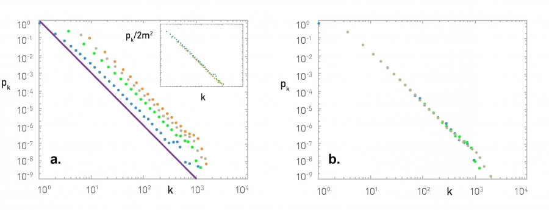

### Overview

Required Reading

* Chapter-5 from A-L. Barabási, [Network Science](http://barabasi.com/networksciencebook/), 2015.
* Chapter-18 (mostly sections 18.3 and 18.7) - from D. Easley and J. Kleinberg, [Networks, Crowds and Markets](https://www.amazon.com/Networks-Crowds-Markets-Reasoning-Connected/dp/0521195330/), Cambridge Univ Press, 2010 (also available [online](https://www.cs.cornell.edu/home/kleinber/networks-book/))
* [Hierarchical structure and the prediction of missing links in networks](https://www.nature.com/articles/nature06830), by A.Clauset et al. Nature, 2008

Recommended Reading

* "[Heuristically Optimized Trade-Offs: A New Paradigm for Power Laws in the Internet](https://link.springer.com/chapter/10.1007/3-540-45465-9_11)", by Fabrikant et al., 2002

### Why Network Modeling?

lets start with a fundamental question. Why do we need network models? where can we use them in practice. Where to use models instead of the actual data that describe real world network.

For instance, consider this two networks. The network at the right relates to human malaria parasite which killed some one million people globally every year. We also saw that adjacency matrix of these network ordered so that the existence of the communities (blue green red) are clearly shown. If we want to ask questions about these specific network, we can work with this specific data and not rely any model.

What do we want however, is to ask more general questions about other parasites or larger/smaller instance of this network. The figure at the left shows a network model. It also ahs three communities. This is a stochastic block matrix model and to describe it we need to specify the number of communities, the size and the probability of intra and inter community edges. We can choose these parameters so that these models can product networks that are similar structurally with the malaria network we see at the right. Or we can use the model to create either larger or smaller networks than the malaria network but still with 3 communities. OR we can use this model to generate 100s of network instances, all of them having the size, edge density, same number of communities but different topology. 

So, when can we use such an abstract network model instead of the data that specified a given network. A model allows us to describe a given network in a parsimonious manner, with fewer parameters than having to specify the complete adjacency matrix.

It also allows us to create an ensemble of many network instances, all of them having the same characteristics. With a model, we can examine various network properties and dynamic behaviors if the network was smaller, larger, denser, etc.

Also, when working with noisy data, we can infer whether some of the links in the given network are missing or they do not actually exists using a model.

Finally if a model is mechanistic, it can provide a plausible explanation on how the network came to be in its current structure. there are also many other reasons to use network models that are often application specific. 

### Preferential Attachment Model

Most real world network show dynamic growth and preferential connections in spite the simple model called the Barabasi Albert model or the preferential attachment. It can generate networks with a power law degree distribution. The model is described as follows:

We start with an initial number of nodes that links between them are chosen arbitrary as long as the node has at least one link. From that point on, the network develops follow two steps at a time.

In the growth step, a new node is added with m lengths. In this animation m is equal to two and in the preferential attachment step, the probability that a link of the new node connects to a node i is proportionate to the degree of node i. Preferential attachment is a probabilistic mechanisms. A new node is free to connect any node in the network, whether it is a hub or it has only one link.

The preferential attachment bias however, implies that if a new node has a choice between for example a degree 2 and a degree 4 node, it is twice as likely that the new node will connect to the node of degree 4 rather than the node of degree 2. While most nodes in the network have only few links, a few nodes gradually become hubs. These hubs are a result of rich get richer phenomenon due to preferential attachment. New nodes are more likely to connect to more connected nodes than to the smaller nodes. Hence the larger nodes will acquire links at the expense of the small nodes, eventually becoming hubs. 

In the following pages, we will study these models mathematically.

### Mathematical Analysis of PA Model

Let us now derive mathematically the degree distribution of the Preferential Attachment (PA) model. There are different ways to do these derivations, depending on how rigorous we want to be. Here, we will use the “rate-equation” approach because it is quite general and you can also use it to derive the degree distribution of other growing networks.

Suppose that we add a new node in each time unit, starting from one node at time t=1. So, if N(t) represents the number of nodes at time t, we have that N(t)=t for t >0.

Let $N_k(t)$ denote the number of nodes of degree k at time t. The probability that a node has degree-k at time t is $p_k(t) = \frac{N_k(t)}{N(t)}$–  the degree distribution changes with time as we add more nodes and edges.

Recall that in the PA model every new node adds m edges to existing nodes. At time t, the total number of edges is $m \times t$ and the sum of all node degrees is twice as large.

The PA model states that the probability $\pi(k)$ that a new node at time t connects to a specific node v that has degree-k is proportional to k:

$$
\Pi(k) = \frac{k}{\sum_j k_j} = \frac{k}{2mt}
$$

After we add a new node at time t, the average number of edges that are expected to connect to degree-k nodes is:

$$
m \, \frac{k}{2mt} \, N(t) p_k(t) = \frac{k}{2} \, p_k(t)
$$

because a new node brings m new edges, and the average number of nodes of degree-k is $N(t) \, p_k(t)$.

This is also the average number of nodes of degree-k that get a new edge and become nodes of degree-(k+1) -- assuming that each node gets at most one new edge.

Similarly, some nodes of degree-(k-1) will get a new edge and they will become nodes of degree-k.

Using the previous expression again, the expected number of such nodes is $\frac{k-1}{2} \, p_{k-1}(t)$.

So, considering how many nodes of degree-k we have at time t, how many nodes of degree-(k-1) become nodes of degree-k at time t+1, and how many nodes of degree-k become nodes of degree-(k+1) at time t+1,  we can write that the expected number of degree-k nodes at time t+1 as:

$$
(N+1) \, p_k(t+1) = N\, p_k(t) + \frac{k-1}{2} p_{k-1}(t) - \frac{k}{2} p_k(t)
$$

The previous expression applies to all degrees k>m -- but it cannot be used for the minimum possible degree m because there are no nodes with degree m-1 (remember that even a newly born node has m edges).

Instead of having nodes of degree-(m-1) that are “promoted” to nodes of degree-m, we add exactly ONE node of degree-m at each time step.

So the expected number of degree-m nodes at time t+1 is:

$$
(N+1) \, p_m(t+1) = N\, p_m(t) + 1 - \frac{m}{2} p_m(t)
$$

Note that the previous two expressions give us a recursive process for computing $p_k(t)$ for any value of $k\geq m$ and for any time $t>0$.

What happens asymptotically, as the network size N increases? It can be shown that the probability distribution $p_k(t)$ becomes stationary, meaning that it does not change with time (we will not prove this step however). We will also see some numerical results that support this claim shortly.

So, instead of $p_k(t)$ we can write that $\lim_{t \to \infty} p_k(t) = p_k$.

The expression for nodes of degree-m becomes asymptotically:

$$
(N+1) \, p_m(t+1) - N\, p_m(t) \to p_m = 1 - \frac{m}{2} p_m
$$

which is equivalent to:

$$
p_m = \frac{2}{m+2}
$$

And the expression for nodes of degree-k with $k > m$ becomes asymptotically:

$$
(N+1) \, p_k(t+1) - N\, p_k(t) \to p_k = \frac{k-1}{2} p_{k-1} - \frac{k}{2} p_k
$$

which is equivalent to:

$$
p_k = \frac{k-1}{k+2} p_{k-1}, \quad \mbox{for }k>m
$$

or

$$
p_{k+1} = \frac{k}{k+3} p_{k}, \quad \mbox{for } k\geq m
$$

when $k \to k+1$. 

We now have a recursive formula that we can easily solve using induction to show that the probability of degree-k nodes is:

$$
p_k = \frac{2m(m+1)}{k(k+1)(k+2)} \quad \mbox{for } k \geq m \quad (1)
$$

This is the degree distribution equation for the PA model, at least for large networks.

Note that for large degrees (large k), this expression becomes a power-law with exponent 3, i.e., $p_k \approx ck^{-3}$,where $c=2m(m+1). **This is the main result of these derivations**.

The PA model generates power-law networks – but with a fixed exponent. Further, this exponent is equal to 3, which means that the first moment (mean) of the degree distribution is finite – but any higher moment (including the variance) diverges.

Additionally, note that the degree exponent does not depend on the parameter m. That parameter only controls the minimum degree of the distribution.

Let us now look at some numerical results to get a better insight in the previous results.

{: width="500" height="300"}

Figure (a) shows what happens as we vary the value of m (blue: m=1, green: m=3, grey: m=5, orange: m=7). The distributions are parallel to each other, having the same exponent. The inset plot shows what happens if we plot $\frac{p_k}{2m^2}$ – the effect of m disappears, meaning that $p_k$ is proportional to $2m^2$, as also predicted by our earlier mathematical derivation.

Figure (b) shows what happens when we vary the size of the network N  (blue: N=50,000, green: N=100,000, grey: N=200,000) – all of the plots have m=3. The resulting degree distributions are practically indistinguishable, supporting our earlier claim that the degree distribution becomes stationary (independent of time) at least for large networks.

Figure (c) shows the degree distribution of the PA network with N=100,000 nodes and m=3. The purple dots are the linearly-binned plot of the empirical degree distribution, while the green dots represent the log-binned version of the same plot. Note that the latter shows more clearly that the degree distribution behaves as a power-law with exponent 3.

> **Food for Thought**
>
> 1. Solve the recursive equations given above to show Equation (1). 
> 2. Use the same analytical approach to derive the degree distribution for a version of the PA model that applies to **directed networks**, as follows:
> 
> The probability that a new node connects with a directed edge to a specific node of in-degree $k_{in}(i)$ is:
> 
> $\Pi [k_{in}(i)] = \frac{k_{in}(i)+A}{\sum_j [k_{in}(j)+A]}$
> 
> where A is the same constant for all nodes. Each new node brings m directed links.
>
{: .prompt-info }

### Degree Dynamics in PA Model

How does the degree of a node change over time in the PA model, as the network grows?

An analytical approach that simplifies the problem considerably is to make two approximations:

1. ignore the discrete-time increments of the model and use a “continuous-time approximation” instead,
2. ignore the probabilistic nature of the model and consider a deterministic growth process in which the degree of all nodes increases in a continuous manner based on the PA formula.

Specifically, consider a node i with degree $k_i$ at time t. The rate at which the degree of that node increases at time t is:

$$
\frac{dk_i}{dt} = m \, \Pi(k_i) = m \frac{k_i}{2mt}
$$

The differential equation becomes:

$$
\frac{dk_i}{k_i} = \frac{dt}{2t}
$$

By integrating both sides, we get that:

$$
\ln {k_i} = \frac{1}{2} \ln{t} + c
$$

where c is a constant. Exponentiating both sides:

$$
k_i = t^{1/2} \, e^c
$$

The initial condition is that  $k_i(t_i) = m$, where $t_i$ is the time instant that node-i is born.

So, the degree of node i increases with time as follows, for $t > t_i$:

$$
k_i(t) = m(\frac{t}{t_i})^{1/2}
$$

This simple derivation predicts a couple of interesting facts:

First, the degree of all nodes is expected to increase with the square-root of time, i.e., sublinearly. The sublinearity is expected because each new node brings the same number of links m but it has to distribute those links to a growing number of nodes.

Second, older nodes (nodes that were added earlier in the model), accumulate a larger degree over time. In fact, the maximum degree is expected to be the degree of the first node added in the network, i.e., $k_{max}(t) \approx \sqrt{t}$. So, the PA model can capture the “first-mover advantage” that is often seen in economy, especially when companies compete for new products or services. 

This last point also highlights a shortcoming of the PA model: it cannot capture that different nodes may have different “attractiveness” for new links. The only node feature that matters is the time at which the node is born.

There are several variations of the PA model that introduce additional node parameters (such as a “quality” factor for each node), and/or different network processes (such as removal of existing nodes or edges, or rewiring of existing edges).

{: width="500" height="300"}

The visualization shows numerical results for nodes born at different times (purple for the node born at t=1, orange for the node born at t=100, etc). All curves increase approximately with an exponent of $\beta = \frac{1}{2}$ (note the log scale of the x and y axes).

Of course there are statistical fluctuations because these numerical results do not use the deterministic approximation of the previous derivations. The green curve represents the function $t^{1/2}$.

The lower plots show the degree distribution at three different snapshots of the growth process.

> **Food for Thought**
>
> Use the same deterministic and continuous-time approach to derive the degree of a node as a function of time under the following two scenarios:
> 1. Consider the scenario when we have network growth but no preferential attachment. Suppose that the network grows by one node at a time but the new node adds m links to randomly chosen nodes, instead of using preferential attachment.
> 
> 2. Consider the scenario when we have preferential attachment but no network growth. Suppose that the network size remains constant (equal to N nodes). At each time step, a node is selected randomly and connects to a node i of degree $k_i$ with the PA probability $\pi (k_i)$. If a node does not have any edges, we set arbitrarily that k=1 so that it can potentially get some edges.
>
{: .prompt-info }

### Nonlinear Preferential Attachment

{: width="500" height="300"}

{: width="500" height="300"}

There are many variations of the PA model in the literature.  Some of them generate special types of networks (such as directed or bipartite) while others include additional processes such as the removal or rewiring of edges or the aging of nodes.

Here, we present a nonlinear variation of the PA model in which the probability $\pi(k)$that a new node at time t connects to a specific node v that has degree-k is, not proportional to k, but proportional to:

$$
\Pi(k) = c \, k^\alpha
$$

where c is a constant (calculated so that $\sum_k p_k = 1$) and $\alpha$ is a positive exponent that may be larger or smaller than one. Of course the basic PA model results from $\alpha=1$.

This nonlinear PA model can be analyzed mathematically using the same methodology we studied earlier (the rate-balance approach) – you can try it yourself or look at the textbook (Advanced Topics 5.C).

If $\alpha < 1$, the bias to connect to higher-degree nodes still exists but it is weaker than in the linear PA model. This changes the degree distribution qualitatively – it becomes the product of the  power-law term $k^{-\alpha}$ and an exponential-decay term:

$$
p_k \approx k^{-\alpha} \, e^{- m_\alpha k^{1-\alpha}}
$$

where $m_\alpha$ is a constant that depends on $\alpha$ and m (the number of edges that each new node brings). This distribution is referred to as “stretched exponential” – the exponential term dominates for large values of k. The variance of the stretched exponential distribution does not diverge – such networks do not have large hubs and they do not exhibit the extreme properties of power-law networks we have seen in earlier lessons (such as the lack of an epidemic threshold).

Let’s also compare the degree dynamics of this model with the basic PA model we studied in the previous page. Recall that, when $\alpha=1$, we saw that $k_{max} \approx \sqrt{t}$. When $0 < \alpha < 1$, we can show that $k_{max}$ increases logarithmically,$k_{max}\approx  {(\ln t)}^{1/(1-\alpha)}$
 

What happens when $\alpha>1$? Intuitively, the bias to connect to higher-degree nodes comes stronger. The resulting networks have fewer but larger hubs than $\alpha=1$ – and the vast majority of the nodes connect only to those hubs. If $\alpha$ is sufficiently high all new nodes will connect to the first node because the degree of that node is higher, creating a hub-and-spoke (or “star topology”) network.

The maximum degree, in that case, increases linearly with ”time”,  $k_{max} \approx t$, because all new edges connect to the same node.

The previous results are illustrated with numerical results in the visualizations at the top of the page, showing the degree distribution for three values of $\alpha$ (0.5, 1 and 1.5 with N=10,000 nodes) and the maximum degree dynamics for $\alpha$ = 0.5, 1 and 2.5.

> **Food for Thought**
>
> What happens when $\alpha$ tends to 0? What is the resulting degree distribution and how does $k_{max}$ increase with time?
>
{: .prompt-info }

### Link-Copy Model

{: width="500" height="300"}

The PA model is simple (it has only one parameter) and it can generate a power-law degree distribution. However, the exponent of that distribution is fixed (equal to 3) and so the PA model does not give us the flexibility to adjust the exponent of the degree distribution to the same value that a given network has.

Let us now study another simple model that can also generate power-law networks but with any exponent we want. Additionally, this model can be used to create directed or undirected networks (we present it here in the context of directed networks).

The model is probabilistic and it also generates a growing network (one new node at a time) – as in the case of PA. Specifically, every time we add a new node v, it connects (with an outgoing edge) to an existing node as follows:

1. With probability p, v connects to a randomly chosen existing node u.
2. With probability q=1-p, v connects to a random node w that u connects to. In other words, v “copies” an outgoing edge of u (if u does not have any outgoing edges, v chooses another node. If no node has an outgoing edge, v connects to a random node).

The previous model is referred to as “link-copy” process. An equivalent way to describe the model is that, with probability q=1-p, node v selects a random edge in the network, say from a node u to a node w, and v connects to w.

The previous process can be repeated for m>1 new outgoing edges of node v. For simplicity, let us analyze the model for m=1 new edge.

Let us denote as $x_j(t)$ the in-degree of node j at time t.  How does $x_j(t)$ increase with time?

There are two cases:

1. node-j is selected randomly (with probability p) from a new node and it gains one incoming edge. At time t, there are N=t nodes (recall that we add one node at each time unit), and so the probability that a node-j will get a new incoming edge at time t in this manner is p/t. 
2. an incoming edge of node-j is selected with probability q – and node-j gains again one incoming edge. The probability of that happening at time t is $\frac{q_j(t)}{t}$ because node-j has $x_j(t)$ incoming edges at that time.

The following analysis will rely on the same assumptions we used in the PA model, i.e.,  continuous-time approximation and deterministic degree dynamics.

So, we can write a (deterministic) differential equation that expresses the rate at which node-j gains edges:

$$
\frac{dx_j}{dt} = \frac{p}{t} + \frac{q\, x_j}{t} = \frac{p+q\,x_j}{t}
$$

The initial condition for each node-j is that $x_j(t_j)=0$, where $t_j$ is the time that j was born.

If we index the nodes based on their time of birth (so that node-1 is born at time t=1, node-2 is born at time t=2, etc), we can write that $x_j(j)=0$ for all j.

The previous differential equation is easy to solve if we rewrite it as

$$
\frac{dx_j}{p+q x_j} = \frac{dt}{t}
$$

and integrate both sizes, we get:

$$
\frac{1}{q} \ln{(p+q x_j)} = \ln t + c
$$

where c is a constant. Exponentiating both sides of the equation, we get

$$
p+q x_j = e^{cq} t^q
$$

and so: $x_j(t) = \frac{1}{q} \left( e^{cq} t^q  -p\right)$. The initial condition $x_j(j) = 0$ gives us that $e^{cq} = p/ j^q$. So the solution for the in-degree dynamics is:

$$
x_j(t) = \frac{p}{q} [\left({\frac{t}{j}}\right)^q - 1]
$$

Note that the in-degree increases with time as a power-law with exponent q – contrast that with the PA model in which this exponent is fixed to 1/2.

But what is the in-degree distribution for this model? Let us calculate first the complementary cumulative degree distribution $P[X_j > k]$, i.e., for a given in-degree k and a time t, what is the fraction of the t nodes in the network that have $x_j(t) > k$? In other words, we are asking what is the maximum value of j for which

$$
x_j(t) = \frac{p}{q} [{\frac{t}{j}}^q -1] > k
$$

which is equivalent to

$$
j < t {(\frac{q}{p}k +1)}^{-1/q}
$$

So, the fraction of nodes with degree larger than k is:

$$
P[X_j > k] = {(\frac{q}{p}k +1)}^{-1/q}
$$

To find the probability that a node has in-degree equal to k, we can differentiate the previous expression with respect to k:

$$
p_k = P[X_j=k] = - \frac{dP[X_j>k]}{dk} = \frac{1}{p} {(\frac{q}{p}k +1)}^{-(1/q + 1)}
$$

This shows that the link-copy model creates a power-law degree distribution with exponent:

$$
\frac{1}{q}+1 = \frac{2-p}{1-p}
$$

Note that when p approaches 1, the new node connects to random existing nodes and so there is no bias to connect to nodes with higher in-degree. In that case, the previous exponent diverges and the in-degree distribution decays exponentially fast with k.

As p approaches 0, on the other hand, the power-law exponent approaches 2, which means that both the first and second moment of the degree distribution diverge. The network acquires a hub-and-spoke topology in that case, with every new node connecting to the first node.

For intermediate value of p, we can get any desired exponent larger than 2. For example, for p=1/2, we get that the exponent is equal to 3, as in the PA model. This does not mean, however, that the networks generated by the PA model are identical with the networks generated by the link-copy model for p=1/2. 

The link-copy model has been used to explain the emergence of power-law networks in directed networks such as the Web, citation networks or gene regulatory networks. In all such networks there are “copy-edge” mechanisms. 

For example, when someone creates a new Web page, it is often the case that he/she copies links of other relevant web pages.

Similarly, when writing the bibliography of a research article, authors are often “tempted” to copy references of other relevant articles (hopefully after they have read them!).

And in biology, the process of gene duplication creates multiple copies of the same gene. Those genes have the same promoters, and so, at least initially, they can be regulated by the same transcription factors.

Over time, mutations may change the promoter of a gene, creating regulatory differences in the incoming edges of different gene copies.

> **Food for Thought**
>
> Compare the network topology of the PA model with the undirected version of a Link-Copy network when p=1/2. Both models generate the same power-law degree distribution in that case. How are the two networks different however?
>
{: .prompt-info }

### Generating Networks with Community Structure

In the previous models, our focus has been on the degree distribution. That is an important property of a network – but it is not the only key feature.

As we saw earlier, another common property of many real-world networks is clustering and the presence of communities.

There is no reason to expect that the PA model and its many variants can generate any non-trivial community structure.

In fact we have already seen some models earlier that can generate clustering and/or communities. Recall the Watts-Strogatz model from Lesson-5: it can generate strong clustering (similar to that in regular mesh networks) – but it cannot generate communities and its degree distribution is not a power-law.

Additionally, in Lesson-8 we presented two methods to generate networks with a given community structure: the Girvan-Newman (GN) model and the LFR method. Recall that the latter can generate networks with both a power-law degree distribution and a power-law community size distribution.

Here, we briefly present one more model to construct networks with strong clustering and community structure: **the Stochastic Block Model** (SBM). The model description is very simple: we are given the number of nodes n, the number of edges m, the number r of communities and their sizes $n_1,n_2, ...,n_r$ (with $\sum_{i=1}^r n_i = n$), and a symmetric r-by-r probability matrix P.

The (i,j) element of P is the probability that a node of community i connects with a node of community j, i.e., $P\left(u\longleftrightarrow v \;\middle\|\; u \in i, v \in j \right)$. The diagonal elements of P represent the probability that nodes of the same community connect to each other – those elements are typically larger than the non-diagonal elements. The rows and columns of P are not probability distributions, hence they do not necessarily sum to one.

{: width="300" height="300"}

{: width="200" height="200"}

{: width="300" height="300"}

The visualization shows a network with r=3 communities and n=90 nodes ($n_1=25, n_2=30, n_3=35$) generated by a SBM model. The visualization also includes the 3-by-3 probability matrix P and the 90-by-90 adjacency matrix of the resulting network.

Note that SBM models can generate a clearly defined community structure and strong clustering within each  community – but it does not control the degree distribution or other network properties. Additionally, the communities are “flat” – without any hierarchical structure.

There is a rich literature, mostly in statistics and machine learning, that focuses on the estimation of the SBM model parameters from network data.

Later in this lesson we will study a more general approach, referred to as **Hierarchical Random Graph** (HRG) model, and we will present there a statistical approach to estimate the model parameters.

> **Food for Thought**
>
> Identify the similarities and differences between the SBM, GN, and LFR models in terms of their network properties.
>
{: .prompt-info }

### Generating Networks with Degree Correlations

Another important network property is the presence of correlations in the degrees of adjacent neighbors. As we have seen in Lesson-3, in **assortative** networks nodes tend to connect to nodes with similar degree, while in **disassortative** networks the opposite happens. How can we create networks that exhibit assortative or disassortative behavior?

Suppose that we are given a network (it could be a network that is generated from another model). We can apply the procedure shown in the following visualization:

- Select two random links. Let us call the corresponding four end-points (stubs) as (a,b,c,d), ordered based on their degree so that $k_a \geq k_b \geq k_c\geq k_d$.
- If we want to create an assortative network, we can rewire the two links so that the two higher-degree nodes connect, adding the edge (a,b) if that edge does not already exist. Also, we connect the two lower-degree nodes, adding the edge (c,d) if that edge does not already exist.
- If we want to create a disassortative network, we do the opposite: we connect the highest-degree node (node a) with the lowest-degree node (node d), and node b with node c.

The previous process is applied iteratively until we cannot find pair of edges that can be rewired.

{: width="500" height="300"}

The visualization (b) shows what happens when we apply the previous process on a network generated with the preferential attachment model (with N=1000 nodes, and L=2500 edges). The plot shows the average neighbor node degree $k_{nn}(k)$ as a function of the degree k (see Lesson-3 if you do not recall such plots). Without applying the previous algorithm, the original network is “neutral”, without any significant degree correlations.

When we apply the previous algorithm to create a disassortative network, the degree correlation between a node and its neighbors become strongly negative (purple points).

On the other hand, when we apply the previous algorithm to create an assortative network, the degree correlations become positive at least up to a certain degree (the reason that the degree correlations become negative for higher degrees is related to the constraint that two nodes can connect with only a single link – the high-degree nodes are few and to maintain a positive degree correlation for high-degree nodes would require several links between the same pair of nodes).

Visualizations (c and d) show an example of an assortative network generated by the previous algorithm and the corresponding adjacency matrix. Note that nodes of degree-1 connect to other nodes of degree-1, while nodes of higher degree connect to other nodes of similarly high degree.

Similarly, visualizations (e and f) show an example of a disassortative network generated by the previous algorithm, and the corresponding adjacency matrix. In this case, nodes of degree-1 connect to the highest degree nodes, while there is also a large number of intermediate-degree nodes that connect to other intermediate-degree nodes.

The previous approach produces maximal assortativity or disassortativity because it keeps rewiring edges to maximize the extent of the degree correlations. Another approach is to apply the previous process probabilistically: with some probability p we perform the previous rewiring step, and with the complementary probability 1-p we leave the two randomly selected edges unchanged. The higher the value of p, the stronger the degree correlations will be. The following visualization illustrates this process, shows two networks generated in this manner, and it gives average neighbor node degree plots for various values of p. 

{: width="500" height="300"}

> **Food for Thought**
>
> Explain mathematically the reason we get negative degree correlations even in assortative networks, when we require that two nodes can be connected by at most one edge. Hint: In the configuration model, what is the expected number of edges between two nodes with degree $k_i$ and $k_j?$
>
{: .prompt-info }

### Optimization-based Network Formation Model

The models we examined so far are all probabilistic in nature. In practice, and especially in the technological world, networks are not designed randomly. Instead, they are designed to maximize a certain objective function (e.g., minimize cost) subject to one or more constraints. For example, the topology of a computer network may be designed so that it requires few links (routers and their interfaces can be costly) and it offers short paths (and thus small delays).

In social networks, some form of optimization may also be going on "under the surface". For instance, maintaining a friendship requires time and effort – and so we all (maybe subconsciously) try to have a manageable number of social connections, while at the same time we meet our social need for communication.

Even in biological networks, we may have some underlying optimization through evolutionary mechanisms that gradually select the genotypes with the fittest phenotypes.

So, what happens when a network is designed through an optimization process, without any randomness? What kind of network topologies do we get through that process? We will study here only one such optimization model (out of many different formulations, especially in the literature of communication networks).

Suppose that we design a growing communication network. Nodes arrive one at a time on a given “spatial map”. For simplicity, let us assume that that map is an one-by-one square.

Every new node i connect to one of the existing nodes. If node-i chooses to connect with node-j, the cost of that connection is proportional to $d_{i,j}$, i.e., the Euclidean distance between the two nodes.

This link cost is not our only consideration however. We also want to keep the path length between any pair of nodes short. One way to quantify this objective is the following: Suppose that the very first node represents the “center” of the network – and let $h_j$ be the path length (in number of hops or links) between node-j and the center. If we keep $h_j$ short for all nodes, then the path length between any two nodes will also be short.

Note that because a new node connects to only one existing node, the resulting topology is a tree (and so there is only one path between any two nodes). A tree allows the network to be connected with the minimum number of links (n-1 links for n nodes).

So, on one hand, we want to minimize the cost of the new connection, which is proportional to $d_{i,j}$, and on the other hand, we want to connect to a node j with the smallest possible $h_j$. How can we combine the previous two objectives? Note that they can be conflicting – the node with the smallest $h_j$ may be quite far away from the new node-i.

One approach is to minimize a linear combination of these two metrics. So, when node-i arrives, it connects to the node-j that minimizes the following cost:

$$
C_j = \delta \, d_{i,j} + h_j
$$

where $\delta$ is a model parameter that determines how much weight we give to the cost of the new connection versus the path length objective.

{: width="300" height="300"}

The visualization (a) shows the value of h for the first five nodes in the network. Plot (b) shows the Euclidean distance between the new node (shown in green) and every other node. The plots (c through e) show the optimal selection for node-j for three different values of $\delta$.

If $\delta$ is very low, the new node will prefer to connect directly to the center because the distance-related cost does not matter much.

If $\delta$ is very large, the new node will prefer to connect to the nearest existing node in the unit square.

For intermediate values of $\delta$, both objectives matter and the new node connects with the node that optimizes that trade-off, at least heuristically, based on the nodes that are already in the network.

Plot (f) shows that for a given value of $\delta$, and for each node-j, we can identify a “basin of attraction”, i.e., a region of the unit square in which any new node would decide to connect to node-j.

Now that you have some intuition about this model, think before you move to the next page: what kind of network topology do you expect from this model when $\delta$ is very small? What if $\delta$ is very large? And what may happen for intermediate values of $\delta$?

> **Food for Thought**
>
> ManThink about other network optimization formulations that present a trade-off between network cost, network efficiency, network reliability, and potentially other properties.
>
{: .prompt-info }

### Optimization-based Network Formation Model (cont')

The previous model (and some variants of it) has been studied extensively. The mathematical analysis of the model is quite lengthy, however, at least for our purposes, and so let us focus on numerical results and some basic insight.

First, what happens when $\delta$ is so low that the distance term does not matter? The maximum possible distance between two nodes in a unit square is $\sqrt{2}$. If $\delta < 1/\sqrt{2}$, we have that $\delta \, d_{i,j}<1$. So, for any new node, it is cheaper to connect directly to the center (which has $h_j = 0$) rather than any node with $h_j \geq 1$. In other words, when $\delta < 0.707$, the resulting network has a hub-and-spoke topology because every node connects directly to the center node (see leftmost plots in the visualization – N=10,000 nodes).

On other hand, what happens if $\delta$ is so large that the distance term dominates over the path length $h_j$? When we have N random points on a unit square, the average distance between a point and its nearest neighbor scales with $1/\sqrt{N}$ (do you see why?). The path length to the central node, on the other hand, scales slowly with N (logarithmically with N – recall that the network is a tree). So if $\delta \gg \sqrt{N}$, we have that $\delta d_{i,j}$ dominates over the $h_j$ term. In that case, a new node-i will choose to connect to the nearest node-j. The resulting network in this case has an exponential degree distribution, as it is highly unlikely that a node will be the nearest neighbor to many other nodes.

When $\delta$ is between these two extremes ($1/\sqrt{2}$ and $\sqrt{N}$), the model produces topologies with a strong presence of hubs. The hubs connect to many other nearby nodes (i.e., the cost of those connections is quite low) and additionally the few hubs connect either directly to the center node or indirectly, through another hub node, to the center (i.e., the hubs have low $h_j$ value). This hierarchical structure allows almost all nodes in the network to have a very low cost value $C_j$. The resulting degree distribution can be a power-law – even though the exact shape of the distribution depends on the value of N and 𝛿.

{: width="500" height="300"}

We have seen several models so far that are very different with each other -- but they can all create power-law degree distributions. What does this mean?

It is possible that very different mechanisms (e.g., preferential attachment, link-copy, optimization of cost versus path-length, etc) can all create the same network statistics -- in terms of the degree distribution or even other properties (clustering, diameter, etc). So we should be careful to not jump into conclusions about the mechanism that has generated a given network, just because that network exhibits a certain statistical property.

> **Food for Thought**
>
> If you are mathematically inclined, you can study the following paper that presents a rigorous analysis of a variant of the previous model:
>
> "[Heuristically Optimized Trade-Offs: A New Paradigm for Power Laws in the Internet](https://link.springer.com/chapter/10.1007/3-540-45465-9_11)" by Alex Fabrikant, Elias Koutsoupias and Christos H. Papadimitriou.
>
{: .prompt-info }

### Hierarchical Graph Model

The previous models are ”stylized”  -- in the sense that they have only 1-2 parameters and their main goal is to show how a certain network property (e.g., a power-law degree distribution) can be achieved through a simple mechanism (e.g., preferential attachment).

What if we want to create a network model that meets many of the properties of real-world networks, including: 
1. heavy-tailed degree distribution, 
2. strong clustering,
3. presence of communities, and 
4. hierarchical structure (small and tight communities embedded in larger but looser communities)?

We will now present a model that can meet, to some extent, all these properties. The model is referred to as Hierarchical Random Graph (HRG) and it was proposed by Aaron Clauset and his colleagues.

As opposed to the previous models in this lesson, HRG requires many parameters. Further, these parameters can be calculated algorithmically based on network data, so that the resulting model matches closely the hierarchical density structure of the given network.

First, let us describe the HRG model – without considering the parameter estimation problem. We will examine that problem in the next few pages.

So, suppose we want to create a graph G with n nodes, using the HRG model. The model is described by a dendrogram D, which is a binary tree with n leaves (and so the number of internal nodes in D is n-1).

Each internal node r is associated with a probability $p_r$ -- this is the probability that two nodes are connected if r is their lowest common ancestor in D. So, if two graph nodes i and j have the same parent r in D, the two nodes are connected with probability $p_r$.

On the other extreme, if r is the root of D, the probability $p_r$ represents the probability that any node of G at the left subtree of r connects with any node at the right subtree of r.

So, the complete description of the HRG model requires:

1. The specification of a dendrogram D with n leaves
2. An (n-1)-dimensional vector of probabilities $p_r$.

{: width="500" height="300"}

The HRG model is very flexible and it can encompass many different graph models. For instance, if all probabilities $p_r$ are equal to the same value p, we get the G(n,p) model. On the other hand, if we want to create a graph with a strong community structure (as shown in the visualization) we can set $p_r$ to a high value for all internal nodes in D that are lowest common ancestors (LCA) of nodes in the same community.

For example, consider the green community in the visualization – the internal nodes that are LCAs to only green nodes can have a high value of $p_r$ – at least relative to the value of $p_r$ for nodes that are LCAs of nodes that belong to different communities. Similarly for the other communities.

Additionally, if we want to create hierarchical communities, we can have that the lower internal nodes in D have higher values of $p_r$ than the higher nodes in D. This pattern can also generate strong local clustering.

> **Food for Thought**
>
> 1. Can the HRG model generate networks with degree correlations? (assortative or disassortative)
> 2. How would you set the vector of $p_r$ probabilities to create a skewed degree distribution?
>
{: .prompt-info }

### Maximum Likelihood Estimation of HRG Probabilities

In the previous page, we assumed that the dendrogram D and the vector $\\{p_r\\}$ of the HRG model are given. In that case, we can easily create many random graphs G that follow the corresponding HRG model.

What if we do not know these parameters but we are given a (single) network G, and our goal is to statistically estimate the parameters D and $\\{p_r\\}$ so that the HRG model can produce graphs that are similar to G?

Let us first show how to calculate the probabilities $\\{p_r\\}$ from a given network G, assuming that the dendrogram D is given (we will remove this assumption at the next page).

We will do so using the well-known **Maximum Likelihood Estimation** (MLE) approach in statistics.

Suppose that r is an internal node in D, and consider all node pairs for which r is the LCA. Let $E_r$ be the number of edges in G that connect those node pairs.

{: width="500" height="300"}

In the left dendrogram of the visualization, the internal node r that is labeled as “1/3” is the LCA of the following node pairs: (a,d), (b,d), (c,d) – and only one of those node pairs is connected (c with d). So $E_r =1$.

Further, let $L_r$ and $R_r$ be the number of leaves in the left and right subtrees rooted at r.

In the previous example, $L_r = \\{a,b,c\\}$ and $R_r =\\{d\\}$.

Suppose that someone gives us a vector of probabilities $\\{p_r\\}$. Recall that the likelihood of a model is the probability that that model will produce the given data. So, the model likelihood is:

$$
\mathcal{L}(D,\{p_r\}) = \Pi_{r \in D} \, p_r^{E_r} (1-p_r)^{L_rR_r -E_r}
$$

with the convention that $0^0 = 1$.

So, if D is fixed, what is the vector $\\{p_r\\}$ of the HRG model that will result in maximum likelihood?

If we differentiate the previous expression with respect to $p_r$ and set the derivative to zero, we can easily calculate that the optimal value of each $p_r$ is:

$$
\hat{p}_r = \frac{E_r}{L_r R_r}
$$

which is simply the fraction of potential edges between the two subtrees of r that actually exist in G.

For these optimal values of $p_r$, we can easily show that the model likelihood is:

$$
\mathcal{L}(D) = \Pi_{r \in D} \, [{\hat{p}_r}^{\hat{p}_r} (1-\hat{p}_r )^{1-\hat{p}_r } ] ^ {L_r R_r}
$$

It is common to work instead with the logarithm of the likelihood:

$$
\log\mathcal{L}(D) = -\sum_{r \in D} L_r R_r  h(\hat{p}_r)
$$

where $h(p)=-p\log p - (1-p)\log(1-p)$.

As an exercise, use this last formula to show that the likelihood of the left dendrogram shown in this visualization is approximately 0.00165. Then, show that the likelihood of the right dendrogram is higher (approximately 0.0433).

> **Food for Thought**
>
> Write down the derivations of this page in more detail yourself.
>
{: .prompt-info }

### How to Find the Optimal Dendrogram?

How can we determine the optimal dendrogram D from data?

Unfortunately, it is not possible to derive a closed-form solution for the optimal dendrogram, as we did for the optimal $p_r$ values. 

One option would be to construct an iterative search algorithm that samples random dendrograms and tries to find the dendrogram with the highest likelihood $\mathcal{L}(D)$. That may take too long, however, given the super-exponential number of possible dendrograms when n is large (see "food for thought" questions).

It would be much better to sample dendrograms in a biased manner with a probability that is proportional to the likelihood $\mathcal{L}(D)$ -- so that dendrograms with higher $\mathcal{L}(D)$ are more likely to be sampled by our search algorithm. We will see how to do so, using a stochastic optimization approach that is known as **Markov Chain Monte Carlo (MCMC)**.

{: width="500" height="300"}

Suppose that an iteration of the algorithm starts with a dendrogram D (e.g., the dendrogram shown at the left of the visualization). We pick an internal node r uniformly at random (other than the root). As shown in the visualization, r identifies three subtrees: the left child-subtree of r (called s), the right child-subtree of r (called t), and the sibling-subtree of r (called u). We can now create two more dendrograms by replacing either s or t with u (as shown in the visualization). Note that these two new dendrograms have preserved the internal relationships in the subtrees s, t and u. We now choose one of the two new dendrograms with equal probability -- let us call the new dendrogram D’.

The process we described above describes a Markov Chain, i.e., a probabilistic way to move from one dendrogram to the next, such that only the last dendrogram matters – a Markov Chain does not remember its history.

Now that we have generated the new dendrogram D’, we calculate its likelihood $\mathcal{L}(D')$.

We accept D’ as the new state of the Markov Chain if the likelihood has not decreased (i.e., if $\Delta\mathcal{L}=\mathcal{L}(D') - \mathcal{L}(D) \geq 0$).

If the likelihood has decreased, we may still accept D’ but we do so with probability $e^{\log \Delta \mathcal{L}} = \frac{\mathcal{L}(D')}{\mathcal{L}(D)}$.

If we do not accept D’, then we remain with the dendrogram D and pick again a random internal node r.

This process of choosing whether to accept the new state D’  or not is referred to as the Metropolis-Hastings rule.

The interesting property of the previous Markov Chain is that it is **ergodic** (i.e., we can go from any dendrogram to any other dendrogram with a finite series of the kind of transformation shown in the visualization).

Together with the use of the Metropolis-Hastings rule, this means that the MCMC algorithm presented here ensures that any dendrogram D will be sampled, at least asymptotically, with a probability that is proportional to the likelihood of that dendrogram $\mathcal{L}(D)$.

The algorithm terminates when the maximum observed likelihood has reached a “plateau” (meaning that we cannot improve $\mathcal{L}(D)$ over a number of iterations).

The previous process is stochastic, and so we may not get the same dendrogram each time we run the algorithm. In practice, however, it has been observed that all resulting dendrograms have roughly the same likelihood.

> **Food for Thought**
>
> * Show that the number of possible dendrograms with n leaves is
>   $𝑛!(𝑛−1)!/2𝑛−1$
> * If you are intrigued about MCMC, read more about Markov Chains, the ergodicity property, and the asymptotic sampling property mentioned above.
>
{: .prompt-info }

### Hierarchical Graph Model Applications

{: width="500" height="300"}

One application of the HRG model is to generate a large ensemble of networks – all of them following the same probabilistic model estimated based on a single given network.

These networks can then be used in simulation studies. For instance, imagine testing a new routing algorithm on many different “Internet topologies” that have been generated from a single snapshot of the current Internet topology.

Another application may be that this ensemble of networks is used as the ”null model” in testing whether a given network follows a certain model or not. For instance, suppose that we have generated an HRG model based on a sample of healthy brain networks – and we have also generated an HRG model based on a sample of brain networks from schizophrenia patients. We can then use these two models to test whether a given brain network belongs in one or the other group.

The following visualization shows two different networks (b and c) that were both generated using the HRG model shown at the left (a). The model has 30 nodes. Note that the shading of the internal dendrogram nodes is such that darker means higher probability values. Together with the dendrogram, this visualization also shows the corresponding adjacency matrix, Note that the blue and green communities belong to a larger community that is more loosely connected – and they are less likely to be connected to the red community.

Another application of the HRG model is to detect the presence of false-positive or false-negative edges. This is important in practice because the measured network data is often incorrect or incomplete – especially in the context of biology of neuroscience. So, suppose that we are given a single network $G$ and we construct an HRG model $G$ based on $G$.

If $G$ predicts that there is a high probability that two nodes X and Y are connected, while these two nodes are not connected in 𝐺
, we may have a missing edge (false negative) in $G$.

On the other hand, if $G$ predicts that there is a low probability that two nodes X and Y are connected, and these two nodes are connected in $G$, we may have a spurious edge (false positive) in $G$.

> **Food for Thought**
>
> Can you think of other applications of the HRG model?
>
{: .prompt-info }

### Lesson Summary

This lesson focused on network models. ​

​Some models are simple, with only one or two parameters, and they show how a simple mechanism can produce an important property seen in many real-world networks. For example, the preferential attachment model produces networks with a power-law degree distribution. ​

​Other models are more parameter-intensive and they can produce realistic networks that exhibit more than one real-world properties. For example, the HRG is such a model and it can produce a hierarchical community structure, clustering, and a skewed degree distribution. ​

​When using a network model – or potentially when you design your own network model – it is important to ask first: **what is the goal of the model**? ​

A famous aphorism in science is that “all models are wrong but some are useful” (attributed to the statistician George Box). ​

So, asking whether “the model is realistic” is not usually the right question. ​The goal of a model is never to just copy reality (another aphorism in science is that “the best model of a cat is the same cat”). ​The goal of a model is to create one, or usually many, networks that exhibit certain properties. ​

We can use these networks to examine how the given properties affect the function of those networks.   ​For example, we can examine how a family of networks with power-law degree distribution affect the spread of an epidemic. ​

​There are 100s of network models in the literature – and of course, we could only study a small number of them. ​Nevertheless, this lesson gave you sufficient background to understand and use any other model you encounter in the future. ​
