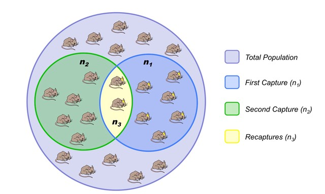
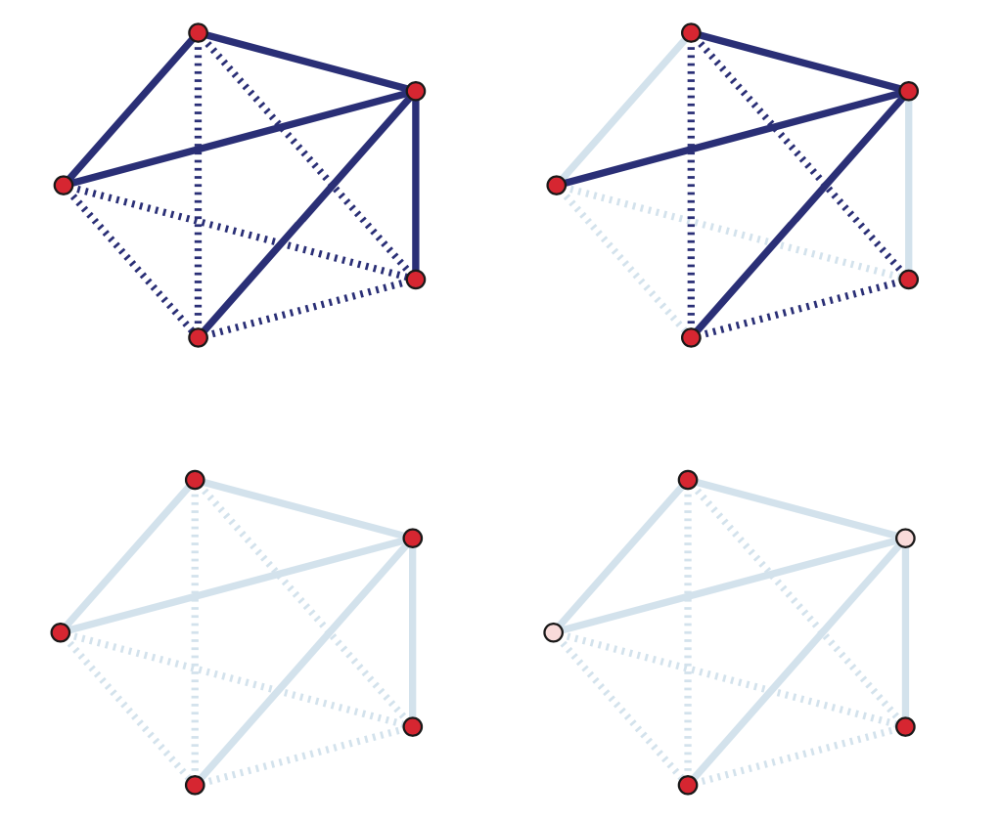
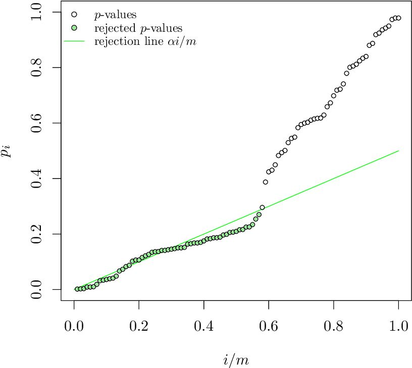

### Overview

Required Reading

* [Sampling and estimation in network graphs](https://link.springer.com/chapter/10.1007/978-0-387-88146-1_5), by Eric D.Kolaczyk, 2009
* [Network inference with confidence from multivariate time series](https://journals.aps.org/pre/abstract/10.1103/PhysRevE.79.061916), by Mark Kramer et al, 2009
* [Network topology inference](https://link.springer.com/chapter/10.1007%2F978-0-387-88146-1_7), by Eric D.Kolaczyk, 2009

Recommended Reading

* [What is the real size of a sampled network? The case of the Internet](https://journals.aps.org/pre/abstract/10.1103/PhysRevE.75.056111) by Fabian Viger et al., 2007

### Introduction to Network Sampling

It is often the case that we do not know the complete network. Instead, we only have sampled network data, and we need to rely on that sample to infer properties of the entire network. The area of statistical sampling theory provides some general approaches and results that are useful in this goal.

Let us denote the complete network as $G=(V,E)$ – we will be referring to it as the **population graph**.

Additionally, we have a **sampled graph** $G^\* = (V^\*, E^\*)$, which consists of a subset of nodes $V^\*$ and edges $E^\*$ from the population graph.

To illustrate the challenges involved in network sampling, consider the following problem.

Suppose we want to estimate  the average degree of the population graph, defined as

$$
E[k]= \frac{\sum_{i \in V}k_i}{N}, \quad N=|V|
$$

where $k_i$ is the degree of node-i and N is the number of nodes in the population graph.

The obvious approach is to estimate this with the average degree of the sampled graph $G^\*$ as follows:

$$
\bar{k}= \frac{\sum_{i \in V^*}k_i}{n},\quad n=|V^*|
$$

where n is the size of the sample.

Now, consider two different network sampling strategies, or “designs”. In both of them we start with a random sample $V^*$ of n nodes:

**Design-1**: for each $i \in V^\*$, copy all edges that are adjacent to node i in the set of sampled edges $E^*$.

**Design-2**: for each pair of sampled nodes $(i,j) \in V^\* \times V^\*$, examine if they are connected with an edge, i.e., if $(i,j) \in E$. If they are, copy that edge in $E^\*$.

Note that Design-1 requires that we know all neighbors of each sampled node, even if those neighbors are not sampled – while Design-2 only observes the adjacencies between sampled nodes. In practice, this means that Design-2 would be simpler or less costly to conduct. Imagine, for example, that we construct a social network based on who is calling whom. Design-1 would require that we know all phone calls of the sampled individuals. Design-2 would require that we only know whether two sampled individuals have called each other.

Which of the two Designs will result in a better estimate of $E[k]$ in your opinion? Please think about this for a minute before you look at the answer below.

If you answered Design-1, you are right. With Design-2, we underestimate the degree of each node by a factor of roughly $\frac{n}{N}$ because, on the average, we only “see” that fraction of nodes of the population graph.

That does not mean however that Design-2 is useless. As we will see later in this Lesson, we could use Design-2 and get a reasonable estimate of the average degree as long as we add an appropriate “correction factor”. For example, we could get a better estimate with Design-2 if we use the following correction:

$$
\bar{k}= \frac{N}{n} \frac{\sum_{i \in V^*}k_i}{n}
$$

This can be a useful approach if Design-2 is simpler or cheaper to apply than Design-1.

Here is another example of how statistical sampling theory can be useful: imagine that you want to estimate the number N of nodes in the population network G. For practical reasons however, it is impossible to identify every single node in G -- you can only collect samples of nodes. How would you estimate N? Please think about this for a minute before you read the following.

{: width="500" height="300"}
*Image source: http://www.old-ib.bioninja.com.au/options/option-g-ecology-and-conser/g5-population-ecology.html*

We could use a statistical technique called **capture-recapture estimation**. The simplest version is that we first select a random sample $S_1$ of $n_1$ nodes, without replacement. The important point is that we somehow “mark” these nodes. For instance, if they have a unique identifier, we record that identifier.

Then, we collect a second sample $S_2$ of $n_2$ nodes, again without replacement. Let $n_3$ be the number of nodes that appear in both $S_1$ and $S_2$, i.e., $n_{3} = \| S_1 \cap S_2\|$.

If $n_3>0$, we can estimate the size of the population graph as follows:

$$
\hat{N}=\frac{n_1 \, n_2}{n_{3}}
$$

What is the rationale behind this estimator? The probability that a node is sampled in both $S_1$ and $S_2$ can be estimated as:

$$
\frac{n_{3}}{N} = \frac{n_1}{N} \, \frac{n_2}{N}
$$

because the two samples are independently collected. Solving for N gives us the previous capture-recapture estimator.

In sampling theory, two important questions are:

1. **Is the estimator unbiased**, meaning that its expected value is equal to the population-level metric we try to estimate. In the previous example, is it that $E[\hat{N}]=N$, across all possible independent samples $S_1$ and $S_2$?
2. **What is the variance of the estimator?** Estimators with large variance are less valuable in practice.

For instance, it is not hard to show that the variance of the estimator $\hat{N}$ is:

$$
V({\hat{N}}) = \frac{n_1 n_2 (n_1-n_3)(n_2-n_3)}{n_3^3}
$$

Suppose that $𝑛_1=𝑛_2=1000$ and $𝑛_3=1$. Our estimate of the population graph size will be $\hat{N}=10^6$ – but that is also the value of the standard deviation of $\hat{N}$, making the estimate useless!

If $𝑛_3=100$, however, we get that $\hat{N}=10,000$ and the standard deviation of this estimate is 900, which is much more reasonable.

> **Food for Thought**
>
> For the previous estimator $\hat{N}$, show that if $n_1$ and $n_2$ are fixed, the variable $n_3$ follows the hypergeometric distribution. Use this result to derive the previous expression for the variance of $\hat{N}$.
>
{: .prompt-info }

### Network Sampling Strategies

{: width="200" height="200"}

There are various ways to sample from a network and they result in subgraphs with very different properties. here we introduce four of the most common network sampling strategies. Suppose that the network has n nodes and we want to sample k of them. The simplest sampling strategy is to choose randomly and without replacement k out of n nodes and nodes of the original network is included in the sample only if both its end points are sampled. In this example, the yellow nodes are the k sampled nodes, but the only sampled edges are those highlighted in orange. This is referred to as induced subgraph sampling. 

{: width="200" height="200"}

Suppose now that the network has m edges and we want to sample k of them. Another simple sampling strategy is to select randomly and without replacement k edges. A node is included in therefore sample as long as it is adjacent or incident to a sampled edge. This is why this method is referred to as incident subgraph sampling. In this visualization the yellow edges have been sampled white while hte orange nodes are included in hte sample because they are adjacent to at least one sampled edge. Note that higher degree nodes are more likely to be sampled this way. In other words, this is a biased sampling strategy in terms of node sampling probabilities. 

{: width="200" height="200"}

Another sampliung strategy referred to as snowball sampling is to start from a set of randomly selected nodes referred to as seeds shown in yellow here. In the first wave of the process, we include in the sample all the nodes and edge hte edges that are adjacent to the seeds. These are shown in orange. In the second wave we include all the nodes and edges that are adjacent to the nodes of the first wave and that have not been sampled already. These are shown in red. This process continues until we have included in the sample the desirable number of nodes or edges or we have reached the point in which we cannot sample anymore. The special case of a single sampling wave is referred to as star sampling. 

{: width="200" height="200"}

Another family of sampling strategies is referred to as link tracing. It is similar with snowball sampling in the sense that we start from some seed nodes but here we do not sample all the adjacent nodes. Instead there is a criterion that specifies the which adjacent node to sample at each step. For instance in computer networks, we can perform traceroute sampling. Here, the seeds that are shown in yellow as S1 and S2 are referred to as the source nodes of the traceroutes. And we are also given a set of target nodes shown here as t1 and t2. The network uses a specific route to connect a source to the target. And that is exactly the sequence of nodes and edges we included in the sample shown in orange. The sample in this case depends both on the chosen sources and targets, but also on the routing strategy that is deployed in that network. 

### Inclusion Probabilities with Each Sampling Strategy

An important question for each sampling strategy is: what is the probability that a given sampling strategy includes a node or an edge in the sample? As we will see later, these probabilities are essential in deriving important network estimators. 

{: width="300" height="300"}
*Image source: Kolaczyk, Eric D. Statistical Analysis of Network Data: Methods and Models (2009) Springer Science+Business Media LLC.*

For **induced subgraph sampling** (see above), the node and edge inclusion probabilities are, respectively:

$$
\pi_i = \frac{n}{N}, \quad \pi_{(i,j)}=\frac{n(n-1)}{N(N-1)}
$$

​where n is the number of sampled nodes -- because each node of the population graph is sampled uniformly at random without replacement, and each edge of the population graph is sampled if the two corresponding nodes are sampled. Note that the node inclusion probability is the same for all nodes (and the same is true for the edge inclusion probability). 

{: width="300" height="300"}

For incident subgraph sampling (see above), recall that we sample n edges randomly and without replacement. The inclusion probability for edges is simply: $\pi_{(i,j)} = n/\|E\|$, where $\|E\|$ is the number of edges in the population graph. The inclusion probability for node i is one minus the probability that none of the $k_i$ edges of node i is sampled: 

$$
\pi_i = 1 - \frac{\binom{|E|-k_i}{n}}{\binom{|E|}{n}},\quad \mbox{if }n\leq |E|-k_i
$$

Of course if $n < \|E\| - k_i$ then $\pi_i =1$. Note that, with incident subgraph sampling, nodes of higher degree have a higher inclusion probability. 

{: width="300" height="300"}

With **snowball sampling** (see above -- the yellow nodes are the seeds and the process has two stages: first orange nodes and then brown nodes) , the inclusion probabilities are harder to derive, especially when the snowball process includes multiple stages. The statistical literature provides some approximate expressions, however. 

{: width="300" height="300"}

With **link tracing** (including traceroute sampling -- see above), the inclusion probabilities are also harder to derive. Suppose however that the "traceroutes" (sampled paths from source nodes to target nodes) follow only **shortest-paths**, a fraction $\rho_s$ of nodes is marked as sources while another fraction $\rho_t$ of nodes is marked as targets. and $b_i$ is the betweenness centrality of node i  while $b_{(i,j)}$ is the betweenness centrality of edge $(i,j)$. Then, the node and edge inclusion probabilities are approximately:

$$
\pi_i \approx 1-(1-\rho_s-\rho_t)e^{-\rho_s\rho_t b_i}, \quad \pi_{(i,j)}\approx 1 - e^{-\rho_s\rho_t b_{(i,j)}}
$$

> **Food for Thought**
>
> Search the literature to find at least an approximate expression for the inclusion probability of nodes and edges in two-step snowball sampling.
>
{: .prompt-info }

### Horvitz-Thompson Estimation of "Node Totals"

Let us now use the previous inclusion probabilities to estimate various "node totals", i.e., metrics that are defined based on the summation of a metric across all nodes.

Specifically, suppose that each node i has some property $y_i$. We often want to estimate the total value of that property across the whole network: 

$$
\tau=\:\sum_{i\in V}y_i
$$

For instance, if $y_i$ is the degree of each node, then we can use $\rho$ to calculate the average node degree (just divide $\rho$ by the number of nodes). 

Or, if $y_i$ represents whether a node of a social network is a bot or not (a binary variable), then $\rho$ is the total number of bots in the network. 

Or, if $y_i$ represents some notion of node capacity, then $\rho$ is the total capacity of the network. 

Suppose that we have a sample S of n network nodes, and we know the value $y_i$ of each sampled node. 

An important result in statistics is the **Horvitz-Thompson** estimator. It states that we can estimate $\rho$ as follows:

$$
\hat{\tau} = \sum_{i \in S}\frac{y_i}{\pi_i}
$$

where $\pi_i$ is the inclusion probability of node-i, as long as $\pi_i>0$ for all nodes in the sample S.

In other words, to estimate the "total value" we should not just add the values of the sampled nodes and multiply the sum by N/n (that would be okay only if $\pi_i =\frac{n}{N}$ for all i). Instead, we need to normalize the value of each sampled node by the probability that that node is sampled. 

A key property of the Horvitz-Thompson estimator is that it is unbiased, as shown below. Let us define as $Z_i$ an indicator random variable that is equal to one if node i is sampled in S -- and 0 otherwise. Then,

$$
E[\hat{\tau}] = E\left[\sum_{i \in S}\frac{y_i}{\pi_i}\right]= E\left[\sum_{i \in V}\frac{y_i\, Z_i}{\pi_i}\right]=\sum_{i \in V}\frac{y_i\, E[Z_i]}{\pi_i}= \sum_{i \in V} y_i = \tau
$$

An estimate of the variance of this estimator can be calculated from the sample S as follows:

$$
V(\hat{\tau}) \approx \sum_{i\in S}\sum_{j\in S}y_i y_j\left(\frac{\pi_{i,j}}{\pi_i \pi_j}-1\right)
$$

where $\pi_{i,j}$ is the probability that both nodes i and j are sampled in S (when i=j, we define that $\pi_{i,j} = \pi_i$). 

> **Food for Thought**
>
> Suppose that i and j are sampled independently. How would you simplify the previous expression for the variance of the Horvitz-Thompson estimator?
>
{: .prompt-info }

### Estimating the Number of Edges and the Average Degree

We can also apply the Horvitz-Thompson estimator to "totals" that are defined over all possible node pairs. Here, each node pair $(i,j)\in V\times V$ is associated with a value $y_{i,j}$, and we want to estimate the total value:

$$
\tau = \sum_{(i,j)\in V \times V}y_{i,j}
$$

For instance, if $y_{i,j}$ is one when the two nodes are connected and zero otherwise, the total $\rho$ is twice the number of edges in the population graph. 

Another example: it could be that $y_{i,j}$ is one if the shortest path between the two nodes traverses a given node-k (and zero otherwise). Then, the value $\rho$ is related to the betweenness centrality of node-k.

Suppose that we have a sample S of n node pairs,  with the corresponding values $y_{i,j}$ of the sampled node pairs. The Horvitz-Thompson estimator tells us that an unbiased estimator of $\rho$ is:

$$
\hat{\tau}=\sum_{(i,j)\in S\times S} \frac{y_{i,j}}{\pi_{i,j}}
$$

Let us first apply this framework in estimating the number of edges in the population graph. Suppose that we perform induced subgraph sampling, starting with n nodes chosen without replacement. Then, the probability of sampling a node pair (i,j) of the population graph is 

$$
\pi_{i,j} = \frac{\binom{n}{2}}{\binom{N}{2}} = \frac{n(n-1)}{N(N-1)}
$$

So, our estimate for the number of edges in the population graph is:

$$
\hat{\tau}=1/2\,\sum_{(i,j)\in S\times S}\frac{y_{_i,j}}{\pi_{i,j}}=|E^*|\frac{N(N-1)}{n(n-1)}
$$

which means that we just need to multiply the number of sampled edges $\|E^\*\|$ by a correction factor (the inverse of the fraction of sampled node pairs).   

{: width="500" height="300"}
*Image source: Kolaczyk, Eric D. Statistical Analysis of Network Data: Methods and Models (2009) Springer Science+Business Media LLC.*

To put these results in a more empirical setting, the plot shows the results of estimating the network density (and thus the number of edges) in the Yeast protein-protein interaction network, when using induced subgraph sampling. The actual number of edges is 31,201 (and the number of nodes is 5,151). The plots at the left show the empirical distribution of the sampled number of edges
|$E^\*$| for three node sampling fractions: p=0.10, 0.20 and 0.30 of the total number of nodes. The plots at the right show the empirical distribution of the standard error (estimate of standard deviation of |$E^\*$|). All distributions are based on 10,000 trials. 

Let us now use this result to also estimate the average degree $E[k]$ in the population network. Recall that the average degree is related to the number of nodes N and the number of edges $\|E\|$ as follows:

$$
E[k]= \frac{2\, |E|}{N}
$$

Using the previous estimate for the number of edges at the sampled graph, we get the following estimate for the average degree of the network:

$$
\bar{k}_{\mbox{induced_subgraph}} = \frac{2}{N}\, |E^*|\frac{N(N-1)}{n(n-1)}= \frac{2\, |E^*|}{n} \, \frac{N-1}{n-1}
$$

It is interesting to compare this with the average degree estimate if we sample the network using single-stage snowball sampling (also known as star sampling). In that case, we sample all the neighboring edges of each sampled node. So, we know the exact degree $k_i$ of each sampled node. Additionally, the inclusion probability for each node is $n/N$. So, the Horvitz-Thompson estimator for the total number of edges in the population graph is $\frac{1}{2}\sum_{i \in S}\frac{k_i}{n/N}$
. Thus, the star-sampling estimate for the average degree is:

$$
\bar{k}_{\mbox{star_sampling}} = \frac{2}{N} \left( \frac{1}{2}\sum_{i \in S}\frac{k_i}{n/N} \right)=\frac{2 \, |E^*|}{n}
$$

Note that the induced-subgraph estimator differs from the star-sampling estimator by a factor $\frac{N-1}{n-1}$. That factor aims to correct for the extent to which the degree of each node is under-sampled when we use induced subgraph sampling.

> **Food for Thought**
>
> Recall that the Transitivity of a graph requires us to calculate the number of connected node triplets and triangles. How would you apply the previous framework to estimate these quantities from a sample of the graph, using induced subgraph sampling?
>
{: .prompt-info }

### Estimating the Number of Nodes with Traceroute-like Methods

Let us now see how we can use a traceroute-like sampling strategy to estimate the number of nodes in a large network. Suppose that we have a set of sources $S=\{s_1,s_2, \dots s_{n_S}\}$ and a set of targets $T=\{t_1,t_2, \dots t_{n_T}\}$. Each traceroute starts from a source node and it traverses a network path to a target node, also "observing" (sampling) the intermediate nodes in the path. Note that an intermediate node may be observed in more than one traceroute path. The number of  observed nodes is denoted by $N^\*$, while the number of nodes in the population network is denoted by $N$. How can we use $N^*$ to estimate $N$?

Here is the key idea in the following method: suppose that we drop a given target node $t_j$ from the study. Would that target be observed in the traceroute paths to the remaining targets? We can easily measure the fraction of targets that would be observed in this manner. Intuitively, the lower this fraction is, the larger the population network we are trying to sample. Is there a way we can use this fraction to "inflate" $N^\*$ so that it gives us a good estimate of $N$? As we will see next, the answer is yes through a simple mathematical argument. 

Let us introduce some notation first. Suppose that $V^*_{(-j)}$ is the set of observed nodes when we drop $t_j$ from the set of targets. The number of such nodes is:

$$
N^*_{(-j)}=|V^*_{(-j)}|
$$

The binary variable $\delta_j$ is equal to one if $t_j$ is NOT observed on sampled paths to any other target -- and zero otherwise. The total number of such targets (that can be observed only if we traceroute directly to them) is $X=\sum_j \delta_j$. 

The probability that $t_j$ is not observed on the paths to any other target, however, is simply the ratio between the number of nodes that are not observed after we remove $t_j$, and the number of non-source and non-target nodes:

$$
P\left(\delta_j=1|V^*_{(-j)}\right) = \frac{N-N^*_{(-j)}}{N-n_S-(n_T-1)}
$$

assuming that the targets are chosen through random sampling without replacement from the set of all non-source nodes in the population graph. 

The expected value of $N^*_{(-j)}$ is the same for all j however, simply due to symmetry (j can be any of the targets). Let us denote that expected value as:

$$
E\left[N^*_{(-j)}\right] = E\left[N^*_{(-)}\right]
$$

So, the expected value of X is:

$$
E[X]=\sum_{j=1}^{n_T} P\left(\delta_j=1|V^*_{(-j)}\right) = n_T \, \frac{N-E\left[N^*_{(-)}\right]}{N-n_S-(n_T-1)}
$$

We have now reached our goal: we can solve the last equation for the size of the population graph N:

$$
N =  \frac{n_T E\left[N^*_{(-)}\right] - (n_S+n_T-1)E[X]}{n_T - E[X]}
$$

The expected value $E[X]$ of the targets that can be observed only if we traceroute to them can be estimated by X, which is directly available from our traceroute data. 

And the expected value $E[N^\*_{(−)}]$ can be estimated, again directly from our traceroute data, as the average of $$N^\ast_{(-j)}$$ across all targets j. 

Let us now see what happens when this method is applied to estimate the size of an older snapshot of the Internet that included N=624,324 nodes and 1,191,525 edges. The number of sources was $n_S=10$. The "target density", defined as $\rho_T=n_T/N$, is shown as the x-axis variable in the following graph. The y-axis shows the fraction of the estimated network size over the actual network size (ideally it should be equal to 1). The solid dots show the estimates from the method we described above (including intervals of $\pm$ one standard deviaton around the mean). The open dots show the same fraction if we had simply estimated the size of the network based on $N^*$. 

{: width="500" height="300"}
*Image source: Kolaczyk, Eric D. Statistical Analysis of Network Data: Methods and Models (2009) Springer Science+Business Media LLC.*

Note that the previous method is fairly accurate even if the target density is as low as 0.005 (i.e., about 3,100 targets). 

On the contrary, if we had estimated the size of the network simply based on the number of observed nodes we would grossly underestimate how large the network is (unless if our targets pretty much cover all network nodes). 

> **Food for Thought**
>
> If you could place the $n_S$ sources anywhere you want, where would you place them to improve this estimation process?
>
{: .prompt-info }

### Topology Inference Problems

Let us now move from network sampling to a different problem: **topology inference**. How can we estimate the topology of a network from incomplete information about its nodes and edges?

The problem of topology inference has several variations, described below. The following visualization helps to illustrate each variation. The top-left figure shows the actual (complete) network, which consists of five nodes and five edges (shown in solid dark blue) -- the dotted dark blue lines represent node pairs that are NOT connected with an edge. The topology inference problems we will cover in the following pages are:

{: width="500" height="300"}
*Image source: Kolaczyk, Eric D. Statistical Analysis of Network Data: Methods and Models (2009) Springer Science+Business Media LLC.*

1. **Link prediction**: As shown in the top-right figure, in some cases we know that certain node pairs are connected with an edge (solid dark blue) or that they are NOT connected with an edge (dotted dark blue) -- but we do not know what happens with the remaining node pairs. Are they connected or not? In the top-right figure those node pairs are shown with solid light blue and dotted light blue, respectively. We have already mentioned the link prediction problem in Lesson-12, in the context of the Hierarchical Random Graph (HRG) model. Here, we will see how to solve this problem even if we do not model the network using HRG. 
2. **Association networks**: As shown in the bottom-left figure, in some cases we know the set of nodes but we do not have any information about the edges. Instead, we have some data about various characteristics of the nodes, such as their temporal activity or their attributes. Imagine, for instance, that we know all the characteristics, hobbies, interests, etc, of the students in a class, and we try to infer who is friend with whom. We can use the node attributes to identify pairs of nodes that are highly similar according to a given metric. Node pairs that are highly similar are then assumed to be connected. 
3. **Network tomography**: As shown in the bottom-right figure, in some cases we know some nodes (shown with red) but we do not know about the existence of some other nodes (shown in pink) -- and we may not know the edges either. This is clearly the hardest topology inference problem in networks but sufficient progress has been made in solving it as long as we can make some "on-demand path measurements" from the nodes that we know of. Additionally, the problem of network tomography is significantly simpler if we can make the assumption that the underlying network has a tree topology (this is not the case in the given example).

### Link Prediction

Let us introduce the Link Prediction problem with an example. The following network refers to a set of 36 lawyers (partners and associates) working for a law firm in New England. Two lawyers are connected with an edge if they indicated (through a survey) that they have worked together in a case. We know several attributes for each lawyer: seniority in the firm (indicated by the number next to each node), gender (nodes 27, 29, 34 are females), office location (indicated by the shape of the node -- there are three locations in the dataset), and type of practice (red for Litigation and cyan for Corporate Law). 

{: width="500" height="300"}
*Source: “Statistical analysis of network data” by E.D.Kolaczyk. http://math.bu.edu/ness12/ness2012-shortcourse-kolaczyk.pdf*

Suppose that we can observe a portion of this graph -- but not the whole thing. How would you infer whether two nodes that appear disconnected are actually connected or not? Intuitively, you can rely on two sources of data:

1. The first is the node attributes -- for instance, it may be more likely for two lawyers to work together if they share the same office location and they both practice corporate law.
2. The second is the topological information from the known edges. For instance, if we know that A and B are two nodes that do not share any common neighbors, it may be unlikely that A and B are connected. 

Let us start by stating an important assumption. In the following, we assume that the missing edges are randomly missing -- so, whether an edge is observed or not does not depend on its own attributes. Without this assumption, the problem is significantly harder (imagine solving the link prediction problem in the context of a social network in which certain kinds of relationships are often hidden). 

Let us first define some topological metrics that we can use as "predictor variables" or "features" in our statistical model. Consider a node i, and let $N^{obs}_i$ be the set of its observed neighbors. As we have seen, many networks in practice are highly clustered. This means that if two nodes have highly overlapping observed neighbors, they are probably connected as well.

A commonly used metric to quantify this overlap for nodes i and j is the size of the intersection $\|N_i^{obs}\cap N_j^{obs}\|$. The normalized version of this metric is the Jaccard similarity,

$$
s(i,j)=\frac{|N_i^{obs}\cap N_j^{obs}|}{|N_i^{obs}\cup N_j^{obs}|}
$$

which is equal to one if the two nodes i and j have identical observed neighbors. 

Another topological similarity metric, more relevant to network analysis, is the following:

$$
s(i,j) = \sum_{k \in N_i^{obs} \cap N_j^{obs}} \frac{1}{\log|N_k^{obs}|}
$$
 
Here, node k is a common neighbor of both i and j. The idea is that if k is highly connected to other nodes, it does not add much evidence for a connection between i and j. If k is only connected to i and j though, it makes that connection more likely. This metric is sometimes referred to as "Adamic-Adar similarity". 

There are several more topological similarity metrics in the literature -- but the previous two give you the basic idea. 

Together with topological similarity scores s(i,j), we can also use the node attributes to construct additional predictor variables for every node pair. Returning to the lawyer collaboration example, we could define, for instance, the following five variables:

* $𝑍^{(1)}_{𝑖,𝑗}=seniority_𝑖+seniority_𝑗$
* $𝑍^{(2)}_{𝑖,𝑗}=practice_𝑖+practice_𝑗$
* $𝑍^{(3)}_{𝑖,𝑗}=1 \text{ if ($practice_𝑖=practice_𝑗$) and 0 otherwise}$
* $𝑍^{(4)}_{𝑖,𝑗}=1 \text{ if ($gender_𝑖=gender_𝑗$) and 0 otherwise}$
* $𝑍^{(5)}_{𝑖,𝑗}=1 \text{ if ($office_𝑖=office_𝑗$) and 0 otherwise}$

We can also represent with the same notation any topological similarity score between node pairs. For instance, 

$$
Z_{i,j}^{(6)} = |N_i^{obs} \cap N_j^{obs}|
$$

Many other such predictor variables can be defined, based on the node attributes and topological similarity metrics. 

Now that we have defined these predictor variables for each pair of nodes, we can design a binary classifier using Logistic Regression.

Suppose that **Y** is the (complete) adjacency matrix of the network. The binary variables we want to model statistically are the adjacency matrix elements $${\bf Y}_{i,j}$$ (equal to one if there is a connection and zero otherwise). Our training dataset consists of the set of observed node pairs $${\bf Y}^{obs}$$ -- these are the node pairs for which we know whether there is an edge $$({\bf Y}^{obs}_{i,j}=1)$$ or not $$({\bf Y}^{obs}_{i,j}=0)$$.The remaining node pairs of Y are represented by $${\bf Y}^{miss}$$ and we do not know whether they are connected ($${\bf Y}^{miss}_{i,j}=1$$) or not ($${\bf Y}^{miss}_{i,j}=0$$). 

The equation that defines the Logistic Regression model is:

$$
\log\left[ \frac{P(Y_{i,j}=1|{\bf Z}_{i,j}={\bf z})}{P(Y_{i,j}=0|{\bf Z}_{i,j}={\bf z})} \right] = \bf{\beta^T \, z}
$$

where $Y_{i,j}=1$ means that the edge between nodes i and j actually exists (observed or missing) -- while $Y_{i,j}=0$ means that the edge does not exist. The vector z includes all the predictor variables for that node pair (we defined six such variables above). Finally, the vector $\beta$
 is the vector of the regression coefficients, and it is assumed to be the same for all node pairs. 

A logistic regression model can be trained based on the observed data ${\bf Y}^{obs}$, calculating the optimal vector of regression coefficients $\beta$. If you want to learn how this optimization is done computationally, please refer to any machine learning or statistical inference textbook. 

After training the model with the observed node pairs (connected or not), we can use the logistic regression model to predict whether any missing node pair is actually connected using the following equation:

$$
P(Y_{i,j}^{miss}=1|{\bf Z}_{i,j}={\bf z})= \frac{e^{\beta^T\bf{z}}}{1+e^{\beta^T\bf{z}}}
$$

This equation follows directly from the logistic regression model. For instance, if the previous probability is larger than 0.5 for a node pair (i,j), we can infer that the two nodes are connected.

The link prediction problem is very general and any other binary classification algorithm could be used instead of logistic regression. For example, we could use a support vector machine (SVM) or a neural network. 

> **Food for Thought**
>
> In the link prediction framework we presented here, the logistic regression coefficients are the same for every node pair. What does this mean/assume about the structure of the network? How would you compare this approach with link prediction using the HRG modeling approach we studied in Lesson-12? 
>
{: .prompt-info }

### Association Networks

In some cases we know the nodes of the network -- but none of the edges! Instead, we have some observations for the state of each node, and we know that the state of a node depends on the state of the nodes it is connected with.

For instance, in the context of climate science, the nodes may represent different geographical regions. For each node we may have measurements of temperature, precipitation, atmospheric pressure, etc over time. Further, we know that the climate system is interconnected, creating spatial correlations between different regions in terms of these variables (e.g., the sea surface temperate at the Indian ocean is strongly correlated with the sea surface temperature at an area of the Pacific that is west of central America). How would you construct an "association network" that shows the pairs of regions that are highly correlated in terms of each climate variable?

Recall that we had examined this problem in Lesson-8, when we discussed the 𝛿
-MAPS method. Our focus back then however was on the community detection method to identify regions with homogeneous climate variables (i.e., the nodes of the network) -- and not on the association network that interconnects those regions.

To introduce the "association network" problem more formally, suppose that we have N nodes, and for each node i we have a random vector $X_i$ of independent observations. We want to compute an undirected network between the N nodes in which two nodes i and j are connected if $X_i$ and $X_j$ are sufficiently "associated". 

To solve this problem, we need to first answer the following three questions:

1. How to measure the association between node pairs? What is an appropriate statistical metric?
2. Given an association metric, how can we determine whether the association between two nodes is statistically significant? 
3. Given an answer to the previous two questions, how can we detect the set of statistically significant edges while we also control the rate of false positives? (i.e., spurious edges that do not really exist)

**Let us start with the first question: which association metric to use?**

The simplest association metric between $X_i$ and $X_j$ is **Pearson's correlation coefficient**:

$$
\rho_{i,j} = \frac{E[(X_i-\mu_i)(X_j-\mu_j)]}{\sigma_i \, \sigma_j}
$$

where $\mu_i$ and $\sigma_i$ are the mean and standard deviation of $X_i$, respectively. As you probably know, this coefficient is more appropriate for detecting linear dependencies because its absolute magnitude is equal to 1 if the two vectors are related through a (positive or negative) proportionality. If $X_i$ and $X_j$ are independent, then the correlation coefficient is zero (but the converse may not be true). 

Instead of Pearson's correlation coefficient, we could also use Spearman's rank correlation (it is more robust to outliers), mutual information (it can detect non-linear correlations) or several other statistical association metrics. Additionally, we could use partial correlations to deal with the case that both $X_i$ and $X_j$ are affected by a third variable $X_k$ -- the partial correlation of $X_i$ and $X_j$ removes the effect of $X_k$ from both $X_i$ and $X_j$.

To keep things simple, in the following we assume that the association between $X_i$ and $X_j$ is measured using Pearson's correlation coefficient. 

**Second question: when is the association between two nodes statistically significant?**

The "null hypothesis" that we want to evaluate is whether the correlation between $X_i$ and $X_j$
 is zero (meaning that the two nodes should not be connected) or not:

$$
H_0: \rho_{i,j}=0~~\mbox{versus}~~H_1:\rho_{i,j}\neq 0
$$

To answer this question rigorously, we need to know the statistical distribution of the metric $\rho_{i,j}$ under the null hypothesis $H_0$. 

First let us apply the **Fisher transformation** on $\rho_{i,j}$ so that, instead of being limited in the range [-1,+1], it varies monotonically in $(-\infty, \infty)$:

$$
z_{i,j}=\frac{1}{2}\log\left[ \frac{1+\rho_{i,j}}{1-\rho_{i,j}}\right]
$$

Here is a relevant result from Statistics: if the two random vectors $(X_i,X_j)$ are uncorrelated (i.e., under the previous null hypothesis $H_0$) and if they follow a bivariate Gaussian distribution, the distribution of the Fisher-transformed correlation metric $z_{i,j}$ follows the Gaussian distribution with zero mean and variance $1/(𝑚−3)$, where m is the length of the $X_i$ vector. 

Now that we know the distribution of under the null hypothesis, we can easily calculate a p-value for the correlation between $X_i$ and $X_j$. Recall that the p-value represents the probability that we reject the null hypothesis $H_0$ even though it is true. So, we should state that $X_i$ and $X_j$ are significantly correlated only if the corresponding p-value is very small -- typically less than 1% or so. 

To illustrate what we have discussed so far, the following figure shows a scatter plot of m=445 observations for the expression level of two genes at the bacterium Escherichia coli (E. coli). The two genes are tyrR and aroG. The expression levels were measured with microarray experiments (log-relative units). The correlation metric between the two expression level vectors is $\rho=0.43$. Is this value statistically significant however?  

{: width="500" height="300"}
*Image source: Kolaczyk, Eric D. Statistical Analysis of Network Data: Methods and Models (2009) Springer Science+Business Media LLC.*

If we apply the Fisher transformation on $\rho$, we get that $𝑧=0.4599$. The probability that a Gaussian distribution with zero mean and variance $1/(445−3) \approx 0.0023$ gives a value of 0.4599 is less than $7.69×10^−22$, which is also the p-value with which we can reject the null hypothesis $H_0$. So, clearly, we can infer that the two genes tyrR and aroG are significantly correlated and they should be connected in the corresponding association network. 

**Third question: how to control the rate of false positive edges?**

You may be thinking that we are done -- we now have a way to identify statistically significant correlations between node pairs. So we can connect nodes i and j with an edge if the corresponding p-value of the null hypothesis for $\rho_{i,j}$ is less than a given threshold (say 1%).  What is the problem with this approach?

Suppose that we have $𝑁=1000$ nodes, and thus $𝑚=𝑁(𝑁−1)/2=499,500$ potential edges in our network. Further, suppose that a correlation $\rho_{i,j}$ is considered significant if the p-value is less than 1%. Consider the extreme case that none of these pairwise correlations are actually significant. This means that if we apply the previous test 499,500 times, in 1% of those tests we will incorrectly reject the null hypothesis that $\rho_{i,j}=0$. In other words, we may end up with 4,995 spurious edges that are false positives!

This is a well-known problem in Statistics, referred to as the Multiple Testing problem. A common way to address it is to apply the False Discovery Rate (FDR) method of Benjamini and Hochberg, which aims to control the rate $\alpha$ of false positives. For instance, if $\alpha=10^{−6}$, we are willing to accept only up to one-per-million false positive edges. 

Specifically, suppose that we sort the p-values of the  $𝑚=𝑁(𝑁−1)/2$ hypothesis tests from lowest to highest, yielding the sequence $p_{(1)}\leq p_{(2)} \leq \dots p_{(m)}$. The Benjamini-Hochberg method finds the highest value of $k \in \{1\dots m\}$ such that

$$
p_{(k)}\leq \frac{k}{m}\alpha
$$

if such a p-value exists -- otherwise 𝑘=0.

{: width="500" height="300"}
*Image source: "The power of the Benjamini-Hochberg procedure", by W. van Loon, http://www.math.leidenuniv.nl/scripties/MastervanLoon.pdf*

The null hypothesis for the tests with the k lowest p-values is rejected, meaning that we only "discover" those k edges. All other potential edges are ignored as not statistically significant. Benjamini and Hochberg proved that if the m tests are independent, then the rate of false positives in these k detections is less than $\alpha$.

In our context, where the m tests are applied between all possible node pairs, the test independence assumption is typically not true however. There are more sophisticated FDR-control methods in the statistical literature that one could use if it is important to satisfy the $\alpha$ constraint. 

> **Food for Thought**
>
> 1. Explain why the m tests are probably not independent in the context of association network inference.
> 2. What would you do if the Benjamini-Hochberg method gives k=0 for the value of $\alpha$ that you want. You are not allowed to increase $\alpha$. 
>
{: .prompt-info }

### Topology Inference Using Network Tomography

Let us now focus on topology inference using network tomography. In medical imaging, "tomography" refers to methods that observe the internal structure of a system (e.g., brain tissue) using only measurements from the exterior or "periphery" of the system. In the context of networks, the internal structure refers to the topology of the network (both nodes and edges), while the "periphery" is few nodes that are observable and that we can utilize to make measurements.

For instance, in the following tree network the observable nodes are the root (blue) and the leaves (yellow) -- all internal nodes (green) and the edges that interconnect all nodes are not known.

{: width="500" height="300"}
*Image source: Kolaczyk, Eric D. Statistical Analysis of Network Data: Methods and Models (2009) Springer Science+Business Media LLC.*

To simplify, we will describe network tomography in the context of computer networks, where the nodes represent computers or routers and the edges represent transmission links. Please keep in mind however that network tomography methods are quite general and they are also applicable in other contexts, such as the inference of phylogenetic trees in biology. 

Let us first review a basic fact about computer networks. When a packet of size L bits is transmitted by a router (or computer) on a link of capacity C bits-per-second, the transmission takes L/C seconds. So, if we send two packets of size L at that link, the second packet will have to wait at a router buffer for the transmission of the first packet -- and that waiting time is L/C.

We can use this fact to design a smart measurement technique called "sandwich probing". Consider the previous tree network. Suppose that the root node sends three packets P1,P2,P3 at the same time. Packets P1 and P3 are small (the minimum possible size) and they are destined to one of the observable nodes, say $R_i$, while the intermediate packet P2 is large (the largest possible size) and it is destined to another observable node $R_j$. The packets are timestamped upon transmission, and the receiving node $R_i$ measures the end-to-end transfer delay that the two small packets experienced in the network. 

If the destinations $R_i$ and $R_j$ are reachable from the root through completely different paths (e.g., such as the leaves 1 and 5 in the previous tree), packet P3 will never be delayed due to packet P2 because the latter follows a different path. So, the transfer delays of the two small packets P1 and P3 will be very similar. The absolute difference of those two transfer delays will be close to 0. 

On the contrary, if $R_i$ and $R_j$ are reachable through highly overlapping paths (such as the leaves 1 and 2 in the previous tree), packet P3 will be delayed by the transmission delay of packet P2 at every intermediate router in the overlapping segment of the two paths. The more the intermediate routers in the common portion of the paths to $R_i$ and $R_j$, the larger the extra transfer delay of packet P3 relative to the transfer delay of packet P1. 

Let us denote by $d_{i,j}$ the difference between the transfer delays of packets P1 and P3 when they are sent to destination $R_i$, while the large packet P2 is sent to destination $R_j$
. This metric carries some information about the overlap of the network paths from the root node to $R_i$ and $R_j$. In practice, we would not send just one "packet sandwich" for each pair of destinations -- we would repeat this 1000s of times and measure the average value of $d_{i,j}$. 

{: width="500" height="300"}
*Image source: Kolaczyk, Eric D. Statistical Analysis of Network Data: Methods and Models (2009) Springer Science+Business Media LLC.*

The previous figure visualizes these average delay differences for an experiment in which about 10,000 "packet sandwiches" were sent from a computer at Rice University in Texas to ten different computers: two of them also at Rice, others at other US universities and two (IST and IT) in Portugal. The darker color represents lower values (closer to 0), while the brighter color represents higher values. Note, for instance, that when we send the small packets to one of the Rice destinations and the large packet to a destination outside of Rice, the delay difference is quite low (relative to the case that both destinations are outside of Rice).

Now that we understand that we can use $d_{i,j}$ as a metric of "path similarity" for every pair of destinations, we can apply a hierarchical clustering algorithm to infer a binary tree, rooted at the source of the packet sandwiches, while all destinations reside at the leaves of the tree. Recall that we used hierarchical clustering algorithms in Lesson-7 for community detection. Here, our goal is to identify the binary tree that "best explains" the delay differences $d{i,j}$, across all possible pairs i and j.

The algorithm proceeds iteratively, creating a new internal tree node in each iteration. At the first iteration, it identifies the two leaves i and j that have the largest delay difference (i.e., the two destinations that appear to have the highest network path overlap), and it groups them together by creating an internal tree node $a_{i,j}$ that becomes the parent of nodes i and j. Then, the delay difference between the new node $a_{i,j}$ and any other leaf k is calculated as the average of the delay differences $d_{i,j}$ and $d_{j,k}$ (i.e., we use "average linking"). The two leaves i and j are marked as "covered", so that they are not selected again in subsequent iterations. 

The algorithm proceeds until all nodes, both the original leaves and the created intermediate nodes, are "covered". 

In the following figure we show what happens when we apply this method in the previous delay difference data. The top visualization shows the actual network paths from the source node at Rice to the ten destinations. The bottom visualization shows the result of the hierarchical clustering algorithm we described earlier. 

{: width="500" height="300"}
*Image source: Kolaczyk, Eric D. Statistical Analysis of Network Data: Methods and Models (2009) Springer Science+Business Media LLC.*

Note that a first difference between the "ground truth" network and the inferred network is that the latter is a binary tree, while the former includes branching nodes (routers) with more than two children. There is also a router (IND) that is completely missing from the inferred network, probably because it is so far that it does not cause a measurable increase in the delay of packet P3. 

> **Food for Thought**
>
> 1. The metric we have introduced here is based on delay variations using "packet sandwiches". Can you think of other ways to probe a network in order to measure the topological overlap of different paths?
> 2. The network inference method we used here is based on hierarchical clustering. Can you think of other network inference methods we could use instead? (Hint: remember what we did in Lesson-12 with the dendrogram of the HRG model)
>
{: .prompt-info }

### Other Network Estimation and Tomography Problems

There are several other interesting problems in the network tomography literature. Here we simply mention a couple of them. In a computer network, links can be in a congested state, causing performance problems such as queuing delays or packet losses. In every end to end path goes through these links. Suppose that we have a number of sensors and we can monitor the performance of several end to end paths shown here in red between those sensors. If none of the links are congested then all of the paths will appear as not congested.

{: width="500" height="300"}

If however, one link becomes congested then the paths that go through that link will also appear in the path measurements as congested. In this visualization the two orange paths are congested and they may be introducing large queuing delays and packet losses. Which link do you think is the cause of these problems? If we assume that there is only one congested link and congestion can only take place between routers not between sensors and routers then the most parsimonious explanation in this scenario here is that the link that is shared by both congested paths shown here in red, is also congested. In general, as long as wek now the topology of the network and they are out between every pair of sensor nodes, we can usually identify the link or sequence of links that may be congested. 

{: width="500" height="300"}

In the context of communication networks, each link is associated with the propagation delay. Suppose that we want to estimate these link delays given end-to-end delay measurements. The delay of a path is equal to the sum of the link delays in that path. For instance, in this small network we see here we have three links with unknown delays. Suppose that we measure using a software tool such as Pink, that the delay in the path between A and B is 30 milliseconds, between A and C is 40 milliseconds, and between B and C is 50 milliseconds. Further, suppose that we know the topology of the network and the route of sequence of links in its path, we can express this problem as a system of linear equation in which the unknowns are the link delays and each equation corresponds to a distinct path. In this case, the linear system has a unique solution for the delay of each link shown here in the visualization. In practice, however, such systems are often under constraint because the number of unknowns, the number of links, is more than the number of equations or paths. In such cases, we need to make additional assumptions about the links in order to be able to solve the linear system. 

{: width="500" height="300"}

Another interesting tomography problem in the context of transportation or communication networks is to estimate the amount of flow or traffic between every pair of end-points. This is also known as the traffic matrix inference problem. For instance, in this visualization we have four antinodes, the cities Atlanta, Boston, Chicago and Detroit. The directed flows between these four cities may refer to the number of trucks driving between the cities every day. Suppose that we know the underlying road network and the route that is followed between every pair of cities. Further, suppose that we know for each of these links the traffic volume on that link, it could be the number of trucks per day on that highway segment. How would you use such link level volumes to estimate the unknown paths level directed flows? Try to write down a system of linear equations for this network so that each of the directed flows between two cities corresponds to an unknown and its network link gives us an equation. AS you will see in many cases, we have more unknowns than equations meaning that again we're dealing with an under specified problem. 

{: width="500" height="300"}

As we just saw the traffic matrix inference problem is often under-constrained because the number of unknowns is typically larger than the number of equations. One way to add some more structure into the problem is to consider a model that describe traffic flow between two-end nodes based on certain properties of those nodes such as the population or the distance between them. A common such model is the traffic gravity model. This model assumes that the traffic between two cities is proportional to the product of the populations $P_i$ and $P_J$ of the two cities and inversely proportional to the distance between the two cities shown as $d_{i,j}$. The proportionality coefficient is a variable that we can estimate based on the link level travel volume measurements. Additional constraints are typically sufficient to solve the traffic matrix estimated problems we have in practice.

### Lesson Summary

This lesson focused on the use of statistical methods in the analysis of network data. This is a broad area, with many different topics. We mostly focused on two of them:

1. **network sampling**: design of different sampling strategies and inference of network properties from those samples,
2. **topology inference**: detecting the presence of missing links, creating association networks, and using tomography methods to discover the topology of the network. 

Here is a list of other topics in the statistical analysis of network data:

* Statistical modeling and prediction of dynamic processes on networks (i.e., applying statistical methods such as Markov Random Fields or Kernel-Based Regression on dynamic processes on networks such as epidemics)
* Analysis and design of directed and undirected graphical models
* Efficient algorithms for the computation of network motifs from sampled network data
* Efficient algorithms for the computation of centrality metrics and communities.

In parallel, some of these problems are also pursued by the Machine Learning community, as we will see in the next lesson. 

<!-- Dummy line -->
<!--  -->    