### Overview

Required Reading

* ["Representation learning on graphs: Methods and applications"](https://arxiv.org/abs/1709.05584), by W.L.Hamilton et al. 2017

Recommended Reading

* ["Deep learning on graphs: A survey"](https://ieeexplore.ieee.org/abstract/document/9039675), by Z.Zhang et al. 2020
* ["Temporal networks"](https://www.sciencedirect.com/science/article/pii/S0370157312000841), by P.Holme and Z.Saramaki, 2012
* ["The structure and dynamic of multilayer networks"](https://www.sciencedirect.com/science/article/pii/S0370157314002105), by S.Boccaletti et al., 2014

### Embedding Nodes in a Low-dimensional Space​

Machine Learning (ML) is a mature discipline with powerful methods to solve classification, clustering, regression and many other problems in data science. Most ML methods however require a vector representation of the inputs. This is easy to do with structured data that already come in the form of vectors or matrices. Even in the case of images, we can easily create a vector of pixel intensities (or RGB colors), scanning the image row by row.

How can we represent a graph (or network), however, with a vector? A graph can have an arbitrary structure, with some nodes being much more connected than others. 

One option would be to represent each node v with an N-dimensional binary vector, where N is the number of nodes: element i is one if node-i is a neighbor of node v and zero otherwise. That vector representation however would be of high dimensionality for large networks. The sampling efficiency of most ML algorithms (i.e., how much training data they need in order to learn a model) is determined by that dimensionality. So, we are interested in graph representation methods that will map each node to a d-dimensionality vector, with $d \ll N$. The d-dimensional vector that corresponds to a node u is referred to as the "embedding" $f(u)$ of that node (see Figure below). 

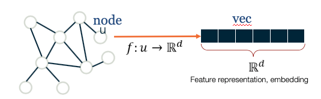{: width="500" height="300"}
*Images ( a,b ) from Jure Leskovec , “Representation Learning on Networks” tutorial, WWW 2018*

Consider, for instance, the well-known Zachary's karate club network (we had also examined that network in Lesson-7), and suppose that we want to represent each node with a two-dimensional vector, i.e., with a point in the Euclidean plane. How would you choose those N points? 

One approach would be to map any two nodes that are "close to each other" in terms of network distance (e.g., directly connected with each other, or having a relatively large number of common neighbors) to two nearby points in the plane. And similarly, any two nodes that have a large network distance should be mapped to points with relatively large distance in the plane. The following figure shows a particular embedding of the nodes in Zachary's network using the DeepWalk algorithm, which will be covered later in this Lesson. 

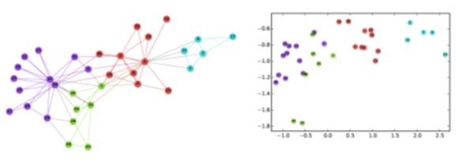{: width="500" height="300"}
*Image from: [Perozzi et al. 2014](https://arxiv.org/pdf/1403.6652.pdf). ​DeepWalk: Online Learning of Social Representations. KDD.*

Why is it reasonable to create node embeddings based on the network distance between two nodes? The basic idea is that the network distance between two nodes in a graph is usually related to the similarity between those two nodes. For instance, in the context of social networks, two individuals that have strong ties between them and/or many common friends, would typically be similar in terms of interests. At the same time, many ML methods (such as classifiers based on the K-nearest neighbors algorithm or based on Support Vector Machines) are based on the assumption that the similarity between two inputs is reflected by the distance between their two embeddings.  

{: width="500" height="200"}

For example, if our goal is to classify "politically unlabeled" people in a social network (say whether they are Democrats, Republicans, Independent, etc), the idea of creating embeddings based on the network connectedness of two nodes makes a lot of sense: individuals that belong in the same social groups will be mapped to nearby embeddings. 

Another example would be in the context of community detection. If the node embeddings are based on network distance, we can use any ML clustering algorithm (such as K-means) to identify clusters of nearby points in the d-dimensional embedding space. 

As you can imagine, there are many way to compute embeddings from a graph so that well-connected nodes are mapped to nearby (or similar) vectors. In the next few pages we will examine more closely some popular methods to compute node embeddings. 

> **Food for Thought**
>
> The Karate club embeddings are deliberately shown here in low-resolution so that the label of the nodes is not clear. Can you identify at least five of the nodes from their embeddings?
>
{: .prompt-info }

### Shallow Encodings and Similarity Metrics​

In this page we discuss some simple approaches to compute node embeddings. They are referred to as "shallow" because the computation of the embeddings does not require to train a deep neural network. 

If we have n nodes and the dimensionality of the embeddings is d, the node embeddings can be "encoded" in a $d\times n$ matrix ${\bf Z}$ (see figure below). If v is an $n \times 1$ "one-hot" vector (all elements are zero except the element that represents node v, which is one), then the embedding of node v is given by the following matrix multiplication:

$$
{\bf\mbox{ENC}} (v)=\bf{Z}\,\bf{v}
$$

which simply extracts the i'th vector of matrix ${\bf Z}$.

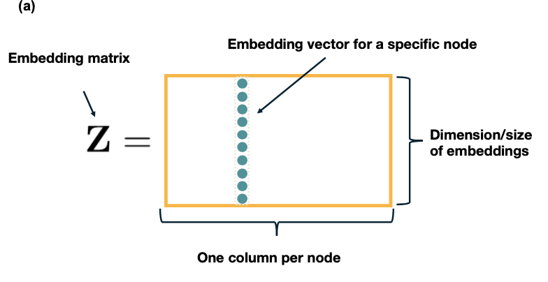
*Images from Jure Leskovec, “Representation Learning on Networks” tutorial, WWW 2018​*

Let us now see how to compute the matrix ${\bf Z} based on different notions of "node similarity". 

The simplest approach is to define that two nodes are similar only if the are directly connected. Further, if the network is weighted, the similarity of two nodes can be equal to the weight of their connecting edge. Specifically, if A is the (possibly weighted) $n \times n$ adjacency matrix of the network, we can compute the matrix Z so that the dot-product of the embeddings $z_u$ and $z_v$ of any two nodes u and v is equal to the element $A_{u,v}$ of the adjacency matrix. Recall that the dot-product of two vectors with unit magnitude is equal to the cosine of the angle between them -- and so it quantifies the distance between the two vectors. 

One way to compute the matrix ${\bf Z}$ then, is to minimize the following "loss function" through any numerical optimization method (such as Stochastic Gradient Descent):

$$
\mathcal{L}=\sum_{(u,v)\in V\times V} \|{\bf z}_u^T \, {\bf z}_v-{\bf A}_{u,v}\|
$$

If the previous loss cannot be minimized exactly to zero, the node embeddings would only approximate the previous relation with the adjacency matrix. An obvious drawback of this approach is that two nodes are considered "not similar" if they are not directly connected, even if they have many common network neighbors. 

A more general approach is to consider that a node v is "similar", not only to its direct neighbors, but also to any node that is at most k-hops away from v (for a small value of k, say 2 or 3).  For example, in the following figure, the red node would be considered "similar" to only the green nodes if k=1, also the blue nodes if k=2, and all shown nodes if k=3. Then, we can compute the embedding matrix ${\bf Z}$ using the previous loss function, but replacing the adjacency matrix ${\bf A}$ with a k-hop adjacency matrix ${\bf A_k}$ in which two nodes are considered neighbors even if they are at most k-hops away from each other. Another approach is to use the first k powers of the adjacency matrix ${\bf A^k}$. Recall from Lesson-2 that this matrix gives the number of k-hop paths between any two nodes (for unweighted graphs). 

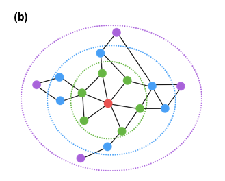
*Images from Jure Leskovec, “Representation Learning on Networks” tutorial, WWW 2018*

Another approach is to consider the overlap between the network neighborhood of two nodes. For instance, in the following network the blue and red nodes are not directly connected but they have two common neighbors (out of 3 neighbors for the red node, and out of 4 neighbors for the blue node). 

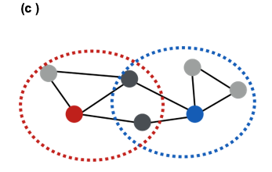
*Images from Jure Leskovec, “Representation Learning on Networks” tutorial, WWW 2018​*

Recall that we had defined such a node similarity metric in Lesson-7. Specifically, the similarity $S_{i,j}$ between any pair of nodes i and j can be defined as:

$$
S_{i,j} = \frac{N_{i,j}+A_{i,j}}{\min\{k_i,k_j\}}
$$

where $N_{i,j}$ is the number of common neighbors of i and j, $A_{i,j}$ is the adjacency matrix element for the two nodes (1 if they are connected, 0 otherwise), and $k_i$ is the degree of node i. Note that $S_{i,j}=1$ if the two nodes are connected with each other and every neighbor of the lower-degree node is also a neighbor of the other node. On the other hand, $S_{i,j}=0$ if the two nodes are not connected to each other and they do not have any common neighbor. There are several such node similarity metrics in the literature with minor differences between them.

Given such a similarity metric, the node embeddings can be then computed numerically based on the following loss function:

$$
\mathcal{L}=\sum_{(u,v)\in V\times V} \|{\bf z}_u^T \, {\bf z}_v-{\bf S}_{u,v}\|
$$

All three approaches that we have seen in this page have some common characteristics. First, they are rather computationally expensive because the loss function considers every possible pair of nodes, even if the similarity between the two nodes is quite weak. This drawback can be addressed using appropriate regularization terms in the previous loss functions that ignore node pairs with very weak similarity. 

A second drawback is that these methods require a separate embedding vector for each node, increasing the number of parameters of the resulting machine learning model proportionally to the network size. Ideally, we would prefer a node embedding scheme in which the number of model parameters is either constant or it scales sub-linearly with the network size. We will see such schemes later in this lesson. 

> **Food for Thought**
>
> 1. The previous loss functions rely on the dot-product of embedding vectors. How would you modify these loss functions so that they rely instead on the L2-distance of embedding vectors?
> 2. Which of the previous methods would you prefer if the network is weighted and directed?
>
{: .prompt-info }

### Random-walk Encodings and Node2vec

The previous methods to compute node embeddings are deterministic in nature. More recent embedding methods rely instead on stochastic notions of "neighborhood overlap" between pairs of nodes.

In particular, **DeepWalk** (a misnomer -- because it does not use deep learning) and **node2vec** are the most popular in this category. Both of them construct node embeddings based on random walks: two nodes u and v have similar embeddings ($z_u \approx z_v$) if the two nodes tend to co-occur on short random walks over the graph.

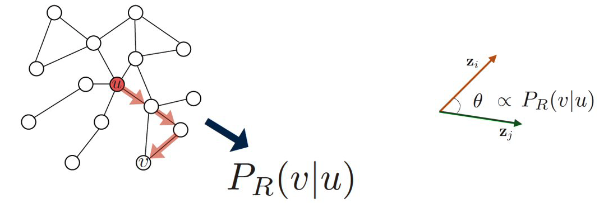{: width="500" height="300"}
*Images from Jure Leskovec, “Representation Learning on Networks” tutorial, WWW 2018*

Specifically, assume that we have an undirected network, and suppose that $P_{R}(v\|u)$ is the probability of visiting node v on random walks of length-T starting at node u, where T is typically a small positive integer (say between 2 to 10, depending on the size of the network). If that probability is high, the two nodes are "close" and they should have similar embeddings. Otherwise, their embeddings should be quite different. 

Based on this insight, we can parameterize the probability $P_{R}(v\|\bf{z_u})$ using the following "softmax" ratio (which is always between 0 and 1) of the node embeddings:

$$
\frac{e^{ {\bf z}^T_u {\bf z}_v}}{\sum_{n\in V}e^{z^T_u {\bf z}_n}} \approx P_R(v|{\bf z}_u)
$$

We can now compute the node embeddings by minimizing the following cross-entropy loss function

$$
\mathcal{L} = \sum_{u \in V}\sum_{v \in {N_R}(u)} -\log{P(v|{\bf z}_u})
$$
 

where ${\bf N_R(u)}$ is the multi-set of nodes in the ensemble of random walks of length T that start from u (it is a multi-set because we can have repeated elements -- nodes can be visited multiple times on each random walk). So, a node v that appears multiple times in ${\bf N_R(u)}$ will contribute more in the previous sum than a node v' that appears only once in ${\bf N_R(u)}$.

If you are not familiar with cross-entropy loss functions, the goal here is to adjust the model parameters (i.e., the node embeddings) so that the terms $P_{R}(v|\bf{z_u})$ are close to 1 when v is in NR(u) and close to 0 when v is not in ${\bf N_R(u)}$.  

Algorithmically, we can think about the previous process as follows:

1. We run short random walks of length T starting from each node u on the graph using a given random walk strategy R(T).
2. For each node u, we compute ${\bf N_R(u)}$, defined as the multi-set of nodes visited on random walks starting from u.
3. We optimize the embeddings ${\bf z_v}$ for every node v based on the previous loss function, given that we know ${\bf N_R(u)}$ for every node u. 
​
Different methods in this literature use various approximations to minimize the previous loss functions, resulting in different computational complexity. For instance, node2vec also uses a set of "negative samples" to approximate the denominator of the softmax term so that the corresponding summation does not need to consider all pairs of nodes. 

Another difference between node2vec and earlier methods is that it introduces two parameters, p and q, that bias the random walk process. Specifically, p controls the probability that the walk will return to the previous node, while q controls the probability that the walk will visits a node's neighbor that it has not visited before. The following example illustrates these random walk strategies. 

Suppose that a random walk started at u and is now at w. The neighbors of w can be:  closer to u (s1), farther from u (s3), same distance to u (s2). We remember where that walk came from. Where to go next? The two parameters that control that decision are:

* p … return parameter (**BFS-like** walk: Low value of p)
* q … ”walk away” parameter (**DFS-like** walk: Low value of q)

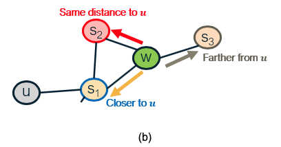
*Images from Jure Leskovec, “Representation Learning on Networks” tutorial, WWW 2018.​*

Random walk approaches are more expressive than the deterministic embedding methods we discussed in the previous page because the notion of "similarity" between node pairs is stochastic and it can incorporate information about both local and more distant neighbors. They are also more efficient because the training process only needs to consider node pairs that co-occur on short random walks -- instead of all possible node pairs. 

> **Food for Thought**
>
> Suppose that we do not use the previous softmax ratio to parameterize the probabilities $P_{R}(v|\bf{z_u})$. Can you think of another way to parameterize these probabilities as a function of the node embedding vectors?
>
{: .prompt-info }

### Applications of Node Embeddings

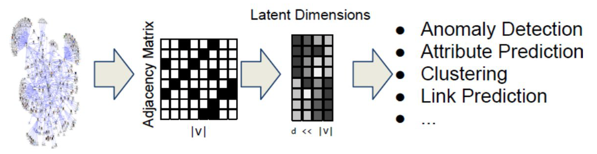
*Images from Jure Leskovec, “Representation Learning on Networks” tutorial, WWW 2018​*

How can we use node embeddings to answer important questions about the original network? 

If you are familiar with machine learning, you know that some classical ML tasks are to perform classification, clustering, regression, anomaly detection, feature learning, etc. All of these tasks have their counterparts in network analysis. 

For instance, ML classifiers (based on algorithms such as neural nets, decision trees, SVMs, etc) can be directly applicable to **classify the nodes of a network in different types** (e.g., male versus female, humans versus bots, political affiliation). To perform this task we need a training dataset that consists of pairs (zv, cv), where zv is the embedding vector of node v and cv is the class (or type) of that node, at least for some nodes of the graph. 

Another ML application on networks is **link prediction**. As we have discussed before, network data are often noisy and we may have both false positives (spurious edges) and false negatives (missing edges). If have computed node embeddings based on a (potentially noisy) estimate of the adjacency matrix, we can then train a binary classifier to predict whether any two given nodes are connected or not. Again, we need a training dataset that consists of pairs of nodes for which we are confident that they are either connected -- or not connected. That classifier can then be applied on other pairs of nodes for which we do not have high-quality data. 

A third application is **community detection**. Even though we have already discussed several algorithms to solve that problem, the use of node embeddings allows us to apply any clustering algorithm on those vectors. If we use an embedding scheme that considers the network distance between any two nodes,  each resulting cluster will consist of a group of nodes that are within a short network distance from each other. The ML literature includes 100s of clustering algorithms, and so using this approach for community detection provides us with a very large "toolbox". 

A fourth application is the **visualization of networks**, relying on the dimensionality reduction provided by node embeddings. Suppose for instance that the node embeddings are two-dimensional. Then, we can represent the nodes of the network in the Euclidean plane, which is much easier for humans to visualize and understand. Nodes with shorter network distance will have more similar embeddings. 

There are many other applications of node embeddings in the analysis of networks -- and the list keeps growing. As we will see in the next page, however, the use of shallow embeddings has some fundamental limitations. For this reason, we will discuss next the use of deep neural networks to represent graphs. 

### Deep Embeddings and Graph Neural Networks

Deep Learning (i.e., the use of neural networks with several layers of hidden units) gives us models that can learn quite complex nonlinear and hierarchical input-output functions. 

The node embedding methods we discussed so far are "shallow" in the sense that they are not computed using such deep neural networks.  There are several problems with shallow embeddings:

* The model parameters include a **different embedding vector for each node**. For huge graphs, this can be an issue. Ideally, we would like to compute the embedding vector of any node using a single model, sharing the model parameters across all nodes.
* Models based on shallow embeddings **do not have inductive capability**, i.e., they cannot generalize beyond the training data that we use to learn the model. An embedding vector is computed for every node of the given graph -- but it is not clear how to compute embedding vectors for nodes that may join the graph later (think of dynamic graphs) or for nodes that are not visible (we may only have a partial view of the compete graph). Ideally, we would like to learn a model that can generalize beyond the portion of the graph it has used in the training process.
* The shallow embedding methods we have discussed are based strictly on connectivity (i.e., the graph adjacency matrix) and so they **cannot model arbitrary node attributes**. For instance, in a social network the nodes may have additional attributes that relate to their gender, age, salary, etc. 

We will now present one way to apply deep learning in the problem of node embedding and graph representation: **Graph Neural Networks (or GNNs)**. We emphasize that there are many other similar methods, such as Graph Convolutional Networks or Graph Recurrent Neural Networks. If you are interested to learn more, please refer to the reading list at the start of the Lesson. 

Suppose that we are given a graph G with:

* ${\bf V}$: the set of n nodes.
* ${\bf A}$: the adjacency matrix.
* ${\bf x_v}$: an m-dimensional vector for each node v, representing arbitrary node attributes (e.g., gender, age, salary)  

A GNN is a neural network in which we compute an embedding vector for each node at each layer of the network. Let us represent by ${\bf h_v^k}$ the embedding of node ${\bf v}$ at layer ${\bf k}$. At the input layer, we have that ${\bf h_v^0 = x_v}$, i.e., the given node attributes. 

At the ${\bf k'}$th hidden layer ${\bf k>0}$, the embedding ${\bf h_v^k}$ of node ${\bf k}$ depends on both the embedding of the same node at the previous layer ${\bf h_v^{k-1}}$ as well as on the embedding ${\bf h_u^{k-1}}$ of every neighbor u of v at the previous layer. More specifically, if ${\bf N(v)}$ represents the set of all neighbors of  node v in the given graph, the embedding ${\bf h_v^k}$ depends on the **average** of ${\bf h_u^{k-1}}$ across all u in ${\bf N(v)}$. This average represents the contribution of the "local neighborhood" of node v to its embedding.

For example, consider the graph at the left of the following figure. The neural network at the right shows that the embedding of node-A at the second hidden layer depends on the layer-1 embeddings of nodes B, C and D (the neighbors of A). Similarly, the embedding of node B at layer-1 depends on the layer-0 embeddings of nodes A and C (the neighbors of B), the embedding of node C at layer-1 depends on the layer-0 embedding of nodes A, B, E and F, and the embedding of node D at layer-1 depends on the layer-0 embedding of node A.  

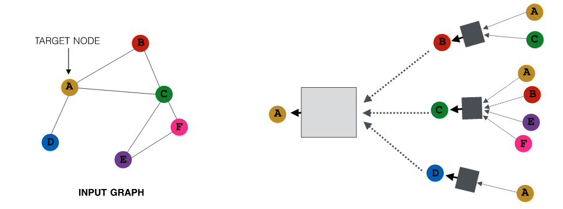
*All images in this page are from Jure Leskovec , “Representation Learning on Networks” tutorial, WWW 2018*

The previous figure only showed the neural network for computing the embedding of node-A (the yellow node) at layer-2. The following figure shows the corresponding networks for all other nodes, using the same color code. Of course in practice all these networks would be integrated in the same neural network model.   

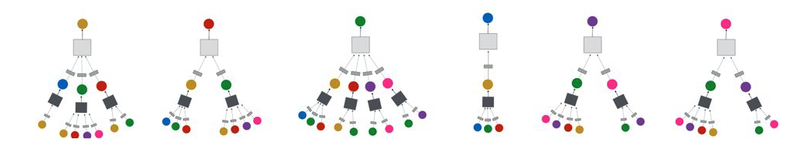

What is the specific mathematical form of these functional dependencies? As in most artificial neural networks, the output of a hidden-layer unit with inputs ${\bf x}$ (a ${\bf d}$-dimensional vector) is given by a nonlinear activation function $\sigma()$ of the weighted sum of the inputs: 

$$
\sigma\left(\sum^d_{i=0}w_i x_i\right)
$$

where ${\bf w}$ is the vector of model parameters (the weight of each input) that we will learn in the training process. The model potentially includes a "bias" term ${\bf w_0}$ for ${\bf x_0}=1$. The nonlinear function $\sigma()$ could be a [sigmoid](https://en.wikipedia.org/wiki/Sigmoid_function). function between 0 and 1 -- but recently most models use the [ReLU](https://en.wikipedia.org/wiki/Rectifier_(neural_networks)). function, which is simpler to compute.  

The input weights at layer-k are represented by the matrices ${\bf W_k}$ (applied on the average neighbor embedding from the previous layer) and ${\bf B_k}$  (applied on the embedding of the node at the previous layer). We will see how to compute these matrices in the next page, when we discuss how to train GNN models.

We are now ready to present the complete equation for the embedding of node ${\bf v}$ at layer ${\bf k}$ -- this is exactly what the GNN computes for each node and at each layer:

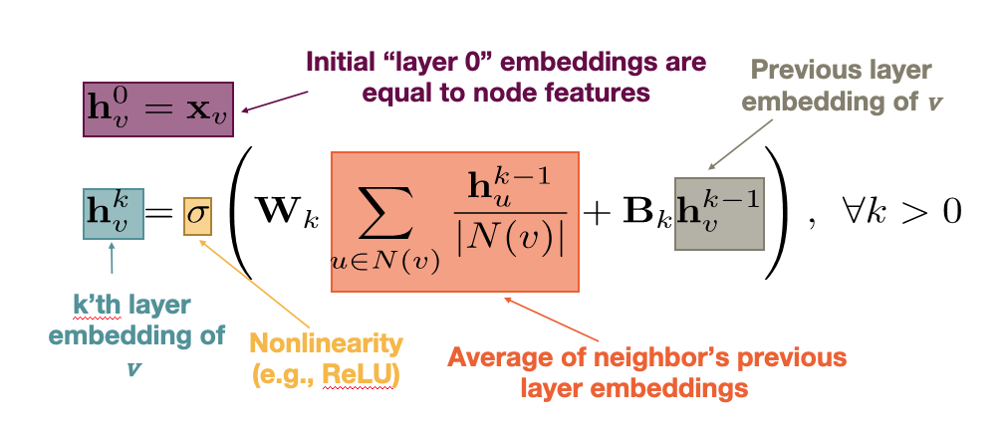

Note that the model captures the topology of the graph through the local neighborhood ${\bf N(v)}$ of each node. At the first hidden layer, the model only "knows" about the direct neighbors of each node. At layer-2, however, it also knows about the neighbors of the neighbors. If the neural network is sufficiently deep (large ${\bf k}$), the model can learn quite subtle structural properties of the graph because it has information about all neighbors of each node within a broader neighborhood that is ${\bf k}$-hop wide. 

Another important point in the previous equation is that the parameters of the model, given by the matrices ${\bf W_k}$ and ${\bf B_k}$ for each layer, are shared across nodes at layer-${\bf k}$, i.e., we do not need to learn different parameters for each node. This is how GNNs accomplish two important goals: first, significant reduction in the complexity of the model (because they do not need to learn different parameters for each node) and second, the model has inductive capabilities because it can apply these matrices even on nodes that are not in the training dataset.   

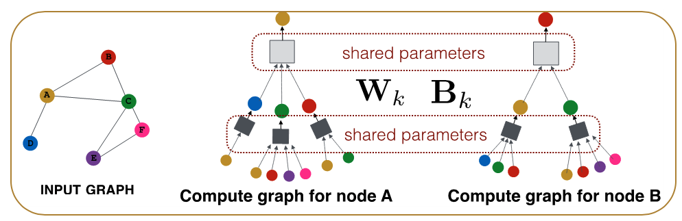

> **Food for Thought**
>
> 1. There is a "hidden assumption" behind the idea of using the same parameters for all nodes at each layer. How would you precisely state that assumption? 
> 2. What is the rationale for NOT using the same shared parameters at every layer?
>
{: .prompt-info }

### GNN Training and Decoders

Let us now see how to train a GNN, i.e., how to compute the model parameters given some training data. 

For simplicity, let us consider a binary node classification task in which we aim to distinguish whether each node of an online social network is human (class-0) versus bot (class-1). Classification tasks with a larger number of classes, or non-classification tasks (such as node clustering, link prediction, etc) can be performed similarly, with minor modifications in the following loss function. 

Suppose that the neural network consists of ${\bf K}$ hidden layers. The final embedding of each node ${\bf v}$ is denoted by ${\bf z_v=h_v^K}$.

We need to also design the "decoder" part of the neural network, which maps the embedding vector ${\bf z_v}$ to the corresponding class of node ${\bf v}$. The simplest decoder is a "**softmax**" operator with parameters ${\bf D}$, where ${\bf D}$ is a vector of the same dimensionality as the embedding vector. The output of the softmax is given by the activation function of the dot-product between the transpose of the embedding vector ${\bf z_v}$ and ${\bf D}$: 

$$
\sigma\left(z_v^T D\right)
$$
 

So, if the softmax output for node ${\bf v}$ is closer to 0, we predict that node ${\bf v}$ is in class-0, and if it is closer to 1 we predict that node ${\bf v}$ is in class-1. 

How can we compute all the parameters of the GNN model, including both the encoder (the part of the network that computes the embeddings with parameters ${\bf W_k}$ and ${\bf B_k}$ for k=1,2,...K) and the decoder (with parameters ${\bf D}$)? 

Suppose that we are given some training data: the actual class ${\bf y_v}$ (0 or 1) for a set ${\bf V'}$ of nodes in the network. We can then compute the following loss function, which is known as cross-entropy loss:

$$
\mathcal{L}=-\sum_{v \in V'} \left[y_v \log\left(\sigma(z_v^T D)\right) + (1-y_v) \log\left(1-\sigma(z_v^T D)\right)\right]
$$
 

Note that when the softmax output for node ${\bf v}$ is close to the actual class of that node, i.e., when $y_v \approx \sigma\left(z_v^T D\right)$, the contribution of node v in the loss is almost 0. Otherwise, when the model predicts the wrong class for node ${\bf v}$, i.e., when $y_v + \sigma\left(z_v^T D\right) \approx 1$,node ${\bf v}$ contributes significantly to the loss. 

So, we can train the neural network to minimize the previous loss function by selecting appropriate model parameters: **$W_k, B_k  (k=1,2,...K)$** and **D**. This optimization is not convex, and so all neural network learning algorithms rely on numerical approaches such as variations of Stochastic Gradient Descent (SGD). 

After we have computed the previous parameters, we can use the GNN model to classify any node in the network, including those for which we do not have training data.

Additionally however, we can compute embeddings (and then classify) even for nodes that were not present in the original network. The following figure illustrates this application of GNNs in the context of dynamic graphs. Suppose that the GNN was trained based on the grey portion of the graph. At some point later, node u joins the network. We can still use the same GNN, without retraining it, to compute the embedding of node u -- and then to classify it. Obviously this approach will only work as long as the new nodes that join the network follow the same structural properties that the original network had. 

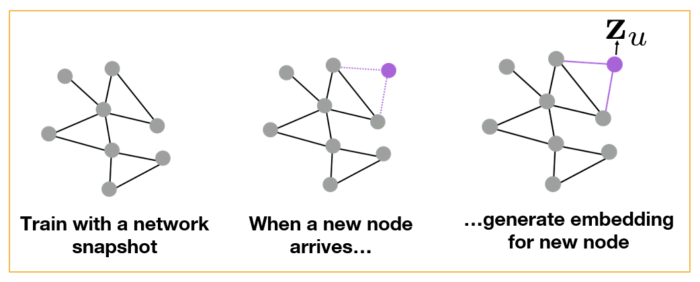
*All images in this page are from Jure Leskovec , “Representation Learning on Networks” tutorial, WWW 2018*

Another application of GNNs is to generalize from one or more given graphs to entirely new graphs -- as long as we have reasons to believe that the new graphs have the same structural properties with the given graphs. For instance, in the context of protein-protein interaction networks, we may have such graphs from closely related bacterial species (e.g., Salmonella typhi and Salmonella typhimurium). We can then learn a GNN model based on these known graphs and apply that GNN to predict properties of proteins in novel Salmonella species, as shown in the following Figure.   

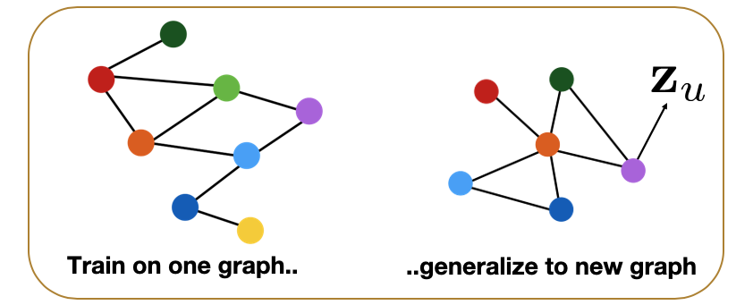

> **Food for Thought**
>
> 1. How would you modify the previous loss function in the case of multiple classes (multinomial classification)? 
> 2. Suppose that the task is not how to classify nodes -- but to predict the presence of links between nodes. How would you train the GNN model in that case given a training graph?
>
{: .prompt-info }

### Application: Polypharmacy​

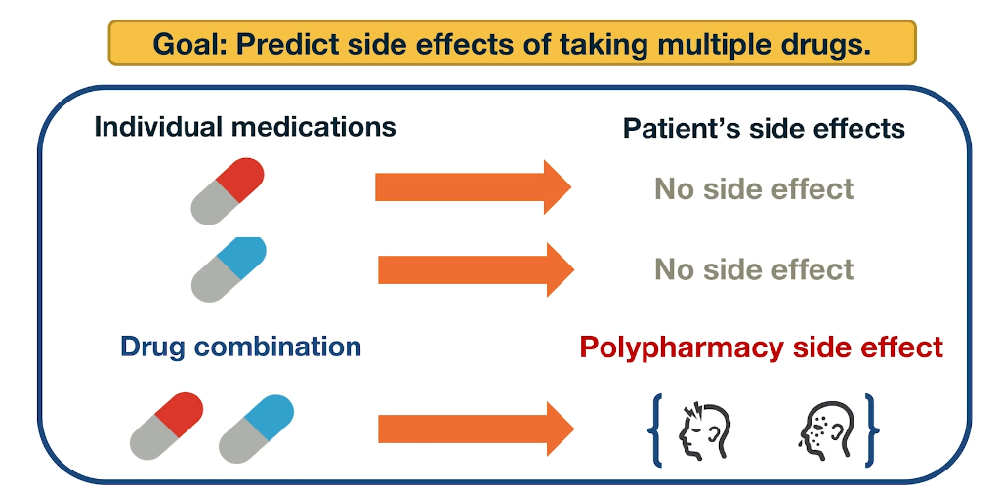

Polypharmacy means that a patient receives multiple medications at the same time. It is common with complex diseases and coexisting conditions but it has high risk of side effects due to drug interactions. 15% of the US population is affected by Polypharmacy and the annual costs exceed 177 billion. It is also difficult to identify manually because it is rare. It occurs only in a small subset of patients and it is not observed during clinical testing.

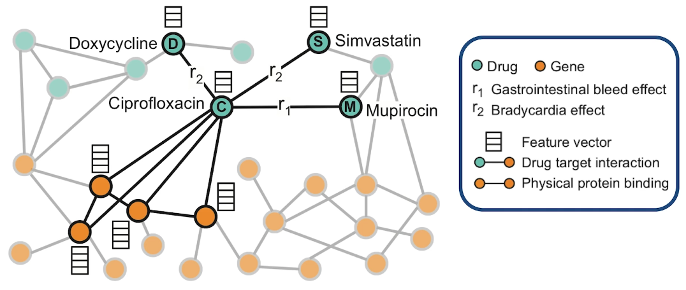

Here is an example of how to model Polypharmacy with a network. The network is multimodal because there are different types of nodes and edges. The green nodes represent drugs, while the orange node represent genes and the corresponding proteins that are encoded by these genes. The edge is between genes represent protein-protein interactions and edge between a gene and the drug means that drug targets the corresponding protein. And the edges between two drugs represent interactions between these two drugs. Those edges are labeled as you see with $r_1$ and $r_2$ and so on. The label of such an edge represents the side effect that would be cause if those two medications are taken together. Such networks can be constructed based on genomic data, patient population data and known side effects of different drug combinations. If we have any additional information about proteins or drugs, it can be included in hte model as different node features.

In this visualization the neighbors of the antibiotic called ciprofloxacin node C indicate that this drug targets four proteins and it interacts with three other drugs. Ciprofloxacin which is node C, taken together with doxycycline which is node D, or with Simvastatin node S increase the risk of bradycardia. Bradycardia side effect is represented in this graph with the edges that are labeled with $r_2$. The combination of Ciprofloxacin with mupirocin which is the mode M, on the other hand, increases the risk of gastrointestinal bleeding which is represented by the edge labeled as $r_1$. The goal of this graph neutral network model called decagon, is to predict unknown edges between drugs. Decagon predicts associations basically between pairs of drugs with a goal of identifying side effects that cannot be attributed to either individual drug in the pair. 

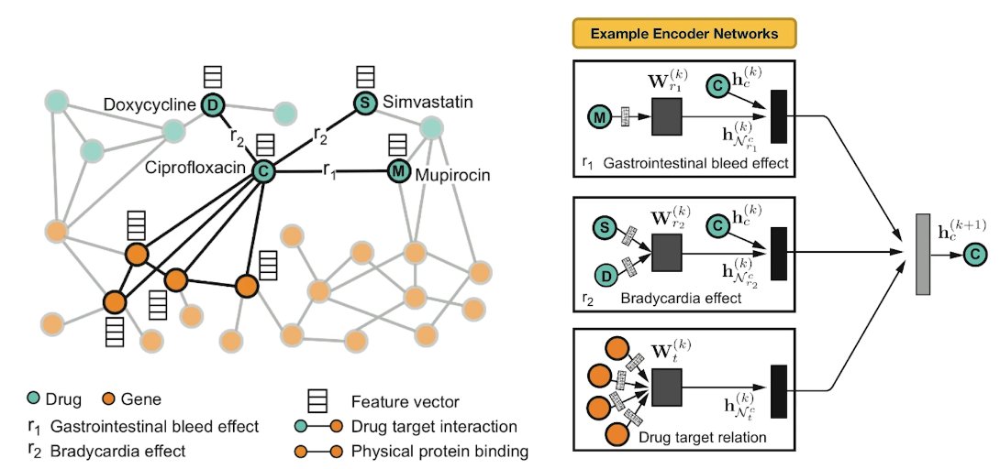

Here is an example of neural networks encoder. What you see at the right is the per layer update for a single graph node. The node representing ciprofloxacin node C, the hidden state activations from neighboring nodes are gathered and then transformed for each relation tie specifically. The top-left rectangle shows the contribution of the $r_1$ edge on the activation of node C at layer k plus 1. The activation depends on the activation of node C at the previous layer, layer k as well as the activation of node M at layer k. Similarly the middle rectangle at the right shows the contribution of the $r_2$ edges on the activation of node C. The bottom rectangle shows the contribution of the four target genes on the activation of node C. These three representations are accumulated in a normalized sum and then passed through a non-linear activation functions such as a Relu to product the hidden state of node C at layer k plus 1. Sets per node update are computed in parallel across the whole network with shared parameters for each type of edge. 

Let us now see how Decagon can predict the existence of unknown side effects for a pair of drugs. This is the decoder part of the Decagon network. Suppose for example, that we want to examine if two drugs, C and S have the side effect represented by each relation type $r_1$, $r_2$, all the way to $r_n$. For each of these relations, the Decagon decoder takes the pair of embeddings for nodes C and S, and it produces a score for every potential relation edge between these two nodes through a fully connected neural layer that is unique for each relation. This type of inductive inference is possible because even though the Decagon neural network is different for each node, all of these networks says the same trainable parameters for each type of edge. So the trainable parameters that refer to the relation $r_2$ which is bradycardia are the same independent of whether those parameters are used for the side effects of drug C, or S or D. 

### Advanced Topics: Deep Generative Models for Graphs

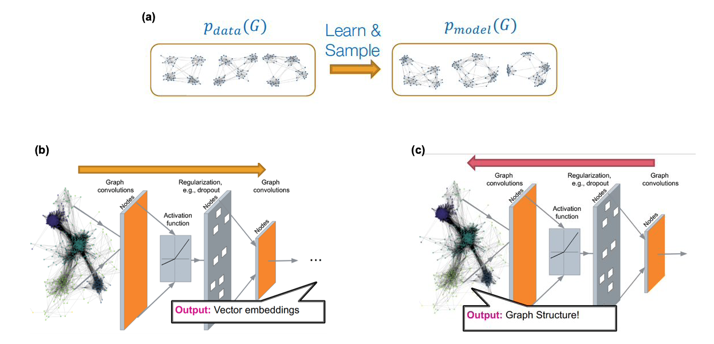
*Source: “Machine Learning with Graphs” – Jure leskovec http://web.stanford.edu/class/cs224w/​*

We have already studied several network generation models in this course (mostly in Lesson-12 but also in earlier lessons). For instance, we have seen models with only one or two parameters (such as the Erdós-Rényì model or the preferential attachment model) as well as models with more parameters that can create networks with modular or hierarchical structure (such as stochastic block models). All of these models however are based on **explicit**, or **prescribed**, assumptions about the desired structure of the network. For example, we choose to use the preferential attachment model if we want to create a network with a power-law degree distribution of a certain exponent. 

What if we want to generate networks that have similar structure with one (or more) given real networks -- but we do not have an explicit structural characterization of those networks? For example, given a portion of the Facebook friendship graph, we may be asked to create several synthetic networks that have the same structural properties with the Facebook graph -- even though we may not be in a position to list (or even know!) all those structural properties.

As shown in part-(a) of the above Figure, the goal in that case is to use one or more given graphs (the data) to learn a high-dimensional joint distribution  (the model) that gives the probability that any two nodes are connected given the connectivity between all other nodes in a graph. We can then use that model to create many synthetic networks, of arbitrary size, with the expectation that all those networks share the same structural properties with the given data.  

The main challenges in developing graph generative models are:

* the generative model should be able to generate graphs of arbitrary size and density. In practice this is difficult if the given data only refer to networks of a given size and density (e.g., it is hard to generate realistic dense networks if all the data refer to sparse networks). 
* the generative model needs to consider the issue of "graph isomorphism", meaning that some networks may appear different (e.g., we may have ordered/labeled the nodes in different ways) even though the networks are identical (or almost identical) in terms of structure. 
* the generative model needs to learn all non-trivial structural properties of the given graphs, such as degree correlations, community structure, hierarchy, and many others, without being explicitly trained to capture any of these properties.

This is an active research area that spans both network science and machine learning. Most of the state-of-the-art "generative graph models" rely on deep neural networks, as shown in Figures (b) and (c) above. The deep learning architectures that have been adapted in this context are: variational auto-encoders, deep Q-networks (reinforcement learning), generative adversarial networks (GANs), and generative recursive neural networks (RNNs). We will not discuss these approaches in more depth here because they require prior knowledge in deep learning. 

If you are interested to learn more about this topic, we recommend the 2020 article: ["A systematic survey on deep generative models for graph generation"](https://arxiv.org/abs/2007.06686) by X.Guo and L.Zhao.

One application in which graph generative models has attracted large interest is in computational chemistry (molecule design) and drug synthesis. Discovering a new molecule that is similar to existing molecules (e.g. a given set of antibiotics) is a very expensive and time-consuming process, especially if every candidate molecule is to be chemically synthesized and tested at the lab. Network science and deep learning techniques have been used to propose good molecular candidates (graphs between chemical elements) that have a high "score" in terms of their similarity to existing molecules.

The additional challenge, however, is that these candidate networks need to represent valid molecules. For instance, they need to satisfy the valency of each atom in the molecule so that the resulting chemical is stable. Another challenge is that the candidate networks should be, not just similar, but better than the given molecules in terms of various properties (e.g., a new antibiotic should be effective to bacteria that are already resistant to the existing antibiotics that are used as data in the corresponding generative model). 

A recent survey of methods in this area is ["Deep learning for molecular design"](https://pubs.rsc.org/en/content/articlelanding/2019/me/c9me00039a/unauth#!divAbstract) by D.Elton et al. 

### Advanced Topics: Interdependent Networks

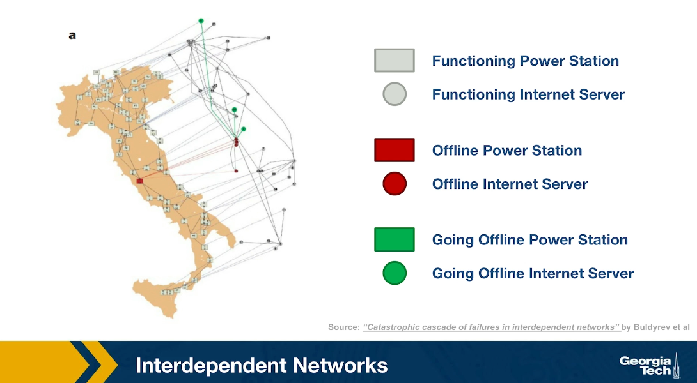

Another emerging topic of network science is that of interdependent networks or multi-layered networks. This illustration refers to a cascade of power failures that took place in 2003 in the power distribution network of Italy. We see two networks, on the map of Italy, we see the network of power generators while the network of computer severs that control those power generators is shown at the right over the map of Italy, It is important to understand that in order for a power generator to operate properly, it has to be controlled by one of those computer servers. In order for the computer severs to operate properly, they need to have power. So the two networks are interdependent. 

At the first step of the process, one of the power generators shown here is red, went offline. Three of the computers servers went also offline because they depended on that power generator. The nodes that are shown in green here are nodes that will go offline at the next step of the process. Indeed at the next step of the process, some additional computer severs went offline causing two more power generators to go offline shown here in red.

In the final step of the process, as you see, about half of the country went offline because all of those south power generators went offline together with the computer servers that control them. This is an example of an interdependent network. In many real-world systems there are such interdependencies between networks. For example in transportation, if there is a disruption in airlines because of a volcanic eruption or something else, many more passengers will start traveling by trains, buses or cars, potentially causing congestion on the land transportation network. 

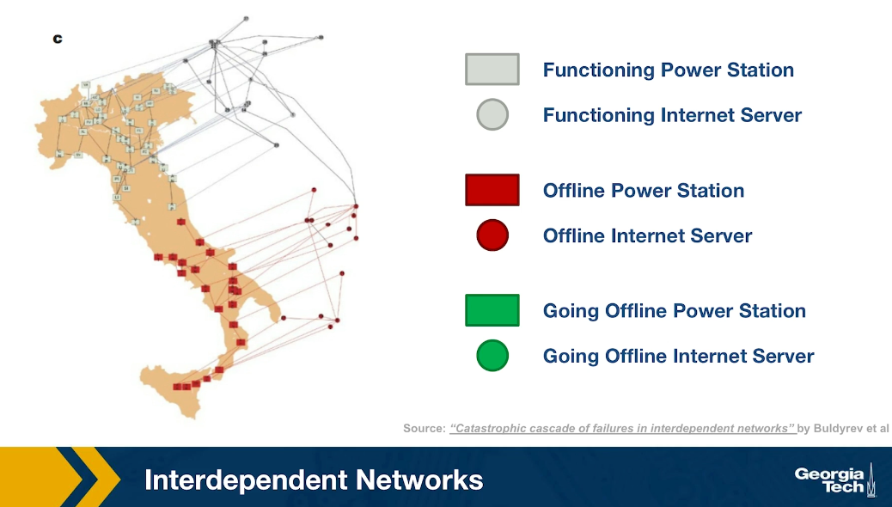
### Advanced Topics: Temporal Networks

An active research area in Network Science is the study of Temporal Networks. In such networks, nodes and edges may be present only for specific time periods. For instance, a network that shows the phone communications between people may represent each call with an edge that has a specific start and end-time. Note that the transitivity property does not apply in temporal networks, in the sense that if node-A connects to node-B, and node-B connects to node-C, we cannot conclude that node-A connects to node-C. 

For instance, Figure-a represents the communications between six people, arranged temporally in six time steps. For instance, during the first time period (t1) node-A contacted node-B, and node-C contacted node-F. If we ignore the temporal ordering of the links, we can reach completely wrong conclusions about the communication flows that are possible in a given network. For instance, if node-A is the only node with some information at time t1, is it possible that this information will ever reach node-F during the following six time steps?

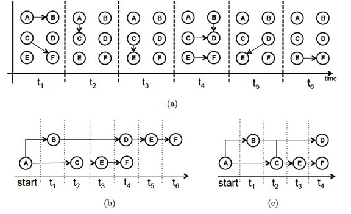
*Source: [“Temporal network metrics and their application to real world networks”](https://www.cl.cam.ac.uk/~cm542/phds/johntang.pdf) (Figure 4.5) by J.K.Tang.*

Figure-b shows that there are actually two different "temporal paths" from node-A to node-F. In one of them node-F would obtain the information at time t4, while in the other at t6.

We could also ask: what is the earliest time at which each node in the graph could receive this information? This is shown in Figure-c, referred to as the "minimum temporal spanning tree" originating at node-A. 

These are only a couple of the many interesting questions we can ask about temporal networks. The temporal structure of edge activations can significantly affect the dynamics of processes that are taking place on a network, such as epidemics, information diffusion, or synchronization. Additionally, the metrics we have defined earlier to quantify the centrality of nodes (or groups of nodes) have to be modified in temporal networks so that they only consider temporally-valid paths. 

If you are interested to learn more about Temporal Networks, we recommend the recent book ["A Guide to Temporal Networks"](https://www.worldscientific.com/worldscibooks/10.1142/q0033) by R.Lambiotte and N.Masuda.

### Lesson Summary

This lesson focused on the overlap between Network Science and Machine Learning, with an emphasis on Deep Learning and Graph Neural Networks.

This is a relatively new area that has been mostly pursued in the research literature in the last five years or so.

The applications of this emerging area are numerous – mostly because many real-world problems can be modeled with graphs and because Deep Learning has enormous capabilities to learn complex features from data without the burden of manual **“feature engineering”**.

We should also mention however the main drawbacks of the Deep Learning approach:

First, the resulting models are over-parameterized (thousands or even millions of parameters!) – compare that with models such as Preferential Attachment that have only one parameter, or even Stochastic Block Graphs in which the number of parameters scales with the number of communities. Models with too many parameters may overfit the data and they can be computationally expensive in terms of training.

Second, Deep Learning models are often viewed as **“black boxes”**, i.e., they are not transparent in terms of how the (automatically identified) features relate to the given task. For example, if a neural network classifies the node of an online social network as **“bot”** (instead of human), we may not know why.

Third, Deep Learning models typically require lots of training data. This is not a problem as long as we are working with large graphs, or many graphs, and we have labeled data for the nodes and edges of those graphs. For smaller networks however, it may be more appropriate to rely on simpler models, such as those studied in Lesson-12.

The last part of this lesson also mentioned some other state-of-the-art network science topics (such as interdependent networks or temporal networks) that we do not have time unfortunately to cover in more detail. If you are interested to learn more about these topics, please refer to the provided references.  

<!-- Dummy line -->
<!--  -->    