### Overview

Required Reading

* Chapter-8 (sections 8.1-8.3) from A-L. Barabási, [Network Science](http://barabasi.com/networksciencebook/), 2015.
* Chapter 20 -  D. Easley and J. Kleinberg, [Networks, Crowds and Markets](https://www.amazon.com/Networks-Crowds-Markets-Reasoning-Connected/dp/0521195330/), Cambridge Univ Press, 2010 (also available [online](https://www.cs.cornell.edu/home/kleinber/networks-book/))
* Chapter 21 (section 21.5) -  D. Easley and J. Kleinberg, [Networks, Crowds and Markets](https://www.amazon.com/Networks-Crowds-Markets-Reasoning-Connected/dp/0521195330/), Cambridge Univ Press, 2010 (also available [online](https://www.cs.cornell.edu/home/kleinber/networks-book/))

Recommended Reading

* [Synchronization in complex networks](https://www.sciencedirect.com/science/article/pii/S0370157308003384?casa_token=QxVjOU3HcM8AAAAA:RPNz2aIVI7cMQT3y0TtbHQDwM51cL7fGvK0ajWo7FLAIPHo3468AqrhdXJDbOs2xxc_X5lFV4A) by A.Arenas et al., 2008
* [Adaptive coevolutionary networks](https://royalsocietypublishing.org/doi/abs/10.1098/rsif.2007.1229): a review by T.Gross and B.Blasius, 2008
* [Co-evolutionary dynamics in social networks: A case study of twitter](https://link.springer.com/article/10.1186/s40649-015-0023-6) by D.Antoniades and C.Dovrolis, 2015

### Inverse Percolation On Grids and G(n,p) Networks​ ​

{: width="300" height="300"}
*Image Source: Network Science by Albert-László Barabási.*

Let's start with a process of network dynamics in which the topology changes over time due to node (or link) removals. ​

This happens often in practice as a result of failures (e.g., Internet router malfunctions, removal of species from an ecosystem, mutations of genes in a regulatory network) or deliberate attacks (e.g., destroying specific generators in the power distribution network, arresting certain people in a terrorist network).​

Consider the simpler case in which instead of a network we have a two-dimensional grid, and a node is placed at every grid point. Two nodes are connected if they are in adjacent grid points. ​

In the context of random failures, we can select a fraction f of nodes and remove them from the grid, as shown in the visualization at the left. The y-axis in that visualization shows the probability that a randomly chosen node belongs in the largest connected component on the grid. ​

When f is low, the removals will not affect the grid much in the sense that most of the remaining nodes still form a single, large connected component (referred to as **giant component**). ​

As f increases however the originally connected grid will start “breaking apart” in small clusters of connected grid points. ​

Further, as the visualization shows, this transition is not gradual. Instead, there is a sudden drop in the size of the largest connected component as f approaches (from below) a critical threshold $f_c$. ​

At that point the **giant component** disappears, giving its place to a large number of smaller connected components. ​

In physics, this process is referred to as **inverse percolation** and it has been extensively studied for both regular grids as well as random G(n,p) networks.

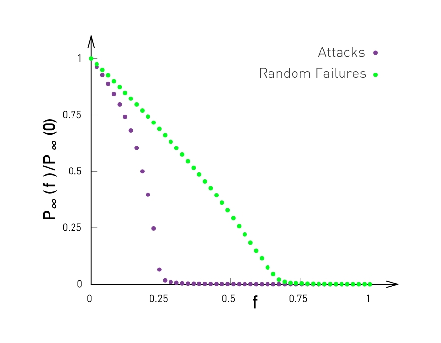{: width="500" height="300"}

The visualization at the top shows simulation results of a G(n,p) network with n=10,000 nodes and average degree $\bar{k}=3$. ​

The y-axis shows, again, the probability that a node belongs in the largest connected component of the graph after we remove a fraction f of the nodes, normalized by the same probability when f=0. ​

In the case of random failures, note that the critical threshold $f_c$ is about 0.65-0.70. After that point, the network is broken into small clusters of connected nodes and isolated nodes. ​

The same plot also shows what happens when we **attack** the highest-degree nodes of the network. We will come back to this curve a bit later in this Lesson. 

On the next page, we will see an animation for power-law networks, in which the degree distribution has infinite variance. In that case, the process of random node removals behaves very different than the process of node attacks. ​

Then, after that animation, we will derive and show some mathematical results for the critical threshold –for the case of random failures as well as for the case of higher-degree node attacks. 

> **Food for Thought**
>
> Compare the inverse percolation process described here with what we studied in Lesson-3 about G(n,p) networks, namely the emergence of a giant connected component when the average degree exceeds one. In both cases we have a phase transition. What is common and what is different in the two processes? 
>
{: .prompt-info }

### Random Removals (Failures) vs Targeted Removals (Attacks)​

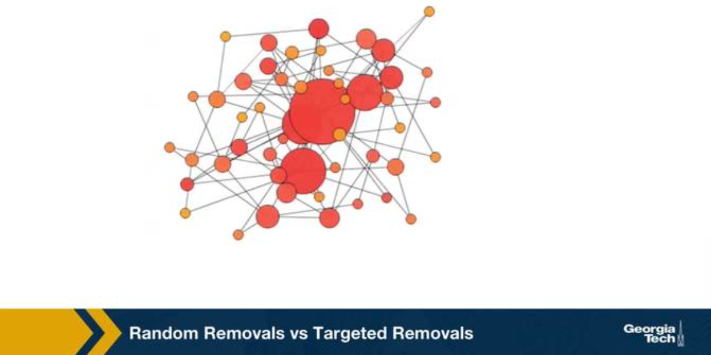{: width="500" height="300"}

We consider two ways of removing nodes from a network, random removals or failures, and targeted removals of the highest degree nodes. We refer to those as attacks. The visualization shows a network with 50 nodes and about 100 edges. The network was created with the preferential attachment model, and so, that the degree distribution is approximately a power law with exponent 3 as we learn in lesson four. Note that the size of its node is proportional to its degree. The animation shows the case of random removals, in iteration, we select a random node and remove it, This changes the degree of all nodes connected to the remove node. The question we focus is, how many nodes do we need to remove until the network's largest connected component folds apart to just a small fraction of the initial network size? 

{: width="500" height="300"}

In this animation, this happens after we remove about 40 to 45 out of the 50 nodes.  Note that the four to five hubs keep the network connected because of the remaining connections. The largest connected component breaks down, only when we have removed so many nodes, but the original hubs are no longer high degree nodes. Let us now switch to targeted removals or attacks. 

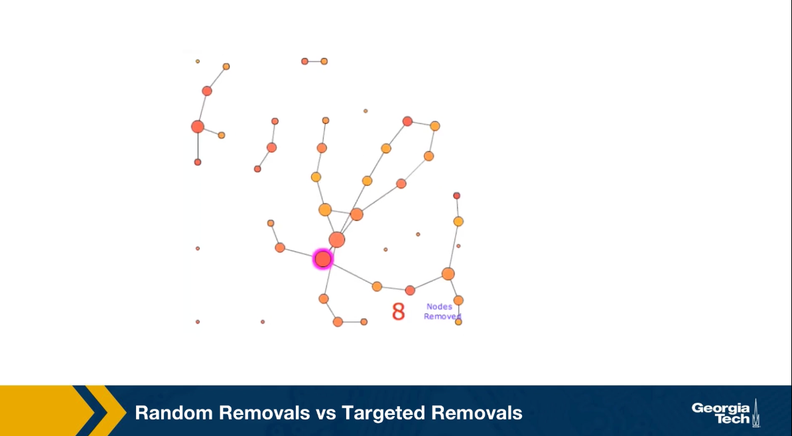{: width="500" height="300"}

The animation shows here what happens if we remove the node with the highest degree in each iteration. Such an attack on the network would require that the attack has some information about the topology of the network, or the degree of its node. In this case, it takes only the removal of about 10 nodes before the largest connected component falls apart to disconnected individual nodes, and few small connected components.

The qualitative conclusion from these two animation is that the networks with power law degree distribution, and that's with hubs are quite robust to random failures but they are also very vulnerable to targeted attacks on their highest degree nodes. 

### Molloy-Reed Criterion​

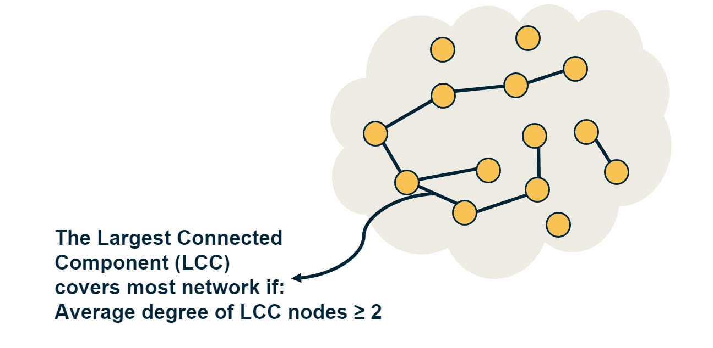{: width="500" height="300"}

If the **largest connected component (LCC)** of a network covers almost all nodes, we refer to that LCC as the **giant component** of the network. 

To derive the critical threshold of an inverse percolation process, we need a mathematical condition for the emergence of the giant component in a random network  (including power-law networks). This condition is referred to as **Molloy-Reed criterion (or principle):**​

Consider a random network that follows the configuration model with degree distribution p(k) (i.e., there are no degree correlations). **​The Molloy-Reed criterion states that the average degree of a node in the giant component should be at least two.​**

Intuitively, if the degree of a node in the LCC is less than 2, that node is part of the LCC but it does not help to **expand** that component by connecting to other nodes. So, in order for the LCC to expand to almost all network nodes (i.e., in order for the LCC to be the giant component), the average degree of a node in the LCC should be at least two. 

To express the Molloy-Reed criterion mathematically, let us first derive the average degree of a node in the LCC, as follows:

Suppose that j is a node that connects to the LCC through an LCC node i. ​

Let $P[k_j=k \| A_{i,j}=1]$ be the probability that node j has degree k, given that nodes i and j are connected.

From Bayes's theorem, we have that:

$$
P[k_j=k | A_{i,j}=1] = \frac{P[k_j=k, A_{i,j}=1] }{P[A_{i,j}=1] } = \frac{P[k_j=k] \, P[A_{i,j}=1| k_j=k]}{P[A_{i,j}=1] } ​\quad (1)
$$
 

For a network with n nodes and m edges, the denominator is simply:

$$
P[A_{i,j}=1] = \frac{2m}{n(n-1)}= \frac{\bar{k}}{n-1},
$$

where $\bar{k}$ is the average node degree.​

Also, $P[A_{i,j}=1 \| k_j=k] = \frac{k}{n-1}$ because j chooses between n-1 nodes to connect to with k edges (recall that the configuration model allows for multiple edges between nodes). ​

Returning to Equation-(1), we can now derive the average degree of nodes in the LCC:​

$$
\sum_{k} {k \, P[k_j=k | A_{i,j}=1]} = \sum_{k} {k \, \frac{P[k_j=k] \, P[A_{i,j}=1| k_j=k]}{P[A_{i,j}=1] }}  = \frac{\sum_{k} k^2 p(k)}{\bar{k}} = \frac{\bar{k^2}}{\bar{k}} ​
$$

So, returning to the Molloy-Reed criterion, we can now state it mathematically, as follows:​

In a random network that follows the configuration model with degree distribution p(k),  if the first and second moments of the degree distribution are $\bar{k}$ and $\bar{k^2}$
 respectively, the network has a giant connected component if​

$$
\frac{\bar{k^2}}{\bar{k}} \geq 2​
$$

> **Food for Thought**
>
> How does the Molloy-Reed criterion relate to the following result in Lesson-3 about G(n,p) networks: a giant connected component emerges if the average node degree $\bar{k}$ is more than one? And how does it relate to the average neighboring node degree $\bar{k}_{nn}$, we derived in Lesson-2?​
>
{: .prompt-info }

### Robustness of Networks to Random Failures​

*Image Source: Network Science by Albert-László Barabási*

We will now present the critical threshold under random node failures. ​The detailed proof of this result can be found in the textbook (Advanced Topics 8.C). The key points of the proof however are the following: ​

**A.** When we remove a fraction f of the nodes, the degree distribution changes. A node that had degree k in the original network, will now have a degree $\kappa \leq k$ with probability​

$$
\binom{k}{\kappa} \, f^{k-\kappa} \, (1-f)^{\kappa}​
$$

because each of the $k-\kappa$ neighbors of that node is removed with probability $f$, and there are $\binom{k}{\kappa}$ ways to choose $\kappa$ from $k$ neighbors. ​

**B.** If the probability that a node has degree k at the original network is $p_k$, the probability that the node has degree $\kappa$ in the reduced network (the network that results after the removal of a fraction f of the nodes) is:​

$$
p'_{\kappa} = \sum_{k=\kappa}^{\infty} p_k \binom{k}{\kappa} f^{k-\kappa} (1-f)^{\kappa}​
$$ 

**C.** The average degree of the reduced network is a fraction (1-f) of the average degree of the original network:​

$$
\bar{\kappa} = (1-f) \, \bar{k}​
$$

D. Similarly, the second moment of the degree distribution of the reduced network is:​

$$
\bar{\kappa^2} = (1-f)^2 \bar{k^2} + f (1-f) \bar{k}​
$$

where $\bar{k^2}$ is the second moment of the degree distribution of the original network. ​

Going back to the Molloy-Reed criterion, the reduced network has a giant connected component if​

$$
\frac{\bar{\kappa^2}}{\bar{\kappa}} \geq 2​
$$

Substituting the previous expressions for the first and second moments of the reduced network, we get that the critical threshold for random node failures is​

$$
f_c = 1 - \frac{1}{\frac{\bar{k^2}}{\bar{k}} -1}​
$$

For G(n,p) networks, the degree variance is equal to the average degree, and so $\bar{k^2}=\bar{k}(\bar{k}+1)$. This means that the critical threshold for a G(n,p) network is​

$$
f_{c,G(n,p)} = 1 - \frac{1}{\bar{k}}​
$$

So, if the average degree of a large G(n,p) network is 2, we expect that the giant connected component of the network will disappear when the fraction of removed nodes exceeds about 50%, as shown in Figure (b). ​

What happens with power-law networks in which the degree exponent is between 2 and 3? As we saw in Lesson-4, in that case the first moment is finite but the degree variance and the second moment diverge.  ​So, $f_c$ converges to 1, at least asymptotically,

$$
f_{c, \, 2<\gamma\leq 3}\to 1
$$

Figure (a) illustrates this point with simulation results on a power-law network n=10,000 nodes, degree exponent $\gamma=2.5$, and minimum degree $k_{min}=1$. ​As n tends to infinity, the green curve will asymptotically converge to zero at $f=1$. ​

**This is a remarkable result that needs further discussion: it means that such networks stay  connected in a single component even as we remove almost all their nodes.**  ​Intuitively, this happens because networks with diverging degree variance have hubs with very large degree. Even if we remove a large fraction of nodes, it is unlikely that we remove all the hubs from the network, and so the remaining hubs keep the network connected. ​

The situation is not very different **if we randomly remove links instead of nodes**, as shown in Figure (b). ​Here, we remove a fraction f of all links in the network. It can be shown that the network’s giant connected component disappears at the same critical threshold as in the case of node removals. ​The visualization in Figure (b) refers to a G(n,p) network in which n=10,000 nodes and the average degree is $\bar{k}=2$. ​As predicted by the critical threshold equation, the giant component disappears when we remove 1-(1/2)=50% of all edges.​ For lower values of f, the effect of random node removals is more detrimental than the effect of random link removals (why?). ​

What happens with power-law networks in which the degree exponent $\gamma$ is larger than 3? In that case the degree variance is finite, and so we can use the critical threshold equation to calculate the maximum value of f that does not break the network’s giant component. Figure (c ) shows numerical results of three values of $\gamma$– the network size is n=10,000 and the minimum node degree $k_{min}=2$.

> **Food for Thought**
>
> How do you explain that the random removal of a fraction f of nodes causes a larger decrease in the size of the largest component than the random removal of a fraction f of links (when $f<f_c$>)?​
>
{: .prompt-info }

### Robustness of Networks to Attacks​

What happens in the case of attacks to the higher-degree nodes? What is the critical threshold $f_c$ in that case?

*Image Source: Network Science by Albert-László Barabási*

Let us start with some simulations. Figure (a) contrasts the case of random failures and attacks in a G(n,p) network with n=10,000 nodes and average degree $\bar{k}=3$. The y-axis shows, as in the previous page, the probability that a node belongs in the largest connected component of the graph after we remove a fraction f of the nodes,  normalized by the same probability when f=0. In the case of random failures, the critical threshold $f_c$is about 0.65-0.70 -- the theoretical prediction for an infinitely large network is $1-1/\bar{k}=2/3$. 

The same plot shows what happens when we “attack” the highest-degree nodes of the network.  Specifically, we remove nodes iteratively, each time removing the node with the largest remaining degree, until we have removed a fraction f of all nodes. 

This “attack” scenario destroys the LCC of the network for an even lower value of f than random removals. The critical threshold for attacks is about 0.25 in this network.  The fact that the critical threshold for attacks is lower than for random failures should be expected – removing nodes with a higher degree makes the LCC sparser, increasing the chances that it will be broken into smaller components. 

As we know from Lesson-4 however, G(n,p) networks do not have hubs and the degree distribution is narrowly concentrated around the mean (Poisson distribution).  What happens in networks that have hubs – and in particular what happens in power-law networks in which the degree variance diverges?

Figure (b) contrasts random failures and attacks for a power-law network n=10,000 nodes, degree exponent $\gamma=2.5$, and minimum degree $k_{min}=1$. Even though the case of random failures does not have a critical threshold ($f_c$ tends to 1 as the network size increases), the case of attacks has a critical threshold that is actually even lower (around 0.2 in this example) than the corresponding threshold for G(n,p) networks. Power-law networks have hubs, and attacks remove the hubs first. So, as the network's hubs are removed, the giant component quickly gets broken into many small components. 

The moral of the story is that **even though power-law networks are robust to random failures, they are very fragile to attacks on their higher degree nodes.** 

The mathematical analysis of this attack process is much harder (you can find it in your textbook in “Advanced topics 8.F”) and it does not lead to a closed-form solution for the critical threshold $f_c$. 

Specifically, if the network has a power-law degree distribution with exponent $\gamma$ and with minimum degree $k_{min}$, then the critical threshold $f_c$ for attacks is given by the numerical solution of the equation:

$$
f_c^{\frac{2-\gamma}{1-\gamma}} = 2 + \frac{2-\gamma}{3-\gamma} \, k_{min} \, \left(f_c^{\frac{3-\gamma}{1-\gamma}} -1 \right)
$$

Figure (c ) shows numerical results for the critical threshold as a function of the degree exponent $\gamma$, for two values of $k_min$, and separately for failures and attacks. 

The key points from this plot are:

* In the case of random failures, $f_c$ decreases with $\gamma4 – this is expected because as $\gamma$
 decreases towards 3, the degree variance increases, creating hubs with higher-degree.
* In the case of attacks, however, the relation between $f_c$ and $\gamma$ is more complex, and it also depends on $k_{min}$. In the case of $k_{min}=3$, as $\gamma$ decreases, $f_c$ decreases because the degree variance increases, the hubs have an even greater degree, and removing them causes more damage in the network’s giant component. 
* As expected, for given values of $\gamma$ and $k_{min}$, attacks always have a smaller $f_c$ than random failures. 
* As $\gamma$ increases, and for a given value of $k_{min}$, the critical threshold $f_c$ for attacks approaches the critical threshold for random failures. The reason is that as $\gamma$ increases, the variance of the degree distribution decreases. In the limit, the degree variance becomes zero and all nodes have the same degree. In that case, it does not matter if we remove nodes randomly or through attacks. 

> **Food for Thought**
>
> How would you explain the way that the critical threshold $f_c$ depends on the minimum degree $k_{min}$, for a given value of the exponent $\gamma$
? Answer separately for random failures and attacks.
>
{: .prompt-info }

### Small-world Networks and Decentralized Search​

{: width="500" height="300"}

Back in the late 60s, the famous sociologist Stanley Milgram, decided to study the small world phenomenon. Until then, this was only a fascinating anecdote. OPeople would find it amusing every time it was discovered that two random individuals know hte same person. Nobody had studied this empirically however, and the six degrees fo separation principle was just an expression.  Milgram asked several individuals in Nebraska to forward the letter to a target person in Boston. He gave participants the name, address, and occupation of the target. But the participants could not just send the letter directly to the target. They had to forward the letter to a person they knew on a first name basis with a goal of reaching the target as soon as possible. Most participants chosen acquaintances based on geographical and 
occupational information. It is reasonable to expect that these letters would never reach their destination. Because finding such a path between two random individuals, one in Nebraska and another in Boston would require a very long number of intermediates. Besides, it could be that even if there are short paths between these two individuals, their immediate people would not know that short path exists. 

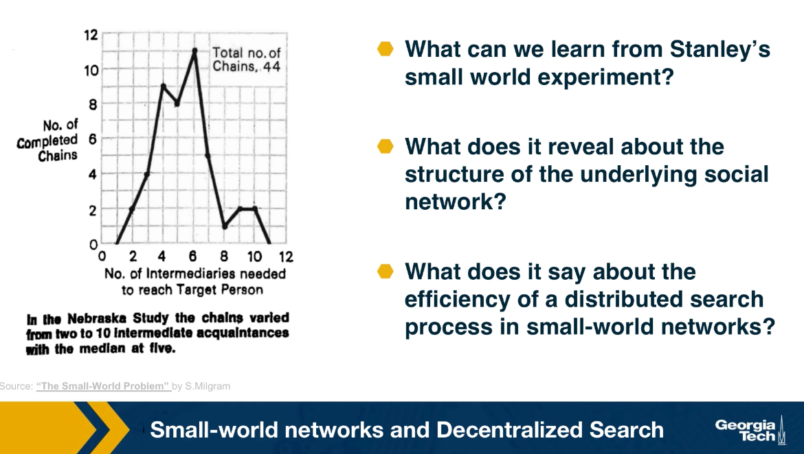{: width="500" height="300"}

And so the letters would keep getting forwarded in the vicinity of the target but never actually reaching the target. Surprisingly, one third of the letters made it to the target. The histogram that you see here from Milgram original paper shows that the median distance was six steps just as the six degree of separation principle detected.

What can we learn Stanley Milgram's small world experiment? What does it reveal about the structure of hte underlying social network? And what does it say about the efficiency of a distributed search process in small-world-networks? These are questions that we answer in the next few pages using an elegant mathematical model that was developed by John Kleinberg at Cornell University.

> **Food for Thought**
>
> It is interesting to read the original paper by Milgram (1967). Here is the [link](http://files.diario-de-bordo-redes-conecti.webnode.com/200000013-211982212c/AN%20EXPERIMENTAL%20STUDY%20by%20Travers%20and%20Milgram.pdf)
>
{: .prompt-info }

### Decentralized Search Problem​

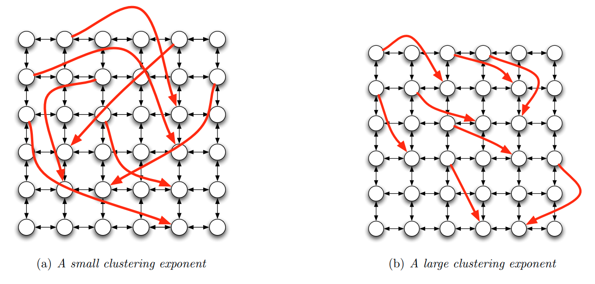{: width="500" height="300"}
*Image Source: Textbook “[Networks, Crowds and Markets](https://www.cs.cornell.edu/home/kleinber/networks-book/)”.by Easley and Kleinberg. Figure 20.5​*

Milgram’s experiment has been repeated by others, both in offline and online social networks. These studies show two points:

1. Even global social networks (Facebook has around one billion users) have multiple short paths to reach almost anyone in the network (typically around 5-6 hops, and almost always less than 10 hops). 

2. It is possible to find at least one of these short paths with strictly local information about the name and location of your neighbors, without having a global "map" (topology) of the network – and without a central directory that stores everyone’s name and location in the network. ​

The first point should not be surprising to us by now. Recall what we learned about Small World networks in Lesson-5. A network can have both strong clustering (i.e., many triangles, just as a regular network) and short paths (increasing logarithmically with the size of the network, just as G(n,p) networks). The way this is achieved in the **Watts-Strogatz model** is that we start from a regular network with strong clustering and rewire a small fraction (say 1%) of edges to connect two random nodes. These random connections connect nodes that can be anywhere in the network – and so for large networks, these random connections provide us with “**long-range shortcuts**”. If you do not recall these points, please review Lesson-5. ​

Let us now focus on the second point: how is it possible to find a target node in a network with only local information, through a distributed search process? First, let us be clear about the information that each node has: a node v knows its own location in the network (in some coordinate system), the locations of only the nodes it is connected to, and the location of the target node.

The metric we will use to evaluate this distributed search process is the “**expected delivery time**”, i.e., the expected number of steps required to reach the target, over randomly chosen source and target nodes, and over a randomly generated set of long-range links. ​

To answer the previous question, we will consider an elegant model developed by Jon Kleinberg. Suppose that we start with a regular grid network in k-dimensions (the visualizations shown refer to k=2 but you can imagine mesh networks of higher dimensionality). Each node is connected to its nearest neighboring nodes in the grid. Note that this network does not have cliques of size-3 (triangles) but it still has strong clustering in groups of nodes that are within a distance of two hops from each other.​

Let $d(v,w)$ be the distance between nodes v and w in this grid. ​Kleinberg’s model adds a random edge out of v, pointing to a node w with a probability that is proportional to $d(v,w)^{-q}$ – the exponent q is the key parameter of the model as we will see shortly. ​

The value of q controls how “spread out” these random connections actually are. ​If q=0, the random connections can connect any two nodes, independent of their distance (this is the case in the Watts-Strogatz model) – and so they are not very useful in decentralized search, when you try to “converge” to a certain target in as few steps as possible. If q is large, on the other hand, the random connections only connect nearby nodes – and so they will not provide the long-range shortcuts that are necessary for Small World property.

The visualization contrasts the case of a small q and a large q. What do you think would be the optimal value of q, so that the decentralized search process has the minimum expected delivery?​

> **Food for Thought**
>
> Try to think of either an application of decentralized search in technological/social networks -- or of an instance of decentralized search in natural networks. For example, back in the early 2000s, when peer-to-peer applications such as Gnutella were popular for sharing music files, decentralized search was at the “peak of its glory”. ​
>
{: .prompt-info }

### The Optimal Search Exponent in Two Dimensions​

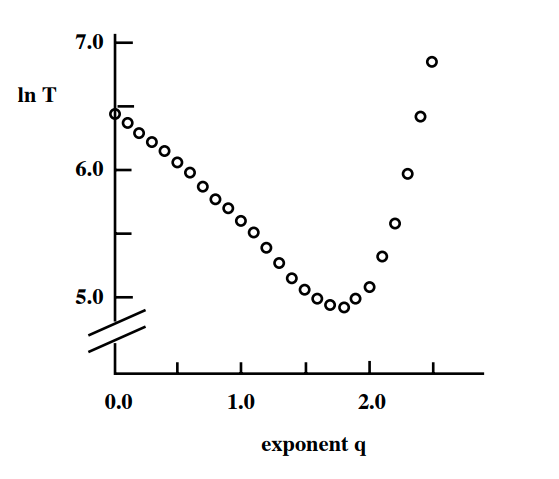{: width="500" height="300"}
*Image Source: Textbook “[Networks, Crowds and Markets](https://www.cs.cornell.edu/home/kleinber/networks-book/)”.by Easley and Kleinberg. Figure 20.6​*

Let us start with some simulation results. The plot shows the exponent q at the x-axis, when the initial grid has k=2 dimensions. The y-axis shows the logarithm of the expected delivery time in a grid with 400 million nodes. Each point is an average across 1000 runs with different source-target pairs and different assignments of random edges. ​

As expected, values of q that are either close to 0 or quite large result in very slow delivery times. The random edges are either ”**too random**” (when q is close to 0) or ”**not random enough**” (when q is large). ​

It appears that the **optimal value of the exponent q is when it is close to 2** – which, remember, is also the value of the dimension k in these simulations. Is this a coincidence?​

The answer is that we can prove that the optimal value of q is equal to k. In other words, if we want to maximize the speed of a decentralized search in a k-dimensional world, we should have random “**shortcut links**” the probability of which decays as $d(v,w)^{-k}$ with the distance between two nodes. ​This surprising result was proven by Kleinberg in 2000. ​

You can find the proof, at least for k=1 and 2, in the online textbook “Networks, Crowds and Markets” by Easley and Kleinberg (section 20.7). ​On the next page, we give the basic intuition  behind this result. ​

> **Food for Thought**
>
> Why do you think that the average delivery time increases much faster when q>2 than when q<2?
>
{: .prompt-info }

### Why The Optimal Value of q is Equal to Two in a Two-Dimensional World?​

{: width="500" height="300"}
*Image Source: Textbook “[Networks, Crowds and Markets](https://www.cs.cornell.edu/home/kleinber/networks-book/)”.by Easley and Kleinberg. Figure 20.7*

We can organize distances into different “**scales of resolution**": something can be around the world, across the country, across the state, across town, or down the block. ​

Suppose that we focus on a node v in the network – and consider the group of nodes that are at distances between d and 2d from v in the network, as shown in the visualization.​

If v has a link to a node inside that group, then it can use that link to get closer to the set of nodes that are within that scale of resolution. ​

So, what is the probability that v has a link to a node inside that group? ​And how many nodes are expected to be in that distance range?

In a two-dimensional world, the area around a certain point (node v) grows with the square of the radius of a circle that is centered at v. ​So, the total number of nodes in the group that are at a distance between d and 2d from v is proportional to $d^2$. ​

On the other hand, the probability that node v links to any node in that group scales as $d(v,w)^{-2}$, when $q=k=2$. ​So, if node w is at a distance between d and 2d from v, the probability that it is connected to v is proportional to $d^{-2}$.

Hence, the number of nodes that are at a distance between d and 2d from v, and the probability that v connects to one of them, roughly cancel out. ​This means that the probability that a random edge links to a node in the distance range [d,2d] is independent of d. ​

In other words, when q=k=2, the long-range links are formed in a way that “**spreads them out**” roughly uniformly over all different resolution scales. ​This is the key point behind Kleinberg’s result. ​

If the exponent q was lower than k=2, the long-range links would be spread out non-uniformly in favor of larger distances, ​while if q was larger than k=2, the long-range links would be spread out non-uniformly in favor of shorter distances. ​

> **Food for Thought**
>
> The proof of the previous result, at least for for k=1 and k=2, is clearly written in sections 20.7 and 20.8 of the Easley/Kleinberg textbook. I recommend you go through it. 
>
{: .prompt-info }

### Decentralized Network Search in Practice​

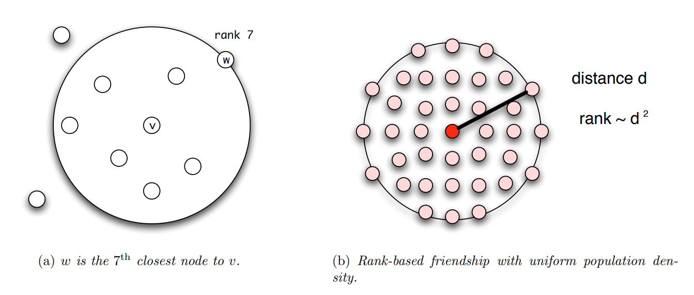{: width="500" height="300"}
*Image Source: Textbook “[Networks, Crowds and Markets](https://www.cs.cornell.edu/home/kleinber/networks-book/)”.by Easley and Kleinberg. Figure 20.9*

In the last few years, researchers have also investigated the efficiency of decentralized search empirically, mostly doing experiments in online social networks. ​There are a number of practical issues that have to be addressed however when we move from Kleinberg’s highly abstract model to the real world. ​

First, in practice, people do not “live” on a regular grid. In the US, for instance, the population density is extremely nonuniform, and so it would be unreasonable to expect that the q=k=2 result would also hold true about real social networks. ​One way to address this issue is to work with “**rank-based links**” rather than “**distance-based links**”. The rank of a node w, relative to a given node v, is the number of other nodes that are closer to v than w -- see Figure (a). ​

We can now modify Kleinberg’s model so that the random links are formed based on node ranks, rather than rank distances. ​In Figure (b), we see that when nodes have a uniform population density, a node w at distance d from v will have a rank that is proportional to $d^2$, since all nodes inside a circle of radius d will be closer to v than w.​

In fact, it can be proven that, for any population density – not just uniform – if the random links are formed with a probability that is proportional to $\frac{1}{\mbox{rank}_v(w)}$, the resulting network will have minimum expected delivery time – note that the exponent, in this case, is 1, not 2. ​

{: width="500" height="300"}

This result has been empirically validated with social experiments on an earlier social networking application called LiveJournal – but similar experiments have been also conducted on Facebook data. Figure-c shows the probability of a friendship as a function of geographic rank on the blogging site LiveJournal. Note that the decay is almost inversely proportional to the rank. ​

Another way to generalize decentralized network search is by considering that people can belong to multiple different groups (family, work, hobbies, etc), and so the distance (or rank) between two network nodes can be defined based on the group at which the two nodes are closest. This group is referred to as the ”**smallest focus**” that contains both nodes.  This generalized distance metric has allowed researchers to examine more realistically whether real social networks have the optimal “**shortcut links**” to minimize the delivery time of the decentralized search, in terms of the corresponding exponent. ​

An interesting question, that is still largely an open research problem, is: why is it that real social networks, both offline and online, have such optimal “shortcut links”? Clearly, when people decide who to be friends with on Facebook or in real life, they do not think in terms of distances, ranks, and exponents! ​

One plausible explanation is that the network is not static – but instead, it evolves over time, constantly rewiring itself in a distributed manner, so that searches become more efficient. For instance, if you find at some point that you want some information about a remote country (e.g., Greece), you may try to find someone that you know from that country (e.g., the instructor of this course) and request that you get connected on Facebook. That link can make your future searches about that country much more efficient. ​

### Synchronization of Coupled Network Oscillators​

Synchronization is a very important property of both natural and technological system. In broad terms, synchronization refers to any phenomenon in which several distinct but coupled, dynamic element have a coordinated dynamic activity. For example, all the devices that are connected to the internet have synchronized clock using a distributed protocol called NTP, network time protocol. Interestingly, this protocol works quite well despite the fact that internet delays are unknown and time varying and the complete topology of the internet is not known.

A classic example of emergent synchronization is shown in this youtube video. Five metronomes are placed on a moving bar so that the motion of its metronome is loosely coupled with the motion of others. The metronomes start from a random phase and under certain conditions that we discuss later in this lesson, they can get completely synchronized after some time as this video shows. Note that in this case, the communication between the five dynamic elements is only indirect. 

The metronomes do not exchange any messages, instead, each of them affects to a small degree, the movement of the underlying board and that board affects hte movement of every metronome. Another example of self organized synchronization in nature is when many fireflies gather close together as this image shows. Note that each firefly cannot see all other fireflies such global communication is not necessary in synchronized systems. Instead, the remarkable effect is that a large number of systems can get synchronized at least a period of time even if each of them can only communicate locally with other nearby systems. 

Similar distributed synchronization phenomena also take place with flock of birds, and school of fish, forming fascinating dynamic patterns. In technology, similar problems emerge when we have a group of robots, autonomous vehicles or drones that need to coordinate without having a centralized controller. Our brains also rely on short term synchronization between thousands of neurons, so that different brain regions can communicate. This type of synchronization, referred to as coherence is shown at this video. 

The video shows three views from the lateral and dorsal of the zebrafish brain using calcium imaging. Whenever a cluster of neurons fires, the corresponding part of hte brain lights up. Note how different brain regions get active at about the same time, occasionally producing large avalanches of neural activity throughout most of the brain. Synchronization is not always a desirable state, however. For example, too much synchronization in the brain can cause seizures. This image shows EGG recordings during the onset of an epileptic seizure. The scissor start at about the middle of the blood, and it shows major waves discharges at the Frequency of about three hertz over most of the patient's cortical surface.

> **Food for Thought**
>
> Can you think of other systems, closer to your interests, that can show spontaneous synchronization?
>
{: .prompt-info }

### Coupled Phase Oscillators – Kuramoto Model​

​Collective synchronization phenomena can be complex to model mathematically. The class of models that have been studied more extensively focuses on coupled phase oscillators. ​

Suppose that we have a system of N oscillators. The j’th oscillator is a sinusoid function with angular frequency $\omega_j$. ​To simplify suppose that the amplitude of all oscillators is the same (set to 1). ​

If the oscillators were decoupled, the dynamic phase $\phi_j(t)$ of oscillator j would be described by the differential equation:​

$$
\frac{d\phi_j}{dt} =\omega_j
$$

Things get more interesting however when the oscillators are coupled (the exact mechanism that creates this coupling does not matter here) so that the angular velocity of each oscillator depends on the phase of all other oscillators, as follows:​

$$
\frac{d\phi_i}{dt} = \omega_i+ \frac{K}{N} \sum_{j=1}^N \sin(\phi_j-\phi_i)​
$$

where K>0 is the coupling strength. In other words, the angular velocity of oscillator i is not just its “natural” frequency $\omega_i$ – instead the angular velocity is adjusted by the product of K and the average of the $\sin(\phi_j-\phi_i)$ terms. ​

This model was introduced by Yoshiki Kuramoto, and it carries his name (Kuramoto model). ​Suppose we only have N=2 oscillators, i and j. If the j’th oscillator is ahead of the i’th oscillator at time t (i.e., $\phi_j(t) >\phi_i(t)$, with $\phi_j(t) - \phi_i(t)< \pi$ ), then the j’th oscillator adds a positive term in the angular velocity of the i’th oscillator, accelerating the latter and pulling it closer to the j’th oscillator. Similar, the i’th oscillator adds a negative term in the angular velocity of the j’th oscillator causing it to slow down, and also pulling it closer to the i’th oscillator.  Will the two oscillators end up synchronized, i.e., having $\phi_i(t) = \phi_j(t)$ for all time? ​

That depends on the magnitude of K, relative to the magnitude of the difference of the two natural frequencies $\|\omega_i - \omega_j\|$. ​Intuitively, the larger the difference of the two natural frequencies, the larger the coupling strength should be so that the two oscillators synchronize. ​

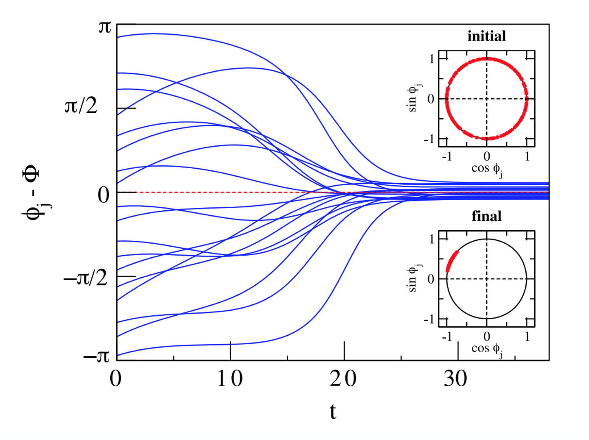{: width="500" height="300"}

Actually, it is not hard to see that in this simple model the two oscillators cannot synchronize if $K < \|\omega_i - \omega_j\|$ because in that case, the velocity adjustment added by the other oscillator is always lower than the difference of the two natural frequencies. ​

What happens when we have more than two oscillators, however?​ To illustrate, look at these simulation results with N=100 oscillators.​

The plot shows the phase difference between individual oscillators (only 18 out of 100 curves are shown) and their average phase $\Phi(t)$. In this case, K is large enough to achieve complete synchronization. ​

The two smaller plots inside the left figure show the initial state (the 100 oscillators are uniformly distributed on the unit cycle of the complex plane) as well as the final state in which the oscillators are almost perfectly synchronized. ​

Let us now introduce a synchronization metric that will allow to measure how close N oscillators are to complete synchronization. ​Recall from calculus that a sinusoidal oscillator with phase $\Phi(t)$ and unit magnitude can be represented in the complex plane as $e^{i\phi(t)}$, where i is the imaginary unit. ​

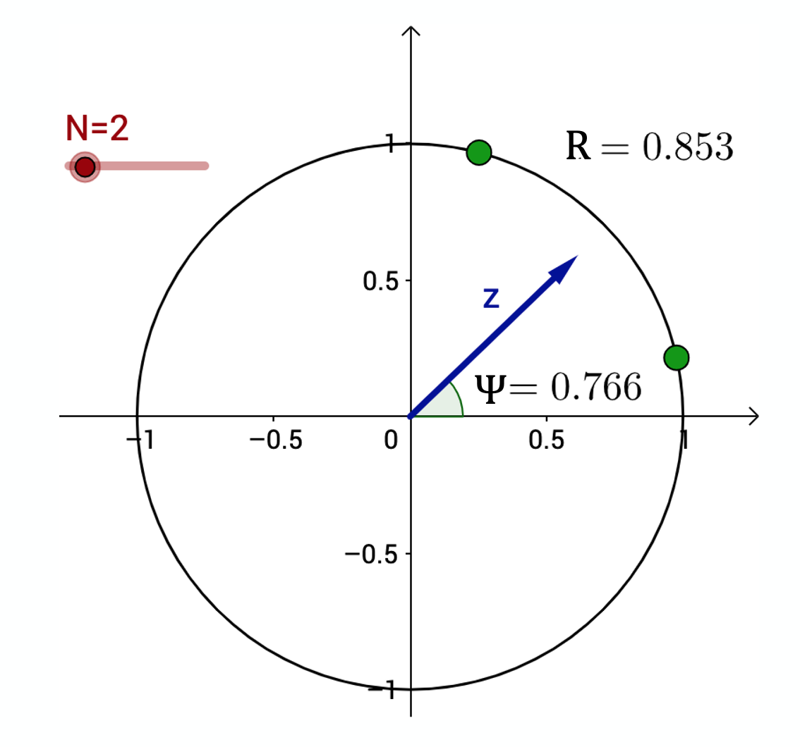{: width="500" height="300"}

The average of these N complex numbers is another complex number $r(t)$ with magnitude $R(t)$ and phase $\Phi(t)$:

$$
r(t) = R(t) \, e^{i\, \Phi(t)} = \frac{1}{N} \sum_{j=1}^N e^{i\, \phi_j(t)}​
$$
 

The magnitude R(t) is referred to as **synchronization order parameter**. Its extreme values correspond to complete synchronization when R(t)=1 (all oscillators have the same phase) and ​complete de-coherence when $R(t)=0$ (that happens when each oscillator has a phase difference $2\pi/N$ from its closest two oscillators).​

The visualization at the right shows the unit cycle in the complex plane. Two oscillators are shown as green dots on the unit cycle. The vector z represents the average of the two oscillators.​ The order parameter in this example is 0.853 (shown as R in this plot), and the phase of z is shown as $\Psi=0.766$
.​

> **Food for Thought**
>
> Show mathematically that:
> ​ 
> $$
> \frac{d\phi_i}{dt} = \omega_i + K \, R(t) \sin \left(\Phi(t) -\phi_i\right)​
> $$
{: .prompt-info }

### Kuramoto Model on a Complete Network​

The Kuramoto model has been studied in several different variations:​

* Is the number of oscillators N finite or can we assume that N tends to infinity? (the former is harder to model)​
* Do the oscillators have the same natural frequency or do their frequencies follow a given statistical distribution? (the latter is harder to model)​
* Is each oscillator coupled with every other oscillator or do these interactions take place on a given network? (the latter is harder to model)​
* Is the coupling between oscillators instantaneous or are there coupling delays between oscillators? (the latter is **much** harder to model)​

In the next couple of pages we will review some key results for the asymptotic case  of very large N, and without any coupling delays. ​

Let us start with  the simpler case in which each oscillator is coupled with every other oscillator:​

$$
\frac{d\phi_i}{dt} = \omega_i + \frac{K}{N} \sum_{j=1}^N \sin(\phi_j-\phi_i)​
$$

The initial phase of each oscillator is randomly distributed in $[0,2\pi)$.​ The coupling network between oscillators, in this case, can be thought of as a clique with equally weighted edges: each oscillator has the same coupling strength with every other oscillator. ​

Further, let us assume that the natural angular velocities of the N oscillators follow a unimodal and symmetric distribution around its mean $E[\omega_i]=\Omega$.​

When do these N oscillators get synchronized?​ It all depends on how strong the coupling strength K is relative to the maximum difference of the oscillator natural frequencies. ​

If K is close to 0 the oscillators will move at their natural frequencies, while if K is large enough, we would expect the oscillators to synchronize.​

Intuitively, we may also expect an intermediate state in which K is large enough to keep smaller groups of oscillators synchronized – but not all of them. ​

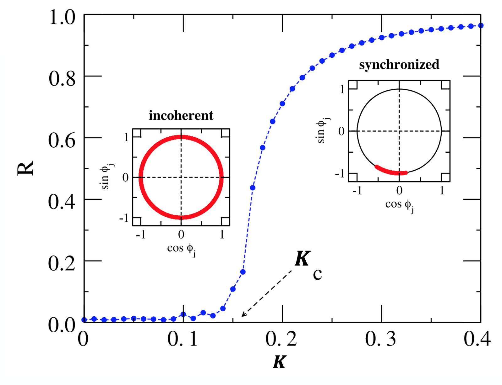{: width="500" height="300"}

The visualization shows the asymptotic value of the order parameter R(t) (as t tends to infinity), as a function of the coupling strength K. ​

For smaller values of K, the oscillators remain incoherent (i.e., not synchronized). ​

As K approaches a critical value $K_c$ (around 0.16 in this case), we observe a phase transition that is referred to as the “**onset of synchronization**”. ​

For larger values of $K > K_c$, the order parameter R increases asymptotically towards one, suggesting that the oscillators get completely synchronized. ​

For the asymptotic case of very large N, Kuramoto showed that as K increases, the system of N oscillators shows a phase transition at a critical threshold $K_c$. ​

At that threshold, the system moves rapidly from a de-coherent state to a coherent state in which almost all oscillators are synchronized (and so the order parameter R increases rapidly from 0 to 1). ​

A necessary condition for the onset of complete synchronization is that ​

$$
K \geq K_c= \frac{2}{\pi \Omega}​
$$

This visualization shows numerical results from simulations with N=100 oscillators in which the average angular frequency is $\Omega=4$ rads/sec, and $K_c \approx 0.16$.​

> **Food for Thought**
>
> Try to derive the Kuramoto critical coupling threshold given on this page.
>
{: .prompt-info }

### Kuramoto Model on Complex Networks ​

What happens when the N oscillators are coupled through a complex network? How does the topology of that network affect whether the oscillators get synchronized, and the critical coupling strength?​

This problem has received significant attention in the last few years – and there are limited results but only for special cases and only under various assumptions. ​

First, in the case of an undirected network with adjacency matrix **A**, the Kuramoto model can be written as follows, ​

$$
\frac{d\phi_i}{dt} = \omega_i + K \sum_{j=1}^N A_{i,j} \sin(\phi_j-\phi_i)​
$$

A common approximation (referred to as “degree block assumption” – we have also seen it in Lesson-9) is to ignore any degree correlations in the network, and substitute $A_{i,j}$ with its expected value according to the configuration model:​

$$
A_{i,j} \approx k_i \frac{k_j}{2m} = \frac{k_i k_j}{N \bar{k}}​
$$

where $\bar{k}=2m/N$ is the average node degree, and m is the number of edges.​

Under this approximation, the Kuramoto model can be written as:​

$$
\frac{d\phi_i}{dt} = \omega_i + \frac{K}{\bar{k}} \sum_{j=1}^N \frac{k_i k_j}{N} \sin(\phi_j-\phi_i)​
$$

Note that as $N \to \infty$, the summation remains finite – and non-zero. ​

Under this approximation, a necessary condition for the onset of synchronization is that the coupling strength $\frac{K}{\bar{k}}$ is larger than the following critical threshold:​

$$
K_c = \frac{2}{\pi \Omega} \frac{\bar{k}}{\bar{k^2}}​
$$

where $\bar{k^2}$ is the second moment of the degree distribution. ​

This formula predicts a very interesting result: ​for power-law networks with degree exponent $2 < \gamma \leq 3$, the network will always get synchronized, even for a very small K, because the second moment $\bar{k^2}$ diverges. ​

{: width="500" height="300"}
*Image Source:  “[Synchronization in complex networks](https://core.ac.uk/download/pdf/71321767.pdf)” by Arenas et al.*

The visualization shows simulation results of heterogeneous oscillators on power-law networks with degree exponent $\gamma =3$ (the networks are constructed with the Preferential Attachment model). The natural frequencies of the oscillators vary uniformly in the interval [−1/2,1/2]. The onset of synchronization is not exactly at 0 – but close to 0.05. The small deviation from the theoretically predicted result does not seem to be a consequence of finite N because the critical threshold remains close to 0.05 even as N increases. ​

We have seen this ratio of the first two moments of the degree distribution several times earlier in the course, including in the friendship paradox, the epidemic threshold, and the critical threshold for random failures. ​When the second moment diverges, we saw in Lesson-9 that the epidemic threshold goes to 0, and earlier in this Lesson that the critical threshold for random failures goes to 1. ​Something similar happens here: networks with major hubs get easily synchronized, even with very minor coupling strength. ​

### Adaptive (or Coevolutionary) Networks​

{: width="500" height="300"}
*Image Source: “[Adaptive coevolutionary networks: a review](https://arxiv.org/pdf/0709.1858.pdf)”by Gross and Blasius*

The most challenging class of problems in network dynamics is related to Adaptive or Coevolutionary networks. ​

Here, there are two dynamic processes that are coupled in a feedback loop, as shown in this illustration:​

1. The topology of the network changes over time, as a function of the dynamic state of the nodes,​
2. The state of the nodes and/or edges changes over time, as a function of the network topology.​

In the illustration, we see a small network of three nodes. Each node can be in one of two states: grey and black. The state of a node depends on the state of its neighbor(s). But also whether two nodes will connect or disconnect depends on their current state. ​

Adaptive network problems are common in nature, society, and technology. In the context of epidemics, for instance, the state of an individual is dynamic (e.g., Susceptible, Exposed, Infectious, Recovered), depending on the individual’s contacts. That contact network is not static, however – infectious people (hopefully) stay in quarantine, while recovered people may return back to their normal social network. ​

Closing the feedback loop, such changes in the contact network can also affect who else will get exposed.​

Another example of an adaptive network is the brain. The connections between our neurons are not fixed. Instead, they change through both short-term mechanisms (such as Spike-Timing-Dependent Plasticity or STDP) and longer-term mechanisms (such as axon pruning during development), and they affect both the strength of existing connections and the presence of synapses between nearby neurons. Importantly, these synaptic changes are largely driven by the activity of neurons. The Hebbian theory of synaptic plasticity, for instance, is often summarized as “**neurons that fire together, wire together**” – a more accurate statement would be that if neuron A often contributes to the activation of neuron B, then the synaptic connection from A to B will be strengthened. The connection from A to B may be weakened in the opposite case.​

A key question about adaptive networks is whether the two dynamic processes (topology dynamics and node dynamics) operate in similar timescales or not. ​

In some cases, the topology changes in much slower timescales than the state of the network nodes. Think of a computer network, for instance: routers may become congested in short timescales, depending on the traffic patterns. The physical connectivity of the network however only changes when we add or remove routers and links, and that typically happens in much larger timescales. When this is the case we can apply the “**separation of timescales**” principle, and study the dynamics of the network nodes assuming that the topology remains fixed during the time period that our model focuses on. ​

In the more challenging cases, however, the two dynamic processes operate in similar timescales and we cannot simplify the problem assuming that either the topology or the state of the nodes is fixed. We will review a couple of such models in the following pages. ​

A major question in adaptive network problems is whether the network will, after a sufficient time period, "converge’’ to a particular equilibrium in which the topology and the state of the nodes remain constant. In the language of dynamical systems, these states are referred to as **point attractors** – and there can be more than one. Other types of attractors are also possible, however. In **limit cycles**, for instance, the network may keep moving on a periodic trajectory of topologies and node states, without ever converging to a static equilibrium. ​

Additionally, fixed points in the dynamics of adaptive networks can be stable or unstable. In the latter, small perturbations in the network topology or state of nodes (e.g., removing a link or changing the state of a single node) can move the system from the original fixed point to another. ​

> **Food for Thought**
>
> Think about the various networks you are familiar with. Are they adaptive or not? Can you study them with the separation of timescales principle? Do you think they have some point attractors or do they exhibit more complex dynamics?​
>
{: .prompt-info }

### Consensus Formation in Adaptive Networks​

{: width="500" height="300"}
*Image Source: “[Consensus formation on adaptive networks](https://arxiv.org/pdf/0707.4416.pdf)”. by Kozma and Barrat. **Correction: The indentation of the second else if should match the first if statement.***

In the following, we describe a consensus formation model for adaptive networks that was proposed by Kozma and Barrat. ​The model is based on the Deffuant model that we studied in Lesson-10. ​

N agents are endowed with a continuous opinion o(t) that can vary between 0 and 1 and is initially random. ​

Two agents, i and j can communicate with each other if they are connected by a link. ​

Two neighboring agents can communicate if their opinions are close enough, i.e., if $\|o(i, t) - o(j, t)\| < d$, where d is the tolerance range or threshold. ​

In this case, the communication tends to bring the opinions even closer, according to the following "update rule":​

$$
o(i, t + 1) = o(i, t) + \mu \left(o(j, t) - o(i, t)\right)​
$$

and

$$
o(j, t + 1) = o(j, t)- \mu (o(j, t) - o(i, t)) ​
$$

where $\mu \in [0,1/2]$ is a convergence parameter. Consider the case of μ = ½ that corresponds to i and j adopting the same intermediate opinion after communication. ​​

The model considers two coexisting dynamical processes: local opinion convergence for agents whose opinions are within the tolerance range, and a rewiring process for agents whose opinions differ more. ​

The relative frequencies of these two processes is quantified by the parameter $w \in [0,1]$.

At each time step t, a node i and one of its neighbors j are chosen at random. ​

With probability w, an attempt to break the connection between i and j is made: if $\|o(i, t) - o(j, t)\|> d$, a new node k is chosen at random and the link (i, j) is rewired to (i, k). ​

With probability 1 − w on the other hand, the opinions evolve according to the previous update rule. if they are within the tolerance range. ​

If w > 0, the dynamics stop when no link connects nodes with different opinions. This can correspond either to a single connected network in which all agents share the same opinion, or to several clusters representing different opinions. ​

For w = 0 on the other hand, the dynamics stops when neighboring agents either share the same opinion or differ of more than the tolerance d.​

The model is described with the pseudocode shown in Figure (A). ​

Figures (B) and (C ) show simulation results for N=1000 agents, a tolerance d=0.15, and average node degree $\bar{k}=5$. ​

Figure (B) refers to the case of a static network without any rewiring, while Figure (C ) refers to the adaptive model we described above (with w=0.7). ​

The evolution of the opinion of a few individuals is highlighted with color.​

When the interaction network is static, local convergence processes take place and lead to a large number of opinion clusters in the final state, with few macroscopic size opinion clusters and many small size groups: agents with similar opinions may be distant on the network and not be able to communicate. ​

Figure (C), which corresponds to an adaptive network is strikingly in contrast with the static case: no small groups are observed.​

The study of Kozma and Barrat showed the following results:​

In the case of the static interaction network, two transitions are found: at large tolerance values, a global consensus is reached. ​For intermediate tolerance values, we see the coexistence of several extensive groups or clusters of agents sharing a common opinion with a large number of small (finite-size) clusters.​ At very small tolerance values finally, a fragmented state is obtained, with an extensive number of small groups.​

In the case of the adaptive interaction network, i.e. when agents can break connections with neighbors with far apart opinions, the situation changes in various ways. ​

At large tolerance values, the polarization transition is shifted since rewiring makes it easier for a large connected cluster to be broken in various parts. ​The possibility of network topological change, therefore, renders global consensus more difficult to achieve. ​

On the other hand, for smaller tolerance values, the number of clusters is drastically reduced since agents can more easily find other agents with whom to reach an agreement. ​A real polarized phase is thus obtained, and the transition to a fragmented state is even suppressed: extensive clusters are obtained even at very low tolerance.​

> **Food for Thought**
>
> Many people believe that online social networks such as Twitter lead to extreme polarization and the formation of "echo chambers". How would you explain this phenomenon using the previous model?
>
{: .prompt-info }

### Coevolutionary Effects in Twitter Retweets​

{: width="500" height="300"}
*Image Source: “[Co-evolutionary dynamics in social networks: a case study of Twitter](https://link.springer.com/article/10.1186/s40649-015-0023-6)” by Antoniades and Dovrolis*

Coevolutionary effects have also been observed empirically, on social networks. ​

Think about Twitter. Consider three users: S (speaker), R (repeater) and L (listener) – see the visualization.​ Initially, R follows S and L follows R. ​Suppose that R retweets a post of S. The user L receives that message and it may decide to follow user S. ​When L starts following S, the network structure changes as a result of an earlier information transfer on the network. ​

Additionally, this structural change will influence future information transfers because L will be directly receiving the posts of S. ​

How often does this happen? The study by Antoniades and Dovrolis referenced here analyzed a large volume of Twitter data, searching for the addition of new links from L to S shortly after the retweeting of messages of S from R. ​

In absolute terms, the probability of such events is low: between $10^{-4}$ to $10^{-3}$, meaning that only about 1 out of 1000 to 10000 retweets of S lead to the creation of new links from a listener L to S. 

Even though these adaptation events are infrequent, they are responsible for about 20% of the new edges on Twitter.​

Additional statistical analysis showed that the probability of such network adaptations increases significantly (by a factor of 27) when the reciprocal link, from S to L, already existed. ​

Another factor that increases the probability (by a factor of 2) that L will follow S is the number of times that L receives messages of S through any repeater R. ​

Such network adaptation effects have profound effects on information diffusion on social networks such as Twitter because they create “**echo chambers**” – a positive feedback loop in which a group of initially loosely connected users retweet each other, creating additional links within the group, and thus, making future retweets and new internal links even more likely. ​

### Lesson Summary

This lesson focused on additional network dynamic processes – dynamics of networks (failures and attacks on nodes), on networks (search and synchronization), and coevolutionary network phenomena. ​

There are many more network dynamical processes that have been studied in the literature. We briefly mention some of them here: 

* **Network control:** how to select the minimum set of nodes that, if externally controlled, can "drive" the network to the desired state? 
* **Network densification:** are networks getting denser over time? If so, why and how?
* **Network congestion:** in networks where there is some flow of "traffic" and a limited capacity on each link (or node), how does congestion cascade from one bottleneck to the rest of the network? 
* **Network games:** if we think of each node as a "rational agent", what happens to the entire network if each node optimizes its connections to maximize a "selfish" objective? (e.g., minimize the number of connections while being within a short distance from every other node) 

In all these problems, the common question that network science focuses on is the following: how does the structure of the network affect the dynamic process that is taking place on the network? And if the network is adaptive, how does this dynamic process affect the structure of the network? The structure and the function of a network are always intertwined -- and the link between the two always relates to dynamic network processes. 