### Overview

Required Reading

* Chapter-1 from A-L. Barabási, [Network Science](http://barabasi.com/networksciencebook/) to an external site., 2015.

Recommended Reading

Read at least one of the following papers, depending on your interests:

 * Networks in Epidemiology: [An Integrated Modeling Environment to Study the Co-evolution of Networks, Individual Behavior and Epidemics](https://www.aaai.org/ojs/index.php/aimagazine/article/view/2283) by Chris Barrett et al.

 * ~~Networks in Biology: [Network Inference, Analysis, and Modeling in Systems Biology](http://www.plantcell.org/content/19/11/3327.short) by Reka Albert~~

 * Networks in Neuroscience: [Complex brain networks: graph theoretical analysis of structural and functional systems](https://www.nature.com/articles/nrn2575) by Ed Bullmore and Olaf Sporns

 * Networks in Social Science: [Network Analysis in the Social Sciences](http://citeseerx.ist.psu.edu/viewdoc/download?doi=10.1.1.226.935&rep=rep1&type=pdf) by Stephen Borgatti et al.

 * Networks in Economics: [Economic Networks: The New Challenges](https://www.sg.ethz.ch/publications/2009/schweitzer2009economic-networks-the/) by Frank Schweitzer et al.

 * Networks in Ecology: [Networks in Ecology](https://www.sciencedirect.com/science/article/abs/pii/S1439179107000576?via%3Dihub) by Jordi Bascompte

 * Networks and the Internet: [Network Topologies: Inference, Modelling and Generation](http://www.ee.ucl.ac.uk/~mrio/papers/hamedjrnl_camera.pdf) by Hamed Haddadi et al.

### What is Network Science?

_The study of complex systems focusing on their architecture, i.e., on the network, or graph, that shows how the system components are interconnected._

In other words, Network Science or NetSci focuses on a **network representation of a system** that shows how the system components are interconnected. To understand this definition further, let’s first explore the concept of _Complex Systems_.

### Complex Systems

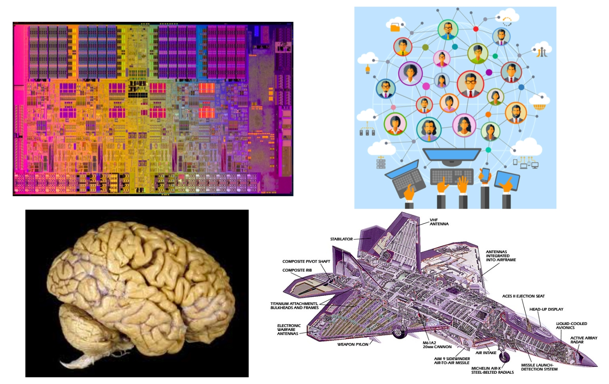

The image above shows a microprocessor, a human brain, an online social network, and a fighter jet. On the surface, you may think that these systems have nothing in common!

However, they all have some common fundamental properties:

1. Each of them consists of many autonomous parts, or modules – in the same way, that a large puzzle consists of many little pieces. The microprocessor, for example, consists of mostly transistors and interconnects. The brain consists of various cell types, including excitatory neurons, inhibitory neurons, glial cells, etc.
2. The parts of each system are not connected randomly or in any other trivial manner – on the contrary, the system only works if the connections between the parts are highly specific (for example, we would not expect an electronic device to work if its transistors were randomly connected). These interconnections between the system components define the architecture of the system – or in other words, the network representation of the system.
3. The interactions between connected parts are also non-trivial. A trivial interaction would be, mathematically, a linear relation between the activity of two parts. On the contrary, as we will discuss later in the course, in all interesting systems at least, these interactions are non-linear.

**To summarize, Complex Systems have:**

* Many and heterogeneous components
* Components that interact with each other through a (non-trivial) network
* Non-linear interactions between components

Next, we’ll discuss Trivial Networks versus Complex Networks.

### Trivial Networks Versus Complex Networks

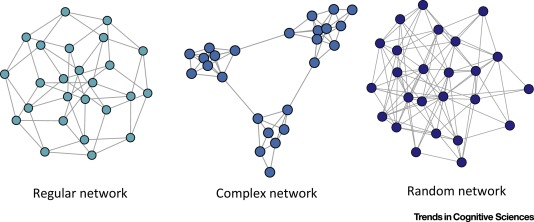
*Image Source: [Local Patterns to Global Architectures: Influences of Network Topology on Human Learning. Karuza, Thompson-Schill, Bassett; 2016](https://www.cell.com/trends/cognitive-sciences/fulltext/S1364-6613(16)30071-7)*

Trivial Networks also known as regular or random networks differ significantly from complex networks as the image above shows. 

**“Regular networks“** are a large family of networks that have been studied extensively by mathematicians over the last couple of centuries. Regular networks such as rings, cliques, lattices, etc, have the same interconnection pattern, the same structure, at all nodes. 

The example shown at the left in the image above is a regular network in which every node connects to four other nodes.

Another well-studied class of networks in graph theory is that of **“Random networks”**. Here, the connections between nodes are determined randomly. In the simplest model, each pair of nodes is connected with the same probability.

In practice, most technological, biological and information systems do **NOT** have a regular or random network architecture. Instead, their architecture is highly specific, resulting in interconnection patterns that are highly variable across nodes. 

For example, the network in the middle has several interesting properties that would not be expected if the network was randomly “wired”: note that there are three major clusters of nodes, few nodes have a much larger number of connections than others, and there are many connected three-node groups.

A major difference between network science and graph theory is that the former is an applied data-science discipline that focuses on complex networks encountered in real-world systems.

Graph theory, on the other hand, is a mathematical field that focuses mostly on regular and random graphs. We will return to the connection between these two disciplines later in this lesson.

### Example: The Brain of the C.elegans Worm

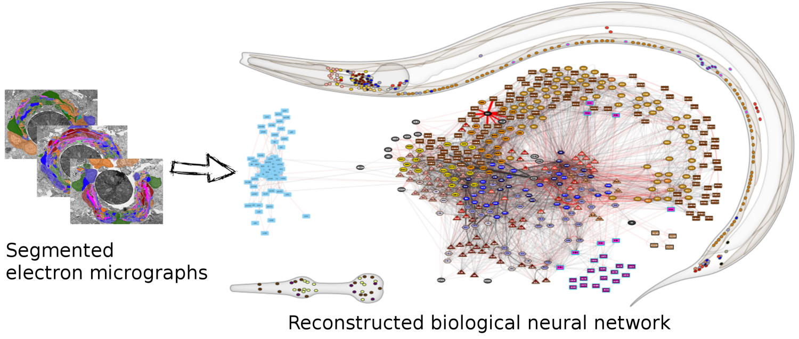
*(Image Source: [wormwiring.org](https://wormwiring.org/))*

To understand the relationship between a complex system and its network representation, let's focus on a microscopic worm called C.elegans.

This amazing organism, which is about 1mm in length, has roughly only 300 neurons in its neural system. Still, it can move in different ways, react to touch, mate, sense chemical odors, and respond to food versus toxins, etc. 

Each dot represents a neuron, and the location of every neuron at the worm’s body is shown at the top right. The connections between neurons, at the level of individual synapses, have been mapped using electron micrographs of tiny slices of the worm’s body. 

The network on the right in the image shows each neuron as a node and each connection between two neurons as an edge between the corresponding two nodes. Do not worry about the different colors for now – we will discuss this network again later in the course. The important point, for now, is that network science maps this highly complex living system into a graph -- an abstraction that we can analyze mathematically and computationally to ask a number of important questions about the organization of this neural system.

Note that this mapping from an actual system to a graph representation is only a model, and so it discards some information that the modeler views as non-essential. For instance, the network representation does not show in this example if a neuron is excitatory or inhibitory  -- or whether these connections remain the same during the worm’s lifetime. 

**So it is always important to ask:** does the network representation of a given system provide sufficient detail to answer the questions we are really interested in about that system?
  
### The Main Premise

We can now state the main idea, the main premise, of network science:

The network architecture of a system provides valuable information about the system’s function, capabilities, resilience, evolution, etc.

In other words, even if we don’t know every little detail about a system and its components, simply knowing the map or “wiring diagram” that shows how the different system components are interconnected provides sufficient information to answer a lot of important questions about that system.

Or, if our goal is to design a new system (rather than analyze an existing system), network science suggests that we should first start from its network representation, and only when that is completely done, move to lower-level design and implementation. 

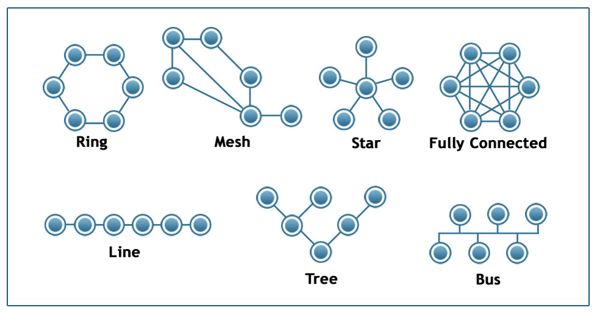
*Image Source: [techiereader.com](https://techiereader.com/category/networking/)*

Above, is an example to illustrate the previous point.

Even if you know nothing about the underlying system, what would you say about its efficiency and resilience under each of the following architectures?

Suppose that we are to design a communication system of some sort that will interconnect 6 sites. The first question is: what should be the network architecture? This figure shows several options. For example, the Ring architecture provides two disjoint paths between every pair of nodes. The Line, Tree, and Star architectures require the fewest number of links but they are highly vulnerable when certain nodes or edges fail. The Fully Connected architecture requires the highest number of links but it also provides the most direct (*and typically faster*) and resilient communication. The Mesh architecture  provides a trade-off between all previous properties.

### Examples of Systems Studied by Network Scientists

Skipped. Just some examples provided.

### Network Centrality

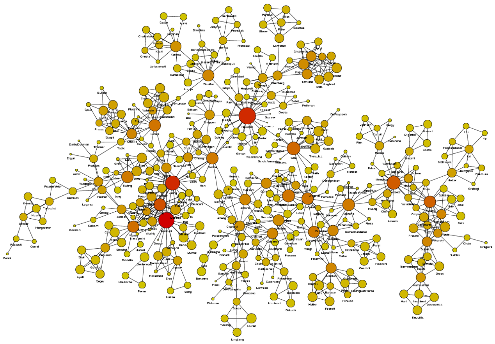
*Image Source: [University of Michigan](http://www-personal.umich.edu/~mejn/centrality/labeled.png)*

Above is an image that shows the co-authorship network for a set of Network Science researchers: each node represents a researcher and two nodes are connected if they have published at least one paper together.

A very common question in network science is: given a network representation of a system, which are the most important modules or nodes? Or, which are the most important connections or edges?

Of course, this depends on what we mean by “important” – and there are several different metrics that quantify the “centrality” of nodes and edges.

Sometimes we want to identify nodes and edges that are very central in the sense that most pairs of other nodes communicate through them.

Or, nodes and edges that, if removed, will cause the largest disruption in the underlying network. 

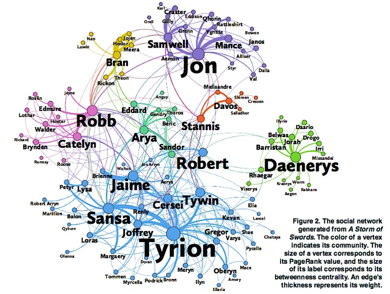
*Image Source: [The Measurement Standard, Carma](http://www.themeasurementstandard.com/wp-content/uploads/2016/04/network-of-swords.jpg)*

Two nodes are connected if the corresponding two characters interacted in that novel, and the weight of the edge represents the length of that interaction.

Two different node centrality metrics are visualized in this figure. The size of the node refers to a centrality metric called PageRank – it is the same metric that was used by Google in their first web search engine. The PageRank value of a node v does not depend simply on how many other nodes point to v, but also how large their PageRank value is and how many other nodes they point to.

The second centrality metric refers to a centrality metric called “Betweenness” and it is shown by the size of the node’s label. The Betweenness centrality of a node v relates to the number of shortest paths that traverse node v, considering the shortest paths across all node pairs. 

Both metrics suggest that Tyrion and Jon are the most central characters in that novel, even though they were not interacting yet.

**Source Links**
* [Finding community structure in networks using the eigenvectors of matricesLinks to an external site.](https://arxiv.org/abs/physics/0605087)

### Communities (Modules) in Networks

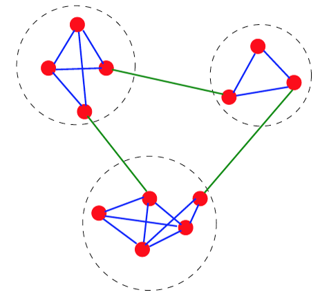

Another important problem in Network Science is to discover Communities – in other words, clusters of highly interconnected nodes. The density of the connections between nodes of the same community is much larger than the density of the connections between nodes of different communities. 

Returning to the previous Game of Thrones visualization, each color represents a different community – with a total of 7 communities of different sizes.

For those of you that are familiar with the book or TV show (mostly seasons 3 and 4), these communities make a lot of sense.  Up to that point in the story, Daenerys, for instance, was mostly interacting with the Dothrakis and with Barristan, while Jon was mostly interacting with characters at Castle Black.

There are many algorithms for Community Detection – and some of them are able to identify nodes that participate in more than one community. We will discuss such algorithms later in the course. 

### Dynamics of Networks

An important component of Network Science is the focus on Dynamic Networks – systems that change over time through natural evolution, growth or other dynamic rewiring processes.

For example, the brain’s neural network is changing dramatically during adolescence – but more recent research in neuroscience shows that brain connections also change when people learn something new or even when they meditate.

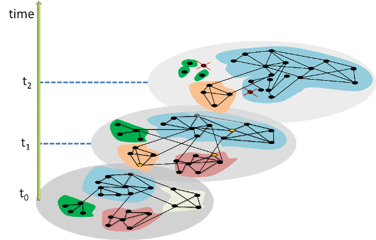
*The image above shows how the community structure of a network may be changing over time. (Image Source: [The University of Florida](http://www.cise.ufl.edu/~tdinh/)*

Note that the white and red communities are gradually absorbed by the blue and the green community gradually collapses.

We will study algorithms that can detect and quantify such dynamic processes in networks. 

Another important problem in Network Science is the study of Dynamic Processes on Networks. Here, the network structure remains the same – but there is a dynamic process that is gradually unfolding on that network. 

For example, the process may be an epidemic that spreads through an underlying social network.

For certain viruses, such as HIV, the state of each human can be one of the following: healthy but susceptible to the virus, infected by the virus but not yet sick, or sick (symptomatic).



The video above shows a simulation of the spread of the H1N1 virus over the global air transportation network. The H1N1 outbreak started in Mexico in 2009 and it quickly spread throughout the world mostly through air transportation.

An important question in Network Science: how does the structure of the underlying network affect the spread of such epidemics? 

As we will see later in the course, certain network properties enhance the spread of epidemics to the point that they can become pandemics before any intervention is possible. The only way to prevent such pandemics is through immunizations when they are available.

### Influence and Cascade Phenomena

The dynamic processes that take place on a network are often not physical. For example, ideas, opinions, and other social trends and hypes can also spread through networks – especially over online social networks.

We will study such influence or “information contagion” phenomena in the context of mostly Facebook and Twitter.

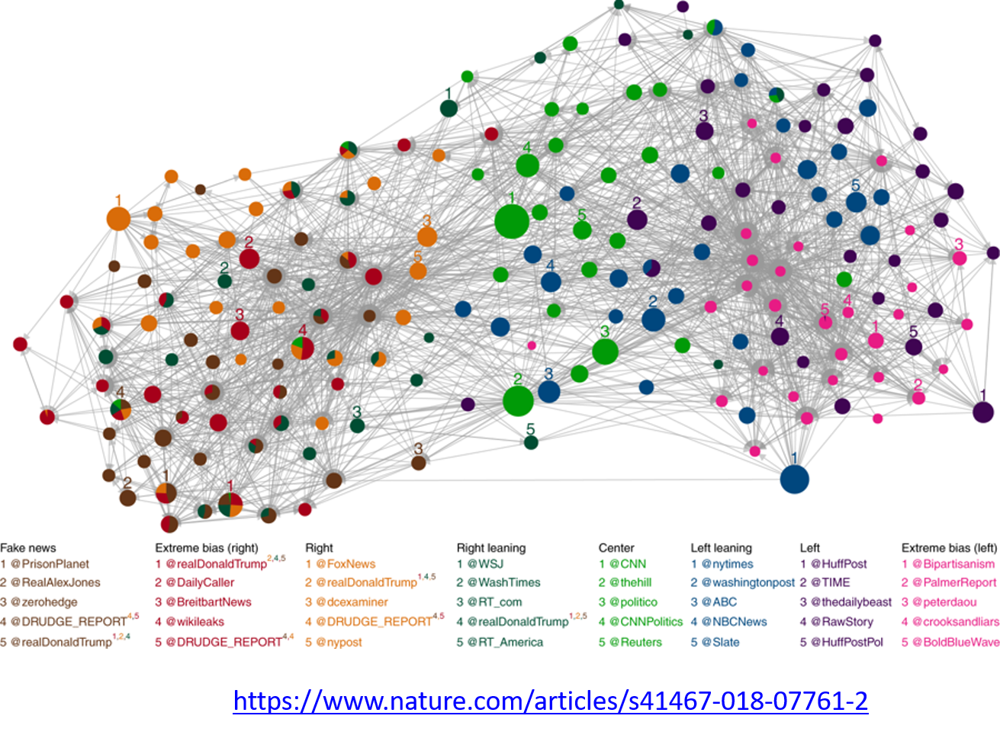
*Image Source: [Bovet, A., Makse, H.A. Influence of fake news in Twitter during the 2016 US presidential election. Nat Commun 10, 7 (2019)](https://www.nature.com/articles/s41467-018-07761-2)*

For example, the image above comes from a recent study focusing on the effect of misinformation (known as “fake news”) on Twitter in the 2016 US Presidential Elections.

The study used network science to identify the most influential spreaders of fake news as well as traditional news.

An important but still open research question is whether it is possible to develop algorithms that can identify influential spreaders of false information in real-time and block them.

**Source Links**
* [Influence of fake news in Twitter during the 2016 US presidential election](https://www.nature.com/articles/s41467-018-07761-2)
  
### Machine Learning and Network Science

We will also study problems at the intersection of Network Science and Machine Learning.

As you probably know, Machine Learning generates statistical models from data and then uses these models in classification, regression, clustering, and other similar tasks.

Network Science has contributed to this field by focusing on graph models – statistical models of static or dynamic networks that can capture the important properties of real-world networks in a parsimonious manner.

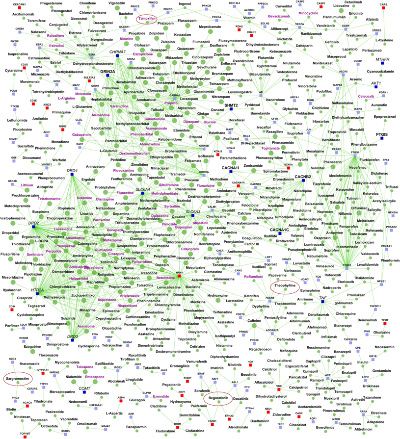
*Image Source: [Ganapathiraju, M., Thahir, M., Handen, A. et al. Schizophrenia interactome with 504 novel protein–protein interactions. npj Schizophr 2, 16012 (2016)](https://www.nature.com/articles/npjschz201612)*

The image above comes from a recent research paper about schizophrenia

It shows the interactions between genes associated with schizophrenia, and drugs that target either specific genes/proteins or protein-protein interactions. Machine Learning models have been used to predict previously unknown interactions between drugs and genes. 

The drugs are shown as round nodes in green, and genes as square nodes in dark blue, light blue or red. Nervous system drugs are shown as larger size green colored nodes compared with other drugs. Drugs that are in clinical trials for schizophrenia are labeled purple. You can explore the visualization interactively with the following link: [Schizophrenia interactome with 504 novel protein–protein interactions](https://www.nature.com/articles/npjschz201612/figures/6).

### The History of Network Science

Let's talk now, rather briefly, about the history of network science.

First, it is important to emphasize that the term “network” has been used for decades in different disciplines. 

For example, computer scientists would use the term to refer exclusively to computer networks, sociologists have been studying social networks for more than 50 years, and of course, mathematicians have been studying graphs for more than two centuries.

So what is new in network science?

---

Network Science certainly leveraged concepts and methods that were developed earlier in Graph Theory, Statistical Mechanics and Nonlinear Dynamics in Physics, Computer Science algorithms, Statistics and Machine Learning. The list below shows the key topics that each of these disciplines contributed to Network Science.

* **Graph theory:**
    * Study of abstract (mostly static) graphs
* **Statistical mechanics:**
    * Percolation, phase transitions
* **Nonlinear dynamics:**
    * Contagion models, threshold phenomena, synchronization
* **Graph algorithms:**
    * Network paths, clustering, centrality metrics
* **Statistics:**
    * Network sampling, network inference
* **Machine learning:**
    * Graph embeddings, node/edge classification, generative models
* **Theory of complex systems:**
    * Scaling, emergence

There are **two main differences** however between these disciplines and Network Science.

**First**, Network Science focuses on real-world networks and their properties – rather than on regular or random graphs, which are easier to analyze mathematically but not realistic. Most of the earlier work in graph theory or physics was assuming that networks have that kind of simple structure.

**Second**, Network Science provides a general framework to study complex networks independent of the specific application domain. This unified approach revealed that there are major similarities and universal properties in networks, independent of whether they represent social, biological or technological systems.

### The Birth of Network Science

The birth of Network Science took place back in 1998 or 1999, with the publication of two very influential research papers.

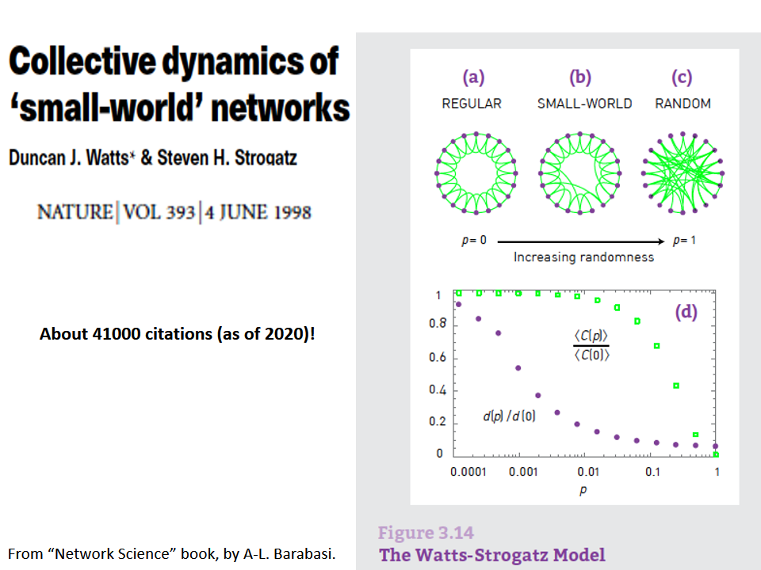

The **first** was the discovery by Watts and Strogatz of the Small-World property in real-world networks. Roughly speaking, this means that most node-pairs are close to each other, only within a small number of hops. You may have heard the term “six degrees of separation”, in the context of social networks, meaning that most people are connected with each other through a path of 6 (or so) acquaintances. 

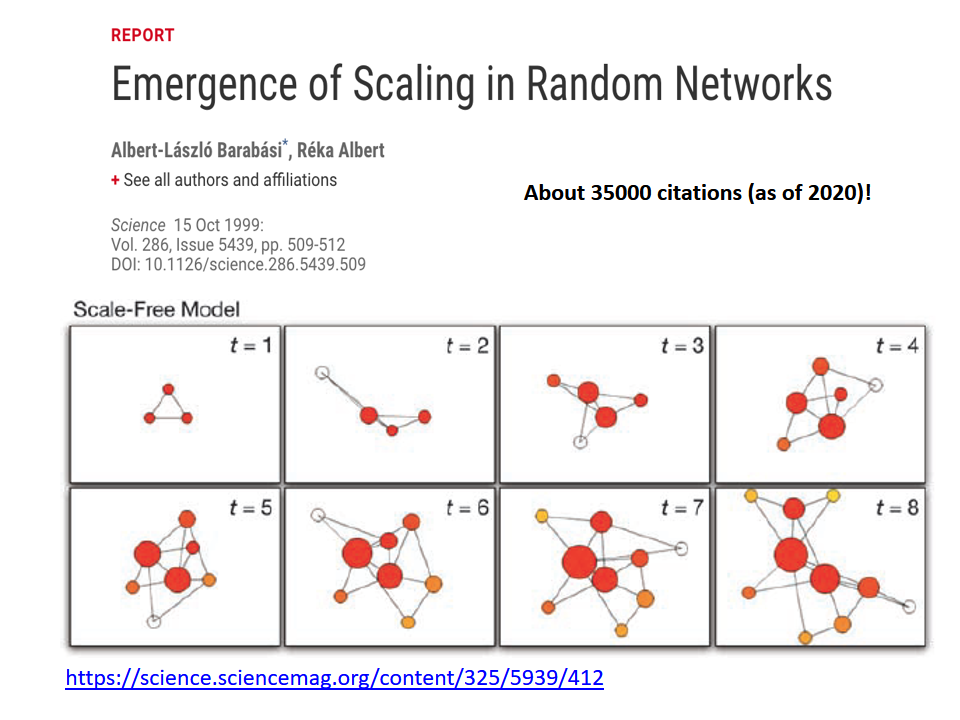

A **second** influential paper was published in 1999 by two physicists, Barabási and Albert.

That paper showed that real-world networks are “Scale Free”. This means that the number of connections that a node has is highly skewed: most nodes have a very small number of connections but there are few nodes, referred to as hubs, that have a much larger number of connections.  Mathematically speaking, the number of connections per node follows a power-law distribution – something that we will discuss extensively later in this course.

Barabási and Albert explained this general phenomenon based on a ”rich get richer” property. As a network gradually grows, new nodes prefer to create links to more well-connected existing nodes, and so the latter become increasingly more powerful in terms of connectivity. This is referred to as “preferential attachment” – and we will study it in detail later.

**Source Links**
* [Collective dynamics of ‘small-world’ networks](https://www.nature.com/articles/30918).
* [Emergence of Scaling in Random Networks](https://science.sciencemag.org/content/286/5439/509).

### TED Lecture: Albert-László Barabási


