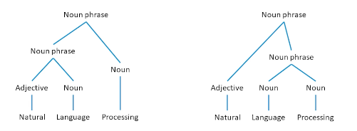
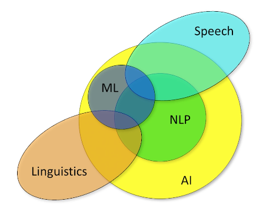

### Introduction to NLP

What is Natural Language Processing? 

* The set of methods for making human language accessible to computers
* The analysis or understanding (to some degree) of what a text means
* Generation of fluent, meaningful, context-appropriate text
* The acquisition of the above from knowledge, and increasingly, data

So if NLP is algorithms but what then is natural language? 

* A structured system of communication (sharing information) that has evolve naturally in humans through use and repetition without conscious planning for premeditation. 
* Humans discovered that sharing information could be advantageous
  * Initially through making sounds to which a mutually understood meaning was ascribed
  * Later: markings
* Language is thus an agreed-upon protocol for moving information from one person's mind to another person's mind

Now, we have evolved to more than just one language. 
* Different groups coalesced around different systems, English, Spanish, Sign Language etc. 
* Each has its own structure that we humans learn
* Each has "rules" though often not well-defined or enforced
* Syntax: The rules for composing language
* Semantics: The meaning of the composition

Characteristics of languages - Lossy But efficient (Can omit information / have errors but message is still conveyed)
* As an example "For Sale: baby shoes, never worn"

### Non-Natural languages

* Languages that are deliberately planned
* Generally have well-defined rules of compositions
* E.g python, javascript, c++
* Syntax structured so as to eliminate any chance of ambiguity
  
For this course we are not going to focus on non natural languages.

What does it mean to say "I understand" or "know" a language?

* I know English
  * I can produce english and affect change on others
  * I can receive english and act reasonably in response
* For example Does a 3 year old know english? (To an extent)
* Does a dictionary know english? (Encompass it but does not operationalize it)
* What to tell a computer so it understands english as well as a 3 year old? 
* As well as an adult? 
* What about a computer? How much do they need to know or understand? 

Overall:

* We do not really have a definition of what it means to "understand" a language
* We have powerful algorithms that can imitate human language production and understanding
* NLP is still very much an open research problem
* Next, we will look at some of the applications of NLP and why human languages are so tricky for computers

### Why Do We Want Computers To Understand Languages?

About human computer interaction.
* Want to affect change on computers without having to learn a specialized language.
* Want to enable computers to affect change on us without having to learn a specialized language
  * Error messages
  * Explanations

A large portion of all recorded data is in natural language, and produced by humans for the consumption by humans.
Natural language is also inaccessible to computational systems, and by doing so, it open up a few applications:

* Detect patterns in text on social media
* Knowledge discovery
* Dialogue
* Document Retrieval
* Writing assistance
* Prediction
* Translation

### WHy is NLP hard?

* Multiple meanings: bank, mean, ripped (e.g mean is the average? or someone is being mean?)
* Domain specific meanings: Latex (Latex allergy, writing papers)
* Assemblages
* Words assemblages: Take out, drive through
* Portmanteaus: Brunch, scromit (screaming while vomiting, lunch+breakfast)
* Metaphor (Burn the midnight oil, i don't give a rat's ass)
* Non-literal (Can you pass the salt)
* New words (covid, droomscrolling, truthiness, amirite, yeet, vibe shift)
  
Other reasons why they are hard:
* Syntax is the rules of composition
* Grammar: The recognition that parts of sentence have different roles in understanding
* Syntactic ambiguity 

{: width='400' height='400'}
 

The left tree in the means the processing of natural languages which is exactly what we want computers to be able to do. Now let's take the exact same phrase, but to put language and processing together into a noun phase, and add adjective to that, now I have language processing, which is natural, which is what humans do but does the exact opposite of what we want computers to do. 

Other examples:

* We saw the woman with the sandwich wrapped in paper
  * What was wrapped in paper? The sandwich or woman?
* There is a bird in the cage that likes to talk
* Miners refuse to work after death. 

### Probability and statistics  

Brief relationship:

{: width='400' height='400'}

Two important mathematical and algorithmic tools. The first way is to use **probability and statistics**. why?

Take for example these two statement about movie reviews, are they positive or negative?

* This film doesn't care about cleverness, wit, or any other kind of intelligent humor
* There are slow and repetitive, but it has just enough spice to keep it interesting. 

We can recast this as a probability statement; what is the probability that the review is positive?

* $Prob(positive\\_review \lvert w_1, w_2, ..., w_n)$
* $Prob(positive\\_review \lvert \text{"there","are","slow", "and", "repetitive", "parts"})$
* What is the probability that we see the word "repetitive" in a positive review? 

We can do the same about text generation, e.g 

* Once upon a time _________
* $P(w_n \lvert w_1, w_2, ..., w_{n-1})$

The other tool we have is **deep learning**.

* A significant portion of the state of the art in NLP is achieve using a technique called deep learning
* a class of machine learning algorithms that use chains of differentiable core modules to learn from data a function that maps inputs to outputs $f(x) \rightarrow y$
* Sentiment classification
  * $x$ = input words
  * $y$ = positive, negative labels
* Text generation, $x$ is input words, $y$ is successor word.
* words are everywhere -- dialogue, document analysis, document retrieval, etc. Needs to be able to process natural language.
* Human languages, which are easy for us, make communication non-trivial for computers
  

<!--  -->