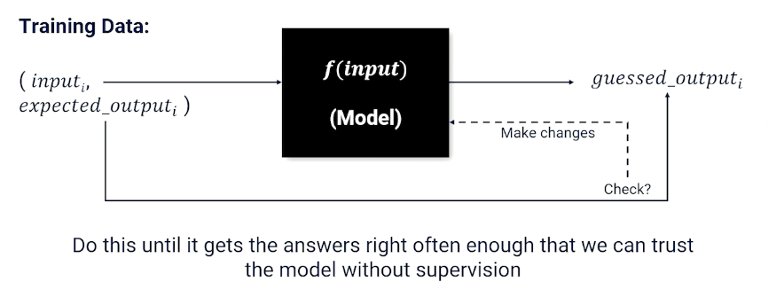

### Random Variables

A placeholder for something we care about.
* Random variables can hold particular values
  * BEARD <True, False>
  * Car <Sedan, coupe,suv, pickup, van>
  * Temperature <-100, ... + 100>
  * Word <a,an, ... zoology>

A random variable comes with probability distribution over values. e.g
* P(Beard) = <0.6, 0.4>

Likewise for temperature, it can be a continuous so it will be a curve.
For words the probability will very sparse.

In NLP, What is the probability that i am in a world in which X has a particular value? What is the probability that I or my AI system is in a world in which some variable X has a particular value?

Do note the notations, $P(X=x) = 0.6$ represents the probability of $X=x$, versus $P(X)$ which is asking for distribution.

### Complex Queries

* Marginal: $P(A) = \sum_b P(A \lvert B=b)$
* Union: $P(A \cup B) = P(A) + P(B) - P(A \cap B)$
* Conditional: $P(A \lvert B) =\frac{P(A \cap B)}{P(B)}$

### Full Joint distribution

When you have more than one random variable, the full joint distribution describes the possible worlds.
* P(NINJAS,SHADOWS, NOISES) is a full joint distribution

{: width='400' height='400'}

So from the table, about 0.576 of the time, there are no ninjas, no shadows nad noises but also 0.008 where there is a ninja without making any noise and no shadows. So there are a total of $2^3=8$ worlds and note that the probabilities **must** sum up to one. 

So once you have this table, then it is very easy to compute any distributions by looking up. If you are only interested in subset cases, e.g ninja and shadow, then you can do so by summing up marginally. 

{: width='400' height='400'}

For example the green box is the sum where ninja is present.

Likewise for another case where you want to know where ninjas or shadows exist:

{: width='400' height='400'}

Again, random variables are things that we care about and want our AI systems to account for. We don't know the value of the random variables but we know the probability of seeing each possible value. We can compute the probability of any combination of values for a set of random variables (probability of being in different possible words). Sometimes we know how some probabilities will change in response to other variables, called conditional probabilities. 

### Conditional Probabilities

We are more likely to care about the probability of value of a random variable GIVEN something else is believed to be true. 

* What is the probability of ninjas given I see shadows?


{: width='400' height='400'}


So e.g $P(ninja \lvert shadows) = \frac{P(ninja \cap shadows)}{P(shadows)}$

Generally, we refer to such things as $P(Y \lvert E = e)$ where $e$ denotes the evidence while $Y$ is the query.

$$
\begin{aligned}
P(Y=y \lvert E=e) &= \frac{P(Y=y \cap E=e)}{P(E=e)} \\
&= \alpha P(Y=y, E=e)
\end{aligned}
$$

Under normal literature, $\frac{1}{P(E=e)}$ is called the normalization constant $\alpha$. This has to do with the marginalization of probabilities.

### Hidden Variables

Conditional probability query doesn't always reference all variables in the full joint distribution. 

For example,consider $P(Y=y \lvert E=e)$, then if there are more than 2 variables, $P(Y=y \lvert E=e)$ is a partial joint distribution. We can convert it to a full distribution as follows:

$$
P(Y=y \lvert E=e) = \alpha \sum_{x \in H} P(Y=y, E=e, H=x)
$$

In other words, iterate over all possible H (hidden) values.

Note that you can do it multiple times:

$$
P(Y=y \lvert E=e) = \alpha \sum_{x_2 \in H_2} \sum_{x_1 \in H_1} P(Y=y, E=e, H_1 = x_1, H_2=x_2)
$$

### Variable Independence And Product Rule

This is to serve as an introduction to bayesian networks.

Two random variables A and B are independent if any of the following are true:
* $P(A \lvert B) = P(A)$
* $P(B \lvert A) = P(B)$
* $P(A,B) = P(A)P(B)$

Product rule allows us to change any joint distribution between variables and turn it into a conditional probability. 

$$
\begin{aligned}
P(A=a,B=b) &= P(A=a \lvert B=b) P(B=b) \\
&= P(B=b \lvert A = a) P(A=a) \\
\end{aligned}
$$

And using the equation above, gives us the **bayes rule**.

$$
\begin{aligned}
P(A =a \lvert B=b) &= \frac{P(B=b \lvert A=a)P(A=a)}{P(B=b)} \\
&= \alpha P(B=b \lvert A=a)P(A=a)
\end{aligned}
$$

### Bayes Rule With Multiple Evidence Variables

What if I have multiple evidence variables $e_1, e_2$

$$
\begin{aligned}
P(Y=y \lvert E_1,=e_1, E_2 = e_2) &= \alpha P(E_2 = e_2 \lvert Y=y,E_1=e_1)P(Y=y , E_1 = e_1) \\
&= \alpha P(E_2 = e_2 \lvert Y=y,E_1=e_1) P(E_1 = e_1 \lvert Y=y) P(y=y)
\end{aligned}
$$

The first step is making use of bayes rule, while the second step is making use of product rule. 

Bayes is particularly useful because we are going to run into lots and lots of situations out in the real world where we often have something called a **cause and effect** between random variables. 

A lot of problems have the form $P(CAUSE \lvert EFFECT)$
* The cause is usually something that is unobservable, so I want to know what has caused something that I cannot directly observe given that it has some effect on the world that I can observe. 
  
To give an example, such as medical diagnosis $P(COVID \lvert ANOSMIA)$,
what is the probability that someone has covid given some of the effects of covid.
Anosmia is the loss of smell. To rephrase, how do we detect someone has covid without testing, can we estimate it based on something that is easy to observe?

$$
P(Covid = true \lvert Anosmia = True) = \alpha P(A = True \lvert C = True) P(C = True)
$$

The interesting bit is when the effects are independent, then we arrive at the generalized bayes model:

$$
P(Cause|E_1,...,E_n) = \alpha P(Cause)P(E_1 \lvert Cause)P(E_2 |Cause) \cdots P(E_n \lvert cause)
$$

There is the naive bayes assumption, that effect variables are always independent or their casual effects are small to be negligible. 

### Language Example

Given a target word $W_T$, if we find out the probability 
whether it exists in a sentence of words $w_1, ..., w_n$, then:

$$
P(W_T = 1 \lvert w_1,...,w_n) = P(W_T=1)\prod_i^n P(w_i | W_T = 1)
$$

### Bayesian networks

Bayesian network is just a way of visualizing the casual relationship between random variables. Recall that the cause is usually unobservable - the one we care about but cannot directly observe. 

{: width='400' height='400'}

nodes are connected when they have a conditional non independent relationship. So each of effect variables is conditioned on the cause and each of the effects have no edges denoting they are independent.

$$
P(X_1, X_2, ...) = \prod_i^N P(X_i \lvert Parents(X_i))
$$

* You don't ever have the full joint distribution, but:
* You must have a conditional probability distribution for each arc in the bayes net. 

Example:

{: width='400' height='400'}

What if we have a missing variables? then we can use the hidden variables:

{: width='400' height='400'}

### Documents Are Probabilistic Word Emissions

Another example using movie sentiment instead:

{: width='400' height='400'}

Imagine we have a document, it has an underlying sentiment, and what is doing is spitting out words.
If I have a positive sentiment, I am going to spit out more words like good, great, fun etc, and spit out fewer words like bad into this document, and vice versa. 

So, whether the word is present in the document which is something directly observable is conditioned on what the underlying unobservable sentiment of that document. 

### Supervised Learning

Mainly a review of Neural Networks and Deep learning as well as supervised learning.

{: width='400' height='400'}

Supervised learning is to learn a function from a training set of data consisting of pairs of inputs and expected outputs. 

{: width='400' height='400'}

### Neural Network And Nodes

{: width='200' height='200'}

Mainly talking about nodes representing the gating function, and edges represented weight. The gating function is also known as the activation function such as :

* sigmoid $\sigma(x) = \frac{1}{1+e^{-x}}$
* Tanh
* reLU

### Gradient Descent

Remember how to update each weights can be done by gradient descent, which is dependent on the loss function, and ideally we have 0 loss.

Example of loss functions (the are others but lecturer did not mention them):

* MSE : $(y-\hat{y})^2$

So we can see how the weights will affect the loss and use the gradient to update the weights to minimize our loss.
The steps is skipped but just know that the gradient of each weight is a function of the incoming activation values and the weight applied to each incoming activation value, applied recursively. 

$$
\begin{aligned}
\frac{\partial L(target_k, output_k)}{\partial w} &= \frac{\partial L(target_k, \sigma (in_k))}{\partial w} \\
&= \frac{\partial L(target_k, \sigma (\sum_j w_{jk}out_j))}{\partial w} \\
&= \frac{\partial (target_k - \sigma (\sum_j w_{jk}out_j))^2}{\partial w}
\end{aligned}
$$

(Feel free to study back propagation yourself).

In summary:

* Neural Networks are function approximators
* Supervised Learning: given examples and expected responses
* Need to know how to measure the error/loss of a learning system
* The weights of neural network combined with loss create a landscape
* Gradient descent: Move each weight such that overall loss is going downhill
* Each weight adjustment can be computed separately allowing for parallelization using GPU(s)

### Modern Deep Learning Libraries

There are other libraries like keras, tensorflow and pytorch. This course is going to focus on pytorch.

* Neural network is a collection of "modules"
* Each module is a layer that store weights and activations (if any)
* Each module knows how to update its own weights (if any)
* Modules keep track of who passes it information (called a chain)
* Each module knows how to distribute loss to child modules
* Pytorch supports parallelization on GPUs

Example of a neural network broken down into layers:

{: width='400' height='400'}

### Pytorch Model Example

Note that we have `init` to define the layers (in the above image),and we can define how the layers are link with the `forward` method.

```python
class BatClassifier(nn.Module):
  def __init__(self):
    self.linear1=nn.Linear(5,3)
    self.sig2=nn.Sigmoid()
    self.linear3=nn.Linear(3,5)
    self.sig4=nn.Sigmoid()
    self.linear5=nn.Linear(5,1)
    self.sig6=nn.Sigmoid()
  def forward(self,x):
    inter1 = self.linear1(x)
    inter2 = self.sig2(inter1)
    inter3 = self.linear3(inter2)
    inter4 = self.sig4(inter3)
    inter5 = self.linear(inter4)
    y_hat = self.sig6(inter5)
    return y_hat

# To predict
model = BatClassifier()
y_hat = model(x)
```

In pseudo code for training the model, we just need to define the loss function and call `backward()`. 

```
# To train
model = BatClassifier()
foreach x,y in data:
  y_hat = model(x)
  loss = LossFn(y_hat,y)
  loss.backwards()
```

* Pytorch and other modern deep learning APIs make it easy to create and train neural networks
* Getting the data is often the bottleneck
* Specific design of the neural network can be somewhat of a black art
* Pytorch can push data and computations to GPUs, allowing for parallel processing, which can greatly speed up training
* Parallelization is one of the reasons why neural networks are favored function approximators.

<!--  -->