### Introduction to Classification

Examples of classifications: Bayesian, Binary, Multinomial classification.
It is important to understand classification because many topics in NLP can be considered as a classification problem.

* Document topics (news, politics, sports)
* Sentiment classification
* Spam detection
* Text complexity
* Language / dialect detection
* Toxicity detection
* Multiple-choice question answering
* Language generation

### Features of classification

|Inputs|Outputs|
|:--|:--|
|word, sentence, paragraph, document|a label from a finite set of labels|

* Classification is a mapping from $V^* \rightarrow \mathcal{L}$ 
  * $V$ is the input vocabulary, a set of words 
  * $V^*$ is the set of all sequence of words
* $X$ is a random variable of inputs, such that each value of $X$ is from $V^*$.
  * X can take on the value of all possible text sequences
* $Y$ is a random variable of outputs taken from $\ell \in \mathcal{L}$
* $P(X,Y)$ is the true distribution of labeled texts
  * The joint probability wit hall possible text document and all possible labels
* $P(Y)$ is the distribution of labels
  * irrespective of documents, how frequently we would see each label

The problem is we don't typically know $P(X,Y)$ or $P(Y)$ except by data.
* Human experts label some data
* Feed data to a supervised machine learning algorithm that approximates the function $classify: V^* \rightarrow \mathcal{L}$
* Did it work? Apply $\textit{classify}$ for some proportion of data that is withheld for testing

An additional source of problem is $V^*$ is generally considered unstructured.
* Supervised learning likes structured inputs, which we call **features** ($\phi$)
* Features are what the algorithm is allowed to see and know about
* In a perfect world, we simply throw away all unnecessary parts of an input and keep the useful stuff. 
  * However, we don't always know what is useful
  * But we often have some insight - feature engineering; have a way of breaking down the unstructured data to be something more useful.

### Bag of words

In bag of words,
* Features are word presence
* Discard word order 
* $\phi$ = \{ a , the, acting, great, good, plot, ...\}
  * When these words are alone, we call them unigrams, and in pairs will be bigrams, trigrams and so on.   
* $x$ is a d-dimensional vector of Features
* Bag of words can also be word frequency instead of word presence. e.g $\phi_{the} = 2, \phi_{was} = 2$
* Other definitions are possible as well. 

With that,

* A feature vector $\phi(x) \in \mathbb{R}^d$
  * Example = $[1, 2, 2, 1, 1, 0, 0, 1, \cdots, 0]$
* Every input $x$ is a point in $d$-dimensional space

So if you imagine if every document can be represented in 2 dimensional space, then document can be represented as a vector based on its features:

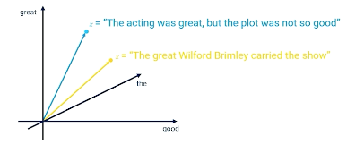{: width='400' height='400'}

Then we can start to do things like classifications, similarity etc.
* Features are what we select for an algorithm to operate on
* Good feature sets lead to good algorithm performance.
* Bad feature set leads to degraded algorithm performance

### Bayesian Classification

Probabilistic approach to guessing the label that accompanies a text (sentence, document),
an example as follows where we are trying to find the label or the sentiment of the document:

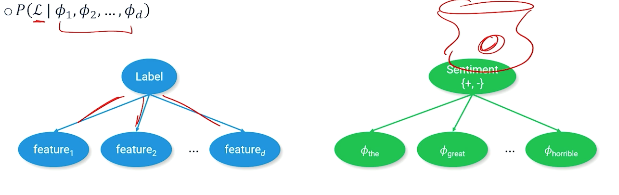{: width='400' height='400'}

Apply The Bayes equation:

$$
P(\mathcal{L}\lvert \phi_1,\phi_2,\phi_3,...,\phi_d) = \frac{P(\phi_1,\phi_2, ..., \phi_d \lvert \mathcal{L}) P(\mathcal{L})}{P(\phi_1,\phi_2,...,\phi_d)}
$$

But this equation is very complicated, we can apply the naive bayes assumption - words features are independent of each other:

$$
\frac{P(\phi_1 \lvert \mathcal{L})P(\phi_2 \lvert \mathcal{L})...P(\phi_d \lvert \mathcal{L})P(\mathcal{L})}{P(\phi_1)P(\phi_2)...P(\phi_d)}
$$

An example:

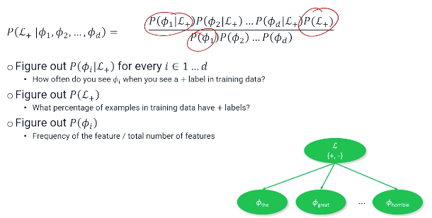{: width='400' height='400'}

Can you can also do the same for the negative label:

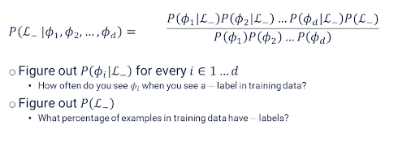{: width='400' height='400'}


Ultimately, we still need to turn these probabilities into a classification. 
One way is to see whether:

$$
P(\mathcal{L+}\lvert \phi_1,\phi_2,\phi_3,...,\phi_d) > P(\mathcal{L-}\lvert \phi_1,\phi_2,\phi_3,...,\phi_d)
$$

We can set $\alpha = \frac{1}{P(\phi_1)P(\phi_2)...P(\phi_d)}$ to ignore the denominator which makes things easier to compute (and also often safe to ignore the denominator in NLP).

In summary:
* Bayesian model sees text as a latent (unobservable) phenomenon that emits observable features.
* The frequency of which these observable features appear in the text is evidence for the label. 
* Learning the bayesian model means filling in the probability distributions from the co-occurrence of features and labels. 
* If unigrams don't give good results, try bigrams or trigrams.

However these comes with limitations; we might want to apply some ML in the future where some of these features are really important to the classification and be able to assign particular weights to those features, possibly even negative weights to say these things might be statistically related to a particular label but actually generally want to think of them as harmful to a particular classification. So the ability to have negative features instead of just every feature being positive with a low or high probability. 

### Log Probabilities And Smoothing

Two problems:
* Multiplying probabilities makes numbers very small very fast and eventually floating point precision becomes a problem.
* sometimes probabilities are zero and multiplying zero against other probabilities makes everything zero.

To manage the first problem: shift to **log scale**.
For instance, $log(1)=0, log(0) = -\infty$. Now we do not have to worry about numbers zeroing out (through small probabilities can become very large).

Also, changing to log scale now, we sum things up instead of multiplying them. 

* $P(A)P(B) \rightarrow = log P(A) + log P(B)$
* $\prod P(\phi_i) = sum P(\phi_i)$
* $\frac{P(A)}{P(B)} = log P(A) - log P(B)$

For the second problems, zeros can still appear. Suppose "cheese" is a feature but never appears in a positive review, then the conditional probability will be 0 irregardless of the features values ; which also affects our normalization constant $\alpha$. 

To solve this, modify the equation so that we never encounter features with zero probability by "pretending" that there is a non zero count of text by adding 1 to the numerator and denominator:

$$
P_{smooth} (\phi_i) = \frac{1+count(\phi_i)}{1+\sum count(\phi_i)}
$$

We call this technique "smoothing", naturally this introduces a small amount of error, but it usually does not affect the classification outcome because the error is applied uniformly across all features.

### Binary Logistic Regression

A small recap:

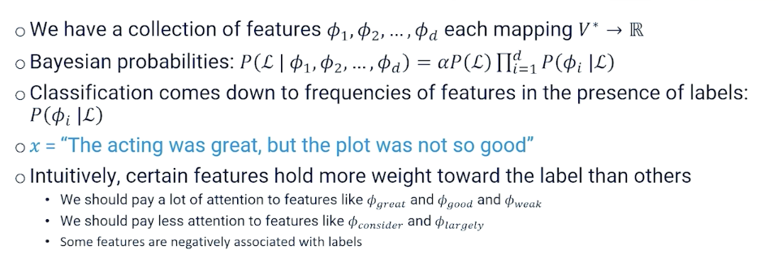{: width='400' height='400'}

In logistic regression, we have a set of coefficients:

* $\theta_1, ..., \theta_d, \theta_i \in \mathbb{R}$
* Also called weights or parameters
* If you set the coefficients just right, you can design a system that gets classification correct for a majority of inputs.
* But you need to learn them.

On top of this, you need:

* Binary labels $\mathcal{L}$
* A scoring function $score(x; \theta) = \sum \theta_j \phi_j(x)$
  * This can be re-written in matrix form: $ \mathbf{\theta^T \phi}(x)$
* Then we can have $classify(x) = sign(score(x;\theta))$

How to learn the weights?
* Probabilistically $P(Y=+1 \lvert X = x; \theta) = f(score(x;\theta))$
* $f$ converts score into a probability distribution $[0,1]$
* An example of $f =\sigma$ the sigmoid function (aka logistic function)
* So the sigmoid will return a +1 or -1 whether it is less than 0.5 (or any cut off)

### Parameter Learning

Learn the optimal set of parameters $\theta^*$ such that the score function produces the correct classification for every input $x$:

$$
\begin{aligned}
\theta^* &= \underset{\theta \in \mathbb{R}^d}{argmax} \prod_{i=1}^n P(y=y \lvert X=x_i ; \theta) \\
\theta^* &= \underset{\theta \in \mathbb{R}^d}{argmax} \sum_{i=1}^n log P(y=y \lvert X=x_i ; \theta) \\
\theta^* &= \underset{\theta \in \mathbb{R}^d}{argmin} \sum_{i=1}^n - log P(y=y \lvert X=x_i ; \theta) \\
\end{aligned}
$$

Recall that $P(Y=y \lvert X=x ; \theta) = \sigma(y\cdot score(x;\theta))$ and $\sigma = (1+e^{-x})^{-1}$

$$
\begin{aligned}
\theta^* &= \underset{\theta \in \mathbb{R}^d}{argmin} \sum_{i=1}^n - log \sigma(y\cdot score(x_i;\theta)) \\
\theta^* &= \underset{\theta \in \mathbb{R}^d}{argmin} \sum_{i=1}^n log (1+exp(-y_i \cdot score(x_i ;\theta))) \\
\theta^* &= \underset{\theta \in \mathbb{R}^d}{argmin} \sum_{i=1}^n log (1+exp(-y_i \cdot \mathbf{\theta^T \phi}(x_i))) \\
\end{aligned}
$$

### Parameter Learning With Neural Networks

Consider the case of a 1 layer neural network:
* Sigmoid at the head to produce a probability close to 1 or close to 0
* Target is $\{0,1\}$ instead of $\{-1,1\}$

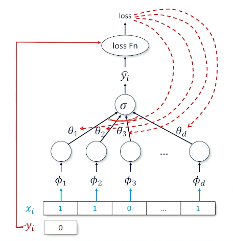{: width='200' height='200'}

* Recall $loss(\hat{y},y) = log(\sigma(y\cdot \hat{y}))$
* Multiplies the score $(\hat{y})$ by target $y=\pm 1$ before sending it through sigmoid then log
* So, to start thinking about this we are going to use another tool box called **binary cross entropy** which ia standard loss function:

$$
loss (\hat{y},y) = -[y \cdot log(p(\hat{y})) + (1-y) \cdot log ( 1- p(\hat{y}))]
$$

Cross entropy means when when y is true, you want $log(p(\hat{y}))$ to be high and vice versa. 

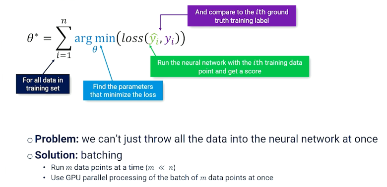{: width='400' height='400'}

The last thing to talk about is batching, which is just splitting up the data and loading it. 

### Training

So the entire training looks like this:

```
initialize θ
For t = 1 to max_epochs:
 For b = 0 to num_batches:
  batch = data[b*m:(b+1)*m]
  y_hats = f(batch_xs; θ)
  L = loss(y_hats, batch_ys)
  θ =  θ - α(∂L/∂θ)
```

Note that $\alpha$ refers to the learning rate which is usually a hyperparameter, too low and not learn anything and too high you "overshoot" and not converge.

### Multinomial Logistic Classification

Suppose we have more than 2 labels, $k$ labels $\mathcal{L} = \{\ell_1, ..., \ell_k\}$

* Set of features $f_j : V^* \times \mathcal{L} \rightarrow \mathbb{R}$
* $k \times d$ input-output parameters
  * $k$ is the number of labels
  * $d$ is the number of features
* for document $x$ with label $y$, iterate through all labels and all features and set $f_{\ell, \phi}(x,y)$ if feature $\phi$ and label $\ell$ are in the document
* What we have:
  * A set of $k$ labels $\ell_1, ..., \ell_k$
  * A collection of $m$ input-output features $f_1(x,y),...,f_m(x,y)$
  * Parameters for every input-output features $\theta_1,...,\theta_m$

$$
score(x,y;\theta) = \sum_i^m \theta_i f_i(x,y)
classify(x;\theta) =\underset{y\in \mathcal{L}}{argmax}(score(x,y;\theta))
$$

* We are going to want to turn the score into probability
* Previously we have used sigmoid $\sigma$
* But sigmoid only works for a single comparision, so, what can we do?

### Softmax

* Need a new tool that can take arbitrary many inputs : Softmax
* Softmax takes a vector of numbers and makes one close to 1 and the rest closes to 0, with the vector summing up to 1

$$
softmax(x_i) = \frac{e^{x_i}}{\sum_j e^{x_j}} = \alpha e^{x_i}
$$

* Exponential to make big numbers really big and small numbers really small 

### Multinomial Logistic Classification As Probability

We want a probability distribution over labels in a document 

$$
P(Y \lvert X=x ; \theta) = softmax([score(x,y_1;\theta),...,score(x,y_n;\theta)])
$$

And one of this numbers will nbe close to 1 and the rest are going to be close to 0. 

If we are interested in a specific label, then we can simply calculate $P(Y = \ell \lvert X=x;\theta)$

$$
\begin{aligned}
P(Y=\ell \lvert X = x ; \theta) &= \frac{e^{score(x,\ell ; \theta)}}{\sum_{\ell'}e^{score(x,\ell' ; \theta)}} \\
&= \frac{e^{score(x,\ell ; \theta)}}{z(x;\theta)}
\end{aligned}
$$

$z(x;\theta)$ is what makes multinomial logistic regression computationally expensive - to compute the probability even for a single label, you need to calculate / sum across all labels and normalize. 

### Multinomial Logistic Classification: Parameter Learning

We start from the same equation as before,

$$
\begin{aligned}
\theta^* &= \underset{\theta}{argmin} \sum_{i=1}^n - log P(y=y \lvert X=x_i ; \theta) \\
\theta^* &= \underset{\theta}{argmin} \sum_{i=1}^n - log \bigg[  \frac{exp(score(x,y_i ; \theta))}{z(x;\theta)} \bigg] \\
\theta^* &= \underset{\theta}{argmin} \sum_{i=1}^n - log (exp(score(x,y_i ; \theta))) + log {z(x;\theta)} \\
\theta^* &= \underset{\theta}{argmin} \sum_{i=1}^n - score(x,y_i ; \theta) + log {z(x;\theta)} \\
\end{aligned}
$$

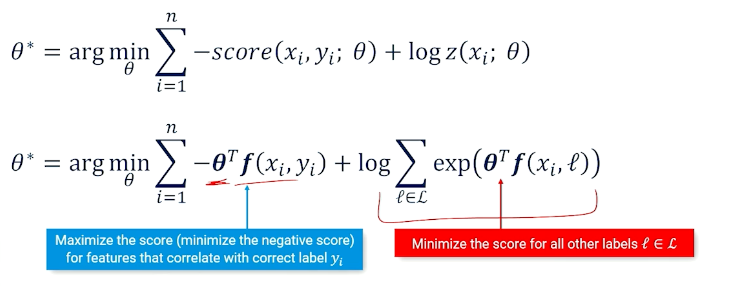{: width='400' height='400'}


* Find the parameters that push up the score for the correct label but push down the score for all other labels
* Otherwise, one can just win by making parameters $\infty$

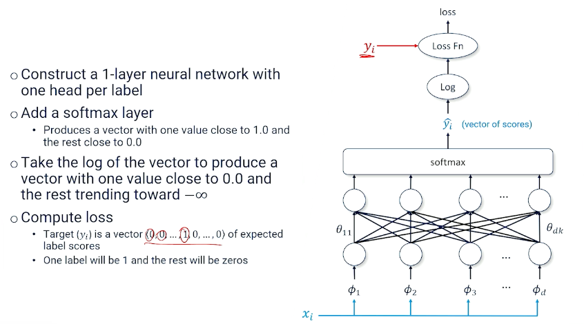{: width='400' height='400'}

So, the output is a vector of predicted log scores, and vector of target values, and we can multiply them together:

In summary, this is also known as the negative log likelihood loss, so we can have the predicted log scores, vector of target values and we can multiply them divided by the sum, and taking the negative: 

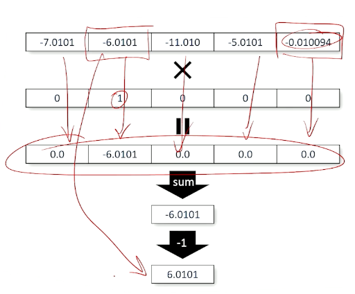{: width='400' height='400'}

### Multinomial Logistic Classification: Neural Net Training

The same as before:

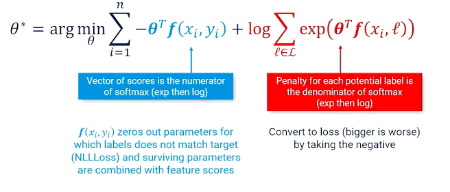{: width='400' height='400'}

So now the $f$ is more complicated and the loss is the negative log likelihood.

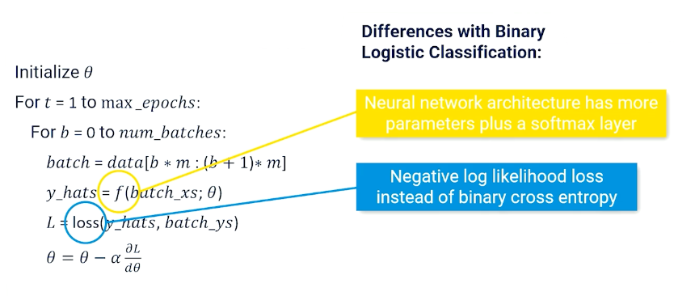{: width='400' height='400'}

Note, in typicals APIs the cross entropy loss module combines the softmax, log and negative log loss together. 

* [Example in pytorch for cross entropy loss](https://pytorch.org/docs/stable/generated/torch.nn.CrossEntropyLoss.html)

### Multilayer Classification Networks

More layers in a neural network can approximate more complex functions. So you can still take the binary logistic classifier or multiple classifications and add more layers. 

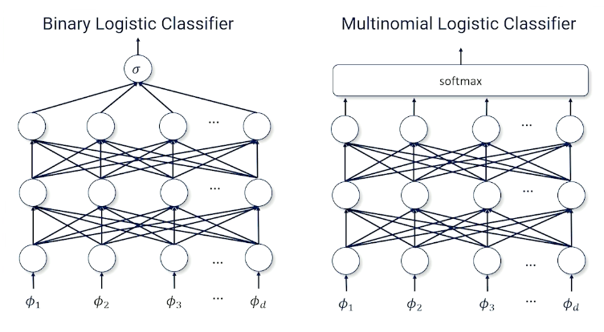{: width='400' height='400'}

So this also opens up/allow more sophisticated neural network architectures such as LSTM, Transformers etc. 

<!--  -->