### Language Modeling

A simplified (yet useful) approximation of the complex phenomenon of language production. To recall the use cases:

* Autocomplete
* Summarization
* Translation
* Spelling and grammar correction
* Text generation
* Chatbots
* Speech recognition
* Image captioning

What makes a good language model?

* model **fluency** of a sequence of words, not every aspect of language production
* **Fluent**: Looks like accurate language (for the purposes of this topic)
* Does a sequence of words look like what we expect from fluent language?
* Can we choose words to put in a sequence such that it looks like fluent language?

### Modeling Fluency

The question becomes, how do we model fluency? Consider the following:
* A set of words that our system knows $\mathcal{V}$
* How many words does a system needs to know?
  * Example: English has $> 600,000$ words
* May want to limit that to the top 50,000 most frequently used words
* What if we come across a word that is not in the dictionary?
* Add special symbols to the dictionary to handle out-of-vocabulary words
  * `UNK`: an unknown word (sometimes also OOV)
* Other special symbols:
  * `SOS`: Start of sequence
  * `EOS`: End of sequence

So how can we make use of all these to start modeling? We can resort back to probability:

* What is the probability that a sequence of words $w_1, ..., w_n$ would occur in a corpus of text produced by fluent language users?
* Fluency can be approximated by probability, e.g $P(w_1,...,w_n)$
* Let's create a bunch of random variables $W_1,...,W_n$ such that each variable $W_i$ can take on the value of a word in vocabulary $\mathcal{V}$

### Modeling Fluency Examples

Recall the chain rule from bayesian statistics:

$$
P(W_1=w_1,...,W_n = w_n) = \prod_{t=1}^n P(W_t = w_t \lvert W_1=w_1,...,W_{t-1}=w_{t-1})
$$

The conditional part is the "history" of the t-th words (also called the "context").

One of the challenges we will face is figuring out how to squeeze the history/context into a representation that makes an algorithm better at predicting the t+1 word. For an arbitrary long sequence, it can be intractable to have a large (or infinite) number of random variables. 
* Must limit the history/context by creating a fixed window of previous words

How?
* First model is to throw away the history completely (unigram approach)
* We assume all words are independent of all other words, i.e
  * $\prod P(W_t = w_t)$
* Obviously wrong 

Consider the bigram approach:
* Assume a word is only dependent on the immediately previous word:
  * $\prod P(W_t = w_t \lvert W_{t-1}=w_{t-1})$
* We can extend this to look behind $$ words.

We are not going to make k random variables and try to learn a joint probability across all variables. Instead, we are going to try to approximate the conditional probability using a neural network. 

$$
P(W_1=w_1,...,W_{n-1} = w_{n-1},W_{n} = w_{n}) = \prod_{t=1}^n P(W_t = w_t \lvert W_1=w_1,...,W_{t-1}=w_{t-1} ; \theta)
$$

Can we go a little further? Can we go all the back to one and not be limited by $k$? I.e can our neural network do it in n-gram where n is the length of every sequence in the document? Then we will have a powerful model. 

### Neural Language Models

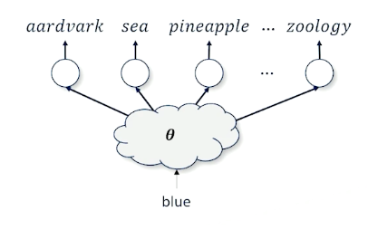{: width='200' height='200'}

We want to take a word blue and figure out what is the next best word.
* The issues is there are 50,000 words 
* We also have to deal with the context (words before blue)

There are also other problems:
* Network networks require inputs to be real-valued numbers
  * One possible solution is to use the **one-hot vector**

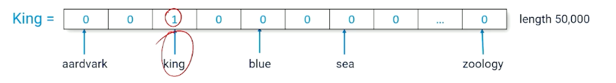{: width='400' height='400'}

A **Token** is the index of a word (e.g in the above image, king =2)

Here is a bigram model, using the one hot vector as input, takes in a single word, and output a single word:

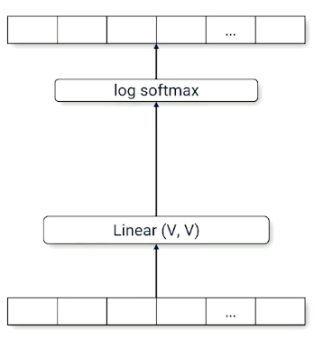{: width='200' height='200'}

Consider a trigram model it will look like this:

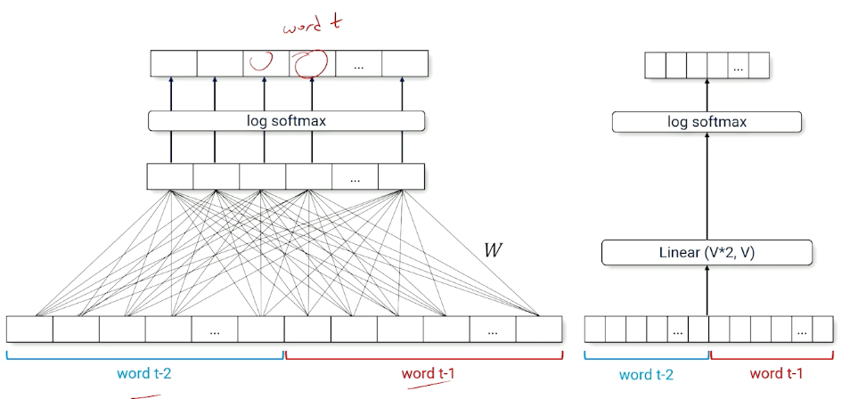{: width='400' height='400'}

Notice that the linear layer is now $\mathcal{V}*2$, and does not "scale" well. 

### Encoders and Decoders

Ultimately, we need a way to deal with context and history size. Introducing encoders and Decoders

* **encoder** Send input through a smaller-than-necessary layer to force the neural network to find a small set of parameters that produced intermediate activations that approximates the output

  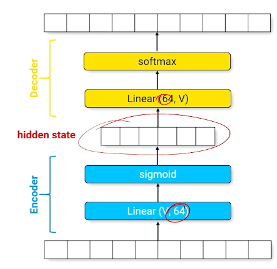{: width='300' height='300'}

  The above image shows the encoder, which is forcing the input layer to be represented by a layer of size 64. 
  * A good set of parameters will represent the input with a minimum amount of corruption
  * Can be "uncompressed" to produce a prediction over the full range of outputs

* **decoder** : A set of parameters that recovers information to produce the output

Now,
* Consider a neural network that implements the identity function 
* Neural network is forced to make compromise
* "KING" produces a hidden state activation similar to "regent"

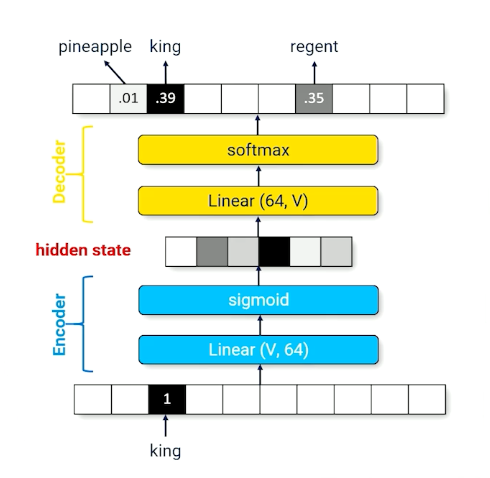{: width='300' height='300'}

There will definitely be some information loss, and, what is the use of going through such material? We can change the network such that it outputs the next word instead:

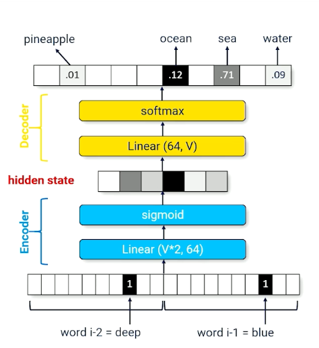{: width='400' height='400'}

* The **hidden state** now compresses multiple words into a fixed size vector
* can be reinterpreted as summarizing the history (context vector) - Used interchangeably 

Extra note about pytorch, there is a the `pytorch.nn.Embedding(vocab_size, hidden_size)` that:
* Takes a token id (integer) as an input
* Converts to a one hot vector of length vocab\_size,
* maps a vector of length hidden\_size. 

Encoders perform compression, which forces compromises which forces generalization. We know we have a good compressor (encoder) if we can successfully decompress. However there are still problems:

* We cannot have different architectures with different size of context history, like one for bigram, trigram etc. That is not going to work. 
* With very large scale, its hard to deal with hard long complicated sequences.

Solution? RNN! 

### Recurrent Neural Networks

Really want one architecture that can manage all these cases. 

* Text sequences can have different history lengths
* Recurrence: process each time-slice recursively

The idea is to use the hidden state and use it back as an input.

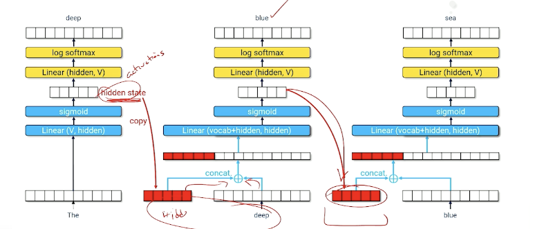{: width='400' height='400'}

Or to represent it in another form:

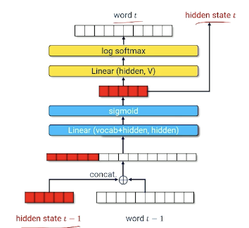{: width='300' height='300'}

* Hidden state encodes useful information about everything that has come before
* Neural net must learn how to compress hidden state $t-1$ and word $t-1$ into a useful new hidden state that produces a good guess about word $t$.

### Training An RNN

* Training data:
  * $x$ token id of $word_{t-1}$
  * $y$ token id of $word_t$
* Input: $x + \text{hidden state}_{t-1}$
* Output: $ \langle log P(w_1), ..., log P(w_{\lvert \mathcal{V}\lvert}) \rangle$
* Cross entropy loss
  * loss = - loss $P(w_1)$
  * So if our loss is 0, means our model mostly got it correct, and otherwise.

So, once you have trained the network, how do you start prediction?

* Start with a word $(word_i)$ and an empty hidden state (all zeros)
* Generate a distribution: $ \langle log P(w_1), ..., log P(w_{\lvert \mathcal{V}\lvert}) \rangle$
* $word_{t+1}$ is the **argmax** of the distribution (i.e the one with the highest score/probability)
* Feed the output back into the neural network for the next time slice $t+1$.
  * In other words use generated word $w_{t+1}$, plus the new hidden state as input to produce word $w_{t+2}$
* Repeat until you are done

Now, what else can we do to improve the generation of the neural network?

### Generative Sampling

The problem with argmax is it can sometimes results in a local maximum, such as some words always having high scores. Instead of argmax, we can do multinomial sampling from $\langle P(w_1),...,P(w_{\lvert \mathcal{v} \lvert}) \rangle$. We can pick a position/score based on how strong that probability distribution is.

For example:
* History = A dark and stormy, what comes next?
* So suppose you output words with [(night,0.4), (sea, 0.1), ...]
  * You will pick night with 0.4, sea with 0.1, and so on. 
  * This works if your prediction is nice and peak around certain words
* **However**, sometimes multinomial sampling can appear too random, especially when there are alot of options with similar probabilities. 
  * Can we "train" the neural network to be more "peaky"? E.g instead of $[0.1,0.1,0.1,...]$ we want $[0.8, 0.01,...]$

To achieve this,  we can introduce a new variable called temperature, $T \in (0,1]$ and sample from:

$$
norm \bigg(\bigg\langle \frac{log P(w_1)}{T}, ..., \frac{log P(w_{\lvert \mathcal{v} \lvert})}{T}\bigg\rangle\bigg)
$$

Divide every probability score by this temperature value, and then normalize this so it is between 0 and 1. Let's observe what will happen:

* Divide by $T=1$ means the distribution is unchanged
* Dividing by a number $T <1$ means all the numbers increase
* as temperature goes to 0, the highest score goes to infinity. 
  * This will look / act more like argmax.

However, RNN can still make mistakes as generation from a RNN is an iterative process of feeding outputs into the neural network as inputs. RNNs tend to forget parts of context-hard to pack things into the context vector.

So, LSTM!

### Long Short-Term Memory Networks

* Hard to learn how to pack information into a fixed-length hidden state vector
* Every time slice the RNN might re-use part of the vector, overwriting or corrupting previous information. 

An example (The vector here represents an embedding):

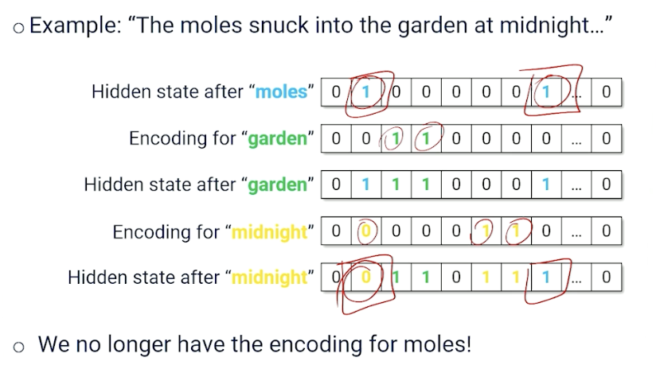{: width='400' height='400'}

If you notice, the hidden state after midnight has overwritten a piece of information here so that we can capture midnight; so both midnight and moles need to use index 1; we effectively lose the information about moles.

That brings us to LSTM, would be nice if the neural network could learn:
* What is worth forgetting
* Which part of the new word input is worth saving
* This means we can maintain a "better/valid" hidden state longer. 

How does Long short Term Memory (LSTM) achieve this?

* Replace internal parts of a RNN encoder with a specialized module called a **memory cell**.

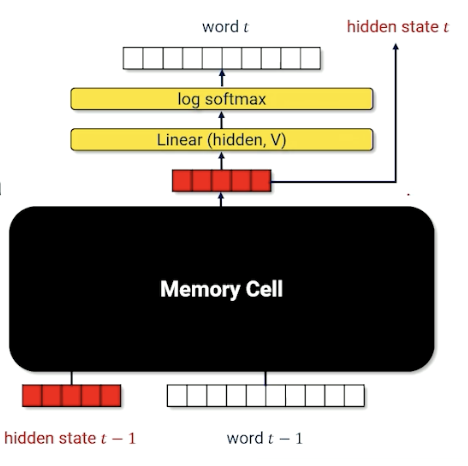{: width='200' height='200'}

### LSTM: A Visual Walkthrough

Let's first look at the computational graph:

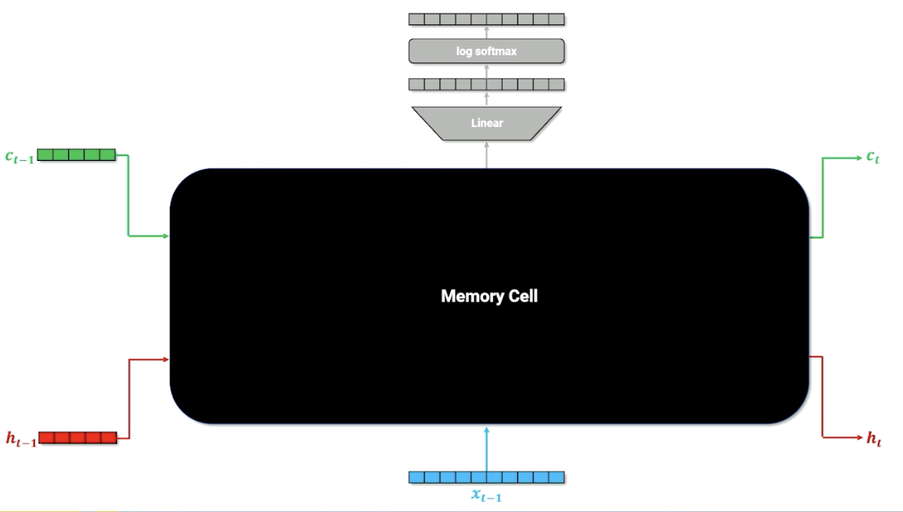{: width='300' height='300'}

$x$ is the one hot vector of the word, and $h$ is still the context/history, similar with RNN. There are now is an additional parameter $c$, the cell memory. Let's look deeper into this cell memory (black box) to know what is going on:

Remember, the linear layer compress the one hot into something useful. We also do the same for the hidden layer and combine them:

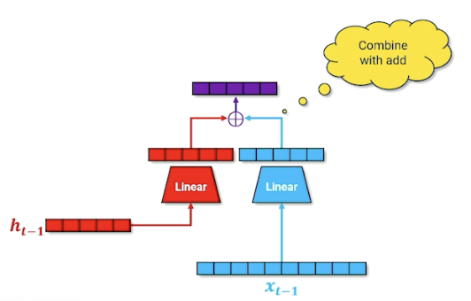{: width='400' height='400'}

Then, we take that and run it through a sigmoid (which will turn some values to 0 or 1). We are going to call this the **forget gate**. 

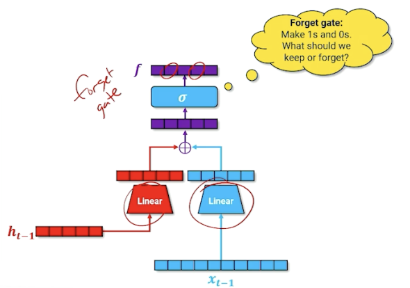{: width='400' height='400'}

We take the output of the forget gate, and multiply it with the cell memory - think of it as "deleting" information in the cell memory into the next time step; this is how the neural network learns what to forget. (For those familiar, this is the `forget gate`)

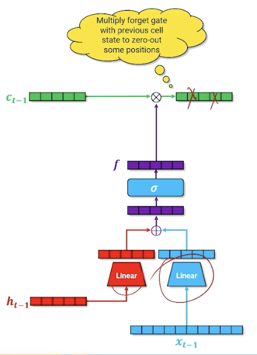{: width='200' height='200'}

In addition, we are going to do another parallel structure inside or our neural network that is going to do our cell memory update.  Note that the linear layers will learn a different set of parameters. (For those familiar, this is part of the `input gate`)

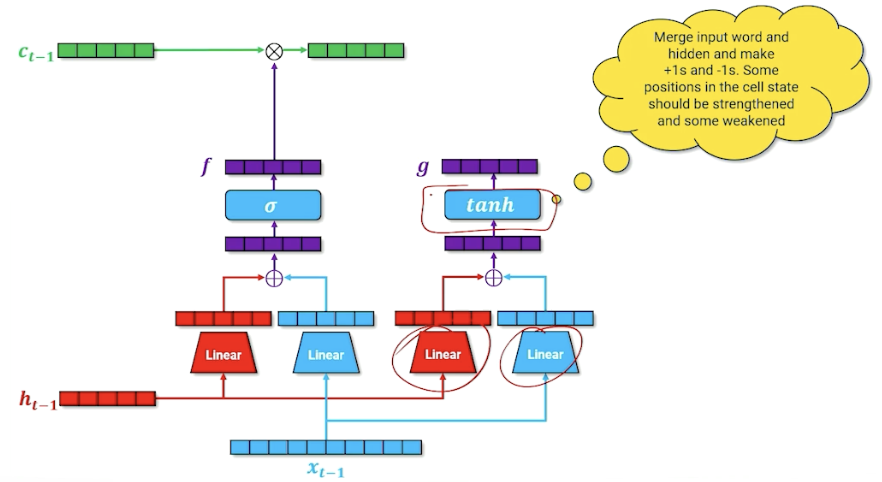{: width='400' height='400'}

The goal is to produce a new cell memory, we do not use a sigmoid but tanh. To recall, tanh produces numbers that are $[-1,1]$ instead of sigmoid $[0,1]$. So what we are going here is merging our word and our hidden state to try to figure out what things should be $+1, -1$. The way we can interpret this is. this is going to be introduced to our cell memory from the previous state, by saying which input in the cell should be strengthened or weakened by adding/substracting one. 

We are not going to add this to the cell memory yet, and going to introduce another parallel structure and have another gate that essentially considers whether this word $x$ should be added to the cell memory. (For those familiar, this is called the `input gate`). Is this word important that should be carried on or it can be ignored? 

We take the input gate $i$ and multiply by the new cell memory $g$:

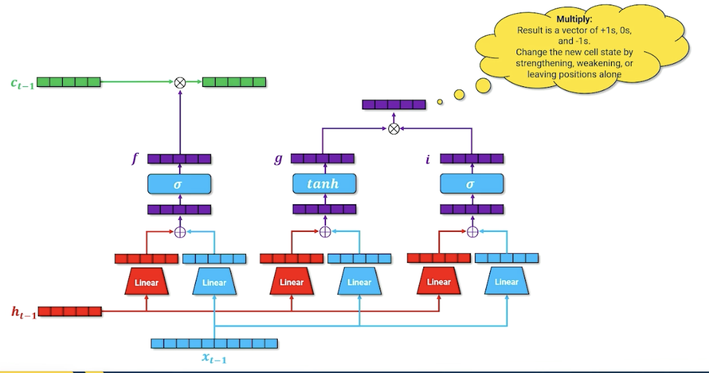{: width='400' height='400'}

This resulting vector not just has plus ones and negatives one but also zeros, so either strengthen, weaken our cell memory or zero, leaving it unchanged.  We finally take this and multiply with $c_{t-1}$ to form the new $c_t$.

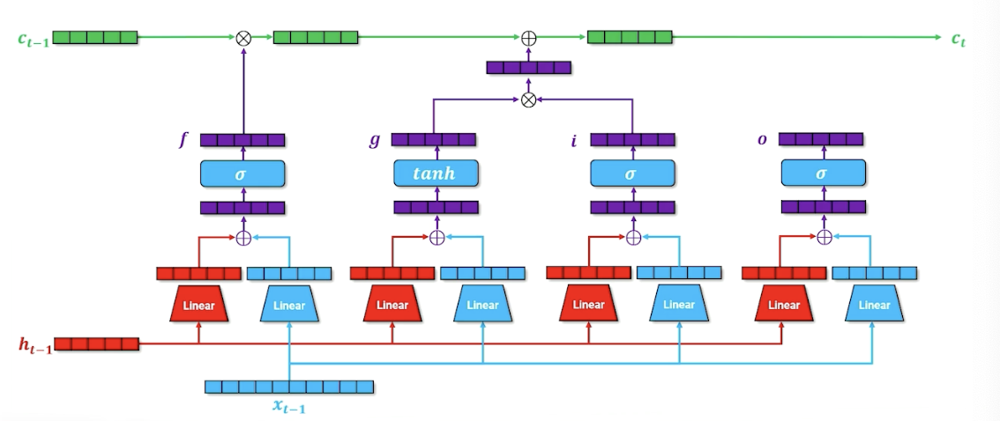{: width='400' height='400'}

For one last time, we have another parallel block (For those familiar, this is the `output gate`), the idea here is to say what needs to be part of the next hidden state, which is going to be used for both the decoder but it is also going to be passed on to the next layer time step in our recurrence. 

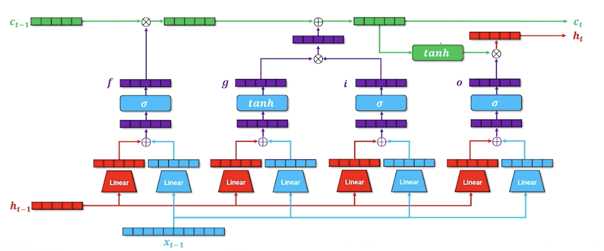{: width='400' height='400'}

We are also going to incorporate in our cell memory, so if we want to figure out what goes into our hidden state, it is going to be a combination of what we want to go forward through our output state as well as whatever cell memory is going to say. The second tnah here is going to squish everything back down to $[-1,1]$ (Lecture mentioned $[0,1]$ somehow but its tanh? ) and combining it with our output gate to produce our new hidden state. 

### LSTM: A Mathematical Walkthrough

The forget gate can be written as:

$$
f = \sigma(W_{x,f}x + b_{x,f} + W_{h,f}h + b_{h,f})
$$

The input gate / cell memory can written as:

$$
\begin{aligned}
f &= \sigma(W_{x,i}x + b_{x,i} + W_{h,i}h + b_{h,i}) \\
g &= tanh(W_{x,g}x + b_{x,g} + W_{h,g}h + b_{h,g}) \\
\end{aligned}
$$

Then update cell state $c$:

$$
c_i = (f \times c_{i-1}) + (i \times g)
$$

Then, we can now calculate our output gate as well as update our hidden state:

$$
\begin{aligned}
o &= \sigma(W_{x,o}x + b_{x,o} + W_{h,o}h + b_{h,o}) \\
h_i &= o \times tanh(c_i)
\end{aligned}
$$

In summary, 

* The full LSTM encoder-decoder network containing the memory cell
* Hidden state summarizes the history of the text
* Cell state is information needed for the memory cell to do its job, passed from time step to time step

As a side note, usually for LSTM, we refer to the entire block as one LSTM block and do not map out the internals of it.

LSTM cells pass extra cell state information that does not try to encode text history but information about how to process that history - meta knowledge about the text history. LSTM were SOTA for a long time and are still useful when handling recurrent data if indeterminate length, and holds "Short-term" memory longer. But LSTM can still get overwhelmed trying to decide what to encode into the context vector as history gets longer and longer.

### Sequence-to-Sequence Models

Special class model that is build on top of LSTM. Recall the structure of LSTM:

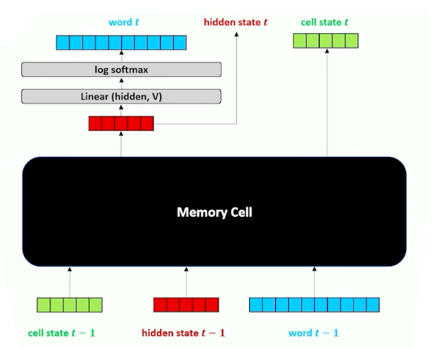{: width='400' height='400'}

This is because sometimes data is of the form:
* $x_i = SOS\ x_{i,1}, x_{i,2}, ..., x_{i,n}\ EOS$
* $y_i = SOS\ y_{i,1}, y_{i,2}, ..., y_{i,n}\ EOS$
  * Each x,y is a sequence of words that are clumped together and are considered a single whole.

The reason why this is a special case is because this comes up very often especially in translation. So translation is usually about converting a phrase (or a sequence) in one language into another language. 

Translation also comes with its own problems, such as the phrasing, words not having a one to one mapping, etc. Sometimes we need to look the full sequence to be better informed on our prediction. 
In order to handle sequence to sequence data:

* sweep up an arbitrary input sequence and encode it into a hidden state context vector. 
* Good for picking up on negations, adjective order, etc. Because the whole input sequence is in the context vector.
* Then decode it into an arbitrary length sequence 
* Stop decoding when `EOS` is generated

### Sequence-to-Sequence Example 

Consider the following example where we keep finding words and update our hidden state:

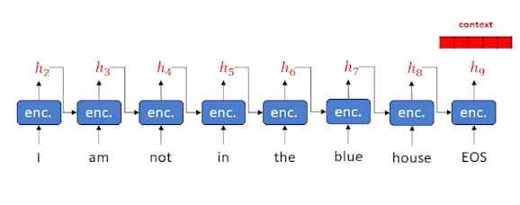{: width='400' height='400'}

Now, we take that context, and start sending it into the decoder:

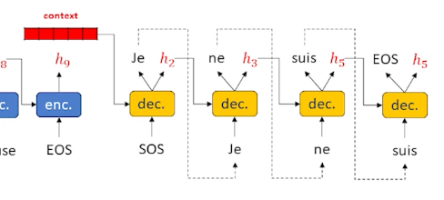{: width='400' height='400'}

And when we see the `EOS` tag we can stop. 

This is a little different from the previous LSTM where we did it word by word. 
Essentially, we have taken the decoder and put it to one side. The decoder need some 
sort of output word (as opposed to an input word) as well as a hidden state that keeps track of what is going on. As a result, we need to put another encoder in the decoder layer, we cannot work directly on words and hidden state. So in a Sequence to sequence, the decoder itself has an encoder inside. The encoder (within the decoder) is usually an LSTM as it works really well, and in most diagrams the cell state is omitted to keep the diagrams clean. 

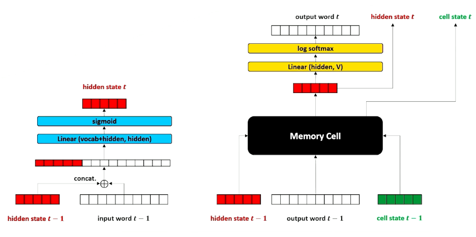{: width='400' height='400'}

In summary:

* Separate the encoder and decoder
* Change the decoder to take an output word and hidden
* Allow us to do one of the most important things in modern neural language modeling: Attention

### Sequence-to-Sequence Model Training

How do we train it when we have a separate encoder and decoder?

Now that it is separate, our training loop is going to have two parts as well. It is going to iterate through the encoder and then it is going to iterate through the encoding. 

For the encoder:

* Set hidden state $h_0^{enc} = \vec{0}$
* Do until $x_j = EOS$
  * Encode $x_j$ and $h_j^{enc}$ to get $h_{j+1}^{enc}$
  * Increment $j$

For the decoder:
* Set $x_0^{dec} = SOS$
* Set $h_0^{dec} = h_{j+1}^{enc}$
* Do until $\hat{y}_j^{dec} = EOS$ or until we hit max length
  * Decode $x_j^{dec}$ and $h_j^{dec}$ to get $\hat{y}_{j+1}^{dec} \text{ and } h\_{j+1}^{dec}$
  * Set $x_{j+1}^{dec} = \hat{y}_{j+1}^{dec}$
  * Because this is training: loss = loss + loss_fn($\hat{y}_{j+1}^{dec}, y\_{j+1}$)
  * Increment $j$

Once we have done all of this, back propagate loss. But this time our loss is the aggregated loss.

Visually we can look at it like this (the loss reflects the entire sequence at once instead of word by word):

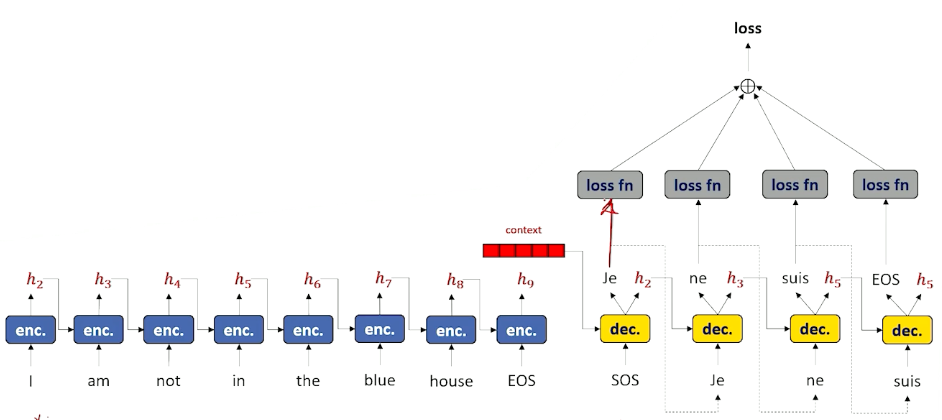{: width='400' height='400'}

### Teacher Forcing

We are going to introduce a new trick to make the neural network learn even better, known as teacher forcing. 

* Instead of using the decoder's output at time $t$ as the input to the decoder at time $t+1$... 
* Pretend our decoder gets the output token correct every time. 
* Use the true training label $y_{i,t}$ as input to the decoder at time $t+1$

So for our decoder, It looks like this instead:

* Do until $y_j=EOS$
  * Decode $y_j$ and $h_j^{dec}$ to get $\hat{y}_{j+1}^{dec} \text{ and } h\_{j+1}^{dec}$
  * Set $x_{j+1}^{dec} = y_{j+1}^{dec}$ i.e ignore the prediction and set to the true value
  * However, for our loss function, we still use the prediction:
    * loss = loss + loss_fn($\hat{y}_{j+1}^{dec}, y\_{j+1}$)
  * Increment $j$

So this is good in the sense because in the early phase, our decoder is getting all the words wrong, which compounds the problem - i.e your next word is built on top of a previous wrong word. 
With teacher forcing, we just use the prediction to compute the loss but use the true word to proceed. 

We can get a little more fancy with this:

* Can perform teacher forcing some percentage of hte time and feed in decoded tokens the remaining percentage of the time. 

In summary:
* Teacher forcing makes training more efficient
* Sequence to sequence works for data that can be split into discrete input and output sentences:
  * translation
  * X and Y can be adjacent sentences to learn to generate entire sentences at once

Moving on to attention next - how we cna make sequence to sequence a little bit more intelligent by being smarter about how it looks back at its own encoder in order to help me figure out what to do in specific slices in the decoder step. This will help out with some of the issues with forgetting and overwriting of our context vectors. 

### Attention, part 1

Finally, [Attention is all you need](https://arxiv.org/abs/1706.03762).

Recall that:
* Parts of the hidden state are continuously overwritten and can forget
* Do we need to throw away all the intermediate hidden states during sequence encoding?
* **Attention**: The decoder to look back through the input and focus a "spotlight" on various points that will be most relevant to making the next prediction of the next output token.
* Pull the attended information forward to the next prediction. 

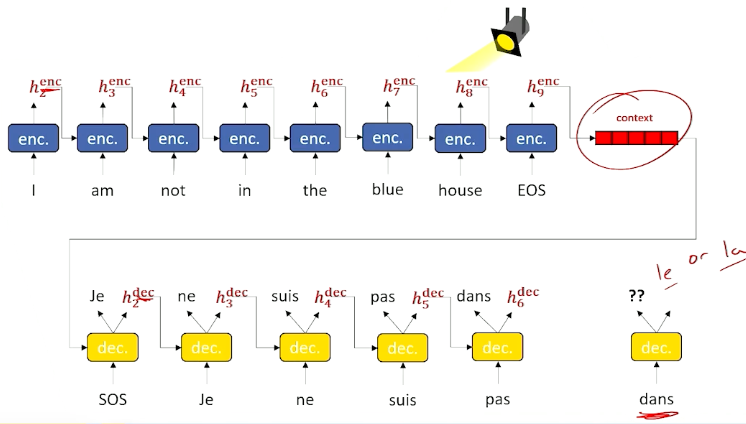{: width='400' height='400'}

Will be great if at prediction of the next word, to look back / spotlight at the decoder stage to identify what was encoded at that particular time slice and if the network knew that, may be able to bring this encoder information forward and make much better choice. 

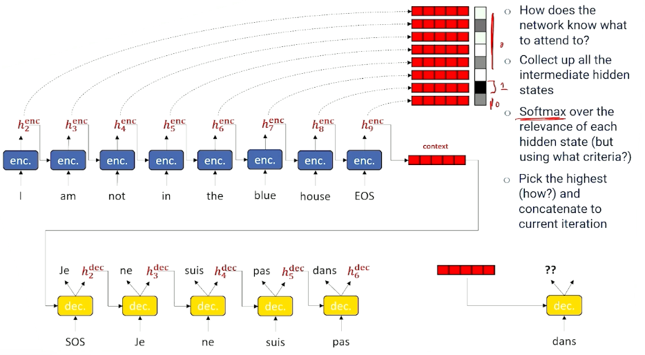{: width='400' height='400'}

The next question is, how do we know which time slice to look at then? In which section should we pay attention to? 
* Grab every single encoder output hidden state and save them and stack them up in a big Q. 
* Decide which is the most important to us, so we have a tool for doing selection - Using softmax! 
  * But what criteria to use for softmax? We still need to figure this out. 
  * Assuming we are able to do so, take the best one, and use it as input for the next decoder step.
  * And we do this for every step. 

### Attention, part 2

Let's take a deeper look now - How we get attention to the decoder: 

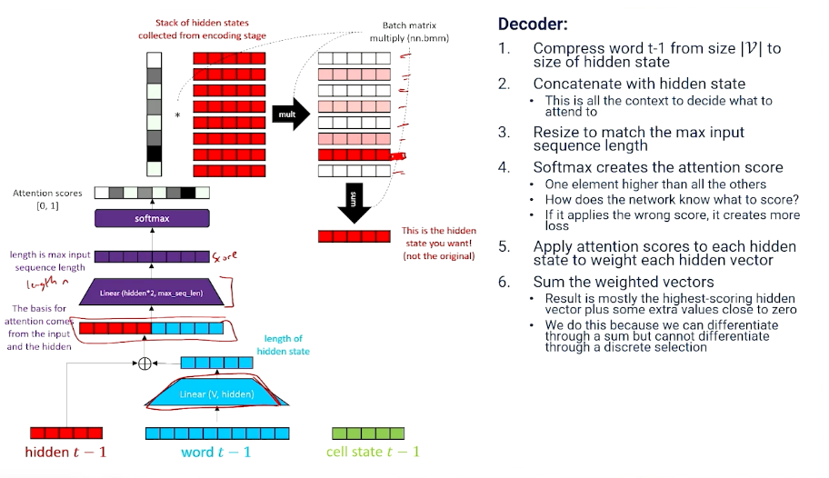

To summarize, 
* Attention: dot product (inner product) of a softmaxed context vector and a matrix of candidates. 
* Everything that might be relevant to choosing what to attend is packed into the context vector
* Network learns how to generate the attention score with linear transformation.

Now, on to the decoder part (we have only finished the attention portion):

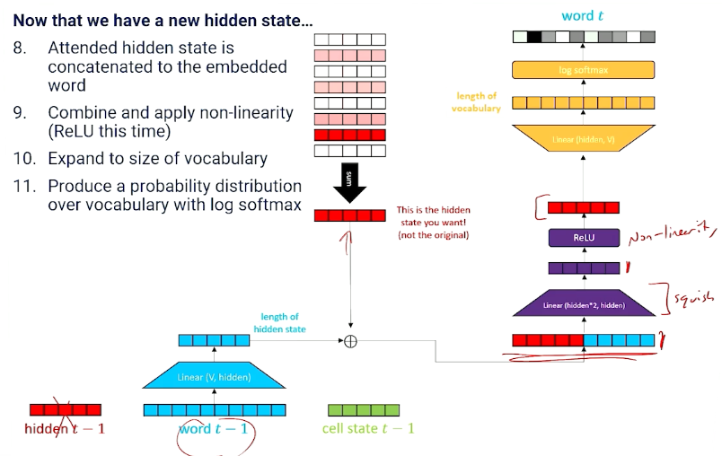

We still need to produce new hidden state and memory cell state! 

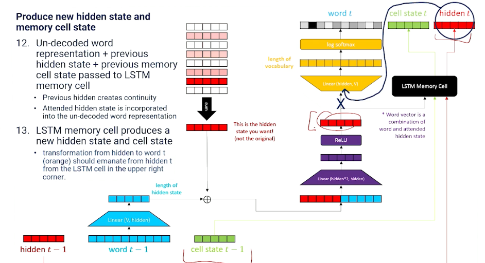

And we do so with a LSTM memory cell layer. 

Putting it all together this is what we get:

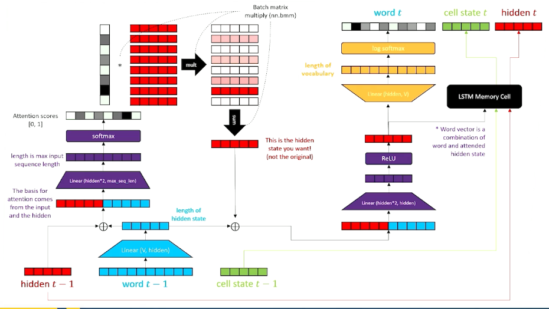

In summary,

* Attention is the mathematical equivalent of "learn to choose from inputs" and is applied in the decoder.
* Attention does not require sequence to sequence, it can be applied to a regular LSTM if there is a buffer of previous words and intermediate hidden states to draw on.

### Different Token Representations

Taking a slight detour here to talk about token representation.

* Up to now we have assumed a token is a word and the vocabulary is a word and the vocabulary is a very large number of words.  
* vocabulary would be letters $\mathcal{V} = [a,b,c,...,z,1,2,3,... punctuation]$
* vocabulary size is small, but the language model has to learn to spell out every word one letter at a time.

There is another way thinking about tokens inbetween having letters and full words, and thats something called **subword tokens**.

* Breakdown complicated words into commonly recurring pieces.
  * For example "Tokenize" $\rightarrow$ "token" + "ize"
  * vocabulary would contain common words, common word roots, suffixes, prefixes, letters and punctuation
* Neural network mostly works on word tokens but occasionally has to learn how to use context to assemble a complex word. 
* In the worst case, neural network can learn to spell really rare, complex words from letters.
* Sub-word vocabulary can cover most of english with fewer tokens ~50,000
* One additional advantage: No need for out-of-vocab (UNK) tokens, as handling these is difficult. 

### Perplexity, part 1

How do we test / evaluate NLP/language models? How do we know when they work well? Even if the loss is low, is it learning what we want it to learn or learning anything useful?

Recall that:
* Language models are all about modeling fluency: probability ~ fluency. 

  $$
  P(W_1=w_1,...,W_{n-1} = w_{n-1},W_{n} = w_{n}) = \prod_{t=1}^n P(W_t = w_t \lvert W_1=w_1,...,W_{t-1}=w_{t-1} ; \theta)
  $$
* That is: The probability of every word is conditioned on its history

Now, perplexity:
* A measure of how "surprised" (perplexed) a model is by an input sequence
* A good language model is one that is good at guessing what comes next

**Branching factor**
* Branching factor: number of things that are likely to come next. 
* If all options are equally likely, then branching factor = number of options
* But if different options have different probabilities, then:
  * Branching factor = $\frac{1}{P(option)}$
    * Etc flipping a coin where $P(heads) =0.5$, then branching factor is $\frac{1}{0.5}=2$.
    * If $P(heads) = 0.75$ then branching factor is $\frac{1}{0.75}=1.33$.

Coming back:
* The probability of a word differs given its history $P(w_t \lvert w_1, ..., w_{t-1})$
* So the branching factor will be $\frac{1}{P(w_t \lvert w_1, ..., w_{t-1})}$
* The more plausible alternatives, the more likely the model will make the wrong choice.

Ok, but we have introduced a new problem, consider:

* Probability of a sequence of words (or the probability of this sentence) is:

  $$
  P(w_1,...,w_n) = \prod_{t=1}^n P(w_t \lvert w_1,...,w_{t-1})
  $$
* But, longer sequences would have a smaller probability - So this makes things unfair as well; longer sequences will likely have a smaller probability 
* so we need to normalize by length by taking the $n^{th}$ root, which is done by using the geometric mean:

  $$
  P_{norm}(w_1,...,w_n) = \prod_{t=1}^n P(w_t \lvert w_1,...,w_{t-1})^{\frac{1}{n}}
  $$
* And so the branching factor of a sequence of words:

  $$
  \prod_{t=1}^n \frac{1}{P(w_t \lvert w_1,...,w_{t-1})^{\frac{1}{n}}}
  $$

* Perplexity is just the branching factor of a sequence of words:
  
  $$
  perplexity(w_1,...,w_n) = \prod_{t=1}^n \sqrt[n]{\frac{1}{P(w_t \lvert w_1,...,w_{t-1} ; \theta)}}
  $$

### Perplexity, part 2

Taking the previous equation, and transforming it into log space:

$$
\begin{aligned}
perplexity(w_1,...,w_n) &= exp\bigg( \sum_t^n log(1) - \frac{1}{n}log P(w_t \lvert w_1, ..., w_{t-1};\theta) \bigg) \\
&= exp\bigg( \sum_t^n - \frac{1}{n}log P(w_t \lvert w_1, ..., w_{t-1};\theta) \bigg)
\end{aligned}
$$

Perplexity is also the per-word exponentiated, normalized cross entropy summed up together: so now, we have established a relationship between perplexity and loss.

Therefore, in the case of RNN:
* Recurrent neural networks generate one time slice at a time
* Perplexity is the exponentiated negative log likelihood loss of the neural network:
  * $perplexity(w_t) = exp(-log P(w_t \lvert w_1,...,w_{t-1};\theta)) = exp( Loss(\hat{y},target))$

To recap, 
* Perplexity is loss, the lower the better
* Perplexity is how surprised the language model is to see a word in a sentence
* More possible branches means model is more likely to take the wrong branch
* Perplexity($w_t$) =$x$ means the odds of getting the right token is equivalent to rolling a 1 on an $x$-sided die. 
  * Example: Perplexity($w_t$) = 45 means the model has a 1/45 chance of getting the right token. 
  * But if it was 2 then that means it has 1/2 chance of getting the right token. 

With that:

* During training, we look for loss to go down
* During testing (on unseen data), we look for a low perplexity 
  * The best language models in the world achieve a perplexity of ~20 on internet corpora
* Perplexity doesn't mean non-sense - It means that the model makes a choice other than one that exists in a corpus
  *  Even if we have a high perplexity, it doesn't mean only one word is going to make sense and a whole bunch of words are not going to make sense; maybe the top 20 words still make sense or reasonable words, e.g "Why did the chicken cross the road" vs "cross the street".
     *  It is still going to be fluent and we are not going to be necessarily upset. It just wasn't the one perfect word according to some test set. 

<!--  -->