### Document Semantics

* **Semantics**: What word and phrase mean
* **Problem**: Neural Networks don't know what word means 
  * By extension neural network don't know what a document is about 
  * Words are just one-hot vectors

So, How do we represent the meaning of a document?

* Multi-hot
  * Set a 1 in each position for every word in a document.
  * The values are the same but some words are more important than others.
  * If you want to figure out if two documents are related to each other you want to rely on words that are effective at distinguishing documents 
  * Look for ways to determine which words are important 

### Term Frequency-Inverse Document Frequency

TFIDF - a specific technique trying to decide whether two document are semantically similar to each other without really having the semantics of words and documents themselves. 
* Give weight to each word based on how important it is

**Term frequency** : If a word shows up frequently in a document, it must be more important than other words:

$$
TF(w,d) = log(1+freq(w,d))
$$

* $freq(w,d)$ is how many times $w$ appears in document $d$
* The log forces the TF to grow very slowly as the frequency of a word gets larger. 

**Inverse Document Frequency** : Words that are common in all documents are not very important

$$
IDF(w,D) = log \bigg( \frac{1 + \lvert D \lvert }{1 + count(w,D)}\bigg)+1
$$

* $ \lvert D \lvert$ is number of documents 
* $count(w,D)$ is how many documents in $D$ contains $w$
* As the count increases, the ratio goes towards 1. 

So, TF-IDF:

$$
TFIDF(w,d,D) = TF(w,d) \times IDF(w,D)
$$

* Apply TF-IDF to every word $w$ in every document $d$ to get a vector 

In summary:

* TF-IDF provides a more nuanced document representation of a document than a multi-hot
* Next we look at how to compute document similarity and retrieve the most similar documents 

### Measuring The Similarity Documents

* **Document Retrieval**: given a word or a phrase (itself a document), compare the query to all other documents and return the most similar. 
* Given two documents, represented as vectors, how do we know how similar they are?

One way is to use the **vector distance**:

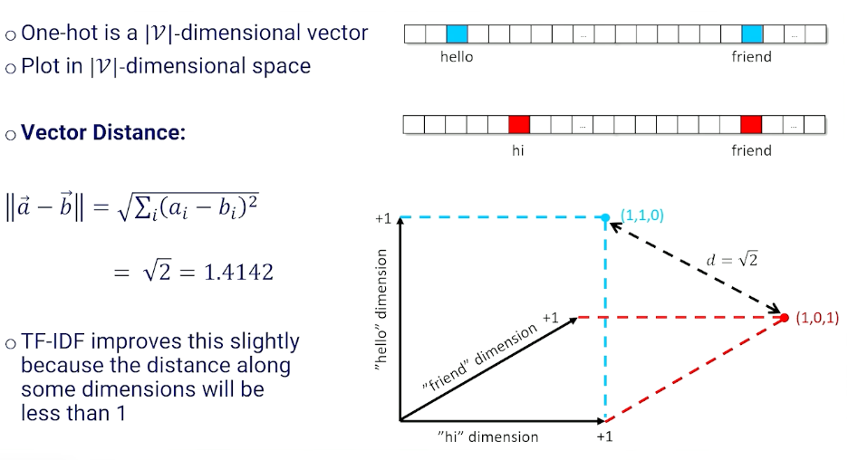{: width='400' height='400'}

Another way is to use the **cosine distance**:

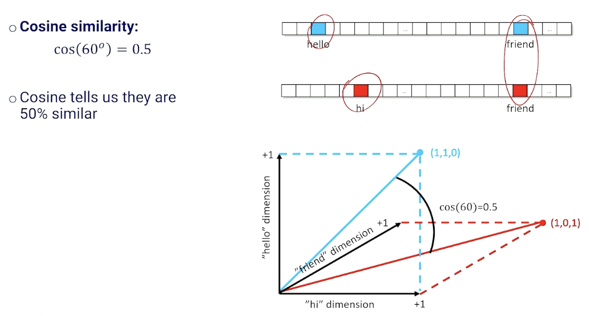{: width='400' height='400'}

Now, on document retrieval:

* Create a $1 \times \lvert \mathcal{V} \lvert$ normalized documetn vector for the query($q$)
* Create a normalized vector for every document and stack to create a $\lvert \mathcal{D} \lvert \times \lvert \mathcal{V} \lvert$ matrix $\mathcal{M}$.
* Matrix multiply to get scores
* Normalized the final vector
* This is the same as computing the cosine similarity 

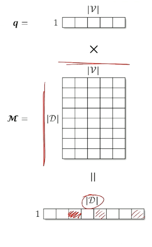{: width='200' height='200'}

$$
cos(\vec{a},\vec{b}) = \frac{\vec{a} \cdot \vec{b}}{\lvert\lvert \vec{a}\lvert\lvert * \lvert\lvert\vec{b}\lvert\lvert}
$$

* Take the argmax to get the index of the document with the highest score (or get the top-k to return more than one)

There are still two issues:
1. Require a $\mathcal{V}$ length vector to represent a document
2. Does not capture the fact that some words are similar ("hi" vs "hello")

### Word Embeddings

The problem with TF-IDF just now is the way we index them in a vector even though they probably mean the same thing.  

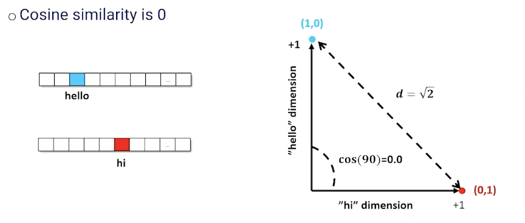{: width='400' height='400'}

Instead of a $\lvert \mathcal{V} \lvert$ - dimensional space, we want a space that intuitively maps similar words and phrases close to each other. This is also known as embeddings:

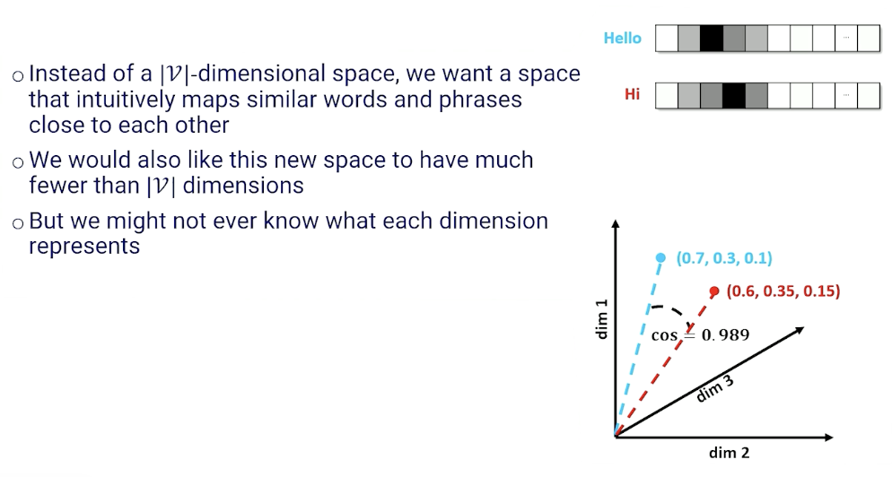{: width='400' height='400'}

So, how are we going to get these embeddings? 

* Take a one hot (or multi hot) and reduce it to a $d$ -dimensional space where $d \ll \lvert \mathcal{V} \lvert $
* Use a linear layer with $\lvert \mathcal{V} \lvert \times d$ parameters $\mathcal{W}$
  * Compress a one-hot into a d-dimensional vector

Why does this work?
* One-hot for the $i^{th}$ word selects a set of $d$ weights and all others are zeroed out
* These remaining weights are a $d$-dimensional representation of the indexed word 
* Because we are multiplying by 1s and 0s, the $d$ weights $W_i$ are identical to the $d$-dimensional vector of activations at the next layer up. 

Looking at the matrix of weights in the linear layer:

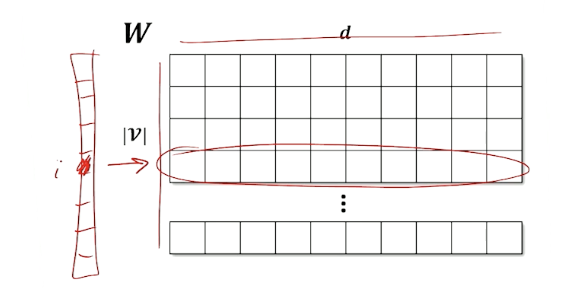{: width='400' height='400'}

* Each row in $W$ is an embedding for each token in vocabulary
* One-hot selects the row
* Learn weights that capture whatever relationship we need

### Word Embeddings Example

Recall the RNN architecture where we have an encoder layer:

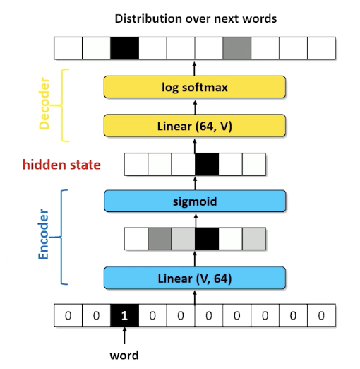{: width='400' height='400'}

We call the lienar compression layer in the encoding the **embedding layer**:
* token to one hot
* Linear from length $\lvert \mathcal{V} \lvert$ to $d$ length vector
* For simplicity moving forward, we are going to assume we can turn the word directly to an embedding. 

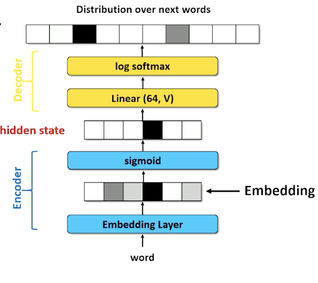{: width='400' height='400'}

* Embedding layer in an RNN learns weights of an affine (linear) transformation
* Whatever reduces loss in the output probability
  * Must have compromises (words having similar activations)
  * We hope those compromises map similar words to similar vectors
  * Still no guarantee on semantic similarity 
* Embedding layer is **task specific** 
  * Because ultimately it is being fed into a NN with a loss function for a specific task.
* Question: can we learn a general set of embedding?

### Word2vec

Maybe we don't need to know what each word means: 

* **Distributional semantics** : a word is known by by the company it keeps
* Words that man approximately the same thing tend to be surrounded by the same word 

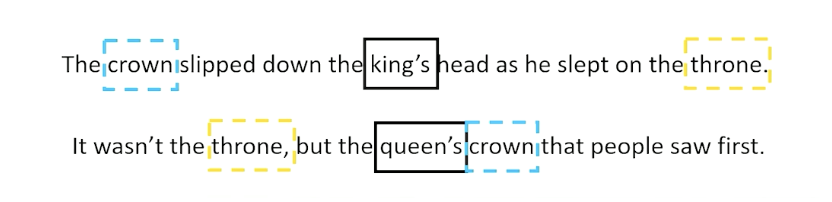{: width='400' height='400'}

* For example we always see king and queen together, maybe they mean something very similar in terms of semantics 
* Again - the idea is we don't need to know what the word mean if words with similar meaning have similar embeddings

Then the question is:

* How can we train an embedding to use this concept of distributional semantics 
* Can a word be predicted based on surrounding words?
  * The crown was left on the throne when the ???? went to bed at night. 
  * Probably king or queen is a reasonable choice; although we can't quite tell which is better 
* Can we predict the surrounding words based on a single word? 

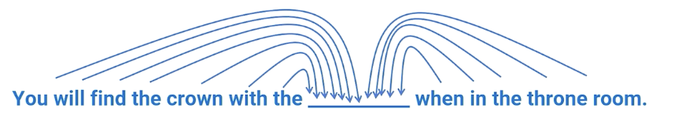{: width='400' height='400'}

* Take out a word in the middle of a sequence and ask a neural network to guess the missing word 
* Loss is the cross entropy of the probability distribution over words 

Similarly, we can look at the opposite of the problem:
* Can a window of words be predicted based on the word in the middle of the window?

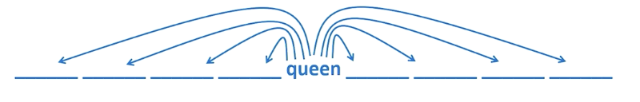{: width='400' height='400'}

* Take a word and guess the words to the left and right
* Loss is the cross entropy of each blank given the word in the middle
* Break up into **skip grams** (bigram on non-adjacent tokens)
  * E.g given word $w_t$, predict $w_{t-i}, w_{t+1}$ for some $i$. 
* Predict each skip-gram separately 

This is also known as the word2vec approach and there are actually two approaches to word2vec:
*  continuous bag of words 
*  or skip grams
  

Let's look at the continuous bag of words (known as CBOW) first, for a window of size $k$, what we are doing is we are taking a particular chunk of document and note that the document is missing a word in the middle. 

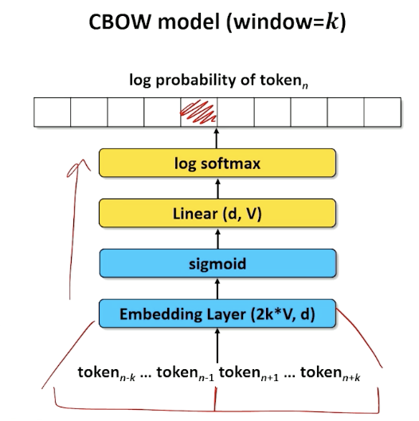{: width='400' height='400'}

So we take the $2k$ words off the left and right of the target word and asking the neural network to predict the missing word, in this case the embedding layer is $2k*V$ and outputs a/compresses it into $d$ dimension. 

Now, let's look at the skip gram model which is to look at a particular word and trying to guess the surrounding words 

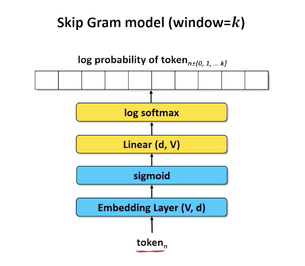{: width='400' height='400'}

* So again, the word will be turn into a dimension of size $d$ 
* Because this is skip gram, we do not really care about the positions of the words but instead look at words with high activations. 
  * And the k highest activations are the words that are most likely to be in window around our $n^{th}$ word 
  * Doesn't need to be a sentence, can be jumbled up - we are just looking for words 
* Compute the entropy of each of the prediction matches the actual words we would find in a span taken from our actual document. 
  * The math side of things is omitted which is a little complicated. 

### Embedding

Let's see what we can do for our embeddings, remember in either CBOW or skip gram we have the embedding layer 

* We can extract teh weights from the embedding layer 
  * Each row is the embedding for a different token in the vocabulary

We can now do something interesting:
* such as computing the cosine similarity using the embedding. 
  * $cos(\vec{v}_{queen}, \vec{v}_{{king}})$
* We can also do retrieval; find documents that are semantically similar 
  * Which Wikipedia document is most relevant to "Bank deposit"
    * Chattehoochee river 
    * Great Recession of 2017
* Can also do analogies - add and subtract word embeddings to compute analogies 
  * Georgia - California + peaches = ?

Again, to recap - words that represent similar concepts tend to be clustered closely in d-dimensional embedding space. 
* Vectors can be added and subtracted

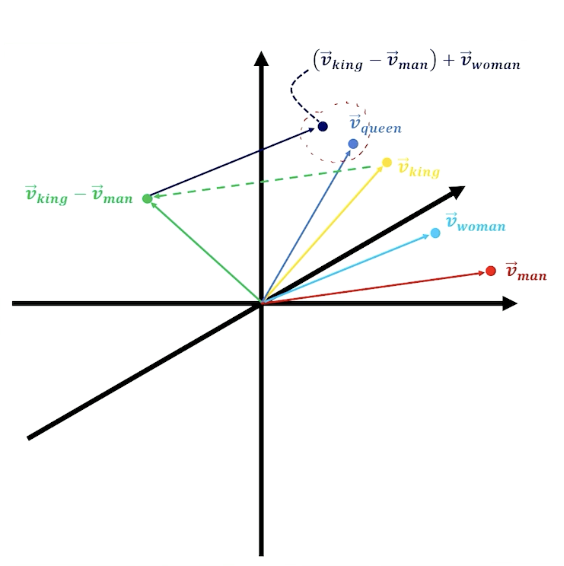{: width='400' height='400'}

E.g King - man + woman = Queen

Also:
* Most points in embedding space are not words
* Search for the nearest discrete point 

What about document embedding?

* Add each word vector 
* Word vectors pointing in the same direction strengthen the semantic concept  

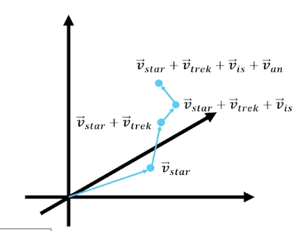{: width='400' height='400'}

* Normalize the resultant vector
  * Value of any of the $d$ dimension is the relative strength of that abstract semantic concept 
  * Necessary for cosine similarity

In summary:

* Word2vec is a learned set of word embeddings
  * Can either use continuous bag of words (cbow) or skip grams
* Word embeddings can be used in word similarity, document similarity, retrieval, analogical reasoning etc
* Text generation must learn an embedding that helps it predict the next word, but the embedding linear layer can be seeded with word2vec embeddings
* We will find embeddings in just about all neural approaches to natural language processing.

<!--  -->