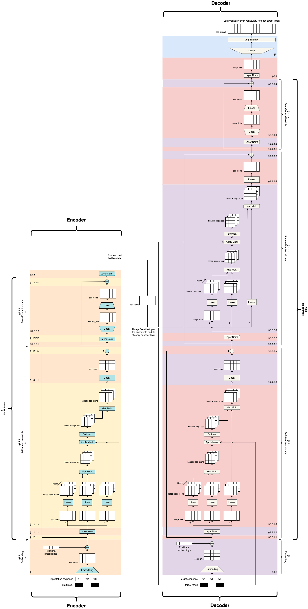

### Introduction to Transformers

Current state of the art, at least in 2023. 

Recall that:

* RNNs process one time slice at a time, passing the hidden state to the next time slice
* LSTMs improved the encoding to the hidden state 
* Seq2seq collects up hidden states from different time steps and let the decoder choose what to use using attention
  * Note how the decoder is side-by-side by the encoder and has it's own inputs in addition to the hidden state (token from the previous time step)
  * $x_s$ are the inputs to encoder, $h_s$ are the outputs
  * $y_s$ are the inputs to decoder, $\hat{y}_s$ are outputs
  * Loss computed on $\hat{y}_s$

  {: width='400' height='400'}

To add:

* Recurrent Neural networks, LSTMs, and Seq2seq exists because recurrence means we don't have to make one really wide neural network with multiple tokens as inputs and outputs. 
  * The wide model was originally considered a bad idea because:
  * inflexible with regard to input and output sequence lengths
  * computationally expensive 
* But sequence lengths is not a big deal if you make $n$ ridiculously long (~1,024 tokens) and just pad one-hots with zeros if the input sequence was shorter. 
* Computation also got alot better capable of more parallelization
  * 2017: First transformer (65M parameters) was train on 8 GPUs for 3.5 days 
  * 2020: GPT3 Transformer (175B parameters) was trained on 1,024 GPUs for a month 

### Transformers: Combining 3 Concepts

Introducing transformers - Combine 3 insights/concepts.

First concept: Encoder/Decoder that operates on a large input input window consisting of a sequence of tokens 
  * Entire input and output sequence provided at once
  * Like Seq2seq the decoder takes a hidden state and entire output sequence, which no longer needs to be generated token by token. 

{: width='400' height='400'}

Second concept: Masking
* Blacking out tokens so that the network has to guess the missing token
* One way is infilling: Guess a word in an arbitrary position in the middle of a sequence 
* Another way is continuation: Guess the word at the end of the sequence.
* Transformers are sometimes called masked language models
* Recall: We have seen this in word2vec is a robust way of learning to embed 

{: width='400' height='400'}

Third concept: Self-attention
* Instead of collecting up hidden states from previous time steps, all time steps are "Flowing" through the network in parallel
* Each time step can attend (softmax and dot product) to every other time slice. 
* As if network has to guess each word - what other words increase the odds of the actual word?

{: width='400' height='400'}

* For example, a word like alien might want to attend to words like landed and earth, because alien is involving in the landing and is involved in this entity called earth and earth is the planet. So earth and planet seems to mean the same thing, as well as alien and "it". 

So when we put all of these things together, we are going to have a very large network:

{: width='400' height='400'}
*Credit: https://github.com/markriedl/transformer-walkthrough*

So we have an encoder/decoder situation with encoder and decoder side by side as we are often used to seeing, and then we start to deal with all these concepts of attention and masking and so on. 

We will walk through the encoder and decoder, and discuss some note worthy transformer architecture such as BERT and GPT. 

### Transformer Encoder

The focus here is on self attention inside the encoder - each position in the sequence is able to select and incorporate the embeddings of the most relevant other positions. 


{: width='400' height='400'}

* Given a sequence of tokens $x_1,...,x_n$ and a mask (in the above image $x_2$ is masked)
* Stack the one-hots to create a matrix
* Embed the one-hots into a stack of embeddings 

{: width='400' height='400'}

The problem is:
* The network doesn't know what order the tokens came in
* Add positional information to each element of each embedding

What is a positional embeddings?
* Sine and Cosine functions at different scales 
* Each embedding get a small number added or subtracted
* Identical tokens in different places in the input will look different 

{: width='200' height='200'}

Set aside a residual 
* A branch in the computational graph 
* Tensor is untouched on one branch and manipulated on the other branch
* The manipulations are then applied to the residual and merged with the residual copy 
* [This will be revisited in the future to understand why we need this residual](#self-attention-process-outputs)

{: width='200' height='200'}


* All dimensions of all tokens are made relative to the mean $x' = \frac{x-mean(x)}{\sigma(x) + \epsilon}$
* After normalizing, add trainable parameters $(W,b)$ so that the network can adjust the mean and standard deviation how it needs $x'' = Wx' +b$

### Transformers: Self-Attention

Self-attention is a mechanism to capture dependencies and relationships within input sequences. It allows the model to identify and weigh the importance of different parts of the input sequence by attending to itself.

{: width='400' height='400'}

* Make three copies of the embeddings
  * Don't over think it, just think of a hash table
* A normal hash table matches a query (Q) to a key (K) and retrieves the associated values (V)
* Instead, we have a "soft" hash table in which we try to find the best match between a query and a key that gives us the best value
* First we apply affine transformation to Q,K and V
* Learning happens here - how can Q, K and V be transformed to make the retrieval work best (results in the best hidden state to inform the decoder)

{: width='300' height='300'}

* How does a query match against a key?
* Multiply Q and K together to get raw scores

{: width='300' height='300'}

* Apply the mask to indicate tokens that cannot be attended to (make numbers in masked rows close to 0)
* Apply softmax to "pick" the row each token thinks is most important 

{: width='400' height='400'}

* Each cell in the scores matrix indicates how much each position likes each other position
* Softmax means each row should have a column close to 1 and the rest close to 0
* Multiplying the scores against V means each position (row) in the encoded $x$ grabs a portion of every other row, proportional to score. 


Example:

{: width='400' height='400'}

* In Q, the softmax is 0/1 for simplicity, in reality they are all probabilities so we will get a little of everything.
* So what we can see is it is shuffling/jumbling up the embeddings - the one closest to 1 will preserve the most values. 

We will see in the next section how we make use of this "jumbled up" embeddings.

### Self-Attention Process: Outputs

{: width='400' height='400'}

Apply a linear layer learns to do whatever is necessary to make this jumbled up set of embeddings to the next stage. (Instructor says whenever you are not sure if it is required to alter the weights, just a linear layer :smile:)

{: width='400' height='400'}

Now, coming back to the residual:
* Remember it was a pure copy of the embeddings 
* Results of the self-attention are added to the residual 
* Important to retain the original embedding in the original order
* reinforce or inhibiting embedding values (according to the transformation just before it)
* Now each embedding is some amount of the original embedding as well as some proportion of every other embedding attended to.

{: width='300' height='300'}

* Set aside the residual a second time
* Layer Normalization
* Learn to expand and compress the embeddings
* Expansion give capacity to spread concepts out
* Compression forces compromises but in a different configuration
* Re-apply residual

In summary:

* Stack the embed a sequence of $n$ tokens
* Split the embedding into query, key, and value and transform them so that Q and K can be combined to select a token from V with softmax 
* Add the attended-to V to teh residual so that certain token embeddings are reinforced or diminished but never lost 
* Do steps  2 and 3 $k$ more times to produce a final stack of $n$ hidden states, one for each of the $n$ original tokens

### Multi-Headed Self-Attention

One last small detail to our encoder: Multi head 


* The encoder configuration is single-headed self attention
* Each token can attend to one other token
* But we might want each token to attend to more than one token to account for different contexts or word senses 
* Multi-headed attention applies self attention $h$ times


Note that we sacrifice embed\_len in this case, but we can simply extend it in the earlier layers if we need to. 

Then, we still do the same thing to multiply our Q and K together:

{: width='400' height='400'}


To summarize:
* Each token position can select $h$ different token positions 
* Each $h^{th}$ of each token embedding is a separate embed 
* When unfolded, each row is now a combination of several other token embeddings
* Important because each token may be informed by the presence of several tokens instead of just one other token. 

### Transformer Decoder

Now, we turn our attention (pun intended) to the decoder side of things which will show us how we made use of the output from the encoder.

{: width='400' height='400'}

* The decoder is almost the same as the encoder
  * It still outputs the residuals and store a separate copy 
* Like Seq2seq, the decoder will take the hidden state from the encoder
* It also takes an input the $y$ tokens, as if seq2seq was teacher-forced
* The decoder-output will be a log probability distribution over tokens. 

{: width='300' height='300'}

Again, similar steps with the encoder, and this make things ready for self attention again.

* The embedded tokens are $Q$ 
* The major difference is now we do not make $K$ and $V$ copies

and instead:

{: width='400' height='400'}

* Hidden state from the encoder is copied into $K$ and $V$ 
* Decoder has to learn (linear parameters) how to match the best key to get the right value
* Doing so increases the probability of guessing the right output tokens 

{: width='400' height='400'}

* The above diagram shows single headed but we actually do mutli headed 
  
{: width='400' height='400'}

* And continue to send up the chain and do some linear transformations 
  * Also add the residuals that is created during the decoder. 

{: width='300' height='300'}

* The decoder creates the query to be applied against the key and value from the encoder
* Learn to select the most important hidden state from the input
  * Do this $n$ times

{: width='400' height='400'}

And finally, we have the generator:
* basically just the expansion out to the vocabulary / prediction.
* Remember here we are interested in the original masked location, so we go back and figure out the masked-out probability distribution (in this case $x_2$)
  * Ultimately what we care about from a generation standpoint

For computing loss, we only look at the masked positions(s)
* Compute KL-divergence between each predicted token $\hat{y}_{masked}$ and the actual token $y\_{masked}$
 
### BERT

**Bert** stands for Bidirectional Encoder Representation from Transformers 
  * Addresses the need for **contextual embeddings**
* Example:
  * The heavy rain caused the river ot overflow its \<MASK\> and flood the valley.
  * The increase in interest rates caused the \<MASK\> to stop approving loans
  * You are probably thinking about the word \<Bank\> which can mean the financial institution or one side of the river. So how can a language system differentiate between between these two users when the word is exactly the same? 
* This issue plague many natural language systems prior! Recall:
  * Word2Vec makes a word and tries to find an embedding that allows the word to be guessed based on other words around it  
  * Word2Vec during training would sometimes see water-related words and financial-related words and find an embedding that satisfied both context
  * The embedding of a word should be different based on other words around it
* And this is what BERT is trying to do:

{: width='600' height='600'}

* BERT uses self-attention, which means that the model can look at the words around a token (forward and backward) during inference time and factor those into the hidden state for the token. 


Bert comes in many different versions:
* The largest version has 345M parameters, 24 layers and 16 attention heads
* Trained on a 3.4B word corpus scraped from the internet
* Bert is trained by randomly masking the same word in the input and output and measuring the reconstruction loss (whether it can predict the true word)
* Attention means every token encoding is a mixture of the original token encoding (via residual) plus some portion of other tokens that are being attended to 

Once the model is trained:
* The model can be reused for many different tasks because the corpus is very diverse
* BERT pre-trained model can be downloaded and use off-the-shelf in a variety of ways
* Embeddings can be used to compute word/document similarity or do retrieval
  * To embed, you don't just look up a word 
  * Provide a complete context span (before and after)
  * Grab the hidden state for that token as the embedding
* Infilling: provide a span and as mask and use BERT's decoder prediction to guess the word
* Question-Answering: question is the context and answer is masked 

### BERT Training Examples

Example of infilling:

{: width='400' height='400'}

Example of question/answering:

{: width='400' height='400'}

Characteristics of BERT:

* One of the powers of transformers is that they can be trained on very large, diverse datasets
* The contextual embedding achieved from self-attention means that the embeddings can be used for many diverse tasks and topics 
* Can be trained once and used for many different tasks
* May still benefit from **fine-tuning** on specialized corpora 
* Fine-tuning starts from a model trained on a general, diverse corpus and continuous training on a specialized corpus to shift the parameters to achieve better loss on a specific task
* BERT isn't suited for text generation because it is Bidirectional - It can look at future tokens


### GPT

* Recall that BERT is bi-directional and thus is trained to look forward and backward from a masked token.
* GPT tweaks to the transformer concept to make it suited for predicting the next word in a sequence 
* Options ($y$) are shifted to the left because we want to predict the next word 
* Future context is masked 

{: width='400' height='400'}

For example if we look at juneteenth, we only can look at the 3 words before that.

GPTs over time:
* GPT-2:
  * Released in August 2019 as a 774 million parameter model
  * Was initial concern that it would be mis-used to create harm
* GPT-2-Large
  * Released in Nov 2019 as a 1.5b parameter model
  * generally considered a good at fluent sentence completion
  * Could be fine-tuned on a specialized corpus to generate texts that looked like blogs, news, articles
* GPT-3
  * Created June 2020 with 175b parameters
  * Trained on 19B word corpus
  * Not released but OpenAI provides an aPI and charges per token
  * Cannot be fine-tuned because it is behind the API, but doesn't need to be fine-tuned to do alot of things. 
* GPT-neo
  * Created Mar 2021 with 2.7b parameters
* GPT-J
  * Created June 2021 with 8b parameters
* GPT-NeoX
  * Created April 2022 with 20b parameters
* OPT
  * May 2022 Facebook/Meta replicated GPT-3 
  * Variety of size publicly available: 125m, 350m, 1.3b, 2.7b, 6.7b, 13b, 30b, 66b, 175b
* BLOOM
  * Released July 2022 by 1000 AI researchers working together
  * Open-access model
  * 176b parameters, 59 languages, trained on 350b tokens of text from an open dataset 

In summary:

* Once trained, the model (GPT) can be reused for many different generation tasks
* **Foundation Models**, large pre-trained models that are trained on a diverse enough corpus that they don't need to be fine-tuned. Note foundation here just means "the base layer", not like redefining things or the go to for everything.
* Zero-short learning (prompting)
  * GPT-3 and similar have a large context window
  * Provide a prompt that includes a bunch of examples on how to perform a task and GPT-3 will "learn" the pattern and respond according to the pattern
  * Embeddings are highly contextual due to self-attention so GPT picks up on the pattern
  * If the model has seen something similar in the training data, then it can probable be zero-shot prompted 
  * Think of a prompt as an "index" into a part of the model that contains a skill

### GPT Examples

Prompting / Text generation/ completion:

{: width='400' height='400'}

Also can be used for translation - Can see we provided examples/answers:

{: width='400' height='400'}

Same for open-ended question and answering:

{: width='400' height='400'}

And other examples such as:
* Poetry generation
* Code generation
* Joke generation
* and others! 

In summary for GPT:
* Transformer designed for forward generation of continuations
* Large models trained on large diverse training data are capable of generating completions about a lot of different topics 
* Because models now are so huge and know so many things, we find that we need to do less and less fine tuning but instead of prompt engineering - self attention makes GPT able to pick up on a pattern in the prompt and try to continue the pattern
* In theory the largest versions (175b parameters) are less likely to need to be fine-tuned

### Fine-Tuning and Reinforcement Learning

* Pre-trained language models are trained on a large, general corpus of text and are generally capable of generating fluent text 
* To specialize the output, one can fine-tune the modelContinue training the pre-trained model with a small, specialized corpus 
* Shift the weights in the model, biasing it toward the new data

{: width='400' height='400'}

* By fine tuning it, I want my language model to reflect based on my new input corpus and start changing the corpus by adjusting the probability distribution that the model outputs 
* E.g we want elves instead of company etc.

Now, 
* Fine-tuning dataset can be to small to train a fluent model on its own 
* The fine-tuned model will start to specialize its responses without losing the ability to respond to broader contexts
* Nothing additional is needed except the pre-trained model and the new dataset.

One common question that comes up is what is the difference between prompting and tuning.

* For large models (maybe >6B), then prompting may just be enough - because the models are too big and already have seen the context;
  * Also usually they are too large so you need specialized hardware.
* If you need specialized tasks/info and prompting will not be able to accomplish what you need, so you have to resort to tuning and providing your own dataset.


### Instruction Tuning

Special version of fine tuning, let's look at an example:

* Prompt: "Write an essay about Alexander Hamilton"
* Response: "Include at least two references and full bibliographic information"
  * This seems unexpected, why?
  * Turns out it is treating it like a prefix and treating it like a classroom assignment and provide the rest of the classroom assignment
* The problem is that the most probable continuation, based on all the times it has seen the prompt is not the same as treating the prompt as an instruction

Here how is to handle instruction tunning:

{: width='400' height='400'}


* Human prompts the model
* Model returns response 
* Humans correct the output 
* Collect up corrections into a new dataset
* Fine tune on corrections

### Reinforcement Learning

* What if we have human feedback of the form :thumbsup:/:thumbsdown: ? 
* Instruct tuning doesn't work

There is another thing we can do beyond instruction tunning - reinforcement with human feedback.

* Reinforcement learning solves a Markov Decision Process (MDP) by performing trial-and-error learning with sparse feedback
  * Don't need to know much about MDP 
* Agent must figure out which action will get it the maximum amount of future reward
* A reward function sometimes give a positive or negative value to a state or action, but most of the time does not provide any feedback
* Explore different actions until something provides reward
* Try to learn what you did right (or wrong) and do more (or less) of that reward 

### Reinforcement Learning for Text

* Pretend each token generated by a language model is an action
* Agent generates some tokens for a while and then receives rewards
* Need to somehow convert rewards to loss (reward = 0 is bad, loss 0 is good)

Example one:
* Prompt: "What is Mark Riedl famous for?"
* Output: "Mark Riedl has research automated story generation, graphics, and reinforcement learning"
* Feedback: :thumbsdown:
* The problem is the statement isn't exactly entirely wrong, only the "Graphics" portion is wrong. 
* So, how did the system/model know which word(s) was/where wrong?

Problem one: Which word (Action) should get the negative reward?
* If I punish every token in the sequence, it will not generate the things that are correct
* Solution - Explore different variations
  * "Mark Riedl has researched automated story generation, safety, and reinforcement learning"
  * "Mark Riedl has abandoned automation story generation, graphics, and reinforcement learning"
  * Which leads us to the next problem 

Problem two: No human feedback for variations, The solution:

{: width='250' height='250'}

* Train a classifier on human feedback
* User prompts model
* Receives response
* Provide :thumbsup:/:thumbsdown: feedback
* Classifier attempts to guess :thumbsup:/:thumbsdown: and loss is backpropagated 

{: width='250' height='250'}

* Feed text into LM 
* Generate multiple response 
* Score each response with the classifier 
* Use score (probability output) as replacement for human feedback 

In summary:
* Sometimes a prompt is an instruction it is the first part of a pattern to continue, and sometimes a bit of both
* A LM (language model) doesn't understand the intention of the input, which means it can respond inappropriately 
* Tuning the model shifts the parameters ot prefer one way of responding (token choice) over another
* Generally, people report that "instruction-tuned" models feel more like they are listening
* Can also reduce toxicity, reduce prejudicial bias, and other "unsafe" outputs (e.g talk about suicide)
* Downside: Need to collect a lot of human feedback, regardless of whether instruction-tuning or using reinforcement learning


-----
### Transformer Code 

For the next 3 sections in Module6, just refer to the python notebook over at [Transformer Walkthrough Code](https://github.com/markriedl/transformer-walkthrough)

### Code Analysis Introduction

Just note the different hyperparameters:

```python
d_embed = 512       # embedding size for the attention modules
num_heads = 8       # Number of attention heads
num_batches = 1     # number of batches (1 makes it easier to see what is going on)
vocab = 50000       # vocab size
max_len = 5000      # Max length of TODO what exactly?
n_layers = 1        # number of attention layers (not used but would be an expected hyper-parameter)
d_ff = 2048         # hidden state size in the feed forward layers
epsilon = 1e-6      # epsilon to use when we need a small non-zero number
```

* Make dummy data
* Encoder

### Code Analysis: Self-Attention Module

* Self attention module (Section 1.2)
* Final Encoder Layer Normalization (Section 1.3)

### Code Analysis: Decoder

* Decoder (Section 2)
* Generate Probability Distribution (Section 3)


<!--  -->