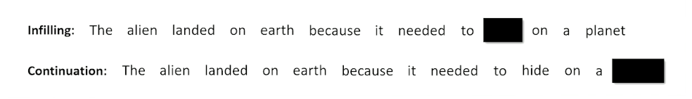

### Introduction to Transformers

Current state of the art, at least in 2023. 

Recall that:

* RNNs process one time slice at a time, passing the hidden state to the next time slice
* LSTMs improved the encoding to the hidden state 
* Seq2seq collects up hidden states from different time steps and let the decoder choose what to use using attention
  * Note how the decoder is side-by-side by the encoder and has it's own inputs in addition to the hidden state (token from the previous time step)
  * $x_s$ are the inputs to encoder, $h_s$ are the outputs
  * $y_s$ are the inputs to decoder, $\hat{y}_s$ are outputs
  * Loss computed on $\hat{y}_s$

  {: width='400' height='400'}

To add:

* Recurrent Neural networks, LSTMs, and Seq2seq exists because recurrence means we don't have to make one really wide neural network with multiple tokens as inputs and outputs. 
  * The wide model was originally considered a bad idea because:
  * inflexible with regard to input and output sequence lengths
  * computationally expensive 
* But sequence lengths is not a big deal if you make $n$ ridiculously long (~1,024 tokens) and just pad one-hots with zeros if the input sequence was shorter. 
* Computation also got alot better capable of more parallelization
  * 2017: First transformer (65M parameters) was train on 8 GPUs for 3.5 days 
  * 2020: GPT3 Transformer (175B parameters) was trained on 1,024 GPUs for a month 

### Transformers: Combining 3 Concepts

Introducing transformers - Combine 3 insights/concepts.

First concept: Encoder/Decoder that operates on a large input input window consisting of a sequence of tokens 
  * Entire input and output sequence provided at once
  * Like Seq2seq the decoder takes a hidden state and entire output sequence, which no longer needs to be generated token by token. 

{: width='400' height='400'}

Second concept: Masking
* Blacking out tokens so that the network has to guess the missing token
* One way is infilling: Guess a word in an arbitrary position in the middle of a sequence 
* Another way is continuation: Guess the word at the end of the sequence.
* Transformers are sometimes called masked language models
* Recall: We have seen this in word2vec is a robust way of learning to embed 

{: width='400' height='400'}

Third concept: Self-attention
* Instead of collecting up hidden states from previous time steps, all time steps are "Flowing" through the network in parallel
* Each time step can attend (softmax and dot product) to every other time slice. 
* As if network has to guess each word - what other words increase the odds of the actual word?

{: width='400' height='400'}

* For example, a word like alien might want to attend to words like landed and earth, because alien is involving in the landing and is involved in this entity called earth and earth is the planet. So earth and planet seems to mean the same thing, as well as alien and "it". 

So when we put all of these things together, we are going to have a very large network:

{: width='400' height='400'}
*Credit: https://github.com/markriedl/transformer-walkthrough*

So we have an encoder/decoder situation with encoder and decoder side by side as we are often used to seeing, and then we start to deal with all these concepts of attention and masking and so on. 

We will walk through the encoder and decoder, and discuss some note worthy transformer architecture such as BERT and GPT. 

### Transformer Encoder

The focus here is on self attention inside the encoder - each position in the sequence is able to select and incorporate the embeddings of the most relevant other positions. 

{: width='400' height='400'}

* Given a sequence of tokens $x_1,...,x_n$ and a mask (in the above image $x_2$ is masked)
* Stack the one-hots to create a matrix
* Embed the one-hots into a stack of embeddings 

{: width='400' height='400'}

The problem is:
* The network doesn't know what order the tokens came in
* Add positional information to each element of each embedding

What is a positional embeddings?
* Sine and Cosine functions at different scales 
* Each embedding get a small number added or subtracted
* Identical tokens in different places in the input will look different 

{: width='200' height='200'}

Set aside a residual 
* A branch in the computational graph 
* Tensor is untouched on one branch and manipulated on the other branch
* The manipulations are then applied to the residual and merged with the residual copy 
* [This will be revisited in the future to understand why we need this residual](#self-attention-process-outputs)

{: width='200' height='200'}

* All dimensions of all tokens are made relative to the mean $x' = \frac{x-mean(x)}{\sigma(x) + \epsilon}$
* After normalizing, add trainable parameters $(W,b)$ so that the network can adjust the mean and standard deviation how it needs $x'' = Wx' +b$

### Transformers: Self-Attention

Self-attention is a mechanism to capture dependencies and relationships within input sequences. It allows the model to identify and weigh the importance of different parts of the input sequence by attending to itself.

{: width='400' height='400'}

* Make three copies of the embeddings
  * Don't over think it, just think of a hash table
* A normal hash table matches a query (Q) to a key (K) and retrieves the associated values (V)
* Instead, we have a "soft" hash table in which we try to find the best match between a query and a key that gives us the best value
* First we apply affine transformation to Q,K and V
* Learning happens here - how can Q, K and V be transformed to make the retrieval work best (results in the best hidden state to inform the decoder)

{: width='300' height='300'}

* How does a query match against a key?
* Multiply Q and K together to get raw scores

{: width='300' height='300'}

* Apply the mask to indicate tokens that cannot be attended to (make numbers in masked rows close to 0)
* Apply softmax to "pick" the row each token thinks is most important 

{: width='400' height='400'}

* Each cell in the scores matrix indicates how much each position likes each other position
* Softmax means each row should have a column close to 1 and the rest close to 0
* Multiplying the scores against V means each position (row) in the encoded $x$ grabs a portion of every other row, proportional to score. 

Example:

{: width='400' height='400'}

* In Q, the softmax is 0/1 for simplicity, in reality they are all probabilities so we will get a little of everything.
* So what we can see is it is shuffling/jumbling up the embeddings - the one closest to 1 will preserve the most values. 

We will see in the next section how we make use of this "jumbled up" embeddings.

### Self-Attention Process: Outputs

{: width='400' height='400'}

Apply a linear layer learns to do whatever is necessary to make this jumbled up set of embeddings to the next stage. (Instructor says whenever you are not sure if it is required to alter the weights, just a linear layer :smile:)

{: width='400' height='400'}

Now, coming back to the residual:
* Remember it was a pure copy of the embeddings 
* Results of the self-attention are added to the residual 
* Important to retain the original embedding in the original order
* reinforce or inhibiting embedding values (according to the transformation just before it)
* Now each embedding is some amount of the original embedding as well as some proportion of every other embedding attended to.

{: width='300' height='300'}

* Set aside the residual a second time
* Layer Normalization
* Learn to expand and compress the embeddings
* Expansion give capacity to spread concepts out
* Compression forces compromises but in a different configuration
* Re-apply residual

In summary:

* Stack the embed a sequence of $n$ tokens
* Split the embedding into query, key, and value and transform them so that Q and K can be combined to select a token from V with softmax 
* Add the attended-to V to teh residual so that certain token embeddings are reinforced or diminished but never lost 
* Do steps  2 and 3 $k$ more times to produce a final stack of $n$ hidden states, one for each of the $n$ original tokens

### Multi-Headed Self-Attention

One last small detail to our encoder: Multi head 

* The encoder configuration is single-headed self attention
* Each token can attend to one other token
* But we might want each token to attend to more than one token to account for different contexts or word senses 
* Multi-headed attention applies self attention $h$ times

Note that we sacrifice embed\_len in this case, but we can simply extend it in the earlier layers if we need to. 

Then, we still do the same thing to multiply our Q and K together:

{: width='400' height='400'}

To summarize:
* Each token position can select $h$ different token positions 
* Each $h^{th}$ of each token embedding is a separate embed 
* When unfolded, each row is now a combination of several other token embeddings
* Important because each token may be informed by the presence of several tokens instead of just one other token. 

### Transformer Decoder

Now, we turn our attention (pun intended) to the decoder side of things which will show us how we made use of the output from the encoder.

{: width='400' height='400'}

* The decoder is almost the same as the encoder
  * It still outputs the residuals and store a separate copy 
* Like Seq2seq, the decoder will take the hidden state from the encoder
* It also takes an input the $y$ tokens, as if seq2seq was teacher-forced
* The decoder-output will be a log probability distribution over tokens. 

{: width='300' height='300'}

Again, similar steps with the encoder, and this make things ready for self attention again.

* The embedded tokens are $Q$ 
* The major difference is now we do not make $K$ and $V$ copies

and instead:

{: width='400' height='400'}

* Hidden state from the encoder is copied into $K$ and $V$ 
* Decoder has to learn (linear parameters) how to match the best key to get the right value
* Doing so increases the probability of guessing the right output tokens 

{: width='400' height='400'}

* The above diagram shows single headed but we actually do mutli headed 
  
{: width='400' height='400'}

* And continue to send up the chain and do some linear transformations 
  * Also add the residuals that is created during the decoder. 

{: width='300' height='300'}

* The decoder creates the query to be applied against the key and value from the encoder
* Learn to select the most important hidden state from the input
  * Do this $n$ times

{: width='400' height='400'}

And finally, we have the generator:
* basically just the expansion out to the vocabulary / prediction.
* Remember here we are interested in the original masked location, so we go back and figure out the masked-out probability distribution (in this case $x_2$)
  * Ultimately what we care about from a generation standpoint

For computing loss, we only look at the masked positions(s)
* Compute KL-divergence between each predicted token $\hat{y}_{masked}$ and the actual token $y\_{masked}$
 
### BERT

### BERT Training Examples

### GPT

### GPT Examples

### Fine-Tuning and Reinforcement Learning

Target: Before Orchard

### Instruction Tuning

### Reinforcement Learning

### Reinforcement Learning for Text

### Code Analysis Introduction

### Code Analysis: Self-Attention Module

### Code Analysis: Decoder

Target: Finish up tuesday

[Transformer Walkthrough Code](https://github.com/markriedl/transformer-walkthrough)

<!--  -->