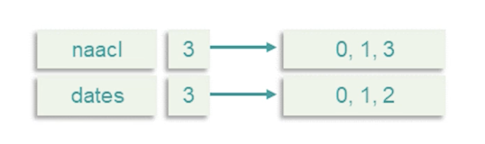

### Classical Information Retrieval

* Information retrieval means **searching for relevant information** which satisfies **information need**
* Usually from a large collection of text documents
* Most notably the web, but also emails, personal/work documents, legal. ....
* Arguably the defining **task** of the information age.

We will go through the basic task definition and also a few retrieval paradigms:
* boolean retrieval
* Ranked retrieval
* Vector-space models
* Probalistic IR

As well as metrics and evaluation 

{: width='400' height='400'}

For the task of information retrieval:

* Assume fixed set of documents for now
* Example user information need:
  * "Find out when my NAACL paper is due"
  * Example query: "naccl dates" 

At the heart of information retrieval system, a document **d**, given query **q** is relevant, if it satisfies the user **information need** and not relevant otherwise.
* Note, relevance is defined with respect to the original information need, and only indirectly relates to the query
  * e.g document containing the terms "naacl", "dates" could be irrelevant, if it doesn't contain the actual paper deadline
  * Relevance can be ambiguous
    * Which date am I looking for?
    * Which year?

Before diving deeper, we need to understand **precision** and **recall**:
* Given set of results document, $R = \{d_1,...,d_n\}$
* Precision : Of all documents in $R$, what fraction are relevant?
* Recall: of all documents which are relevant in the collection, what fraction appears in $R$. 

The simplest way of implementing text retrieval is by matching terms of words in the query to terms in the document, known as term-matching methods. For example:
* How to search for terms ("naccl","dates") in documents?
* Searching through all documents is slow
* Return documents with naacl AND dates? 
  * How about more complicated queries like OR, or naccl and NOT 2021 etc.
*  Efficient implementation of such systems need to pre-compute and store term inclusion in documents so queries can be executed faster. 

**Term-document incidence matrix**

The data structure which stores the inclusion of each term for each document is called the term-document incidence matrix.

{: width='400' height='400'}

Each column in this matrix is a document, and the number of columns will be the number of documents in the collection. 

Each row is a term or a word, any term which appears anywhere in the collection will have a row in this table, and the number of rows is equal to the number of unique terms that appear in the collection. 

The entires in this matrix are binary, if a term appears in that particular document, the entry is one, otherwise it is zero. 

So, given such a term-document incidence matrix, we can quickly see how to calculate the set of documents, which are both naacl and dates. 
* we simply take the binary row vectors corresponding to naacl and dates and perform a bitwise and operation. 
* The resulting binary vector indicates the relevant documents. In this case only the first two contain both naacl and dates.
  * Extends to other type of queries as well. 

This idea is pretty simple, but:
* Problem: term-document matrix can be too large even for moderate size collection
* Case study: As of 7 march 2022, there are over 6million English Wikipedia containing over 4 billion words
* If we assume 1 million unique terms, that's over 6.5 trillion bits to store 
  * And if we talk about the web, it is even larger.

So what can we do to reduce this search space? one stright forward way is to use **term normalization**

* Lower case, drop punctuation
  * e.g Ke\$ha $\rightarrow$ kesha
* Stemmization, lemmatization
  * am, are, is $\rightarrow$ be
  * organizes, organizing $\rightarrow$ organize
* Remove stop words
  * The, a, of , ...
* Highly language dependent
* Precision-recall tradeoff 
* but.... Index still too large. 

One critical observation we have to make to address this problem the term document index matrix is sparse. 
* For example in wikipedia if each article only has 630 words over 1 million vocabulary, over 93% bits is not required.

We can overcome this with **the inverted index**, it consist of an index of terms, for each term, store indices of documents which it appears in (sorted)

{: width='400' height='400'}

* This is also known as the posting list
* It also stores the term document frequency 

Supporting boolean queries with this matrix can be done as follows:

{: width='400' height='400'}

* Each doc is a **bag of words**
* Process AND queries by merging lists
  * Linear of $L_1 + L_2$ (Why we sort)
  * See that we still retrieve the first two documents (0,1)
* Can also do OR, NOT, recursive
* Optimize by doing rarer terms first (Why we store document frequency)
* Boolean search with inverted index was the dominant IR tool for decades
  * still used for email, document search etc. 

**Phrase Queries**
One question/problem that comes up is what about phrased queries (multiple words)?

* How to handle "red hot chilli peppers"?
* Can index all n-grams as terms
  * But this is way too large
* Instead, we can index bi-grams, chain them together:
  * "red hot", "hot chilli", "chilli peppers"
  * Can have false positives
  * But even so, the number of indexes are still too many 
* Solution?
  * Use positional index. 

{: width='400' height='400'}

* Store the index of each position the term appears in the document
* Can use a two-stage merge algorithm to support phrase queries 
* Can also support proximity searches

The clear drawback of positional indices is their complexity. 
* There are 2-4x larger than regular term index (roughly 50% of original text size)
  * Frequent terms are especially expensive 
  * Can use compression to reduce size
* Can be combined with bi-gram index
  * Index popular bi grams (e.g Michael Jackson) as terms. 

### Ranked Retrieval

In practice, we care about the order of documents. 

* Boolean search often results in a feast (too many results) or famine (too few results)
* Good for experts
  * Know how to formulate query to get manageable results
  * Get exactly what you search for
* Good for machines
  * sift through 1000 of results
* Not great for people

Introducing Rank retrieval:
* Return a ranked list of results, sorted according to relevance
* More user friendly
  * Manageable top-k list of Results
  * Uses **free text query** vs Boolean operators

More on the ranking model:
* Assign a **relevance** score to each (query, document) pair.
  * Basic Example, Jaccard Similarity
  * Document A, query B are a set of words, $j = \frac{\lvert A \cap B\lvert}{\lvert A \cup B\lvert}$
  * 0 if no intersection, 1 if $A=B$
* Does not consider:
  * Frequency (count) of query terms in document
  * Rare words are more informative than common words
  * Length of document or query

So, how can we improve on this?

* Consider a single term query
  * Score should be 0 if term is not in document 
  * Score should increase with increasing ${tf}_{t,d}$
* How should score increase?
  * Sub-linearly (words appearing 50 times vs 5 times, its not 10x relevant)

$$
tf_{t,d} Score = \sum_{t\in q \cap d} 1 + log\ {tf}_{t,d}
$$

**Document frequency** - What about entire documents then?
* Rare words are more informative
  *  "naacl dates" - naacl far more informative
*  Two ways to account for it:
   *  Collection frequency: count of term in the entire collection
   *  Document frequency: count of documents in which the term appears 

$$
idf_t score = log_{10} \frac{N}{df_t}
$$

* IDF stands for inverse document frequency 
* Document frequency more robust to outliers and Spam
* idf score has no effect with single term queries
* Some versions drop log

### Term-Frequency Inverse-Document Frequency (TF-IDF)

$$
TF-IDF score = \sum_{t\in q \cap d} 1 + log\ {tf}_{t,d} \ times log_{10} \frac{N}{df_t}
$$

* Best invented weighting heuristic in IR
* Many variants
  * with/without logs
  * Can also weigh query terms

{: width='400' height='400'}

{: width='400' height='400'}

Choosing which one to use is a matter of experimentation.

Revisiting our term document incidence matrix:

{: width='400' height='400'}

To calculate TF-IDF, for each cell, you see we calculated the log term frequency multiplied by the log inverse document frequency, then given a query, its just a matter of summing up the TF-IDF values for each term in the query. 

{: width='400' height='400'}

We still see the first and second document being ranked as top 2, which is expected.

### Probalistic Information Retrieval

In probabilistic information retrieval,

* Relevance is ambiguous and hard to defined
* A statistical approach seems apt 
* Rank documents by probablity of relevance 
  * $P(R = 1 \lvert d,q)$
* How to model $P$? 

Lets look at the simplest approach: Binary independence model.

Here we just consider the query and documents as represented by a bag of words. The order of terms does not matter and we can just represent the document type query by the term incidence vector. This is just a binary vector of zeroes and ones, the size of which is the vocabulary size. Each entry is one if the term appears in the document and 0 otherwise. 

Moreover, we assume that they appear independently of each other given the query and relevance label, and this is the critical assumption behind this binary model. With this assumption and this formation, let's see what the relevance probabilities end up looking like:

{: width='400' height='400'}

We will look at the odds of a document being relevant. We will look at the odds of a document being relevant. In other words, how much more likely is it that this document is relevant than it is not relevant. We will use this as our ranking score function.

Ranking by the odds is clearly equivalent to ranking by probability of relevance, but makes the math a little cleaner. If we break down the probabilities by the chain rule, we get two terms, The second one is the odds of relevance condition on the query only. Since this is fixed for a given query, it has no effect on the ranking, so we can safely ignore it for our purposes. 

The first term, is the probability of generating a document conditioned on the query and condition on the relevance label. For the binary independence model, since we assume term incidents to be independent, we can factor this probability for each term. We introduce a little bit of notation here to make the equations easier to follow.

Let $P_i$ be the probability of term $i$ appearing in the document given the document is relevant. And similarly, $r_i$ is the probability of the term appearing given that the document is not relevant. These corresponds to the quantities in the numerator and denominator of our ranking score respectively. 

Using the independence assumption now we can break down the fraction into product over all term indices and also group the product for term indices which are one which appear in the document and term indices which don't appear.

Now, lets consider the case that $q_i = 0$, in other words, a term which does not appear in the query. To further simplify things, we assume these terms don't give us any information, they appear with equal probability whether the document is relevant or not. With this assumption, we can regroup the terms to come up with this final equation here, which is highlighted. This is the product overcoming terms which appear in both $d$ and $q$ multiplied by another product which is over the query terms only. We notice that the second term is constant for a fixed query, therefore it has no effect on ranking, and that leaves us with just the first product which conveniently only consider terms that are common to documents and query. 

{: width='400' height='400'}

So lets take a closer look at this ranking term, Taking logarithms, we end up with a sum of scores and two terms that appear in the score. One is $\frac{1-r_i}{r_i}$, recall that this represent terms probabilities in the not relevant case. 
In this case, the probabilities should be approximated as the unconditional probability of this term, since the vast majority of documents will not be relevant. Since most terms appear only in a small fraction of documents, $r_i$ is smaller, this fraction should be very close to inverse document frequency. So this provides a very nice justification for the IDF term in TF-IDF. 

The second term, the term involves $p_i$'s is tricker to estimate. So recall that $p_i$ is the probability of a term $i$ appearing indicates the raw document is relevant. Intuitively, this should be a non-trivial probability as we're expecting a query term that appear in relevant documents with significant probability. If we have a training set with relevance labels, we can try to estimate this probability. Otherwise we can just say $\frac{p_i}{1-p_i}$ to be a constant and hope for the best. 

### Probalistic Information Retrieval (BM25)

The BIM (binary independence model) is a very simple ranking model, and makes a bunch of assumptions, some of which are justified in in practice and some of which might not be. 

For instance, the independence of terms in documents is a very strong assumption which help keep the math simple, but almost surely not accurate in practice. 

Another assumption is that terms that do not appear in the query do not appear the ranking.  It i is easy to think of counter examples, for example, synonyms or translate it to the query terms but are not exactly the same, should surely affect the document ranking. 

The boolean bag of words representation for queries and documents is yet another simplification, which is not neccesarily accurate. There are cases where word or order / freuqencies matters as in often used example, man bites dog versus dog bites man. We've talked about booelean relevance, and there are more fine main notions of relevance which can capture this document is more relevant than that document. 

Finally, the assumption that the relevance of each document is indpendent, this one intuitively make sense but when you consider the value of the set of results that we return rather than each document in isolation, then it's actually better to consider overlap and diversity between documents. For instance, if there are duplicates in our collection of documents, won't add any value to return a bunch of those in the result set.

So, clearly the BIM model can be improved in various way and we will look at how to remove at least some of these assumptions. 

**BM25**

One such model is what is called the BM25 Model, which stands for best match 25 since the authors tried a lot of variants and arrived at the 25th try. 

* Generative document model similar to BIM in words that drawn IID from multinomial distribution.
* In contrast to BIM, term frequency is not Boolean by this model as mixture of two poisson distribution depending on whether the term is elite or not. 
  * Elite word here means terms which are specific to the central topic that the document is about versus other terms which the document just happen to mention. Each document is assumed to be composed of these two groups of terms. 
* The log odds ratio is approximated by $\frac{tf}{k+tf}$ where k is some constant. 
  * This is function is increasing return frequency and it saturates at one, and k is a parameter which controls slope of this function and can be set empirically. 
  * The rest of derivation is similar to the beam model. 

{: width='400' height='400'}

So far we have not really considered the effect of document length. 
* Longer document are more likely to have higher term frequency, it might make sense to normalize term frequency with document length. 
  * however hte effect might be more complex, for example longer documents may have larger score, in which case they might be more likely to be relevant.
  * But they could also just be more spammy nad repetitive in which case they are less likely to be relevant.
* The solution here is to normalize to some extent but set the normalization parameter empirically. In this case, we set a parameter b between zero and one, where zero means normalization and one means normalization proportionally to document plans. 

{: width='400' height='400'}

Putting that together, at the top we see the expression for the score rebuild without document length representation. Consists of the inverse document frequency term, which follows from the independence of terms as we saw in the BIM derivation. 

We also see the term frequency appealing, which we just talked about, which comes from the poisson mixture approximation. As you can see, after all that meandering, it ends up looking very similar to TF-IDF, just some more smoothing provided by this parameter k. Now on top of that, we add the document length normalization, which normalizes both term frequency terms in that direction, and that gives us the full BM25 ranking score. 

{: width='400' height='400'}

This BM25 model has a total of just two free parameters which can be determined from data.

* k control term frequency weight 
  * k = 0, gives binary model
  * k large, gives raw tf 
* b controls document length normalization,
  * b = 0, no normalization,
  * b = 1, full normalization
 
### Metrics and Evaluation

To measure performance, we need datasets in information retrieval that takes the form of a search relevance dataset.  Such a benchmark dataset consists of the following:

* A document collection ( e.g wikipedia articles, news articles, etc...)
* A set of queries
  * Ideally samples from real user queries
* Relevance labels for each (q,d) pair
  * Could be binary or more nuanced

Given such a dataset with adequate size, we can build, run, and evaluate information retrieval models. However,

* Infeasible to label all (q,d) pairs, even with crowd sourcing 
* Instead, fetch likely candidates (by using a simple model like TF-IDF), only label those
  * needs a working IR system (model bias), which leads to bias to generate these initial candidates. Clearly all (q,d) pairs we label has to come from retrieval results of this basic model. And conversely if this model is unable to to retrieve the correct documents for subqueries, those will not appear in our datasets.
  * There will be false negatives, and there will be bias. 
    * Unfortunately there is no easy solution other than making sure you label enough candidates from this baseline model. 

Example of relevance datasets:

Some of the most popular and earliest examples of relevant data sets were produced for the TREC Text REtrieval Conference. This conference rose in popularity with that advance and success of web search engines as multiple tracks for web search, deep learning models,  question-answering legal medical domains etc.

One of the largest pops in information retrieval benchmark is the MSMARCO dataset from Microsoft. This dataset consists of almost million queries from real search logs of tubing search engine coupled with 8.8 million excerpts or passages from web pages retrieved by being for these queries. The dataset comes with multiple relevance labels for each query and also includes human-written free-text answers to a subset of queries which are posed as questions.

{: width='400' height='400'}

A more recent benchmark or rather a collection of benchmarks for retrieval is BEIR. BEIR collects together IR data sets from diverse set of domains such as web search tweets news or scientific articles. The original motivation for the benchmark was to evaluate generalizability of retrieval systems to new and unseen domains. This continues to be an active research area. 

### Metrics

A good retrieval system should put relevant documents above non-relevant ones. There are various metrics to quantify this idea. To recap Binary legitmate metrics precision:

* Binary IR metrics
  * precision, recall
* Ranking metrics
  * Precision at K -  the ratio of correctly identified relevant items within the total recommended items inside the K-long list
  * MAP (mean average precision)
  * MRR (Mean Reciprocal Rank)
  * NDCG (Normalized discounted cumulative gain)

**Precision at K PR@K and MAP**

{: width='400' height='400'}

If we have an ordered set of documents we can calculate precision for the top k documents returned for any k. We refer to this metric as precision at k.

Precision at k is obviously a function of which k we pick. Should we look at just the top from k=1 or should we use k=10? A model might be better for one but not the other. Sometimes we know what k makes most sense for our application for instance we might be presenting 10 results in the first page of results in which case k=10 equals might be a good choice. However sometimes it is desirable to have a single metric to pick the best model overall.

Mean average precision or MAP is one such metric. MAP is the average of precision values at values of k which correspond to the ranking of the relevant documents. In this example there are four relevant documents:

* Their ranks are 2, 4, 7, 8
* Calculating precision values at those rank which is 1/2,2/4,3/7,4/8
* Which gives average precision of 0.482 
* MAP (Mean average precision) is the mean of average precisions for over all queries in our evaluation dataset.

If there are no relevant documents in the results the mean average precision is clearly zero. Also note that the contributions corresponding to each relevant document in the results is weighted equally. So this assumes the user is interested in all the relevant documents which might or might not be the case.

Another drawback of MAP is that it works best when there are many relevant labels in our dataset for each query.

**MRR - Mean Reciprocal Rank**

{: width='400' height='400'}

Mean reciprocal rank, or MRR, only considers the first relevant result. It's defined as one over the rank of the first relevant result averaged over all queries. This is motivated by applications where a single relevant result is usually able to satisfy the users information need. For instance for a web search we’re usually not interested in reading all the web pages which might be relevant once we find the information we’re looking for. Also if we assume the user is scanning results from top to bottom the rank of the first relevant result should be correlated to the time and effort spend by the user to find what he or she is looking for. This justifies the use of reciprocal rank metric as a proxy for user effort.

**NDCG - Normalized discounted cumulative gain**

Normalized discounted cumulative gain or NDCG is another often used metric for retrieval. It is the only one we’ll cover which takes into account non-binary relevance ratings $\{0,1,2,...\}$.
* Which means it can discriminate between highly relevant documents and just moderately relevant ones.
* Another property of this metric is that it assumes lower-ranked documents are less useful to the user similar in spirit to MRR.

* Ratings in ranked order for top n docs: $r_1,...,r_n$
* cumulative gain $(CG) = r_1 + ... + r_n$
  * If this is binary, is equivalent to using precision at n.
* However, since we higher ranked documents to be more important, we can discount them by rank and then sum them:
* Discounted CG = $r_1 + r+2/log 2 + ..., r_n/log_n$
$$
DCG = r_1 + \sum_{i=2}^n \frac{r_i}{log i}
$$

NDCG:
* Normalize DCG at rank n by the ground truth, maximal, DCG value at rank N
* Useful for queries with a varying number of relevant results
  * Notice that the discounting here is logarithmic, whereas in MRR it was linear. 
  * So NDCGS discounting is more mild than MRR

The last step is to normalize the discounted cumulative gain by the maximum value at each rank. How do you find this maximum value? We take the best possible ranking that is rank all documents in order of their relevance labels and calculate DCG on this ground through ranking. Normalizing in this way is useful to have consistency with queries having different numbers of relevance labels and relevant results. It also ensures the value is always between zero and one.

An Example:

{: width='400' height='400'}

We have three levels of relevance here with r equals 2 being most relevant shown by the dark green squares r=1 is medium relevance shown in a lighter green and r=0, not relevant, are the light squares.

We have three medium-relevance documents and one high-relevance one in this example. If we just sum up the ratings that would give us cumulative gain and that would be equal to five in this example.

To get discounted cumulative gain we divide by the log ranks for instance the first medium relevance document is at Rank 2 so we divide it’s rating by log of 2 and so on giving us a DCG value of 2.69. In the below figure we show the ideal ranking. So here we ordered documents by the labeled relevance ratings. We can recalculate DCG for this ranking which of course results in the higher value of 3.13. Normalizing 2.69 by 3.13 gives us the NDCG metric value which 0.859.

So relevance benchmark datasets are a good way to measure progress especially in IR research but at the end of the day what we care about is real user value from an online system such as a search engine. When we have a working system with users there are more direct ways to measure improvements by leveraging feedback from the user such as click data which are cheap and plentiful. We won’t talk about this topic in any detail but I wanted to give one example how one could make use of this to compare two retrieval models in an online setting.

Say we have two competing ranking algorithms and want to decide which is best. What we can do is combine results from both systems and present the interleaved results to the user in random order. Then we aggregate clicks while tracking which result comes from which model. At the end of the day the algorithm with the most clicks wins. This is a very simple instance of what we call A/B testing which is the main method by which commercial IR deployments are tested and evaluated and improved.

We are at the end of our lecture on classical information retrieval methods.

We’ve talked a lot about term-matching methods which are simple and powerful at the same time.
However, these methods only rely on the surface form of words and have no deeper understanding of semantics
These methods don’t work well with natural language and instead prefer a list of keywords.
With the increasing volume of data that we have we can start building better models which understand things like context and synonyms and can work well with natural questions directly return answers to user queries using tools from machine learning and deep learning. This course is about natural language processing and in the next lecture hopefully we’ll talk about how machine learning and natural language process methods are used in retrieval systems

### Neural Information Retrieval

Information retrieval is the task of **searching for and retrieving relevant information** which satisfies the user's **information needs**. Information retrieval models are everywhere and the web as we know it would not function without them since there's so much information out there there is simply no way of getting value out of that without retrieval.

Previously we discussed the foundations of information retrieval and covered term-matching heuristics like TFIDF which are very robust and effective and have been the dominant tool in IR until recent years. Now we will go back to the origin trade-off of this lecture series and see how tools from machine learning and NLP can help improve retrieval models.

* First we will look at Machine Learning for IR (aka Learning to rank)
* Retrieve and rank pipeline
* Embedding based IR 
* Neural retrieval (Neural Network Methods)

{: width='400' height='400'}

Here's the outline of a typical IR system. Classical text search engines have been heavily dependent on text matching heuristics such as TF-IDF which decide documents relevance based on whether the document contains terms exactly match the terms which appear in the user's query.

However we all know modern search engines are a lot more complicated than this. First of all we usually have access to a lot more information than just takes the query and documents. For example we might know information about the domain from which to a page counts from, the freshness of the context. We can extract PageRank and information from hyperlinks pictures and potentially hundreds of more features.

There is no way for a term matching system to make use of this information. Moreover we have a lot of data in the form of user click logs and large labeled retrieval datasets which we can and should use to make our models a lot more precise. TF-IDF variants are robust but rigid and cannot really make use of any of this information. Instead we can use powerful machine-learning algorithms, gradient boosted decision trees, neural networks to learn from this vast amount of information and build information retrieval systems which better understand and fulfill the user's information needs.

To see how information retrieval can be cast as a machine learning problem consider the ranking model

* For each $(q,d)$ pair consider a function:
  * $f(q,d)\rightarrow s$, where $s$ is a relevance label
* $s \in \{0,1\}$: binary relevance (binary classification)
* $s \in \{0,1,...,k\}$: multi level relevance (multi-class classification)
* $s \in \mathbb{R}$: binary relevance (regression)

{: width='400' height='400'}

Here is how we would train such a model. Suppose we have a standard search relevance dataset comprised of (q,d) query document pairs and the relevance label for each row. We combine this with a table of features that we extract from each query document pair. We can include our regular text matching scores here like tf, term frequency, and IDF, documents frequency, at other query and document level features such as query and document lengths, PageRank, freshness of the document etc. We could even include user features or location features for personalization. At this point we have a complete dataset for training a machine learning model and we can pick our favorite algorithm to do that be it logistic regression SVMs decision trees or anything else.

**Reranking pipeline**

{: width='400' height='400'}

Training your model in this way is conceptually simple.

However it would not be possible to name this such model since each query we would need to run the model on every document in the collection to calculate the ranking. Remember that the classical information retrieval methods that we covered in the last lecture I designed for fast retrieval from start making use of very simple heuristics and efficient data structures such as inverted indices to return results quickly even for huge document correlations. By using machine learning algorithms obviously introduces a lot of complexity and how to incorporate that without ballooning the computational cost needed samples.

The simplest way of making use of machine learning models is to incorporate them in a reranking setup. In any ranking pipeline we rank documents in two steps. In the first step we reduce the large collection of documents into a shortlist of potential relevant candidates. For this step we need to use a fast retrieval heuristics such as TF-IDF. But in the second step since the number of documents now is more manageable anywhere between K=10 to a few thousands of documents we can use our trained machine learning models to score each candidate documentaries respect to the query and to re-rank them. If the recall of our first-stage system is adequate then we get both the advantages of using a powerful model and manageable latency we get from the past first stage retrieval system. We can also add even more steps of reranking where at each stage we shrink to pull off candidate documents but the model we use increases in complexity and cost. Thus the reranking pipeline is neat and often used way to trade off computational cost and accuracy in the retrieval system.

### From Classification to Ranking

In previous sections we saw that information retrieval can be cast as as a classification problem. However this is not the most natural formulation

* classification only defined an absolute notion of relevance
* Ranking requires us to consider not only whether a document is relevant
    * but also if it is more or less relevant than competing documents
* In practice classification is
  * good for discriminating random irrelevant documents
  * but not for superficially relevant onw
* To overcome these issues native ranking methods have been introduced.
  * An example is using pair-ranking objectives instead of a point objective ranking classification
  * Another technique is using hard negative examples
    * which are documents which looks superficially relevant but don't really answer the query and show as false positives
    * Using these difficult examples and training can help the model learn a more fine notion of ranking

{: width='400' height='400'}

So to make things concrete let's go through the components of as simple logistic regression classification model and compare it to an equivalent pair-ranking set up.

In classification the quantity of interest that we're predicting is probable to of relevance given a query document pair the scoring function takes in a single query document pair and output a single score $s_i$ which is essentially a point estimate for each document $d_i$. Then the model is say the probability is equal to the sigmoid or the score function. 

So to train this model we have a list of documents with binary relevance labels. The labels evaluate each document independently. The loss is cross entropy loss which is just the log probability of the correct labels under our model which is log of sigmoid of s in this case if the label y is 1 or log of 1 minus sigmoid of s, y is 0. After simplifying that a little bit that comes $1-y_i$ times $S_i$ minus log of sigmoid $s_i$. Now if you look at the gradients of the loss with respect to the model parameters w we simply get the derivative of the score function with respect to w multiplied by the error which is the difference between our predictions sigmoid $s_i$ minus the label $y_i$. This Lambda or the error determines the step we take training the model with gradient descent.

{: width='400' height='400'}

Now in the pair-ranking set up instead of modelling the relevance probability of a single document in isolation we model given two documents, the first document is more relevant than the other. You can still use a point-wise scoring function as in the classification case but the model now takes two sides scores in the sigmoid. The problem desired the highest score difference between the two documents. The labels are also different. Instead of labeling each document in isolation we ask greatest peak the more relevant one out of two documents. Having raters rate this way actually can improve data quality and interleaving agreement since it is usually easier to compare two documents than to assign an absolute rating to one on it's own. So the label $y_{i,j}=1$ if $d_i$ is more relevant than $d_j$ and zero otherwise. Most calculation is identical only replace the $s_i$ in the sigmoid. Now the margin or difference $s_i-s_j$ and similarly for the lowest grade. In the end if you look at the expression for the gradient you get the expression for the step size Lambda but this time it's a function of the pair of documents i and j and represents the error of the pair prediction rather than the points prediction.

**Ranknet**

{: width='400' height='400'}

An early example of learning to rank algorithm is RankNet which was based on pair-ranking ideas. To calculate score gradient for a given query doctrine pair we consider the sum of all such $\lambda_{ij}$s for all labeled documents paired with q. Note that $\lambda_{ij}$ only depends on the binary ordering of $d_i$ and $d_j$. And in particular it does not depend on their rank difference or absolute ranking. So whether d_i is ranked first or tenth or whether $d_j$ is ranked 500th will not make a difference in the score. Also as a side note this early paper used a neural network to model the scoring function.

{: width='400' height='400'}

The more famous example is LambdaRank and it's variation LambdaMART which improve our RankNet and it's still used in many ranking pipelines to this day. We mentioned that RankNet does not explicitly consider absolute rank of documents or their rank difference. And as such it's poorly matched to popular rate retrieval metrics such as mean reciprocal rank and NDCG. If you recall mean reciprocal rank the rank of the first element documenting the results and therefore it's highly sensitive to absolute ranking. NDCG also discounts absolute rank of relevant documents although by the slower located term. And it's also sensitive to the ranking difference of documents.

The authors of LambdaRank realize that we can tailor RankNet to pretty much any metric by appropriately weighing the $\lambda_{ij}$ by the difference in the metrics score. For example instead of updating weights by $\lambda_{ij}$ we scale this by the difference in NDCG metric we would get if the ranking of the two documents $d_i$ and $d_j$ were flipped. And this small modification was shown to be sufficient to directly optimize for the target metric. LambdaMART either combines LambdaRank with gradient boosted decision trees replacing the original neural network model that showed even better performance.

{: width='400' height='400'}

LambdaMART has proven to the IR community that machine learning can have tremendous impact in ranking. However these methods are only as good as the features you feed them. And so far we still haven't discussed content features beyond just basic and ground match term frequency and documents frequency. These simplistic features do not allow for any semantic understanding therefore the search results will exhibit only a shallow emotional valence. In this class you've seen multiple groundbreaking advances and takes understanding based on large pre-trained language models for example BERT.

The question is whether BERT has similar models can be used to build search engines with more semantic understanding of user's queries and the answer to that is yes. One way of doing that is to treat BERT as a re-ranking model in the re-ranking pipeline that we talked about earlier. To do that we would train BERT in a pair classification setup. So given a query document pair. BERT concatenate them and feeding into BERT and use the CLS token representation to predict the relevance level. In this way BERT can be used as a re-ranker just like any other classification model as covered earlier. The main rollback of doing this is that BERT is an especially expensive re-ranking model especially when scoring long pieces of texts. Therefore we need to think about latency carefully we need to chunk documents into smaller chunks if needed especially since we cannot reuse any document representation in the setup. We need to rerun the model for each new query.

Nevertheless large language models are powerful and people have gotten such setups to work with large gains in retrievable performance. So soon we will also look at how to leverage such language models for first-stage retrieval retrieving from a large collection of documents and not just in the re-ranking stage.

### Embedding-based Retrieval, part 1

### Embedding-based Retrieval, part 2

<!--  -->