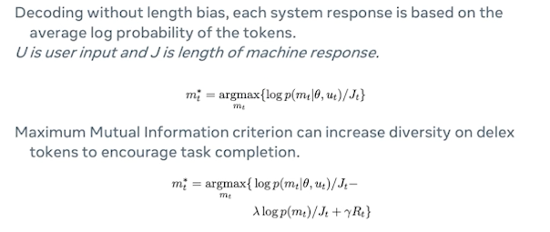
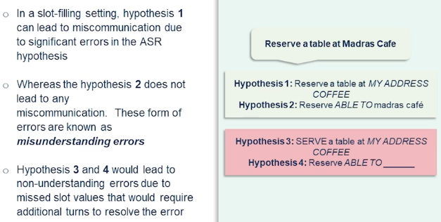

### Introduction to Task Oriented Assistants

In this section we discuss task-oriented dialogue systems. Task-oriented dialogue systems accomplish a goal described by the user in natural language. They often use pipeline approach.

The pipeline usually requires

* natural language understanding for belief state tracking
* dialogue management for designing which actions to take place based on the beliefs
* and natural language generation for generating a response.

In this lecture we will go over:

* introduction to the task-oriented dialogue systems
* Intent Prediction
* NLU and NLG Overview (Natural Language understanding NLU & generation NLG)
* Dialogue State Tracking
* Multi-tasking in task-Oriented
* Error recovery in dialogue
* Domain Knowledge Acquisition
* Evaluation & Benchmarks
* Open Problems

What is exactly a task-oriented dialogue system?

* Well if one may want to understand user utterances to perform a task. Ex: providing information manipulation of objects navigating to a specific location. In case of house robot or social robot navigating to a specific location with voice commands could also be considered as a task-oriented dialogue.
* Generating responses to user requests in a consistent and coherent manner while maintaining the dialogue history is essential for task-oriented dialogue systems.
* While the user and system turns are effectively managed we could also see that recovering from these errors are actually an important caveat that a system needs to be aware of.
* Engaging the user with adaptive and interesting conversations while progressing towards the common goal is also a key element for task-oriented dialogue systems.

Why is task-oriented dialogue a challenging problem?

* Well the context of the dialogue history is extremely noisy and often it is important to keep track of the dialogue history to achieve the task success.
* it's also important for our task-oriented dialogue system to estimate the belief state of the user while resolving anaphora, repetition of a word or phrase, references during the discourse.
* Piecing together all this information is necessary to complete this task.
* domain specific nature of a dialogue can be very challenging and it will require some form of adaptation because lack of data or lack of coverage with different users. So generalization is pretty key for this problem. And you will see why soon.
* API calls to web services could also change over time. And that will require frequent maintenance of the dialogue managers.

Task-oriented dialogues typically have three major characteristics.

* Turn taking
  * Usually dialogue is often interleaved between two speakers including the agent in this case or the system.
  * each speaker would hold the floor for certain amount of time. they take the opportunity to speak or say something or inform something or request something to the interlocutor. And then the agent responds back depending on when the user has ended their turn.
* Speech acts 
  * can be an important part of this understanding of the dialog system.
  * assertives are essentially to say the speaker actually suggests are put forward some information to the agent.
  * directives can be very different from assertives where they just ask or request information.
  * similarly commissives are speakers. Actually speaker is agreeing or opposing the agent so they say yes or no.
  * expressiveness is as simple as saying hello or goodbye.
* Grounding
  * whether the user and the agent usually agreed and have a set of information exchange
  * the agent actually acknowledged the user's exchange information.

{: width='400' height='400'}

Above is an overview of a typical task-oriented dialogue system architecture or pipeline. So when you have a speaker and he or she would say in actions and the automatic speech recognition system would recognize their options and finally run it through an intent understanding and a semantic parser which fragment the utterance into necessary components where the system could understand and it is sent to the dialogue manager which orchestrates the entire conversation history and context. And which actually interacts with the domain reasoner which basically interacts with a knowledge base or a database which is essential for providing information to the user. And then once the information is back from the domain knowledge base or a database constructive response using natural language generation module which is further sent out to a text-to-speech engine which basically synthesizes the system response in a speech form.

There are several terms that we'll be using in this lecture. And some of the important terms are domain intents and slots.

{: width='400' height='400'}

* domains: can be weather, flights, restaurants, or e-commerce
* intents: are classes that a user may initiate in a given domain. ie flight time, booking a flight or change of arrival
* slots: are basically the entities or spans that are contained in a given utterance which would essentially lead us to a certain intent.
  *  For example: book a flight intent
  *  would require arrival location, departure location, arrival time, and departure time.

### Automatic Speech Recognition

This segment is an overview of speech recognition natural language understanding, NLU, and natural language generation, NLG.

* Automatic speech recognition systems are often used in understanding user speech. These user utterances are often required to be endpointed for speech segments alone because they may also include silences as well.
* Acoustic features are computed on these endpointed user utterances This means essentially we're looking to translating these raw acoustic features to some phonemic sequence which is an approximation of how the user has produced relevant syllables in a given language.
* this phonemic representation could be further translated into subwords or full words and conditioned by the language model.

Acoustic models are typically used in order to discriminate between certain phonemes how the speakers actually pronounce certain things

* Acoustic Features: Traditionally mel-frequency cepstral coefficient 
  * whether the acoustic features represent certain phonemes or not
    * this can be done in two ways
* Acoustic Model - two different ways: 
  * Discriminative model either speaker dependent or speaker independent 
  * To realize the phoneme / subphone sequences on the acoustic features 
* then you apply a **Lexicon or a pronunciation** model based on a statistical information in a given language
  * how the syllables are constructed
  * which in turn can be realized further into words or tokens in a given language
* The language model
  * provide the token-level transitional information
  * which token proceeds which token and so on and so forth

Often in this setting you also have certain slot values.

* Slot values are specifically named entities or spans of tokens that are useful for providing information
* these slot values could potentially be out of vocabulary at times
  * if the users are requesting information that is potentially outside the domain or outside of the knowledge base that the system is trained word.
* the ASR challenges in this situation are pretty intense
  * because often the conversational speech and conversational speech is very different from a typical dictation or voice-based search.
  * So acoustic models and language models may require large amounts of data in order to address their switches where they're potentially likely to fail.
* ASR models in this situation often are evaluated on word error rate or Character Error Rate metrics
* In task-oriented dialogue setting slot error rate is more applicable that captures the errors and important information in a given speech hypothesis.

### Natural Language Understanding

Natural language understanding is composed of multiple steps, but sometimes it could be done in a joint modeling way.

* let's look into the details of **intent prediction**. It refers to extraction of semantics from the natural language utterance that a user has uttered to determine the user goal during the dialogue. 
* Then converting the **speech recognition** output to a semantic representation often involves lot of challenging situations such as
  * ASR errors could occur specifically in the slot positions where the words could be mangled around which potentially could cause misunderstanding of the user utterance.
  * ambiguity is also another issue.
  * synonyms appear often human language , multiple meanings,
    * this can cause same word being misinterpreted in different ways.

Natural language understanding typically has three phases

* **intent prediction** ( primarily goal is understanding which is information seeking or clarification )
* **slot filling** (slots relevant to the task/inputs needed to complete the task)
* **state tracking** ( maintaining a distribution of slot values and how the user conversation has progressed )

Slot filling in this case could look into the example here.

{: width='400' height='400'}

I'm interested in Wolfgang Mozart. let's say it's a music recommendation system. And you basically have defined slots as a track or the first name and the last name of the artists and the album name. You can see that the first name and the last name of the artist is captured by the system. Optionally the album or the track name could also be captured if the utterance includes it. In this case it doesn't so we simply go on to okay playing tracks by the Mozart and so the system has addressed the user's request.

{: width='400' height='400'}

Here is a more complex example where you are actually looking for a restaurant in a certain place. And this is an example from the Cambridge Restaurant Information System which is deployed in real life situation.

* user asks: I'm looking for an expensive restaurant in the centre of town
  * system responds: There are 33 restaurants
* to narrow down the search it cares about if the user actually needs certain type of cuisine
  * then the user responds back. They don't care about specific cuisine
* Then the system gets back it takes a turn
  * then says some restaurant which serves a certain particular cuisine.
  * the user is interested in the restaurant and asks the system to reserve a table.
  * the system responds back with the time and number of people who would like to be assigned to the reservation.
  * User follows up with that and the system actually books the reservation successfully and user follows up with an interesting request here which actually one would note that this is a multi-domain dialogue system. The reason being the user is asking for a place to stay which is a hotel reservation which is I would envision the system and as a multi-domain task oriented system because it requires a different set of slots it requires different set of understanding modules. The system accomplishes that task apparently.
  * As you can see the hotel area in this case is referring to the same area as the restaurant which is a conference resolution that needs to be performed by the system in order to achieve the second task.
  * The natural language understanding in principle involves several complex interaction between modules. We'll look into the details of it furthermore in the slides.

### Natural Language Generation

{: width='400' height='400'}

Natural language generation usually can take two forms: User and System initiated dialogue. Let's walk through these couple of examples in front of us.

In the user initiated setting the user drives the conversation.

And as you can see the user has asked requests about Western classical music and the system response back whether they like Mozart and the user responds they like Bach. And the system will oblige the request and also the user makes a correction to his previous request saying but they also like Mozart. And the system replies back saying they will queue and queue tracks from Mozart as well.

In this conversation the system always takes a backseat and tries to acknowledge the user's questions or confirmations. And based on that it does provide information or performs a request. In this case like adding music to the playlist.

So in the system initiative dialogue on the right hand side as you can see the system is more capable of providing array of potential requests that a user could ask. And this way the system has more control over how the conversation can be driven. So certainly it can avoid out of domain request not necessarily all the time but for most part because it's a user is aware of what the system is capable of as opposed to an end user initiated dialogue. So you can see that system preferably drives the conversation by asking whether the user could provide a genre artists or an album. And the user has given in this case the genre information and also an artist information in this case.

**Task Oriented Dialogue**

{: width='400' height='400'}

Task-oriented dialogue typically has 4-5 different states.

* first is understanding that dialogue context. The dialogue context meaning whatever the dialogue manager has previously provided or the previous conversation previous turns etc
* the belief state which is essentially what slots have been fielded and how the user has been going on with the conversation. Are they happy with the conversation or not?
* interpreting the structure database output which is essentially once the information is considered from the domain reason or our database.
* Now the system has to respond in a structured fashion using a dialogue policy. A dialogue policy enables the system to answer questions in certain ways. So whether it has to be crisp answers or they can be more elaborate depending on the dialogue state or the number of turns that have passed through during the dialogue.
* finally the generating the response and a national language fashion which either take the forms of template or a structure prediction form where you essentially have a semantic structure that maps back to a free-form natural language.

More recently people have been using sequence to sequence and encoder-decoder models in order to achieve the same and structure fusion networks are also popular methods to achieve task-oriented dialogue generation or natural language generation.

Here's an example of restaurant domain dialogue natural language generation.

{: width='400' height='400'}

As you can see the user at time t have something I'm looking for an expensive Indian restaurant. And in this case the system is already kept track of the previous dialogue history and also the database responses. So once the dialogue state tracking has updated than the belief state in this case the restaurant of interest is of type Indian. And the act generation part which is let's assume it's a neural network that basically a process which restaurant names to be added into the slots the names and the prices etc.

finally the response generation takes over on the actually manifesting the real response. So in this case you have seen that as a shared encoder which basically has the previous user history such as previous term in this case t-1. And what was the system response and the new user turns context. And also finally the database. Along with this information the system is also capable of providing a slot level attention. So that way it has a sense of which information needs to be more critically captured and where the mistakes can not happen. So in this case let's say the name of the restaurant cannot be wrong at all or it has to be in the vicinity of the user. Let's say and or in this case the criteria is that it has to be an expensive restaurant. So that adds up to the critical part of the response. Finally the system responds back saying I have five and our Curry Garden it serves Indian food and hence the expensive price range. It could also be other constraints such as the location need to be within the range of two miles or one mile and so on and so forth.

### Dialogue Manager

Let's turn our attention to how a dialogue manager functions.

A dialogue manager typically orchestrates the content and structure of the dialogue

* process the input from speech recognition and natural-language understanding modules
* track the history and the context of the dialogue in the form of a state
* exchanges information back-and-forth with the domain reasoner, to get the data back for the user
* then broadcast it to the user via natural-language generation in speech synthesis
* Dialogue managers often use data structure for storing the context and the task relevant information. 
* Dialogue state tracking is a mechanism to update this data structure so that the user would ultimately succeed in their goals.

A dialogue management can achieve this by constructing a task tree. So typically a dialogue system developer would construct this task tree using
* a finite state automaton as simple as handcrafted character dialogue task tree with fixed transitions between dialogue states.
* System typically initiates the dialogue and controls the flow in a very rigid fashion based on series of questions could be very well like a questions game.
* System may have difficulty sometimes to recover from non-understanding errors in this case.
* this is good for small and limited domain dialogue systems so that you could rapidly prototype and how the dialogue users would experience the system.
* A good example of this mechanism is VoiceXML.

And often dialogue management is through frames used by the data structure typically

* Slots and slot types are filled based on the questions posed to the user
  * ie restaurant name, reservation time, cuisine type
* Slot types are often hierarchical in nature where the slots are included in these frames.
  * Thus complex dialogues are performed via tree like dialogue state transitions
  * And you typically see slots and slot types are fail based on the questions.
* This allows multiple domains and multi-intent dialogues with slots tied to an intent.

Dialogue tracking typically consists of processing the user requests and then information and filling in the slot while keeping track of the user preferences, which could be prior information and so forth. 
* There are handcrafted base systems to track the dialogue state. 
* Or there are also probabilistic based methods where you maintain the distribution of the values per slot. 

Dialogue policy typically the mechanism how the actions can be performed what actions can be performed by a system given the dialogue contexts in the state. 
* So every system action can be determined either by a handcrafted or a train policy given the dialogue history. And handcrafted in this case could be as simple as like we discussed VoiceXML based like flowchart etc or
* the statistical one which are more sophisticated use reinforcement learning or partially observed Markov decision processes.

### End-to-End Task-Oriented Dialogue

Let's now look at an end-to-end task-oriented dialogue system, with a primary focus on how different modules discussed earlier would come together.

{: width='400' height='400'}

Let's imagine this architecture proposed by Wen et al in where you can see there are multiple deep neural networks that are involved in orchestrating different mechanisms in different phases of the user actions. So there are primarily six or seven different networks involved in this case so we'll deep dive into each one of them briefly look into how they operate.

{: width='400' height='400'}

First one is intent network where we see the sequence-to-sequence model. In this case could be applied where it could be an LSTM or a CNN or for that matter any sequence-to-sequence model which would basically consider the user's utterance delexicalize it. So when I say delexicalization you're essentially masking out the user's intent or the user's actual utterance with a typical slot value in this case the \<v.food\> is basically the value of the food type that is being masked out. And in this case the user's utterance could be can I have Indian food or can I have tacos? So that could be an utterance and then it gets masked out by their relevant slot type.

{: width='400' height='400'}

the next step is belief tracking where the belief tracking maps this input to distribution of values so it can keep track of various different values. And often the belief tracker operates per slot. So let's assume in this case it's looking at the cuisine so let's see. We can see that Korean is assigned 0.7, British is 0.2, French 0.1. and so on and so forth. And finally the output is slot values with probability scores assigned to it like we discussed.

{: width='400' height='400'}

In this setting typically a database operator may fetch multiple values depending on the slot value. So again these restaurants could also be assigned certain values certain probability or a certain way to optimize for user's preferences. So one would say let's try to apply an argmax or to optimize for users' preferences and their needs as expressed in the request. And MySQL query could typically look like this like "select * where food = Korean. this would essentially bring back all the values that are unique in nature and then sent out to the next step.

{: width='400' height='400'}

There is a policy network which sits in the middle and binds all the different modules. It's typically a feedforward layer to bind the gradients together. And you would see that Zt in this case is the intent work and Pt is basically the belief network in the equation. And Xt is the database hits which is basically that is a list of Korean restaurants in their one hard encoded form.

{: width='400' height='400'}

Next we see the generation network is responsible for generating the actual response to this user. In this case it's again a sequence-to-sequence method which is basically replacing the delexicalized tokens with a database point of values. So I told earlier that in the intent network phase we basically delexicalized what the user is intending at in order to capture their intent using the train models and that will actually help the database to figure out which are the pose potential values that we can include. And this is where replacing the delexicalized tokens with the database pointers would help in generating a valid response.

**Model Training**

Training belief networks between wizard and belief distributions can be challenging. Training end-to-end using these systems which requires some form of a visitor wall setting or wizard sentences that is like a human actually pretending to be a system and generating their response to a given user's request. So often that dataset would help us rapidly evaluate a new leader train models in this kind of a setting.

**Decoding**

{: width='400' height='400'}

At the decoding time often you decode without length bias so that you can have different lens of different responses so that you've introduced certain diversity in the response and the variability in the response. And often sometimes the restaurant names could be longer and so on and so forth.

So each system response can be based on average log probability of the tokens
* this helps to control for the machine's response so we don't over-generate text.
* it also allows sometimes the downstream speech synthesis system also be able to say that exact word the way it was intended to be. Otherwise the user would not understand the system's response even if the system response was correct.

Another method to generate these responses or decode responses is MMI
* Maximum Mutual Information criterion can increase the diversity on delexicalized tokens to increase task completion.

**Belief Tracker Performance**

{: width='400' height='400'}

So if we look into the belief tracker performance often the belief tracker which captures the slot values information and places them into distribution one might claim that precision is most important. But while the precision is important which actually measures how accurately we understood the user's request in the first place it's also important to look into the recall in this case which is the information that was returned by the database and followed up by the response generation is also accurate enough. So that is basically providing how likely the user would accept the response or the restaurant information from the system in this case.

**Interleaving Between Different Related Tasks**

{: width='400' height='400'}

As we are talking about multi-domain in one of the earlier slides it's important that the systems often make sure that when the user has requested for multiple tasks in the same utterance so in this case one may consider this example find me next transit option to downtown Manhattan and reserve a nice Thai restaurant there and not the Italian one like last time. So this had several things to unpack. So there are at least three tasks involved.

* there is a transit task involved where the system has to figure out where the user is like to head to
* then find a restaurant in that particular area. So that's a second task.
* in the third task they wanted a restaurant that was not based on their previous preferences.

So they wanted something else not the Italian food. So I think this also involves keeping track of across the session a contextual history which can be extremely challenging for a system to call back into certain past history and then figure out this is not what the user wanted. So this is where the user preferences come into play. And there are more sophisticated systems to solve this setting where this setting we will not go into the details of it but we'd like to just present this as a situation or a dialogue system could potentially face. And in this case every task needs a task-specific frame to identify slots that are relevant and maintain a context so that estimated belief values based on the task-specific constraints. And it also requires continual update of active and inactive tasks to orchestrate between these multiple tasks in a given dialogue session. So one may see that transit task is performed then it becomes an inactive task. And then now finding out the restaurant is probably more important while keeping track of the user preferences.

### Error Recovery in Dialogue

As we move further into the dialogue system stack we see that errors will obviously naturally co-occur in this kind of a setting where you have multiple tasks or even with a single task dialogue system.

So there are two kinds of errors often occur. misunderstanding and non-understanding error.

{: width='400' height='400'}

Misunderstanding errors often occur due to the speech recognition errors that occur in some form of recognition errors that can not be recovered in that particular instance but could be recovered from in a follow-up patterns. So in this case it is something like the hypothesis .

From the speech recognition, it looks like this.

* There's our table at My address coffee
* was miss recognized "My Address Coffee". And that could be recognized.

The rest of the utterance was recognized correctly except the named entity in this case "My Address Coffee". So this may lead to some miscommunication but does not really derail the dialogue.

Whereas the hypothesis doesn't even derail the dialogue because it got all the relevant slot values. And this is where slot rate like we discussed earlier when we were discussing the ASR evaluation one would say okay the slot was correct so it\'s actually % accurate. Whereas in the further down the list we see hypothesis and which lead to non-understanding errors due to missed slot values. And that will definitely require additional terms to resolve the error where the utterance does not really provide any information about what the user is intending to say.

Often there are three different recovering strategies from failed dialogue options, dialogue misunderstanding, etc.

{: width='400' height='400'}

* So first one is recovering reliable information.
  * by explicitly asking did you say or implicitly confirming I heard you say disambiguation.
  * Do you want A or do you want B?
  * Basically providing envious list options but just restricting it to two.
* you could also how the system ask the user repeat can you tell me again whatever you have said in the previous sections? And that's what obviously upset the user if it has been happening repeatedly. But it would be okay just to use that strategy once in a while. And dialogue is often something that needs to be tracked and whether you need to look into whether it's advancing or not.
  * rephrasing the formulation and providing explicit help what the system could actually do is super relevant and important.
* Finally task completion require some times restarting the dialog altogether. And sometimes you just have to terminate the dialogue because the user satisfaction cannot be achieved. And it'll potentially reduce credibility of the system altogether.

### Evaluation and Benchmarks

**Dialogue Evaluation Metrics**

* Overall empirical metrics typically include
  * task success, Number of dialogue turns, slot error rate/accuracy
* NLU Evaluation can be further broken down
  * Slot-level F1, Intent prediction accuracy
  * Belief state or dialogue state rewards
    * provide feedback to the system
* NLG Evaluation also has some nuances such as
  * BLEU, METEOR scores measure human response against reference
  * Slot error rate or information accuracy towards goal completion
    * how satisfied is the user?
* Human ratings such as Likert scale, single-turn or multi-turn evaluation are more suitable for overall interaction quality
*  Multi reference evaluations often require denoising of ratings, and higher inter-annotator agreement
   * People may or may not judge the conversations in the same light. Some might be more tolerant than the others.
* Recent work on DialoGPT proposed a FED metric that automatically measures the likelihood of generating positive/negative follow-ups for a given system utterance. These metrics would often help guide the user or the developer I would say to actually build dialogue systems that can be rapidly prototyped for a given domain.

**Task Oriented Dialogue Datasets**

{: width='400' height='400'}

**Dialogue Benchmark results**

{: width='400' height='400'}

Tongue of DialoGLUE which actually is one of the largest benchmarking platforms for the task-oriented dialogue it includes several datasets such as banking which contains about utterances related to banking with nearly different fine-grained maintains. Clinic it is another kind which spans about 10 domains with different classes. That is HWU64 which includes intents patents spanning domains including alarm music IoT news calendar etc. That is Restaurant K dataset which comprises about notions as it clearly says in the name. And the DSTC8 is one of the state tracking data sets consists of slot annotations spanning four domains. And so this is actually the DialoGLUE includes several benchmarking methods such as the BERT base convert which is basically BERT trained on open domain dialogues. And BERT-DG which is a BERT trained on full dialogue load data in a self-supervised manner. That is convBERT-DG which is convert trained on full dialog flow dataset.

Like I said as you can see in the experimental results one may see the fine-tuning. The BERT on large open datasets like DialoGLUE could essentially produce a pretty decent model such as convert. And in this case actually one way find this task after training is one of the key components especially when you are looking into dataset-specific findings. So what we're really looking at in this case is sometimes you may fine tune a given pre-trained model to a target task. However fine-tuning on a specific dataset task may not really yield a better results on other datasets even though they may look similar in terms of the spirit of the domain. And that was one of the findings from this particular benchmarking efforts in DialoGLUE.

The performance gains due to the task adaptive nature is more often promising than actually doing a pre-training on the open domain dialogue dataset altogether. Self-supervised training on the same datasets obviously help in a few short learning setting. And this is well understood in other machine learning tasks. this is a promising direction as well for the task-oriented dialogue systems.

**Challenges and takeaways**

In the end we can look into some of the challenges that we have discussed over the last several slides and some takeaways here. Task-oriented dialogue is often challenging just because the sheer scale and limitations of the domain-specific datasets and sometimes the scale of the dataset may not match the number of users or the other way round. And the conversational speech recognition is an active area of research which is I would say is not covered in this talk but should be a very promising direction first task-oriented dialogue especially when we need to understand what the users are saying in different dialects and likely to use different named entities etc. Ambiguity in understanding language can be pretty noisy and the natural language understanding systems need to work hand in hand with the speech recognizer in order to perform better. We have seen that sequence-to-sequence approaches have shown some promise in this direction and ability to generate natural and engaging responses have been promising but we're yet to keep track of the slot-level accuracy.

So over generating texts can be pretty challenging and can be detrimental for the understanding of the user because if it were a robot trying to understand an utterance and then respond back to the user in a very over generated texts then it's unlikely that the user would understand whether the robot has performed the action or not. So dialogue state tracking is also particularly a key area which is covered several times in several data sets like DSTC see datasets are primarily targeted in that area. So there are several approaches that addresses this problem in more details.

<!--  -->