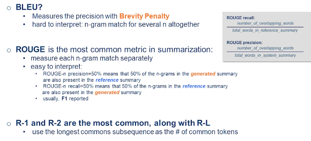
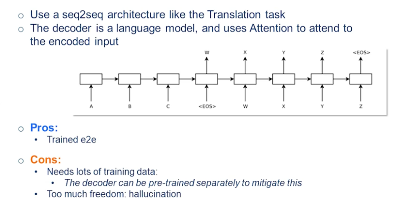
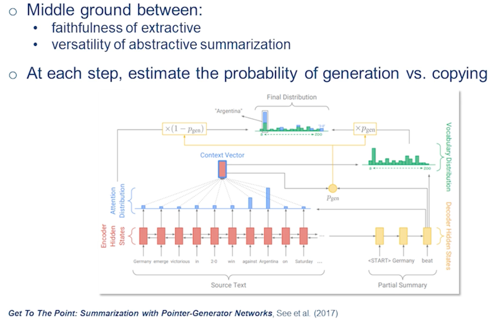
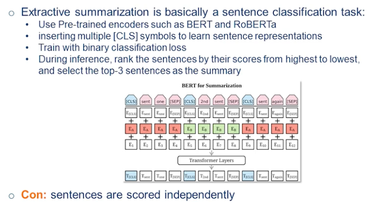
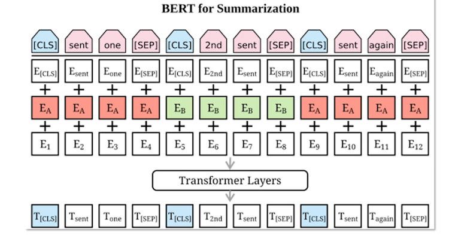
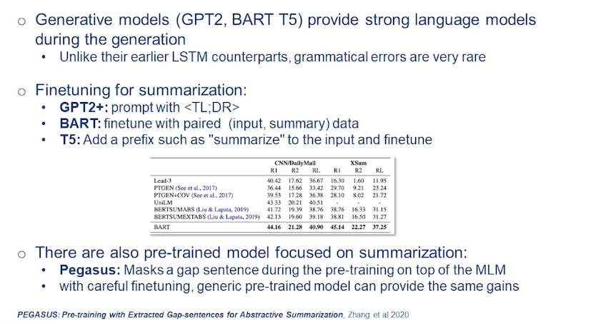
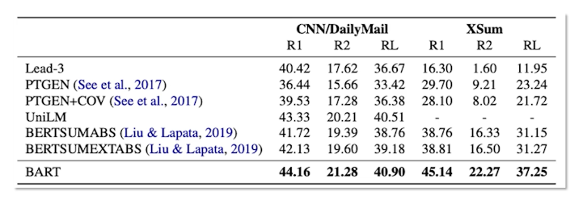
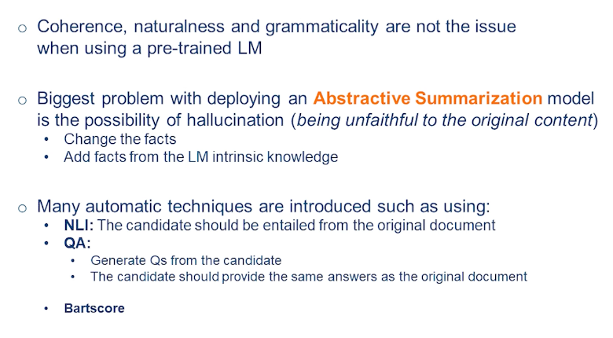

### What is Summarization?

* What is summarization? (use cases and different ways of summarization)
* Metrics and Benchmarks
* Neural Models for Summarization
* Pretrained (Neural) Models for Summarization

What is summarization?

* There is a lot of information that is floating around: Online, personal life, emails, text messages etc etc
* A good summarization system faithfully present only the most relevant information that is needed
  * What emails should be on top?
  * inside each email what is it that I need to know and what is it that I need to respond to?
  * news articles usually have their main bullets at the top
* Consider the sentence
  * Morocco have beaten Spain on penalty kicks and will play either Portugal or Switzerland for a place in the semi-finals of the 2022 World Cup in Qatar
* What makes a good summary?
  * **faithfulness**: the system is not making things up. It's true to the facts it's not adding or changing the facts.
    * ex Morrocco beat Spain vs Spain beat Morrocco (unfatihful)
    * both have very different meanings but use the exact same words to summarize
  * **Relevance**: system has to capture the most informative part that I need
    * Morocco appeared in the World Cup
    * this is faithful but is it the most relevant piece of information?? Probably not
  * **coherence and cohesiveness**
    * there is a slight difference between the two
    * coherent sentences have to be telling a smooth story.
      * ex: Morocco beaten Spain play either Portugal or Switzerland
      * Is rather poor english, despite being relevant and faithful
    * cohesive sentences have to be aligned and be related to each other
    * This again depends on the context and level of formality and the mode of a dialect of language you use. But if we stick to for now we'll look at proper English this sentence is not proper English and it has problems in terms of coherence.

### Extractive vs. Abstractive Summarization

And here we are going to be diving into different ways of summarization.

Consider the sentence: Morocco have beaten Spain on penalty kicks and will play either Portugal or Switzerland for a place in the semi-finals of the 2022 World Cup in Qatar

There are two main ways of summarizing a sentence or a document.

* **Extractive**
  * Some of the original sentences (or sub-sentences) are picked as the summary
    * use or reuse the original sentences and treat them as a summary
  * Pros: Guaranteed to be faithful
  * Cons: it can be redundant and may lack coherence
    * often removes some context and might change meaning or just drop a word that would negate the meaning might also result in redundancy if the sentences picked repeat each other's theme 
    * "Morocco have beaten Spain on penalty kicks
    * Extractive approach is done a lot with news articles, and works relatively well for that domain
* **Abstractive**
  * Generate the summary from scratch.
    * This resembles what humans might do. we just pick and choose and we change words as needed.
    * We bring fillers and connectors and make a smooth summary.
  * Pros: Summaries are generally coherent and grammatical 
    * especially if you use a good language model for your decoder
  * Cons: Faithfulness can be an issue ( hallucination )
    * hullicination refers to the event that the model could just bring something up or make something up that just never happened and it might be even factually correct.
    * this can happen when using pretrained models.
    * ie the model have a lot of info about Portugal that comes out in the summary, but isn't part of the document being looked at, or part of the subject matter
  * Morocco beat Spain in the Qatar world cup
* **Extractive/Abstractive**
  * a combination of the two methods (useful for long documents)
  * you can't put everything in memory sometimes.
    * first extract some pieces of the document that you think are the most relevant. reduce down to say 1-2 pages
    * once you do that then you can give it to an abstractive model
    * your output from the abstractive model
    * is something abstractive and concise and lacks redundancies

### Summarization Evaluation

Methods to evaluate the summarization task.

  * generative task are pretty hard to evaluate.
  * generative tasks include: translation, summarization, and data to text
    * Summarization can be difficult, as the space of acceptable summaries can be large 

Data to text usually refers to a problem that you have a knowledge graph in terms of triples. And you have bunch of triple facts and you want to put them into natural text and glue those facts together. These tasks are hard because to evaluate because the space of candidates are vast.

And it's unlike the discriminative tasks such as classification task that you have the label and you have good metrics like F score. And you can measure if your predicted label is correct or not. And you have f mod metric and you're pretty good. For a lot of task even you have multiple references that you can compare with but it's still it's not exhaustive. And even if that's you're close to one of the references it's not immediately obvious if your candidate is good or not. For example. it could have changed one word that would change the meaning of the whole thing. So that's why that these tasks are much harder to validate than classification tasks.

In summarization especially this is an issue that makes even things trickier because this space of acceptable summaries or even larger than what you get from translation. In translation you're really poke candy. Original document or sentence that you're translating. And you have to basically everything you can pick which part of the centers you want to translate. But in summarization you have that element of retrieval that which part of the article you want to focus on. And then once you know which part do you want to be focusing on how do you present it? And so that's why there are a lot of problems could happen in either of those steps. Those steps could be happening implicitly like an abstractive summarization but it's still they're all up you can imagine pipeline.

* Faithfulness is hard to measure
  * Same words different ordering can make it unfaithful
* Relevance can be subjective
  * Morrocco beat Spain on penalty kicks
  * Morocco beat Spain to reach the quarter finals

Now depending on which one of these facts were mentioned in the reference summary you could be penalized hugely even though both of these are probably good summaries. There are many automatic metrics for summarization and generative task in general. But at the end of the day especially if you want to deploy a system human evaluation is inevitable that how good your summaries are especially interpreter faithfulness that relevance is still is pretty subjective. You can be lenient about it but faithfulness is something that it's a big no-no to make when you want to make a system deploy.

So here we're going to be talking about ROUGE, but first let's do a quick review of BLEU.

EvalMetric-BLEU
* measure of the precision of the translation compare with the original reference translation
* **Brevity Penalty** is added to penalize it to not be super short and super precise
* Hard to interpret: N-gram match for several n altogether
  * that we have one metric for all the n-grams
  * whatever n-gram that you choose everything is mixed together
  * and it spits out just one metric

Some of these issues will be resolved by ROUGE

{: width='400' height='400'}

EvalMetric-ROUGE
* Is the most common metric in summarization
* Measure/treat each n-gram match seperately
* easy to interpret
  * ROUGE_precision = num_OverlappingWords / totalwords_inSystemSummary
    * looks at the number of overlapping n-grams
  * ROUGE-n precision=50%
    * means that 50% of the n-grams in the generated summary are also present in the reference summary
  * ROUGE_recall = num_OverlappingWords / totalwords_inReferenceSummary
    * representing as many as possible the terms in the original reference summary
  * ROUGE-n recall=50%
  * means that 50% of the n-grams in the reference summary are also present in the generated summary
* you often see these called R-1, R-2, etc etc
  * the number refers to the n in n-gram that it is looking at
  * R-1, R-2, are the most common
* Another common measure is the rouge score R-L which it uses the longest common subsequence between the reference and the predicted summary. Instead of overlapping unigrams or bigrams
  * Usually for when you have a summarization system that is better than the other one it all this R1 R2 RL can be better than the other one. But sometimes some of them capture different effects.

### Problems with ROUGE

* The biggest problem with ROUGE is that it only looks at tokens and token match and doesn't consider the semantics.
* There are some versions of it that look at the stem of the word and won't penalize for variations
  * for example: work and working.
  *  But a different word with the same semantics might be penalized
* Another problem that comes up is that a candidate could be completely wrong and has factual errors. But might get high ROUGE scores if it has enough overlap with the reference. So you can throw out the words and bigrams or whatever and still get a high score. Or that's what RL can penalize those stuff. But it still is not enough. You could have a huge overlap at the beginning and while the rest of it is nonsensical it's still gets big RL and as well as the other R1, and R2 but just be nonsensical summary.
* the last problem with ROUGE is that it ignores the original document. So you have a reference summary or multiple reference summaries if you use a good dataset if you have those usually you don't just have one reference summary for the whole article. And you're calculating and evaluating your system based on one single or multiple candidates can references. So there could be a lot of valid summaries.

there are some metrics that have been introduced to counter some of these limitations.

*  the first one that was introduced in was **BERT-score**.
   * This looks to mitigate the limitation that ROUGE doesn't consider the semantics.
   * here instead of looking at the word overlap we give both the reference summary as well as the predicted one to pre-trained encoder like BERT.
   * then we look at the contextualized embedding for each of them
   * And we look at the cosine similarity between the candidate and the reference
* the latest one in that was introduced is BART-score.
  *  In **BART-score** you use a BART model (a pretrained seek-to-seek model) to calculate the probability of the summary candidates given the original documents. So here you use the original document in the formulation as well. For this BART-score has multiple variants.
  *  in some of them it would use the original document as the source and try to calculate the probability of the target which is the predicted summary. this usually is good measure of faithfulness. That if you are making things up in the predicted summary that probability is going to be low that you have introduced new facts original document or change them.
  *  The other variation is to look at the reference summary as the source and the target is a predicted one again. Similar to how ROUGE or BERT-score with work. And we'd look at some irrelevance of how relevant your summary is compared with the reference once.

BART is one of the few metrics that we have to measure faithfulness. Because in a faithful metric you have to consider the original document.

**Benchmarks**

here I've listed some of the benchmarks and you will see on the papers usually.

* Historically summarization was first introduced and super popular for news articles. And it still is being used a lot in most of the websites, such as CNN, Daily Mail, New York Times is probably the most common summarization task and dataset that you will see in papers. And it's a pretty extractive dataset like most of the news articles.
   * For all of these the summary can be pretty much be written from the words that exist in the article and sub sentences or even full sentences. for example a good baseline for all those datasets is the top three sentences. And it's a non-trivial baseline to beat.
* XSUM is on the other side of the spectrum.
  * It is probably the most popular abstractive summarization dataset.
  * here you have a short article bunch of sentences not as long as CNN but it's still pretty long. And you'll give pretty much like the title for it. So you can think of it as a news article title link task which is a much harder task than the CNN Daily Mail and harder to evaluate as well.
* Recently there are a lot of multi-document datasets like Multi-News
  * here you have multiple news articles that you want to summarize together.

And the other aspect of this task this long summarization that we mentioned in the section on abstractive methods.

here you find ArXiv papers and PubMed articles used to evaluate those systems.

There are standard summarization tasks as well though not as popular as articles. This has its own field of methods and stuff. And usually GigaWord is a good dataset for that. For here as it's pretty obvious is that you have a sentence instead of an article that you want to summarize. And sentence simplification is something that is pretty close to this test as well.

There is also some niche articles and there's a WikiHow that you might have heard of the website that you have step-by-step of doing something. And usually we want to summarize the whole section to just its first sentence which is the title of it and we haven't read the TLDR there a lot of users.

Reddit is also popular and they include TLDR (too long didn't read) which they provide a summary themselves and then they tell what the story is. And that dataset has been gathered then it's a pretty challenging task. Probably the hardest dataset among all of this that I mentioned because it's look human written and there's a lot of context that you need.

### Neural Abstractive Summarization

A Neural Attention Model for Abstractive Sentence Summarization

[A Neural Attention Model for Abstractive Sentence Summarization](https://arxiv.org/abs/1509.00685)

{: width='400' height='400'}

Now we want to be talking about the neural models for this task. We've skipped all the traditional models for summarization that existed before neural models were the norm.

The starting point for the new wave of summarization systems that use a neural network was started in 2015 by the paper linked above.

They used a seek-to-seek model that was introduced just a year before, which would take an input and would generate a target output token. The underlying architecture was an RNN. So this is your encoder and you get the end-of-sentence signal that it has ended. And then basically you would get the output of the encoder and initialize your decoder and you generate the outputs word by word. So you generate X and you give X again to your model and generate Y, etc etc, until you hit the end of sentence. And this is where you end the generation.

this is really similar to the translation tasks and the architecture that was used for that. The decoder is basically just a language model. You can imagine that this decoder not only looks at the previous token but can actually attend to all the steps of the encoder as well. And the underlying architecture at the time was RNN. But you can imagine you could have a seek-to-seek model from transformer models that would do the same thing. And this is what we would talk about more.

This makes abstractive summarization much simpler. In terms of formulation you don't need a pipeline that traditionally you needed a surface realization and things like that planning. So usually it was a pipeline you plan and then you surface those words. So here everything is trained end-to-end. So can you just give the original document as input you encode it and you decode the summary. And again similar to all other seq2seq models it uses teacher enforcing.

one problem for this technique was that it needed a lot of training data because everything was trained from scratch. And the model needed to learn a good language model as well. Faithfulness aside and things like that it needed to be a good language model to spit out good English or good language. And that's why there're variations of this that separately pre-train the decoder so that you start with a pretty good language model to begin with so you don't have to teach all the grammar and everything. Again on top of it you can pre-train the encoder on other tasks and then just use on this one.

So there are a lot of improvements that you can put on top of this simple seq2seq model to make it better and better. And this is something that has been done for RNN as well.

But a huge problem with this was that it had too much freedom. And especially this was not a model with a high capacity so you couldn't really pre-train it that much. So in terms of choice of wards and everything it had too much freedom and it would hallucinate a lot. And that was a huge obstacle toward its deployment in real life.

### Pointer-Generator Networks

What made a huge impact and made this model much more tractable was a paper from Stanford that introduced the **copying mechanism**.

[Get To The Point: Summarization with Pointer-Generator Networks](https://arxiv.org/abs/1704.04368)

{: width='400' height='400'}

Think of the copying mechanism as a middle ground between the faithfulness of extractive summarization and the versatility of abstractive summarization. Here the model decides whether it has to copy from the stores, extractive behavior, or generate from its own vocab, which is abstractive behavior. Furthermore it has to learn at each step which one it wants, and which method.

here I brought this example from the original paper. And I encourage you all to read this paper on your own.

And so imagine you have the source text here and you are encoding it. Again the underlying architecture was an RNN here but everything could be done with transformers as well. And once you're encoded this so you start decoding the summary. And at each step in the summary you're looking at two different distributions the green one and the blue one.

The blue one is a simple attention mechanism that at the time was introduced for translation. You want to know which of these words I have to attend more. And that's why it gives a distribution here. And so for the next word for example here after Germany then it was produced. Then Germany then you either want to be talking about victorious or when probably it gives the highest probabilities.

The other side of the spectrum, the other method, that they could generate is through its own vocabulary. So it has its own vocabulary whatever that number is. Usually for such a task you would use probably tens of thousands of words or subwords. And you have a distribution over those as well. So here the one with the highest probability is very similar to when like beat.

Now that you have these two distributions you have to decide which one of those you'll want to use. And here similar to all the neural network architectures you don't have a discrete decision. You always have a soft probability. So you have this distribution and you have the attention distribution. And you combine them with a probability in a soft way and then you get the maximum probability and reward that it corresponds to.

you can imagine that if the probability of a copying was 0.5 so it means that you basically just combine these two distributions together. So for each word you average out the probability that it had in the attention mechanism as well as in their vocabulary and distribution. But usually that probability is much sharper. So as I said it's never one or zeros never either or. But a lot of times it could be like .999 or something like that. So you're pretty sure that you want to copy here.

Through this mechanism you have the flexibility to choose if you want to copy something or generate it. And this was a huge step towards more faithful abstractive summaries in the neural networks that the model now its degree of freedom was brought down a lot. So it could just easily copy and didn't have to make everything up itself. There are more details in this paper. So for example you want to make sure that it just doesn't always copy. So there are different losses that could be added to it. But this copying mechanism is something that was used after this task for a lot of different tasks as well. That when you wanted this explicit summaries explicit copying to happen. 

### BertSum

* [github - bertsum](https://github.com/nlpyang/BertSum)
* [Text Summarization with Pretrained Encoders](https://arxiv.org/abs/1908.08345)

In the last part of the lecture so I want to talk about the pre-trained models for the summarization task which have set the state of the art for the last few years.

{: width='400' height='400'}

The first of these is BertSum

BertSum as could be inferred from its name was using BERT model pre-trained encoder to do the extractive summarization. So extractive summarization can be thought of as a sentence classification task. If you confine yourself to only use full sentences which would guarantee that you're going to be grammatical and you're going to be probably cohesive enough this is something that exactly would be a sentence classification and you don't have to worry about sub-sentences and sub phrases things like that.

{: width='400' height='400'}

let's go over the example here and see that how it was done.

Imagine you have a bunch of sentences, where for each sentence we add an CLS symbol before it. So this is something that's in the original BERT Architecture as you might know that the CLSO class token was added at the beginning for the classification tasks. So here we have this. For each sentence we have to make a decision that we want to include it in this summary or not. So that's why that we have one class label for each sentence.

Next we add the word embedding and then this is the segment embedding and then a position embedding and the common stuff and the transformer and we give it to BERT.

Once you decode it, your target is that you want to predict the class label for each of the sentences. So one thing to add is the separation token that you pull it before each sentence. I don't think it really matters here honestly because you have the class label so the model knows that when the sentence is over when you see a new class label but they just decided to have this separate step token here as well. Usually when you have multiple input that you want to give to the model and you want to make sure that it understands that these are two different sources, or two different things to be treated differently, then you add a separate token. But here they had at its class as well as the set but at the end of the day you want to predict this class labels.

For the loss we use just a binary loss that each one is either zero or one. Then so during your training for each sentence you're doing that loss and then during the inference so each class label as predicted is going to be a probability between zero and one. Then they are ranked from highest to lowest and depending on the summary length that there'll be once they take the top K sentences. In the original paper I think they were doing top three sentences. So that could be another hyperparameter in your model depending on the dataset that how many sentences you want to pick.

This performed pretty well. It'd be the state of the art for I think CNN & Daily Mail datasets but obviously it doesn't work for abstractive summarization. But one thing even the event about extractive summarization is that it was scoring the sentences independently. So even though the BERT model is contextualizing everything as long as it's in its attention span. So all these scores they have been contextualized. But the BERT model is not going to be trying to make your model as least redundant as possible and there could be two sentences that they mean similar thing and both of them are important sentences and the model could score both of them pretty high. Even though in a good summary you either pick this one or that one not both. And this is something that has been studied after this paper as well that you don't want that once you have this course the only thing that you can do is to basically just pick the highest one and those scores and you're not considering that what you have picked before.

So there are methods on top of this that in order to make a decision not only looks at this score but it looks at what you have already picked. So for example when you pick the highest scored one then that probably is the most important center you want to pick anyway. So once you pick that then the next ones the score for them is going to be relative and it's going to matter that which BERT centers you picked. This way redundancy can be brought lower. But again in its original form it worked pretty well and it has some follow-up papers like match some that you guys can look on your own. I strongly recommend doing that.

### Abstractive Summarization: Pre-Trained Models

This section we look at a new class of models that were first intorduced in 2019/2020. At their core these were just pre-trained seq2seq models like such as BART and T5.

these generative pre-trained models fall into two classes.

* The GPT class: that are decoder language models
  * this means that there is no encoder
  * it's just one decoder and everything is trained token by token.
* the auto-encoders, On the other hand are truly a language model
  * here you have a corrupted original sentence and you predict the correct one
  * this class includes BART and T5.

All these models are really good pre-trained models for generation that you can fine tune for different tasks such as summarization. Because these models are pre-trained very well, they don't make many grammatical errors unlike those earlier LSTM models. Everything is pretty coherent. Although it could be nonsensical, or unfaithful, but usually coherence and grammatically is not a problem for them.

So in order to finetune for this task. So it was GPT2, that introduced the prompting method and then it was followed up and the next versions of GPT as well. So usually the way that it work is that you give the original document to it and then you add TLDR at the end. Or you could give it in summary colon and then you prompt it to predict a summary word by word for it depending on the context that it has consumed.

So good thing about this is that you can do this without any training. So it's all zero shot. You can get the decent summaries. It's not comparable with supervised techniques at least for GPT and stuff. Right now with the advent of all the models like ChatGPT the quality of the zero-shot summaries that you get are extremely good. But still if you have a supervised data there are going to be in terms of performance dwarf compared with them.

{: width='400' height='400'}

Then next class of models that you need to finetune is that of BART and T5. In BART you just finetune with the paired dataset like you give the input and you give the output and that here is the summary and you find Jean Piaget model. In T is usually better to add the prefix as well. But it could work and learn without that as well. Once you do that you fine tune it and you can get the abstract of summaries with this.

Here we can see the results table from the original BART paper and it has a list of some of this methods. There was a huge gap in terms of performance with previous methods.

{: width='400' height='400'}

For something like CNN/DailyMail one rouge score is huge like consistent improvement. Here you can see that especially with the for the XSUM summarization which is extreme summarization. Their performance is a huge gap with other techniques and this is where these models really shine. For something like extractive as you can see Lead-3 is a previous summary for CNN/DailyMail is that R1 is just over 40, which is non-trivial at all. So even something that we discussed the point or generator model with the copying. It dwarfs state Lead-3 which is a huge baseline.

But this model BART is versatile enough that could give both the extractive summaries as well as abstractive depending on what supervision it's gotten. There has been a lot of summarization focus pre-training as well. Maybe the most notable is Pegasus that it on top of token masking like BART it would do sentence masking as well. And it showed that it had some improvement on top of BART. But it's been shown that a lot of times if you carefully finetune these models, the pre-trained models for this task, you usually don't need specific pre-training for different tasks. A generic pre-trained model can provide pretty much the same gains.

### Hallucination in Summarization

Finally I want to discuss a little bit more of the hallucination problem. And now that we have this pre-trained language models that as I mentioned the coherence naturalness and grammatically are not issues with this model. But it's still deploying a model like BART in real life setting is pretty challenging for a task for summarization. And the biggest problem is the hallucination and the possibility of it. Because you don't want to be making things up that never existed and make a PR issues and things like that.

{: width='400' height='400'}

So in this models they're usually two types of hallucinations that could happen. One is that you change the facts from the original document that for example someone was born in some year and you generate some other date or you add knowledge and you add facts. those facts could be wrong or they could be correct. This is something that comes from the language model intrinsic knowledge. And these models have huge capacity to memorize the Internet knowledge that they have been pre-trained on. And that's why they sometimes they can just spit out something without looking at the document to see if it exists or not.

just for this task this hallucination there are a lot of different techniques and metrics that has been introduced for models like Bart but in general it works for any methods. But this is something that is much more recent metrics. So we did discuss the BARTscore and how it calculates the hallucination.

But I want to mention two other techniques as well.

* One is the natural language inference which is a entailment task. Entailment task are two sentences could have three different relationships toward each other. One can either entail the other one or it can negate it or it can be neutral. Here we have the summary and we have the original document. And we want to be in a way that original document entails the prediction that we have. Which means that all the facts to it have been presented in the original documents as well. So there are a lot of inference datasets and that's why was one of the good things about this method. But one of the problems with this is that language inference is a really hard task. And different datasets they're not really even generalizable to each other it really depends on your domain. So it's not a problem that has been solved. And then we said okay now when you solve this we go and use it to other metrics. So that's why that there are some push back against this metric as hallucination because itself is a really hard task as it has shown mixed results.
* The other thing that could be more promising is using question-answering for this task. So question and answer and you might be familiar that you have a document or Excel document and you have a question and you want to answer it. Dual problem for this is question generation. That you generate a question from the document and then you try to answer it. So the way it works as a metric we generate a lot of question candidates. These dispersions are generated from the candidate summary. And now those questions they have to have the same answer in the candidate summary as well as the original document. So if you generate enough questions and you can calculate the probability that this is faithful or the reference and the candidate summary was faithful or not. So usually I think there could be like questions depending on the left but questions questions that you will compare the answers from the original document and from the reference. And if they match like nine out 10 of you get a score like % or if there's like a it's % faithful.

This is an active area of research and this is something that again still there's a gap between human evaluation and the automatic metrics. And if you're interested you can study more and you can read more papers on this and see the newest techniques.

<!--  -->