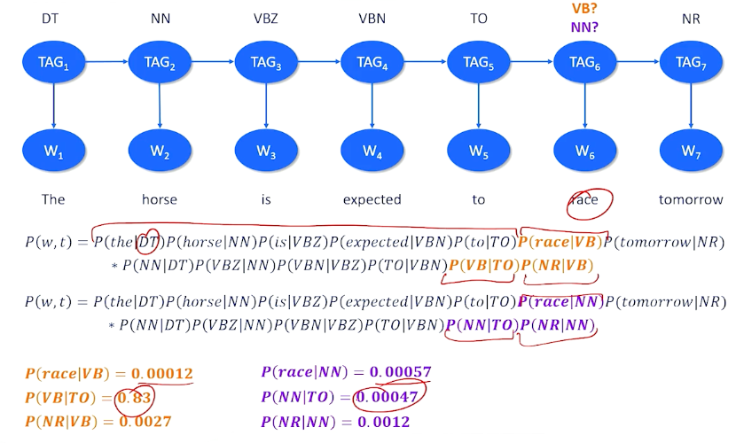

### Machine Reading

Machine Reading: Extract factual knowledge from unstructured text web and palcing it into a structured knowledge base.

{: width='400' height='400'}

The main idea is about information extraction, open and closed.

* **closed information extraction** - a fixed set of types of relations:
  * Example: established, is a, has satellite, provost, etc
* Hand-authored rules
  * Example: Look for a sentence with the word "established" and a date
* Problems:
  * New year of expression information
  * new relations can emerged
  * Too many relations to anticipate
* **Open information extraction** - Extract structured knowledge from unstructured text without knowing what the entities or relations are in advance
  * No prior knowledge on what the relationships are 
* Unsupervised acquisition task

Why must we do this in an unsupervised way? 

{: width='400' height='400'}

It is not impossible, but difficult. We need to go get a corpus and we have to label examples of different relationships. Once you have this dataset, train a binary classifier to predict which sentences had this particular relationship in it, and use it to go through any sentences I want and test the sentence to see if it has that particular relation that we are looking for. And this has to work for many types of relationships which is not a good idea. 

{: width='400' height='400'}

Things gets even more complicated - what if we have multiple types of relationships? Then we need to consider it from a multinomial perspective.

**Distant Supervision**

* Instead of manually labeling, automatically derive labels from an existing knowledge base.
* Assume every entity that is related to another entity in a sentence is a pstive example
  * "Jack loved his sister Jill very much"
* Assume every entity that is unrelated to another entity is a sentence is a negative example 
  * "Jack and Jill went up the hill"
* But how do you know whether two entities are related in a sentence?

We call this distant because we haven't gone through and directly built out the labels for the dataset, but we've written a piece of code or a process that can guess what those labels are. Those labels might be wrong in our ultimate dataset. So we're not directly supervising. There's this layer of indirection between the supervision that we want to provide to our algorithm and what the data actually has.

Now as humans can look at these examples and we can see those relationships and we configure these entities are related these aren't. But algorithmically how do we know whether two entities are related in a sentence? And this is the problem that we're going to turn ourselves to.

* Open information extraction requires learning a way to recognize relations without labeling
  * Do this by using the Syntax of sentences provide strong clues about relations

### Part of Speech Parsing

We have to talk about POS parsing to dive deeper into machine reading.

**Syntax**: The arrangement of words and phrases to create well-formed sentences in a language 
  * Humans can understand even if its not well formed
  * But better for machines if they are 
* Semantics arise from Syntax
  *  is the meaning of words and the meaning of sentences 

Example: "Jane Loves science"

* 3 words, with a very simple syntax but the semantics are quite complicated
  * Jane: is an entity, person. T
  * science: is a concept
  * love: denotes a positive relation/affinity
* We know that Jane has positive feelings about this idea of science
these words have a whole bunch more behind them that we want to be able to get from these words.

That's what we mean when we talk about semantics arising from syntax.

Different kinds of words take on different roles and have different rules that apply to them in a sentence based on where they're used in a sentence, and what we want that sentence to mean.

Here's another example that's actually a little bit ambiguous but is syntactically well-formed, syntactically correct.

* Jane wrote a book on the moon
  * did Jane write a book about the moon?
  * did Jane write a book while living on the moon?
  * you actually cannot tell just by looking at the sentence which of these two meanings we should extract
* Ex2: Her drive was torn up
  * which is the verb: drive or torn?
  * drive could be the act of driving or it could also mean the noun driveway
  * torn could mean "ripped apart" or it could also mean falling apart
  * So is a driveway torn up or is her car like the thing that she is driving falling apart?

As you can see here the correct way of us determining what words have what roles in a sentence is actually a hard and non-solved problem

**Parts of speech** - a category to which a word is assigned in accordance with its syntactic functions

{: width='400' height='400'}

So, how do we do **parts of speech tagging** - which is associating these different roles to the different words in a sentence?

* Assign a part of speech tag to each word in a Sentence
* Probabilistic approach: Set up a dynamic bayesian network

{: width='400' height='400'}

To give an example:

{: width='400' height='400'}

We might have a particular document like the horse is expected to race tomorrow and we might take a guess that there are particular tags that should be assigned to each of these words. And in most cases and this is one well actually two possible mappings here. And in most cases there's a really strong correspondence between the tags probablistically in words like "the" is a determinant, horse is definitely a noun, "is unexpected" are two parts of a verb phrase or two is a special type of part of speech that is setting up something. The one big question here is race. Race is a word that can be a verb but it can also be a noun. Should I choose verb or should I choose noun which is the right choice here. To do this we can turn to the statistics we can turn to the probability. We can set up a giant joint probability equation where we look at the words and all their tags.

If I pick the right dub tag for the then I should have a high probability here. The question is do I have a high probability that race is a verb or not? Do we tend to see the word race when I know that there should be a verb here? And we also want to know what is the probability that I see a verb following a two and a relative noun following a verb. And this might be different. So this other possible mapping would say race is a noun was the probability I see the word race when I am expecting a noun do I tend to see a noun following a two and so on and so forth. And we can basically decide whether we want race to be a verb or a noun tag by looking at the different probability of the entire sentence. So everything is the same except these two parts but what we can see here is race is not a very common verb not also a very common noun. But we tend to have a very high probability of seeing a verb after a two and we don't tend to see a high probability of a noun after a two. So if I had to multiply everything up together again we're basically say this is the most probable explanation. This is the most probable tag that we\'d want to use or most probable set of tags we'd want to use for this sentence. Now how do we make that determination? So I gave you the tags and then we chose between two possible tags in one spot.

How do I figure out what all the tags are. We all have the word we don't have the tags. We need to do something called the most likely explanation which is basically a search for the sequence of latent values these tags that would most likely admit the observed words.

Now we can do this the brute force way. We can look at all possible combinations of tags for all possible positions and then we can compute the probabilities like we just did. That would work but there'll be very computationally expensive and exhaustive. We don't necessarily want to do. But there's one little trick that we can use to speed up and make this more efficient. We can use something called dynamic programming. And what we're going to do I'm not going to go into how dynamic programming works but it's built on the assumption that for any one choice that we have to make in this entire sequence that the most likely choice for that one time slice means if we can make the best choice there that means we will ultimately find the best overall choice. So it the best overall explanation is built of a bunch of local optimal choices along the way. So all we ever really have to do is make the best choice at every single time slice and we'll end up with the best part of speech tag at the end. This isn't guaranteed to work but it's a pretty strong assumption here and it tends to work. So if you're interested in this you can consult some background knowledge on how to set up a dynamic programming algorithm and what the right algorithms are that actually can solve this problem. But now we need to take this knowledge about parsing in parts of speech and bring it back with us and return to the issue of machine reading.

### Dependency Parsing

Dependency parsing is a theory that basically says that we can build graph structured syntactic analysis of sentences that will help us find these relationships. Dependency parsing is a linguistic analysis technique used in natural language processing to uncover grammatical relationships between words in a sentence.

* Words have relationships to each other
* Graph-structured syntactic analysis of sentences
* Root of tree is the verb 
* Arcs are dependencies with types 

So to give you overview of this means:

{: width='400' height='400'}

For example we might look at this lick verb and we might decide that this is the route so that this sentence is about the lick action. We might notice that the cat is the subject the licker and the thing that is being licked is the butt which is the object. So we have subject-verb-object. Then we have other information like fuzzy and butt is modifying fuzzy and her modifying information about what we know about butt and cat tells us which cat and things like that. So the idea is that we should be able to build this graph relationship between all of these words and that's will provide additional information that we need to ultimately do our knowledge extraction.

The most successful way of doing dependency parsing is something called the shift reduce technique. The idea here is the bottom-up technique to build a dependency graph that really explains how different words are related to each other and gives us both the relationships and the types of relationships.

{: width='400' height='400'}

Let's think about the sentence at the left. We can look at different combinations of words and tell us whether they're related to each other. So we're not sure about "the lazy" but we can look at cat and these might be related because the tells us which cat we're talking about, it's the cat. Likewise the word lazy and cat seem to go together because the word lazy is modifying the cat, it tells us something about the cat, it's an adjective modifying the cat. We can also look at the relationship between cat and licked that this is probably telling us that the cat, the entity, that is doing the licking, doing the verb. 

{: width='400' height='400'}

We can also look near the end and see that fluffy is a modifier. It's an adjective that's probably modifying the word butt that seems to be the most likely thing that is modifying. And this is telling us something not about fluffy but it's telling us something about the word butt is talking about, who's butt, We're talking about what is being licked. Was it her was it butt. Well the probably the right parse here is that the object the thing that is being licked is the butt. And the punctuation tells us that the event is done. 

{: width='400' height='400'}

And the ROOT is going to tell us that this is what the sentence is all about. So the sentence is all about this lick action and which terminates once we know everything about the lick action and the entities involved in the lick action.

**Shift reducing Parsing**

{: width='400' height='400'}

So shift reducing has two key data structures that we're going to use. The one is called a **buffer** and this is just the order that the words are presented to us in the sentence. So this is going to allow us to process and walk through the sentence word by word. We store the word in a buffer. We also have something called a **stack** which is basically an extra data structure off to the side which basically says if you don't know what to do with any word in the buffer will just push it onto the stack and hope we can figure out what to do with it later on. Now there are three operations that we care about.

* The first operation is called the **shift** which basically means take something from the buffer
  * first word the buffer push it to the top of the stack.
  * Basically save this for later because we don't know what to do with it.
* The **left** operation basically means we have found a relationship and this relationship is from the top of the stack a word that we had pushed off to later is somehow related to the next word in the buffer.
* the **right** operator which basically says the next word in the buffer is related to the top of the stack. So in particular the buffer is the child or the top of the stack whereas left means the top of the stack is the child interdependency of the buffer.

Let's see this play out in an example

### Dependency Parsing: Example

Here is the same example again, the lazy cat licked her fluffy butt. 

{: width='400' height='400'}

we can see that the sentence is in the buffer ready to be processed and we have the stack. One special thing I'm going to notice I have added this special term token root, and that we've pushed the root onto the stack. We start with the root on the stack. We know we are done with the entire process dependency parse when the root is no longer on the stack, meaning we have finished everything off and there is nothing to think about anymore. 

At the top right corner, We will look at the different relation, the operations we do. So as we try to parse this, these will be the operations shift left or right that we attempt. To kick things off, if there is nothing on the stack except for the root, we don't really have anything to do because although relationships are be there between the stack and the buffer or back from the buffer back to the stack. So if we do not have anything but the root on the stack, then the really only thing we can do is shift, which basically means take the next word in the buffer and push it onto the stack, no relationship is being to created. So we are going to shift the word `the` into the stack:

{: width='400' height='400'}

Now, there is something on the stack and still have our buffer. But when I look at the word `the` and `lazy`, it is not entirely clear to me that those two things to together. So i am going to grab the `lazy` and I am going to shift it onto the stack as well. Maybe I will be able to do something with this a little later. 

{: width='400' height='400'}

So now the next word in the sequence is the word cat and now this time we have a choice to make and it seems like a reasonable choice to make is to do the **left** operation, which is going to create a relationship from cat from the beginning of the buffer to the top of the stack. 

{: width='400' height='400'}

In this case, the relationship is an adjective modification, so lazy is an adjective and we see an adjective preceding a noun, we could probably make a reasonable guess that this adjective is modifying that noun. So we have this relationship between lazy and cat that we can go with. And when we do a left, we both create that arc, and we are also going to pop that stack - we have figured out what lazy is all about, we are done with that and off it goes. 

{: width='400' height='400'}

The next thing we can do is we can now look at the cat and the word the. In this case, when we have a determinant the, and a noun together, it is probably a reasonable guess that the is telling us which cat determinant of the noun. Once again, we can do a left shift, basically which will create the relationship that cat and the go together, and remove it from the stack. 

{: width='400' height='400'}

Now, there is nothing on the stack except for the root, so will shift the cat onto to the stack. So if we can deal with that a little bit later. That allows us to onto the word licked. And here we can look at cat and licked, and there is a nice thing happening here. When we have a noun and a verb, the noun is probably the subject of that verb, so we will go ahead and will do a left operation, and create the subject relationship, saying the  cat is the subject of the verb and we are done with the cat. 

{: width='400' height='400'}

Now, it is an empty stack again, we pushed lick into that, we are going to do a shift. We are about to see the word her, and it is really not clear what to do here. When we are talking about licking and her, the top of the stack and the front of the buffer, it is entirely plausible that the cat could have licked her versus the cat could have licked something else. When we see a verb and a pronoun, that is one possible thing that can happen. 

{: width='400' height='400'}

So we are going to have to make a decision here, the right decision is going to be to do a shift. The reason why we are going to do a shift is because if we did not do this, we end up with some extra words that we did not know what to do with that would not fit into any other relationships. Now we do not know this at this time, let's suppose the algorithm has to make a guess here and let's just suppose it makes the guess teh right thing to do with is shift. 

{: width='400' height='400'}

Now, we have fluffy, and her, her fluffy - we do not really know what to do with pronouns and adjectives following pronouns, so we are going to do another shift, and shift fluffy onto the stack. Now we have the relationship between top of our stack and buffer. So we have an adjective preceding a noun. Once again, we probably think there is a pretty good guess that the word fluffy is modifying that noun, so go ahead and do a left operation here make the relationship and say fluffy is modifying the word butt.

{: width='400' height='400'}

Now we see a possessive pronoun and a noun together, looking at the top of the stack and the buffer, and we can make the guess here that probably her is saying something about who owns the possession of the butt. So the pronoun is related to that word there, so we do a left operation and now we have understood what butt is all about. We are done with the pronoun there. 

{: width='400' height='400'}

We still have butt to deal with and now we have something here that we have not seen before - we have the possibility of making a right shift. The right shift basically says that there might be a relationship going the other way from the top of the stack to the front of the buffer - because we see a verb and we see a noun (licked and butt) and a noun is after the verb, so that is probably going to be the direct object of the verb. 

{: width='400' height='400'}

Now rights are a little bit more complicated, what we are going to do is consume the front of the buffer and we are done with butt and there is a relationship that we just made. 

{: width='400' height='400'}

But we also take what was top of the stack and put it back on the buffer saying we might not actually be done with this word licked. There might be other things we have to consider about this as well as when we do a right shift. Now we are back in a situation where we have words on our buffer, but nothing on our stack, so we are going to actually shift licked back to the stack (did not have to happen that way) and we are left with a punctuation. So when we have a verb followed by a punctuation, we can do a right and we can basically say that that this is the termination of what the sentence is about the sentence is about the verb. So we put the punctuation relationship in here and because it is a right shift, we kick the punctuation out, and once again return lick to our buffer to make sure we are not done with the word licked. 

{: width='400' height='400'}

One last right shift, to do and this is a special rule that basically says when you have the root and a verb or the root and the last word and sentence, then whatever remains in the buffer must have been what the sentence is actually about. 

{: width='400' height='400'}

So we do a right shift from the root to licked, so we say licked is the root, we kick that off, root now becomes part of our buffer and this is our terminal condition. The word root has moved from our stack to our buffer, that means we are done and have addressed every single word in the sentence we have found its dependency to every other word. 

**Learning**

Seems to be doing a lot of hand-waving along the way, in particular when we had to figure out what was the direct object of the verb licked, was it her or was it butt and basically did a hand-waving and said well, let's wait on the word her because we might see something better but how did I actually know that?

* How do you know whether to shift left, or right? 
* We can actually learn a classifier 
  * Given a stack, a buffer, parts of speech tags,
  * Output shift, left, or right (and dependency type)
* But how do we build this dataset?
  * Distant supervision
  * Annotate a lot of sentences with Dependency graphs 
  * Run stack-reduce, backtracking when necessary to find the known graph 
  * X: partial parses of sentences (buffer, stack, POS tags)
  * Y: Best shift-reduce action (shift, left, right)

Basically this tells us these are the sets of shifts lefts and rights we have to do to get to the stack reduced to match the actual answer according to humans what the right parse is. What that means is then if we look at that process of shifting, lefting, and righting what we end up with is a bunch of partial parses of sentences. So basically the shift reduce at different stages in processing a sentence. Which tells us at any given moment what's on our stack what's in our buffer and what the parts of speech are which is exactly the information we want that our input to our classifier. This also tells us which was the shift left or right that we had to do to make the correct annotation work according to our human annotators which tells us what our Ys should be. So we can infact generate automatically through repeated uses of stack reduce backtracking and trying different options until it gets it right to automatically produce a dataset that we can then train a classifier on it. And then once we've done that we can use the classifier in any future stack reducing that we need to do to create dependency parses.
 
### Open Information Extraction

Recall that we are trying to take unstructured text to structured knowledge such as (subject, relation, object) triples. So for two entities in a sentence, a subject and an object, they must be related when possible, how they are related by a particular relationship. 

To give you an example of this, consider **OBama was president of the United States from 2009 to 2016**. 

Open information extraction should be able to tell us these following structured triples exist:

* \< Obama, was, president\>
* \< Obama, was president of, United States\>
* \< Obama, was, president of United States from 2009 to 2016\>
  * There are different ways of looking at that sentence and figuring out what the entity is. So president is one entity, but also president of the United States is also another way of expressing an entity. 
  * Name entity recognition is a little hard and when in doubt, you just look at all combinations of ways of talking about an entity and worry about things later on. 
* \< Obama, was president from, 2009 to 2016 \>

So how do we come up with these particular triples from this particular sentence, and dependency parsing is going to be the key intuition we have here:

{: width='400' height='400'}

This tells us how every single word is related to every other word. Our named entity recognizer came up with a complex noun phrases. Obama was easy, but things like president of United States involves not a single word but multiple words. Same with relationships here, relations can involve multiple words instead of single words as well. How exactly did these tuples came about? It turns out to be a straight forward process.

First thing we have to do is figure out what all the entities (Obama, president) are, list all those out, and then just figure out how we get from one entity to another. So we are literally going to find these entities inside our sentence, and going to trace through dependency parse to get from one entity to the other. 

{: width='400' height='400'}

So to get from president back to Obama, we can follow the yellow path, which basically take us through was the attribute to the subject of was being Obama. So if we walk this particular path of the graph, we go through the was word and was becomes our relation. So now we know how obama and president is related. 

{: width='400' height='400'}

We do this for all ways of expressing all entities in the sentence. We look for OBama and the United States, how are they related to each other, while we walk through the object back to the preposition, so we walk through of president was back to Obama, so was president of becomes our relationship there. 

{: width='400' height='400'}

President of the United States 2019 to 2016 is also a way of expressing an entity, so we find that, we find Obama, we again can walk through the word was by following the arcs in our dependency parse. So we get was for the relationship here. 

{: width='400' height='400'}

And 2019 to 2016 is also an entity, So we have to walk the graph here again. This one is a little interesting, we walk through the word from, that takes us to president and was, so was president from, we can actually skip some of these intermediate words to figure out that this is the core relationship between Obama in 2019 does not really involved the words United States. 

Now, the useful thing in terms of this now is once we have collected all these up and put them into a knowledge base, is they can tell us all the different ways that different entities are related to each other. And this can involve and is primarily used for question answering. So what do these triples tell us? - They tell us things about who Obama was. 
* He was a president
* What was he a president of? 
  * The United States 
* When was he a president? 
  * 2019-2016
* All these things can be answered now by simply trying to match parts of a question to what is known from the documents. 

One of the predominant uses of open information extraction is in fact to do question answering about documents. We want to be able to use these structured pieces of information that we pulled from these unstructured text to be able to answer questions about those texts, as well as about the world that the text describe in general.

For example Obama was the president of ? . We should be able to figure out the word clearly should be United States. That is very nice when the question match very closely to the structure triples that we are able to extract. And we should expect to see that because theoretically it is easier to work with structured knowledge than unstructured knowledge. 

And when we do not have perfect matches, we can still fall back on the distributional approaches, so we can look at the cosine similarity between different parts of a sentence and then different pieces of information we have in our structure tuples. So in the case of the example when was Obama president, we do not have an exact match from our triples but we can see that this question is about the entity Obama, was president from might have a very similar cosine similarity to when was and one was president. We might be able to figure out that when was president is a very close match or cosine similarity enough to the relationship was president. In which case all we have to do then is figure out this is figure out that this is probably the best triple that we have in our entire knowledge base. And then we can go in and find that one particular piece from the triple that the original question didn't actually have. And in this way we're able to make reasonably good guesses about the answers to different questions even when they're structured a little bit differently from the knowledge we have in our knowledge base. 

Now there are pure neural approaches to machine reading and to open information extraction. Historically they've not been as robust in creating structured knowledge from unstructured knowledge as the techniques the unsupervised approaches that we've used with dependency parsing that we've talked about in this particular unit. But I would like to note that at this particular moment in time as of this recording language models are getting more powerful. And take models like BERT have been able through blink infilling been able to make reasonably good guesses about entities and relationships as well as some of the larger models of GPT or sometimes possible to be prompted so that they can answer questions like who is the entity of sentence? What are the entities of the sentence? What is the relationship between these entities in a sentence? So these are becoming more powerful as well. And we would expect over time to probably see more research into the use of large language models to do machine reading and to do question-answering. Matter of fact there'll be future units in which we'll actually look at question answering with large language models. 

### Frames and Events

<!--  -->