### Introduction to Open-Domain Question Answering

What is open domain question answering?

In question-answering systems we build computer systems that automatically answer questions by the humans in natural language. The open domain nature of the problem involves dealing with any questions of anything included pre-crafted knowledge bases such as DBPedia, Wikipedia concept net semi-structured information such as tables and even unstructured forms such as web pages.

There are several flavors of open domain question answering including factoid question answers which is what we're going to focus on today. So factoid question answering is essentially questions centered around facts. Where we ask what, who, where, when, questions popularly known as WH questions. There are different flavors such as opinion questions which are centered around sentiment. So the example would be product reviews and restaurant ratings based questions. There is a third question-answering which is community QA which is often centered around quark source platforms or answers that are essentially gathered from forums, threads, conversations between human conversations.

Let's focus on factoid question answering in this particular talk or in this particular lecture and search engines are essentially a good QA tool where we basically take a keyword as important written a web page and answer. Question-answering can be of different formats. You have multiple choice questions, span solution based questions, close questions and information extraction based question on strain where we actually glean information from unstructured sources to come up with answers.

Let's look into multiple choice questions.

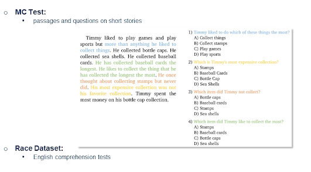{: width='400' height='400'}

So this is an example from raze dataset which contains English comprehension test.

You have a paragraph such as on the left which says

Timmy liked to play games .... so on and so forth.

The first question is he may like to do which of these things the most? So the answer is A collect things. The answer actually lies in the sentence. However the question-answering system would look at the entire passage on the left and would be presented with the questions on the right with multiple choice answers. So the precision is key in this setting. On the other hand we have span selection based question-answering where we actually have to select the answer from extremely long passage. So the precision is key in this setting.

On the other hand, 

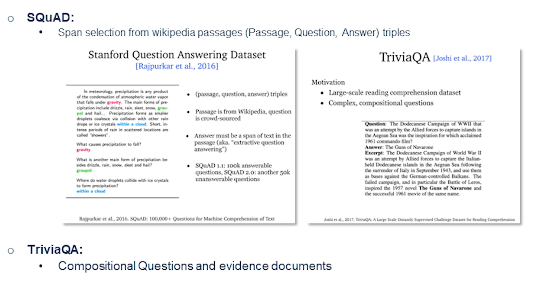{: width='400' height='400'}

SQuAD is a Stanford question answering dataset that is a very popular dataset in this domain which includes spans selected from Wikipedia passages. The dataset is formatted as Passage-question-answer triples. The difference between them is that there are a couple of questions often that may have same answer. Unlike in the previous multiple choice questions we often see one question and multiple answers. Here the questions can be formatted in different ways where the answer maybe the same. So there are a couple of variants of the squad dataset. The difference being that SQuAD V contains only answerable questions while SQuAD V contains unanswerable questions. So when the answer itself is not present in the passage or passages.

There was another example of a dataset of this flavor called TriviaQA which is reading comprehension dataset contains over question-answering evidence triples and which is essentially trivia questions answers authored by trivia enthusiasts and independently gathered evidence documents. There are often six per question on average six evidence is per question which essentially provides high-quality distance provision for answering these questions.

**Cloze**

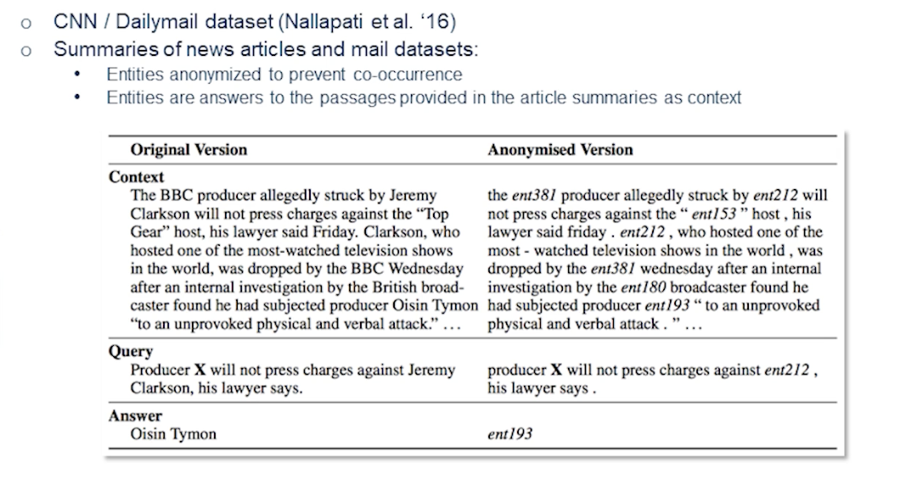{: width='400' height='400'}

The third flavor is cloze. So CNN Daily Mail is a dataset for text summarization. Human-generated abstract or summaries are present in this dataset. The summaries of news articles and Mail datasets are present. Entities anonymized to prevent co-occurrence are essentially our answers. So entities are the answers to the passages that are provided in the article summaries.

Here's a good example. As we see the original version contains the BBC producer allegedly struck by Jeremy Clarkson will not press charges against the top gear horse his lawyer said Friday. Now the word BBC as masked it's presented as ENT381 and similarly Jeremy Clarkson is presented as ENT212.

So here one has to solve two problems. One is extract the entity. Which type of the entity is likely to be present in there. Now the second one would be what is the likely answer in the situation? So when we solve this problem we are essentially solving two problems which has fallen entity extraction as well as unlikely to solve the answer extraction.

**Generative Question Answering**

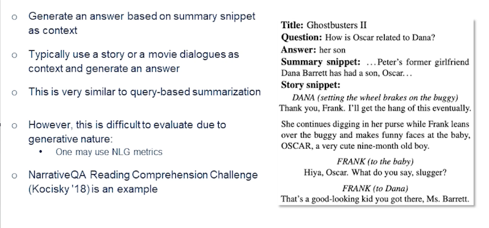{: width='400' height='400'}

In generate question and answering (which is a fourth flavor) we are trying to generate an answer based on summary snippet as context. So let's look into the example on the right. Here you have a title ghostbuster 2 and the answer is essentially a summary snippet or the answer itself may contain the summary snippet or in the story snippet. So typically using a story or movie dialogues or contexts we try to generate an answer and this is very similar to query where summarization.

However this is extremely difficult. Evaluate do to generate the nature of the problem. People may use several natural language generation metrics such as BLEU score or ROUGE in order to automatically evaluate these problems. Narrative QA reading comprehension challenge is a good example of this problem for dataset.

**Classical QA vs Retriever-reader**

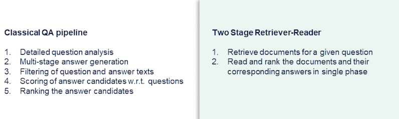{: width='400' height='400'}

So now we have looked into different flavors of open domain question answering. So while we look into various forms now let's look into how this problem is approached.

So first let's observe the classic question-answering tech stack or a pipeline. Now often we have an elaborate pipeline that performance detailed question analysis. Like I said in the first slide you essentially do a WH type resolution. So I tried to identify what ATT the answer may fall under that second part of the problem. Finally you progress towards a multi-stage answer generation while filtering out question answer pays based on that relevance and importance or salients. Essentially we tried to get it the answer candidates running against respect to questions. So the final answer would have certain confidence score generated by the model. On the right-hand side we see a two-stage retrieval reader approach where you retrieve documents for a given question and go over the passages or the documents and try to read and rank the documents are the passages and their corresponding answers in a single phase. It sounds magic but it is how most of the state of the art techniques and the current day actually performed question-answering.

### Retrieval-Reader

In this section we review various state-of-the-art methods that are currently approaching this problem of question answering aiming to solve this.

* Input: A set of descriptive documents and a question document.
* Output is an answer extracted from the descriptive documents.
    * Typically Wikipedia articles are considered as the source as they often contain real world facts.

Now the framework is divided into two stages.

* First stage is information retrieval stage or the candidate documents are retrieved for a given input question which is essentially treated as a query. Remember the search use case where you present a keyword and then you have list of documents it's exactly the same.
* The second phase: performs a reading comprehension stage. So the candidates are parsed for suitable our answer.

Let's look into the retrieval phase first.

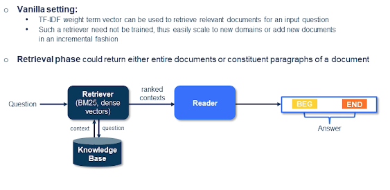{: width='400' height='400'}

In a standard vanilla setting you would see the documents and the queries represented by their TF-IDF weight term vectors. They can be used to retrieve relevant documents for an input question. And such a retriever need not be trained so you can easily scale to near domains or add new documents in incremental fashion. That sounds easy? This is exactly the way often the most techniques are approached currently using something like a sparse vectors. And the retrieval phase could either return entire documents or constituent paragraphs of a document.

In the next phase you essentially have a set of paragraphs or sentences that are extracted that are basically saying to the extractor or the reader which computes the span of the answer, the begin and end, those positions from the sentence or the paragraphs to provide an answer. 

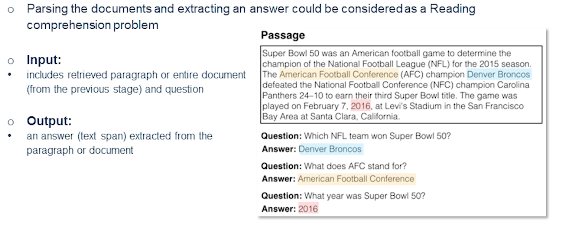{: width='400' height='400'}

So the reader stage you're parsing set of documents and extracting an answer. And an input in this case of course like it's retrieved paragraph or the entire document and also the question itself. So we can look into the details how this problem is approached in the next few slides. Let's look into the example passage here.

You can see there's at least three answers over there and three different questions each highlighted in different colors. So the passage reads: Super Bowl was an American football game to determine the champion of the National League the for 2015 season. The American Football Conference champion Denver Broncos defeated the Nation Football Conference champion Carolina Panthers

Now the questions are

* which NFL team won Super Bowl 50?
  * The answer is Denver Broncos.
  * In this case there is no issues of ambiguity so obviously we have a natural way to solve this problem.
* What year was Super bowl 50?
  * this is a much tricker questions
  * this is a slightly more complex question for a classic question answering problem tech stack but this would be a very easy one to solve for latest retrieval reader-based methods.

**Basic Reader Model with Document **Attention**

{: width='400' height='400'}

So let's look into the basic reader model with document attention. And this is typically how most baseline methods would operate these days for question answering on the reader side. You have a document or a passage, let's imagine this is Wikipedia document, and then you have a question around the entities present in that document. Now we encode both of them and they are positive pairs by the way. So let's say this is given the training data. So this is further encoded in a joint latent space. And now the idea is to provide how the answers are generated but essentially allows us to fine tune the question answering datasets.

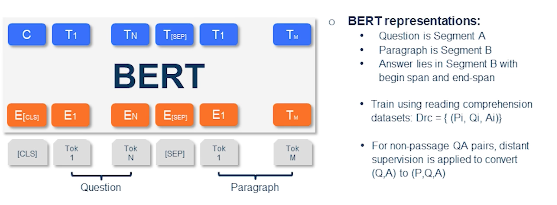{: width='400' height='400'}

As you probably know that what is a transformer-based method which essentially allows you to fine tune to target task. So we can perform fine-tuning for question answering task where you would like to consider the Segment A that is right after the CLS a special token as a question and you have a separator token. And then you present the paragraph which is essentially where the answer lies. The output of such an approach would be the answer where you basically provide the span that is begin and end of the answer in the paragraph segment. What most reading datasets would include is a triple so you have a question then you have a paragraph or a passage and then you have the answer.

So that is how typically reading datasets are used for training. However there is a chance that you do not have a paragraph you simply use question-answer pairs. So now you'll have to use something a technique called distant supervision where you convert the pair into a triple. So one may choose to query or use the question has a query and potentially pick several passages or paragraphs and then maybe use all of them as their positive examples. And some may be negative examples too but this is considering this as a silver dataset one would consider training on this dataset. And potentially multiple passages may have the answer so that's why we need to consider a second phase ranking. So we'll go more into the details of how reranking and other things will work out later in the lecture.

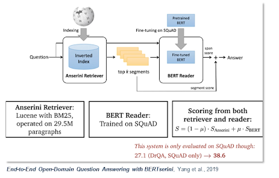{: width='400' height='400'}

So this is a very popular framework called BERTserini which is based out of previous slide where we discused how we could apply BERT to this question answering task. So here the retriever is responsible for selecting segments of texts that contain answer which is then passed to the reader by answer span. So the single-stage retriever in this case tries to identify segments of texts from Wikipedia so that we can pass it to the BERT reader as opposed to a multi-stage read retrieval. Where we first retrieve your documents and then rank passages within and so on and so forth.

So this particular approach has tried to index different granularities of the texts. By what I mean is you could either index the articles, or you could index the paragraphs, or you can index the sentences. While at the inference time you retrieve the segments either it can be paragraphs intense or articles using the question as a bag of words query. So this is basically a BM base retrieval which was previously covered in the information retrieval lecture. Next segments from the retrievers are then passed to the BERT reader. So this is the model that is the vanilla BERT model that was proposed by Devlin et al. in 2018. But there is one slight difference which is to allow comparison and aggregation of results from various segments. So basically they remove the final softmax layer over different answer spans.

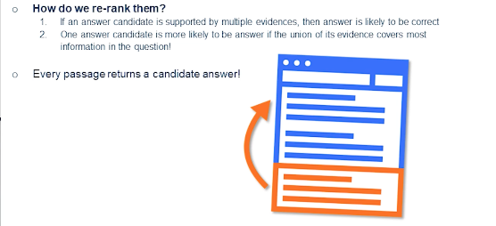{: width='400' height='400'}

Now we talked about reranking and that's actually a very important step when you actually have multiple paragraphs or passages or even long documents. It's extremely impossible or could create latency for the second-stage reader to actually look into every passage that are retriever returns. Instead people have approached this problem using something called passage re-ranker where you only return both passages or performance against the ranking where you actually just look into the candidates that are likely to have answers.

### Training Methods

In this section we will deep-dive into several training methods that have been successful in open domain question answering. So we will advance through some of the more latest techniques.

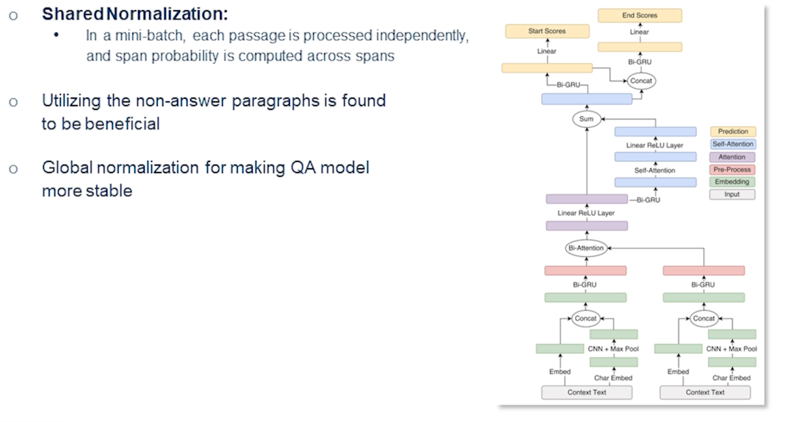{: width='400' height='400'}

Let's begin with multi-passage training. Often the problem is that we utilize just one passage but we could use multiple passages at the same time. And often the non-answer paragraphs or the passages can be extremely beneficial. If you see on the left-hand side so one of the context in this case certainly a paragraph that doesn't have an answer but also help towards identifying the answer. And the global normalization actually makes the question-answering model more stable while pinpointing answers from large number of passages.

So if we could split the articles into different passages and put them into a mini-batch and each passage is processed independently and we compute a span probability across various span that will actually make the performance of the models that much more better. And there is an existing work which actually showed this: BERT-based passage rankers actually give 2% more improvement over the previously looked at BERT reader that we have seen.

However there is one caveat sometimes the explicit sentence-level matching may not be quite helpful. 

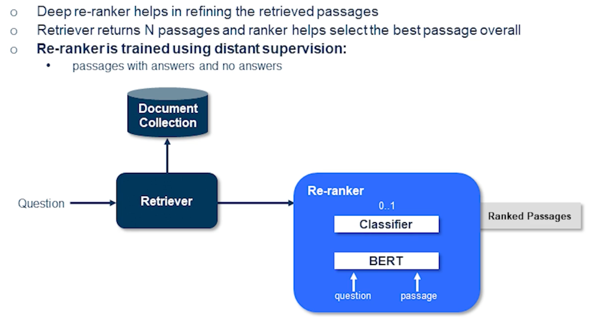{: width='400' height='400'}

So in order to address that issue often it's good to have this re-ranker phase where we explicitly pass the question in the passage and train a classifier essentially a second stage ranking where you have a way to say binary classification this is a right passage or a wrong passage for a given question. In this situation we actually get a series of ranked passages and most of the positive passages were likely to be end up at the top of the list.

Several methods are actually employed this deep re-ranker to refine the retrieved passages. There is a recent work which actually as simple as this technique that I'm showing here it simply computes the probability for each passage independently and obtains the final list of passages.

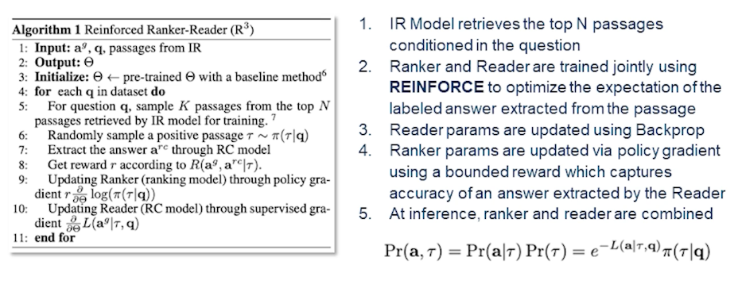{: width='400' height='400'}

There is a little more advanced technique than the previously seen one. This is a joint training of the reader and the ranker where we have an information retrieval model which retrieves the top-n passages conditioned on the question. And then you have a ranker and reader which are trained jointly using reinforcement algorithms to optimize the expectation of the labeled answer extracted from the passage. So while the reader parameters are updated using a back propagation, ranker parameters are updated via policy gradient using a bounded reward. So one could think of the ranker has higher honors of actually getting the right answers from the correct passages. Rather correct passages being ranked on the top and the poorly or negative answers or passages with no answers would be ranked in the bottom.

So the inference ranker and reader are optimized in the following fashion. So with this actually one could apply this model to any of the retriever approaches irrespective of whether it's a dense retrieval or a sparse retrieval. We'll go more into the detail of the retrieval phase later on. So when we're talking about the retrieval I said sparse and dense retrieval.

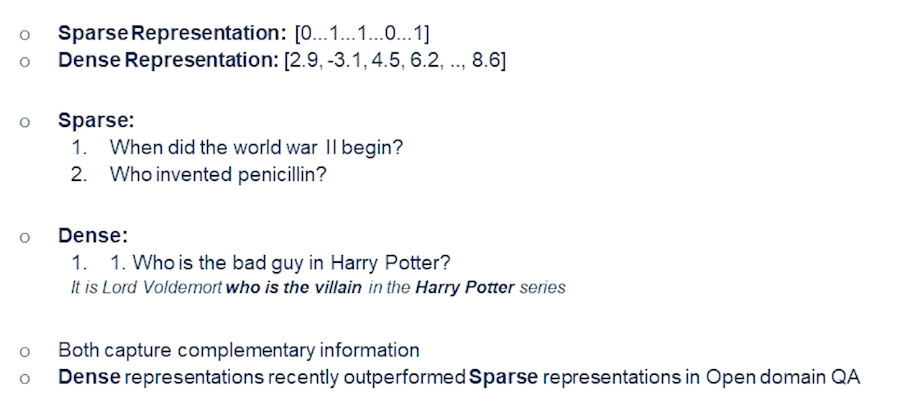{: width='400' height='400'}

What does sparse retrieval mean?

So when we look at the example at the top of the slide we are essentially denoting every token that is in a question as whether it's been present in the index or not. So we are essentially saying there is a token there's no token and so on and so forth. That's a sparse representation. And in dense representation obviously we know which question contains what kind of words in there in the cancelling words and then we basically come up with a word vector or a sentence vector and so on and so forth. There are various ways to come up with a dense representation in a distribution semantics way.

So when we look at the sparse representation not all words in the question need to be in the index. So when I say index it's basically the training data or non-training data but how we indexed the initial set of documents in our database and then we compute some scores around them using TF-IDF or some other similar techniques. And then basically assign certain score to every word that's present in the index. And then basically the inference time you'll end up with a sparse vector.

Whereas in a dense retrieval or a dense representation we have a way to ask more complex questions such as who is the bad guy in Harry Potter? And the answer can be pretty complex. In this case it is Lord Voldemort who is the villain in the Harry Potter series and so on. So it's not like the dense retrieval is better than sparse retrieval they actually capture complimentary information. And only recently we have seen dense representations outperform the sparser representation in open domain QA.

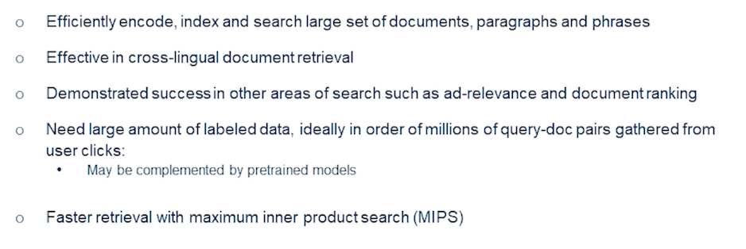{: width='400' height='400'}

What are the characteristics of the dense retrieval and why do we need to use dense retrieval? Sparse retrieval is often based on simple term matching which is obvious limitations. Latent semantic encoding is complimentary to sparse representations by design. So for example synonyms or paraphrases that often contain completely different set of tokens. So they need not be in the vocabulary of the index. So at the time when you're creating the index or the database those words may or may not occur. Whereas in a dense setting and that is not at all a limitation. It's okay to not have those words in the vocabulary at the time of indexing. Instead you've leveraged the fact that there are computing vectors that are likely to be similar based on their synonymy or if they're paraphrases in case of sentences and they could altogether contain totally different tokens. And sometimes people have also utilized different languages cross-lingual documents and they're still effective. So the words that are likely to be translations in different languages would end up having somewhat similar vectors in the close neighborhood.

So basically term matching is good enough for extremely well understood domains. Whereas dense encodings can be very interesting and they're also trainable and they will provide additional flexibility when we have task-specific representations or domain-specific representations or even sometimes the languages do not have enough vocabulary coverage to begin with. And again all of these methods both sparse and dense can be equally useful and some of the times I think dense is more preferred. As I said it can be pretty easily deployed in an index. And we can use maximum inner product search to compute nearest neighbors vectors. So a query is represented or encoded as a vector and then it retrieves a series of documents using this fast nearest neighbors research rate.

### Recent Approaches in Dense Representations

There are several recent approaches for dense representations such as

* ORQA
* RAG - Retrieval Augmented Generation
* REALM and
* DFR - Dense Passage Retrieval.

Let's go through each of these techniques and discuss some of their advantages and disadvantages.

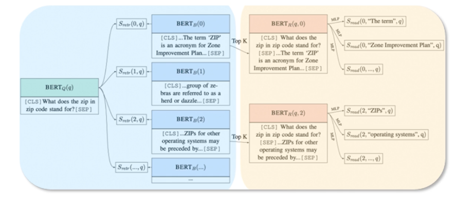{: width='400' height='400'}

ORQA is a model that was introduced by Lee et al in which was one of the first methods Stuart performed BERT for open domain query. Until then most often people would have used BM25 in the retrieval. And mostly the innovation has happened on the reader side of things. So ORQA would actually propose this an inverse close task objective which various blocks that contain the mass sentence and thus contains an additional expense of pre-training step. And the context encoded is not fine tune using pair of questions and answers. And the corresponding representations could be sub-optimal in that case.

So it has its own advantages and it has been found that it's necessary that we augment the retrieval with generation. That is to say that it is good to have a generative way to predict what tokens smart likely to occur. And then in an answer or even in a question for example there is certain way we can parameterize this.

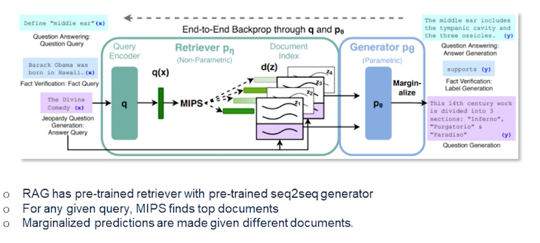{: width='400' height='400'}

So here comes retrieval augmented generation which actually trains the Retriever and a generate end-to-end and treats the retrieved documents as latent variables. So basically there are two models that marginalize over in documents in different ways. So the paper from Louis et al. in 2021 which actually proposes two slightly different variants of the RAG architecture. more details are in the paper but here I'll give you the overview.

Basically the RAG sequence there is the model actually uses the same document to predict the target token and that is the second variant which actually the rack token which predicts each target tokens based on different document. So in the first setting the RAG sequence uses the same document to predict target token which is likely to be an answer. And the second approach uses each target token based on different documents. And finally the Retriever competent in either of these variants is just a by encoder architecture and the generator component is based on the BERT which has a generative model for denoising autoencoder model for generating text. Ideally any generator could be used in this case and that's how it is currently set up in the RAG.

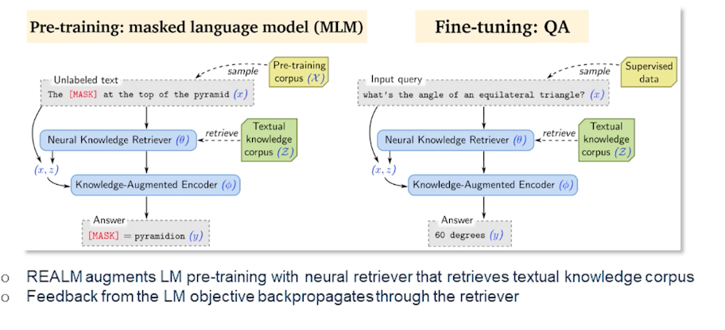{: width='400' height='400'}

REALM is another technique that augments the language model pre-training with the neural tube are very similar to RAG in that sense. Where the feedback from the language model object to backpropagate so the retrievers here the presentations are pre-trained to perform reasoning over a large corpus of knowledge on the fly and explicitly exposes the word knowledge thus the model could use to retrieve and at the time of interests as well. The language model uses the Retriever to retrieve documents from a large corpus like Wikipedia or even the glue web or other open web documents. And then it ends over the documents to help through during the prediction time.

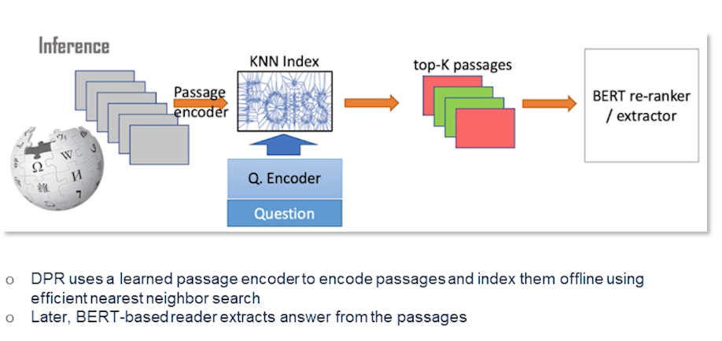{: width='400' height='400'}

DFR (Dense Passage Retrieval) As we are talking about different retrieval and reader techniques this is primarily an interesting retrieval technique which essentially does a learn passage to encode passages and index them offline and then apply MIPS or any other efficient nearest neighbor search. So later on then we have a bird base reader which exact answer from these passages. At runtime obviously a question comes in and then you construct a vector out of it in the same latent space and then you select the passage itself which vectors are close to this question. And the BERT based answer extractor is essentially going over the passage and figures out this time span. So the main contribution of this work is that the retrieval part could practically be implemented using dense representations are known. And actually this was the greatest advantage over BM25 like methods which are sparse retrieval methods and which actually was found to be a new state-of-the-art on several benchmarks.

### Multi-Hop Reasoning

As we progress into various retriever reader architectures one may see that question-answering is always about: a stiuation where we have several passages, one question, and then we figure out which of these passengers may have the answer and then we discover which is the right answer.

What if there are several series of questions and the questions are connected to each other and answers cannot be retrieved in one shot? Then we need to have multiple hops in this situation. What do I mean by that?

Let's focus on this example;

* Jack went up the hill
* Jack put down the pail
* QUESTION: Where did he put the pail?

Now the last question or the last statement which is actually the question need to be addressed in multiple ways. First we need to know what does the pronoun "he" referred to. So in this case it should refer to Jack. And where did he put the pail? Now that's the question where we need to understand that he went up the hill and he put the pail on the hill.

So this problem is known as multi-hop reasoning and multi-hop question-answering is an extension of it. So information that is presented in a post facto way and then there are multiple datasets that are created through multiple steps. The most prevalent one in this setting is hot pot QA and there is another previous dataset which has a fixed number of sequences which was a precursor to the hard part QA.

So what really changed when we do single-hop versus multi-hop?

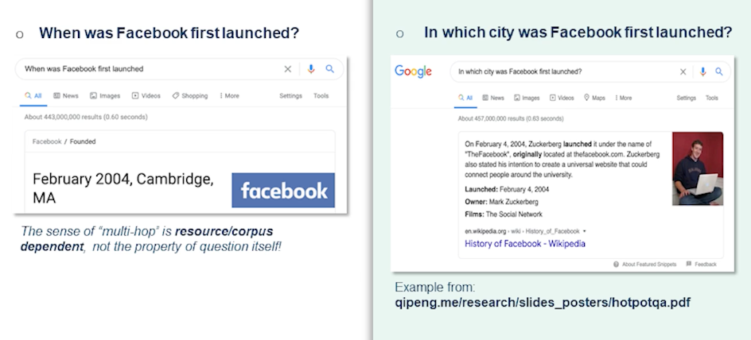{: width='400' height='400'}

Let's look into this question.

* QUESTION: When was Facebook first launched?

The answer could be straightforward. In this case February 2004 Cambridge, Massachusetts. Whereas when somebody asks them the right-hand side in which city was Facebook first launched? So this would require it's not explicitly answered in a single Wikipedia paragraph where it says on February 4, 2004 Zuckerberg launched it under the name of "the Facebook" originally located at thefacebook.com. Zuckerberg also stated his intention to create a universal website and so on and so forth. That actually doesn't have the immediate answer. So this is actually a good example of how the city needs to be figured out.

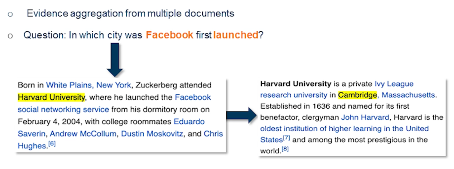{: width='400' height='400'}

So when you look at the actual paragraphs we find there is additional evidence from multiple documents which actually says where was Zuckerberg born and where did he attend the university. So one would know that Zuckerberg was born in White Plains but that's not the relevant information here. He attended Harvard University and where is Harvard University located? Its in Cambridge Massachusetts.

So the answer indeed is in there multiple pieces and retrieval needs to retrieve both documents and most of the time the documents need to be retrieved and sequence. Since you need this information in the first paragraph to retrieve the second paragraph this type of question is sometimes referred to as bridge questions and the intermediate information as bridge entity.

### Existing Solutions for Multi-Hop Retrieval

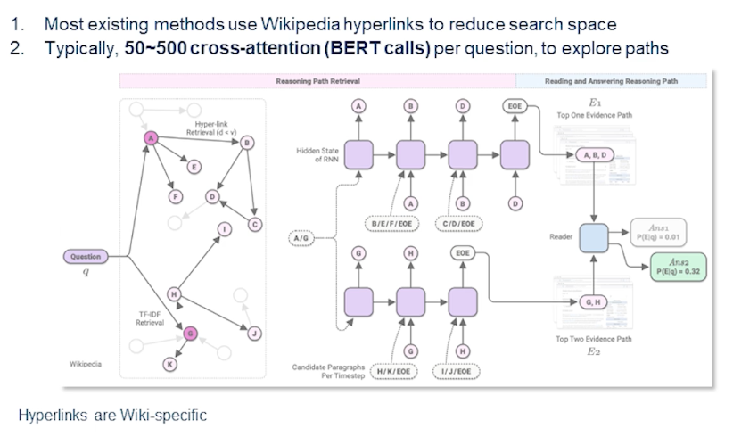{: width='400' height='400'}

So there are several interesting solutions for the multi-hop retrieval. The challenge for multi-hop retrieval is actually the search space of candidates, where the candidates of chains where the documents grow exponentially at each hop. Almost all existing work make use of Wikipedia hyperlinks to narrow down the space and these chains are restricted along the edges of the hyperlink graph or the Wikipedia documents. Obviously this approach would generalize or may not generalize depending on the domain. We cannot simply rely on the hyperlinks.

Let's take an example sometimes the medical documents may or may not have enough hyperlinks. In general the web doesn't necessarily connect all the relevant webpages from a given webpage that is through hyperlinks and moreover such approaches can be too restrictive. So in that sense that's why hot part QA was created as a data set where we could sample them just across the hyperlink graph and then generate the questions. And this is not exactly sufficient to narrow down the search space. Again the tough methods need to rerun 50-500 chains in doing expensive cross intention computation for each candidate.

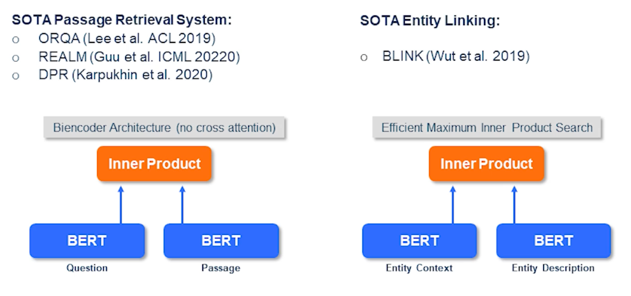{: width='400' height='400'}

So here are some other methods. Like I previously discussed you have to perform passage retrieval which can be done in several different ways where you can apply a by encoder architecture with no cross indention. Then you were to let's say perform state of the art entity linking using blink and similar techniques. So where you have an entity of context and then you have an entity of description and you perform inner product between them.

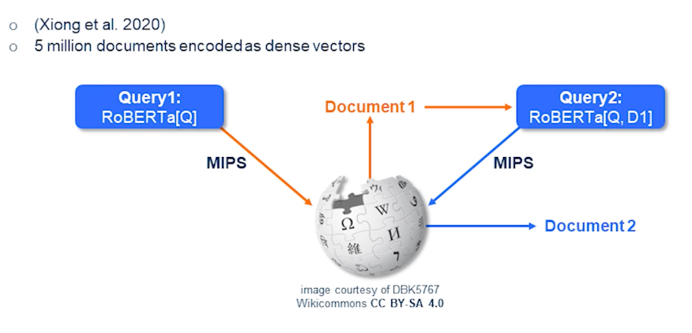{: width='400' height='400'}

So here comes a very interesting technique called multi-hop dense retrieval which essentially is a very simple technique if you look at it. So firstly income subquery and you have a RoBERTa which is a flavor of BERT. So it actually encodes the query and performs a search on an index of vectors that are trained and encoded passages from Wikipedia and outcomes of document 1. And now you run a second round where the query or the question includes the original question queue and also the document D1 which is the top document. And then we again perform a second search where outcomes the document D2. So in this way we could perform multi-hop dense retrieval and this is how mathematically it would look like.

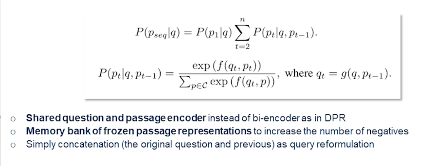{: width='400' height='400'}

It's always measuring the probability of sequence of passages given the query and now once we have the first passage given a query then we break it down into a sequence of passages that are given the previous passage and the original query itself. And then simply compute the probability. How likely it would come the current passage would come out to be the best candidate given the query in the previous passage. So the shared question and passage encoder instead is preferred over by encoder as in the DPR and memory bank of frozen passage representations will also increase the number of negatives. And simply concatenation of the original question and the previous one as we see is used as a query reformulation.

### Datasets and Benchmarks

In this section we deep dive into some of the datasets and benchmarks that we could apply to various approaches that we have discussed in the last two sections.

Let's begin with some of the datasets that are popularly used in question answering.

* bAbl is an automatically regenerated synthetic dataset such that a model can learn characteristics of a language
  * it's a very simple dataset.

Another one popularly used for benchmarking question-answering system

  * Natural Questions, which are questions are created from search logs using crowd workers to find corresponding evidence for a given answer.

there are more well-curated datasets such as

* TriviaQA, mentioned in the previous slide.
  * Reading comprehension with complex compositional questions
  * text evidence is based on the web-search queries.
* SearchQA
  * where the QA pairs are based on Jeopardy Archive
  * The search queries provide text evidence
* Quarsar-T which is trivia questions
  * based on searching and reading the Clueweb
  * which is probably a subset of the overall Clueweb09, which only contains one billion web pages.

HotpotQA and FEVER which are essentially multi-hop and multi-evidence datasets

* HotpotQA actually includes natural multi-hop questions with some supervision from supporting facts
  * thus basically leading into explainable QA.
  * questions require finding and reasoning or multiple supporting documents
  * question are diverse in nature and not constrained to any pre-existing knowledge or knowledge schemas. And there are sentence-level supporting facts required for reasoning and so that QA systems could reason with strong supervision per se and explain the predictions as well.
* FEVER is another dataset
  * which has essentially a fact-checking algorithm sentences dataset.
  * assume that we look at Wikipedia paragraphs and we modify some of the keywords usually. Thereby you're creating misinformed paragraphs in a way. The claims in this case so the paragraphs are with certain information in there could either be considered as supported, refuted, or not enough info if they're too ambiguous because we modified those sentences.

So thereby each of these datasets are pretty relevant for multi-hop and multi-evidence question answering systems.

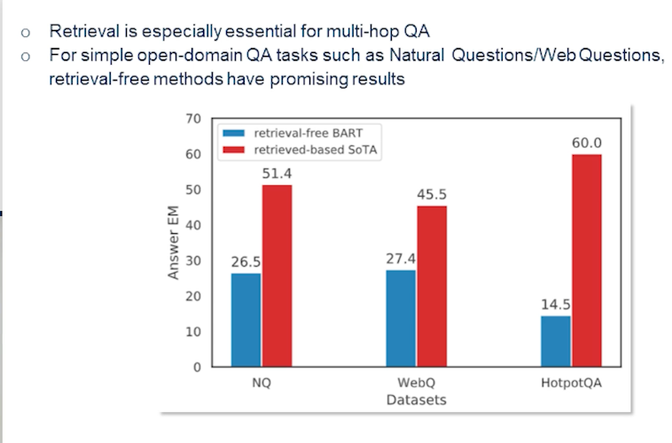{: width='400' height='400'}

So in a typical multi-hop question answering system the retrieval could be as simple as looking at state-of-the-art methods. We could also use similar techniques that we have used in a single hop setting. So they still fall behind as you can see in the natural questions and web questions which are single hop set the methods not necessarily have a advantage when they don't have the generative power. So the techniques that we are discussing here are primarily like say the techniques that do not use a generator towards the end. So something like BART. That's one reason why retrieval is actually more crucial for this multi-hop question-answering.

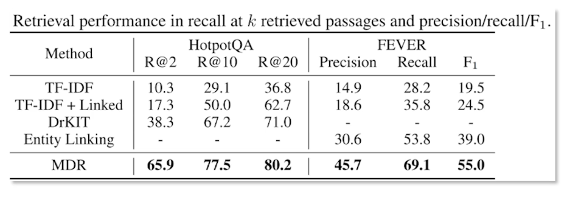{: width='400' height='400'}

So as we discuss the multiple density we'll actually is much more performant in the situation because of the nature of the approach. Where we see the crowdsource questions from HotpotQA are fact-checking datasets such as multi-a and like a fact-checking datasets such as a FEVER we see that strong results techniques are TF-IDF and entity linking baseline. That's the interesting part. So here we're measuring the precision and recall, as well as the F_1 score.

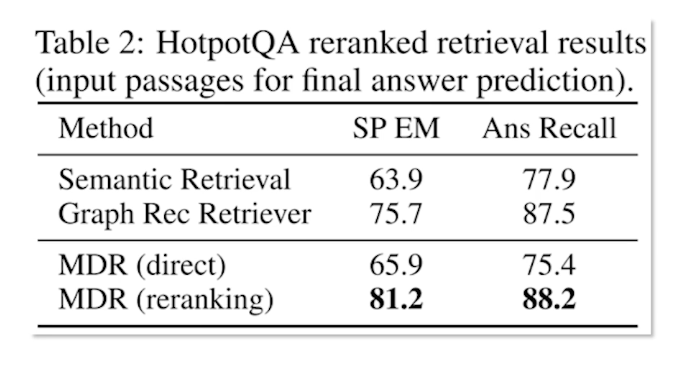{: width='400' height='400'}

One could actually argue that the ranking itself is not sufficient. Especially when you are looking at multiple documents you may need more evidence when you gather more documents. So in that effect obviously reranking actually helps. So retrieval results offer cross attention reranking compared to not reranking. That is simply doing the direct just one short retrieval and ranking is actually no good.

So as you can see there is nearly 10% absolute improvement on that inversion absolute improvement in the recall and nearly 15% absolute improvement in the exact match. So exact match meaning the answer exactly matching the ground truth. Similarly the previous state of the state-of the-art methods such as graph retriever would also stand no chance with the MDR approach. So it helps to have this cross attentionary ranking in this kind of multi-hop setting.

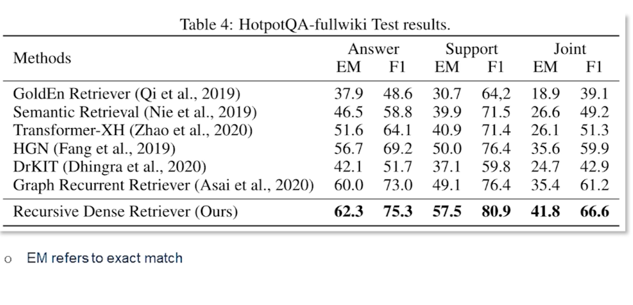{: width='400' height='400'}

Furthermore as we see the Recursive Dense Retriever actually does perform much better than the other retrieval base methods. And you can see that exact match is prominently higher against the competing methods. So similarly for the F_1 score especially for the evidence and also combined answer and support together is also very high. It definitely shows that we have more scope for retrieval in multi-hop setting as opposed to in a single hop setting. That is to say one must pay more attention to what documents are being retrieved and thus they need to be reranked more often in order to get to the actual answer in a multi-hop setting.

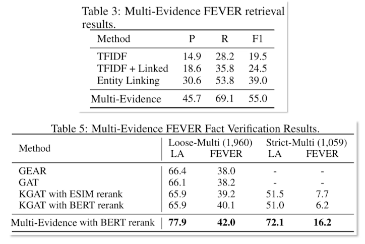{: width='400' height='400'}

As you can see similar story can be told from the FEVER fact verification results. So almost by points the strict multi-evidence set performs much better than the nearest previous state-of-the-art method. This indicates that multi-evidence and multi-document or multi-hop retrieval and reading is essentially a very promising direction in the open-domain QA and soon it becomes even more an interesting challenge as there will be more such datasets similar to a HotpotQA and FEVER.

The main takeaways I have from this lecture is that

* Open-domain QA has several flavors
* Often Reader and Retriever base methods is the go-to framework as of now.
* Simple efficient pipelining approach has outperform complicated pre-training end-to-end schemes. So we need techniques that can be optimized and obviously that are fast enough for specific domains.
* But again there are certain limitations like bi-encoder optimization is challenging while it provides value.
* Dense retrieval is faster and better

<!--  -->