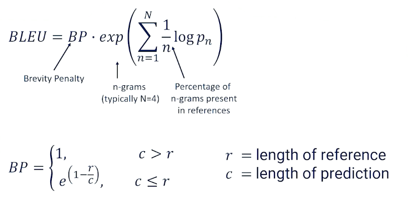

### Machine Translation

{: width='400' height='400'}

Some words are repeated / observable patterns - even as we see across multiple different phrases. This gives us hope that we might actually be able to do machine translation without really even truly understanding what language means. 

Examples of machine translation efforts past the years:

* World War II code breaking efforts at Bletchley Park , England (turing)
* 1948, Shannon and Weaver information theory
* 1949, Weaver memorandum defines the machine translation task
* 1954, IBM demo, 60 sentences from Russian to English
* 1960, Yehoshua Bar Hilel suggests that high-quality MT will require the understanding of meaning. 
* 1966: Alpac report comes to the conclusion that human translation is cheaper & better than MT research
* 1990: IBM CANDIDE - the first statistical machine translation system
* 2000: Progress in statistical machine translation and phrase-based MT
* 2010: Neural Machine Translation

What exactly makes translation hard?

{: width='400' height='400'}

* one to many correspondence or many to one correspondence or even many to many
re-ordering of words
* split phrases
* different word senses
  * in english we have river bank and financial bank, but in german they have 2 different words for such nouns
  * in english we just have brother, but in chinese older brother is (gege) and younger brother is didi
* Word order
* Head Marking vs Dependent Marking to indicate possession. 
* Gendered words 
* Pronoun dropping
* Negation

### Machine Translation Background

* Suppose you had a "perfect" language that could express all thoughts and knowledge 
* Maybe it is first order logic (or maybe not)
* May need more information that your representation cannot express
* Hard to think of semantic representation that covers everything
* Maybe if all languages have the same semantic ambiguity then our representation still works 
* Not true for all languages 

**The vanuquois triangle**

The concept of having a perfect language is still useful to think about and it's useful to think about in the following way. So we think often about something called the Vauquois triangle.

This is a way of saying how do we get from a sentence in a source language to a sentence in a target language? Well we want to still think about this as being able to go to some perfect language in the middle through a process called analysis.

{: width='400' height='400'}

* We want to take that source we want to break it down into words
* analyze it at the word level, then merge the words into phrases
* analyze things at the phrase level
* look at the syntax relationship between things and the phrases.
* We also look at it at the syntax level look
and the semantics level.
* if you do this analysis long enough you would get to this perfect language: Interlingua

{: width='400' height='400'}

Now the reason why this is a useful thing to look at is because when we set it up as a triangle like this we might think do we really need to go to the interlingual? Maybe we can do something called transfer maybe I can stop my analysis at the word level and try to do direct transfer to my target words so word to word translation or word to word transfer. Maybe I'll allow the analysis to go to the phrase level but I'll try to translate or transfer phrases into my target language. Maybe I can go all the way to the syntax level and take syntax trees and syntax analysis and what we learn in that process and transform it into syntax. And maybe we can even do this at the semantic level.

The point here is if we're never going to have this interlingua then we need to find a way of short cutting across this triangle. And to do that we have to pick the level of analysis we want to work at. Let's look at some examples of what language translation looks like when we start thinking about it as transfer. So direct transfer is basically word to word.

Here's an example of Spanish to English

{: width='400' height='400'}

* Word Level you can actually see some re-ordering here. But if we're going to treat this as a direct transfer word to word we would get a jumbled sentence that isn't quite fluent English. But the point is if we just go word through word there must be some way of making this translation happen maybe a statistic. We might say there's a probability that we see the word tomorrow given the word manana and there's a slightly less probability that we see the word morning given manana. So we can just maybe take the most probable translation based on some statistics about how languages relate to each other and we're good to go we have direct transfer. So that's word level.
* Phrase level well now we want to do a little bit better. We want to recognize that phrases like lo hare tend to translate not word by word literally, but to chunks of English. So there's some probability that lo hare should be replaced by "Will do it" and some smaller probability that it should be replaced by "Will do so". Although both are somewhat reasonable.
* Syntax Level can't be expressed as a nice probability tables anymore but you have some syntax structure for lo hare and the noun phrase that comes after that. So what is the probability that the simple verb phrase that we see in Spanish would look like a more complicated, in this case syntax tree, that happens in English? Are these things probabilistically likely to be interchangeable? And we'd need to build statistics on how trees relate to each other in syntax transfer.
* Semantic Transfer We don't have an exact example of this because semantic transfer isn't done very often and I think we're still figuring this out but you would imagine that you can look at things at the semantic level as well.

Now we have a bunch of probabilities. It would be useful at this point to step back and remember Bayes probability rule.

Recall the bayes formula: $P(x \lvert y ) = \propto P(y\lvert x)p(x)$

{: width='400' height='400'}

* P(source $\lvert$ target): correlates to a faithful translation
* P(target): is the fluent translation
  * the reason why this is nice is because they mean something very specific that we can understand.
* to understand fluency we look at an equation we've seen many times
  * $P(target) = P(w_1,...,w_n) = \prod (w_n \lvert w_{n-1})$
  * We break the target down into words and we can compute the word given its previous context.
* What this tells us is there's a language to language probability.
* Any good translation will also look at that target and say whatever we translate to are we likely to see this as a plausible sentence in the target language? So we want both of these things and the statistics are going to give us that.

The faithful translation is the tricky part here. How do we know the probability of a source given a target? Well we have a clue how to do this and this clue is something called parallel corpora. We want to find this parallel corpora that tell us the exact same information in two different languages side by side meant to be faithful to each other. So the two documents should say have the same meaning but be in different languages. And the place that we find a lot of parallel corpora is

* in legal and parliamentary texts from languages that are multi lingual.
  * think European Union where every legal document in every language must be translated to every other language in any country in the European Union.
  * Canada is another example where French and English are both official languages so everything that's official has to be given in both languages.
* It turns out there's lots and lots of parallel corpora in the real world and we just have to find that and make use of it.

A parallel corpus looks like a collection of sentence pairs. We might see the English and the Spanish side by side and we would basically know that each of these phrases were equivalent to each other. And now because if we know English or Spanish but not the other one we actually understand what's being told to us and we can look at how it's being expressed in the other language.

### Evaluating Machine Translation

How do we know a Translation is good?
Well in machine translation there's really kind of two phenomenon that we really care about.

* Fidelity. Fidelity means does the translation capture all the information in the source? That is if I tell someone one thing and I tell another person something else with a translation have I given those two people the exact same information?
* Acceptability So acceptability is asking whether the translation captures enough of the meaning of the source to be useful. So this is an argument to say that translation doesn't have to be perfect to be useful. It's not perfect it's not fluent but it's acceptable.
* Acceptability is a spectrum, Fidelity is much more binary, You got all the information or you didn't

If we had a machine translation system the gold standard would be human evaluation. We would put the originals and the translations in front of people and we would ask them either to judge the fidelity or to judge the acceptability. But humans are expensive! We would rather have some automated way of doing this. Preferably mathematically,

Machine translation makes use of a number of automated metrics. BLEU score being the most famous.

* BLEU: Bilingual Evaluation Understudy
  * the geometric mean of 1,2,3, and 4 gram precision multiplied by a brevity penalty
  * the geometric mean might favour short translations which might mean the translations are dropping information
  * so we then penalize things that might be too short

{: width='400' height='400'}

We would also need a corpora, here are two potential translations
* Maybe this means both of those to some degree.
* Now let's suppose that our Machine translation produces three possible translations (hypothesis)
* How do we know whether one is better than the other?

So the first thing we do is we look at the geometric mean. At each of the 1-gram 2-gram 3-gram 4-gram so on and so forth. I'm just going to go up to the gram level but we can basically look at each of these hypotheses and we can go through the different grams.

* Hypothesis 1
  * we see there are three 1-grams and each of these 1-grams appear somewhere in one of the references. We don't care about ordering but we see I, am, and exhausted in both of the references. So we get 3/3. At the 2-gram levels there's only two 2-grams that are possible. "I am" and "am exhausted". Further, only "I am" shows up as a 2-gram, a bigram, in the references. It shows up twice but we only get one point for that so we get one of two bigrams show up in our references. There's only one 3-gram none of which show up exactly in the reference. We get zero there.
* Hypothesis2:
  * if we do case sensitivity in this case we're doing that we see only one -gram that shows up in the reference I. We see none of the bigrams show up and the trigram doesn't show up at all.
* Hypothesis 3
  * we do see one of the 1-grams show up tired tired is in the references it's repeated but we don't care about that. We just see is it present or not. None of the bigrams and none of the trigrams. Then depending on how you do smoothing and some of the other things you come up with a geometric mean.

You might come up with something along the lines of hypothesis 1 having a very good geometric mean score, hypothesis 2 having somewhat less and then hypothesis 3 also not particularly great. Again don't get caught in the numbers. I don't remember how I did the smoothing to come up with these numbers. The key is that what we're already seeing right now is that hypothesis 1, the one that we intuitively think is the best one here is in fact showing up as having the higher score.

{: width='400' height='400'}

So the complete BLEU score is calculated as the geometric mean times the brevity penalty. For the penalty term, If you have a very short translation you have a lot of 1-grams but maybe you don't have a lot of 2-grams and 3-grams and 4-grams. The geometric mean is going to be quite okay with that. But we want to basically make sure that we come back in and say well hold on we don't want to just say "tired". We don't want that to come out as seeming like good translation. What we do is we say if the length of the prediction is greater than the length of the references we're fine. The brevity penalty is just . There's no penalty. But if our length of our predictions are smaller than the reference then we apply this penalty here to make sure that we are not giving an artificially high BLEU score for basically translations that are likely missing a lot of information just because they're way shorter than what we should expect to see with a good translation.

These two components go together to give us the BLEU score. Again this captures the intuition that the translation is somewhat faithful if not just acceptable.

### Machine Translation as Transfer

We're finally ready to talk about machine translation as transfer. We'll do so at both the word level and the phrase level in this segment.

Recall that "direct Transfer" is word-to-word, so word level. So machine translation via direct transfer will also be word to word. Just as before we will run into some word ordering issues.

* Glinda no dio una boftada a la bruja verde (in spanish)
* Glinda not give a slap to the witch green (to english via direct transfer)

To get around direct transfer issues is we go to phrase transfer, which is where we'll spend most of our time.
Recall from our seq2seq models

* Transfer works better when we're dealing with larger chunks of text. Often chunks of text in one language, ie phrases, seem to translate naturally to other chunks of text.
* So to do phrase transfer, we just need to figure out what these common phrases, aka chunks, are and stich them together

The Stitching is the most challenging
* first is what are these common phrases?
* How do we identify these phrases? How do we do word alignment within these word phrases?
* And then how do we stitch these phrases together?
  * The fluency is going to be very helpful in terms of stitching as we'll see.

{: width='400' height='400'}

So if we want to figure out which phrases are going to be the ones that we have to remember and keep track of because they translate well to each other. We need some way of figuring out which are these word phrases that we should keep track of irrespective of their word ordering. So we'll look at two examples here. The example we saw before which was John loves Mary going to French. And that was an example that we saw where there was no word ordering issues here. This is the straightforward thing and we know it's straightforward because if we plot this along a matrix. We can see every single word maps to the next word in particular order and we get this nice diagonal. So first word goes first second goes second third goes to third. That's what that is telling us.

Compare this to something that has not so literal word alignment. So I know that John loves Mary has some word re-ordering issues here. So I know that those words are in order. But then we see the swapping of loves and Mary shows up as a different pattern. So we see the diagonal break. So what we want to do is we want to find a way to identify the fact that this is a chunk that we should keep track as being separate. Whereas all the other words we can deal with on a word to word basis.

{: width='400' height='400'}

To do word alignment, we're going to make one small change to this diagonal alignment chart. We're going to add the null because we want to sometimes recognize the fact that some words just don't show up in the translation. And this allows us to basically go through and find a mapping or an alignment in terms of word order.

In this case Mary is the first word maps the first word. But then we have the second word becoming the third "a traverse" seems to go together. So the third words maps to the third word as well four to four five to five six and seven don't show up in the translation at all. And eight the eighth word is actually referring back to the swimming, the swam word. So this is the alignment chart and what this allows us to do is basically keep track of the alignment. Every word source sub I has to be aligned to one of the target words. Including null target j such that $a_i= j$. That's just telling us what this thing is telling us here. But once we do this we can make a small update to our statistical math. We can say the probability of a target phrase given a source phrase, now should be the sum across all possible alignments of the target and the alignment given the source. So we're adding a in here and what we're basically trying to do is say now we have to go from source and predict not just the target words but also the alignment as well. The for example needs to show up as something that we predict. But this will give us a level of precision at the phrase level. And if we do our little bayesian tricks we can move our alignment to the other side and multiply by the probability of alignment. So now we really have to do is we have to figure out what is the probability of a particular alignment of phrase to phrase. So now we need to know phrase alignment probabilities. And that's going to be somewhat straightforward. Because we're going to see phrases and their corresponding phrases show up again and again in different documents. So phrase alignment.

Word alignment was going to assume that each word can be swapped for another word or null. So we have to be able to guess the alignment of each word. So we go through word by word and say well does it show up in this spot or does it show up earlier or does it show up later? The third word really the third word. Or should it be moved to the second should it be moved to the forward? This is not a trivial problem but we're going to allow for the fact that many short phrases always seem to translate the same way. So what we really have to now do is go and figure out what those phrases are and just remember them. So in the example before of slapping the green witch. We always see green which might be something that we see time and time again. Bruja verde being green witch a la to the this is obviously something we're going to see a lot. And then more complicated phrases that might translate to simple words like dio una bofeda meaning slap.

{: width='400' height='400'}

So now I'm not going to spend a lot of time talking about how phrase alignment works but just to give you the intuition. This is basically going to be a clustering problem. We can look at these alignment issues and we can look and say. Well we often see patterns show up. This phrase aligns nicely with that phrase. This phrase aligns nicely with that one but the alignment is opposite. Lets say in the case of this week and so on and so forth. So again I'm not going to go into the details of how you do this. There's lots of different ways of doing it. But you really want to cluster these strongly co occurring phrases that you see in parallel corpora and then you keep phrase statistics. What do I mean by phrase statistics? We're just going to write all these down. So how many times do we see green witch and it's a line source? How many times do we see at home referred to in different ways? How many times even single words. How many times do we see i in East? And this week and it's German correspondence.

So obviously you know if we have counts we can convert these into probabilities as well. So now we have phrase to phrase probabilities going for us.

{: width='400' height='400'}

So now the next thing that we have to do is we need to start stitching the phrases together. Now this is the problem when should we go word to word or when should we try to replace phrase by phrase? And. >> In our summary statistics of phrase-to-phrase translations we might see different chunks being translated into different chunks in different ways at different times. What we're going to do is we're going to build up something called the phrase lattice here. Bear with me a little bit this is the direct transfer level. This would be what would happen if we translated each single word to its best match other words. We've already determined that this isn't good. But we can do more than that. We can go in and say well the word no in Spanish is sometimes translated into did not or no. "No dio" can show up as "did not give". Dio una bofetada could come as slap but we could also see it as slap a slap slapping by slap to the and so forth. What we're basically doing is we're taking every chunk of the source language and we're looking at the possible translations we see in our phrase dictionary that we might replace it by and we're just putting all these into one big lattice.

The reason why this lattice is a nice way of visualizing this is because now we can think about walking through the lattice I could have gone Glinda did not give a slap to the witch green but I could also look and say well no could have been did not. So I might want to have said Glinda did not. That leaves me with dio and I really only have one choice there. So I might have to say Glinda did not give. Una bofetada could be a slap. That's the only thing that seems to be available once I decide to go from Glinda to Glinda did not to Glinda give and once we get a slap there are different ways we could have gone to the next thing we could go to by we could have gone to the we could have gone to or the. Let's pick one let's say go by. That leaves us with la translating to the and we could have gone to witch green or we could go to the green witch

{: width='400' height='400'}

so what we can see here is that by picking up at every single time slice along the way and picking a different possible phrase we get different possible paths through the phrase lattice. We could have also gone from Glinda did not give to a slap to to the and then green witch and we could have gotten Glinda did not give a slap to the green witch which maybe is a little bit better and we can look at all these different possibilities. So Glinda did not slap the green witch and maybe that's the best one. I like that one the most. How are you going to choose? Well here's how we're going to choose.

{: width='400' height='400'}

We're going to look at all the possible combinations and we're going to score them. We're going to look for the maximum for the target multiplying together the faithfulness. This is how phrase translates to phrase in this lattice and then the fluency of the overall path that we took the light blue, the dark blue, or the red would all be different possible translations with different scores in terms of the faithfulness of the translation as well as the overall fluency of the entire trajectory through the lattice. We can just go through and we can find all these possible paths through there. We can score them take the max. Now we know what is the best stitching of all these phrase chunks together.

**Beam Search**

{: width='400' height='400'}

Now you can imagine that this is an easy example. Once you have very very large phrase tables and phrase summary statistics this can become very very complicated the phrase lattice can become very very large. We want to be able to have an efficient way to do this search through the phrase lattice. A technique that has been used very successfully is something called beam search. The idea of the beam search is we're going to walk through the phrase lattice and every time we make a decision we're going to score that transition. We're not going to wait till the very end. We're going to score that transition at that particular time looking at the score of faithfulness plus the score of fluency by running this say through a language model. Then we'll decide whether we want to favor faithfulness over fluency or fluency over faithfulness and we'll sign our alphas and betas appropriately. To give you an idea here right after two steps we might have said Glinda only has one choice. We can only convert that to Glinda so we would look at the probability of Glinda being translated into Glinda. Then we might make a choice to go to not and we would look what's the probability of no and not being good translations. Then we would also look at the fluency of going from Glinda to not so the probability of seeing the word Glinda times the probability of not giving Glinda. So we're looking at the path after two steps the fluency and then the faithfulness of every one of those in the two-time steps.

Now we have a way of scoring now we have a way of moving through here and basically incrementally making a good judgment of how well our previous choices have been stacking up. Now because memory is a problem as I mentioned before we don't want to keep all possible transitions all possible paths at every single time step because that's going to give us exponential memory growth. What we're going to do is we're going to apply a beam width. We're basically going to say I'm only going to keep track of so many possible translations. I'm just going to take the top K best at every given time throughout the rest and then build from that step forward.

{: width='400' height='400'}

This is what beam search looks like in practice. We start with our first translation our first faithful translation. Then we look at all the possible things that we can go to next. Glinda can go to Glinda not Glinda did not Glinda did not give or Glinda no according to the lattice. And if our beam search has a beam width of four that's good because there are exactly four here we keep all those. And all the ones we keep we then go through and we try to take the next step for each of those. Glinda not can go to Glinda not give Glinda not slap Glinda not slap. There's actually two repeated possible transitions here. Glinda did not has three possible transitions. Glinda did not give goes to Glinda did not give a. There's only one thing we seem to be able to do there according to the lattice and Glinda no gives us some options as well. Now those four gave us a tone more. Our memory is building up we're going to eliminate some of these options. We're going to take the four best. Let's suppose these are the four best. We're going to ignore all the rest and we're going to then make a transition from each one of those. Here are the transitions we have from those four going forward gives us a whole bunch but once again we just take the four best take those four best allow them to go to the next translations keep the four best and so on and so forth. The best ones are actually in here. A few of these have an option of adding an extra word but we'll find that those words are not good to add on so we're not even going to look at them we're just going to let them slide right off the edge of that screen.

But you can see expand score eliminate, repeat, expand score eliminate, repeat until satisfied.

Eliminate is the beam search way of doing things, it keeps things fast keeps and our memory requirements low and while we are making greedy judgments about every single time slice hopefully though are scoring with the language model and the faithfulness components always keep us on the right track. Generally this is going to work out pretty well not perfectly. Sometimes we can get really really great translations that get eliminated because we get in some minimum that beam search doesn't like. But more often than not this works out pretty well.

That is looking at transfer specifically at the phrase transfer and most transfer is done at the phrase level. We have really good tools and we've found that this works pretty well in most cases. We didn't look at syntax trees because figuring out how trees are probabilistically mapped to all the trees is a little bit more complicated but there is work out there that does that and you can see there are some advantages in looking at higher-level understanding of chunks as opposed to just phrase and phrase reordering trees can capture so much more structure. You can do this at the semantic transfer level as well which is including more and more complicated structures into this notion of the translation process. Again not a lot is done at the semantic level because we find syntax and phrase level gives us most of what we need. Semantic is a little bit uncertain what it really means to do a semantic transfer in the first place.

But structural transfer is theoretically powerful. Semantic transfer is also theoretically powerful and it does remain an open research topic. There's lots of room to improve as we've probably seen and there are ways in which we can bring in more structure and make better transfer choices. But we're not going to go much deeper into the transfer because over the last few years the state of the art and machine translation has really been dominated by neural approaches specifically and including the transformer. In the next set of slides and topics we'll be looking more specifically into the neural approaches to machine translation how that works and how that has evolved over time as well.

### Neural Machine Translation

In the last few years we have had some very good success with machine translation by using neural network approach, which should not be particularly surprising based on how much time we spent talking about neural networks and language models and things like that up until now. Let's take a look at how we approach machine translation from the neural network architecture perspective. 

Recall that Recurrent neural networks (LSTMs in particular) read a sentence in one direction to build up a hidden state.
* Builds up a hidden state over time and that hidden state allows a generator to make the next best choice. So if we are treating translation as a language generation problem, we are going to take a source and generate word by word what the target should be.  

The hidden state is decoded to produce the next token:

{: width='400' height='400'}

Look at this example:

Every word we are going to encode it and decode it into some other word. So Glinda doesn't translate so that is particularly fine. We get to the next time slice, we pass the hidden state forward and we expect to produce whatever word should come next. So no is the input in the source would have to translate to, well the best translation should probably say did, right? Glinda did not slap the green witch, but we are looking at the word no. What information can we possibly have to know that we should have to use the word did instead of not here? When Spanish has the key indicator the word that is really going to help us make the best decision hasn't even appeared yet when we are looking from left to right. 

This is going to up over and over again, even in this example, if we are further through it and we are looking at being la translated to the. But in the next time slice we really want to do word re-ordering. We really should go to green but we have no clue about color. What we are looking at is the word witch. So how are we possibly ever going to have a chance to guess that we should say green witch instead of witch or witch green or anything like that? 

So you can see the most direct application of neural networks is going to give us this direct transfer issue that we saw with word to word transfer before. So we are going to have to think our way through this a little bit.

Wells, RNNs are pretty simple, maybe we should do something a little better maybe we should have stuck with sequence to sequence. Seq2seq networks are going to work a little bit better and because they are going to work better because they collect up contextual information for the source sequence before generating the target sequence. 

Here is the same example we saw long ago for translation. 

{: width='400' height='400'}

The hidden state is going to encode information like the house is blue etc and capture it at the higher semantic level than strictly the word level. So seq2seq is going to work a bit better but it is also not great because we also know that sequence to sequence lose alot of information along the way. Furthermore, translation can involve reordering, the translation of any one word requires context from the left to the right. 
* Any one word can have context from both left and right, and all this information up into one big hidden but remember we also have attention models and and these attention models allow the neural network's decoder to go back and look at any given time slice in the past.

However you still always look back to the left and never really look to the right, until you get to the final hidden state. So attention isn't going to be particularly useful unless we do something to make it more useful. 

And the thing we are going to do to make it more useful is something called a bidirectional LSTM or bidirectional seq2seq in this case which is to say, 
* if we have the entire source, why must we limit ourselves to the left to right, one direction or another? Why not both? 
* Figure out what that source sentence means and then try to translate it from that point forward involving attention and all of the mechanisms we have to use. 

{: width='400' height='400'}

So this is what bidirectional LSTM is going to look like with the source input `I am not in the blue house`:

We still have to go from left to right initially (or vice versa), we are still going to encode left to right but we are not going to stop there once we get into the end. We are going to go back through right to left. 

{: width='400' height='400'}

So we are going to code the end and what it looks like and we are going to take that hidden state back from the left back to the right. So we are going to have two different hidden states one for each direction. We are going to concatenate these two hidden states together and we are going to call this the full complete context for every time slice. 

Now if we do this, this is the encoder so if we do this during the encoder not only will we have one much more sophisticated hidden state that goes into the decoder but the decoder can come back with attention and target any one of these particular time slices getting information from the left and from the right showing up in that hidden state. 

So in this hidden state here, because we went from left to right and right to left,will be alot more useful in terms of the full context of what is going on at that particular time slice than if we had just one or the other. This is going to be one the more powerful ways of building a neural architecture for translation and all we really had to do was remember the fact that when we do language generation we are always going left to right but when we have the full source because we are going translation we are going sequence to sequence, we do not have to make such assumptions. 

{: width='400' height='400'}

The bidirectional sequence to sequence with attention was really the state of the art in terms of machine translation, really until transformer came along. And I think one thing that a lot of people have forgotten about nowadays is that the transformer architecture was designed specifically with translation in mind. 

What does a transformer do? It takes this entire sequence in, you have a sequence coming in as a source, your decoder takes the sequence in the target language and uses masking to basically be able to guess every single word. And what attention is already able to do is it is already able to look at every single time slice, look before it, look after it, figure out what words are useful to it, bring that information in, build that context into each single time slice both at the source and target level. By basically doing simple masking, just take a source and target and just randomly mask different words in different places, the original transformer was able to learn how to do this translation task very very successfully with all the clunkiness that we had to build into sequence to sequence with attention to get that to work. It is all happening in one single monolithic model, and I think we have to remember, it was not really until GPT came along and altered how masking was done that it really became a text generation system. It was really a bidirectional encoder decoder architecture designed for that purpose until GPT came along. 

Transformers if you have source and target documents, you can then feed those into the transformer, you do your masking and have a powerful learning going on there. But we can actually do better than that:

{: width='400' height='400'}

We can do something called multilingual translation with transformers. That is, we can build single model that translate between many different source and many different target languages. So N different sources and different targets basically translating between anyone. You just say, this is my source, this is my target, translate to all teh other languages as well. This can be done when we train the exact same transformer architecture, not on a single parallel corpus, but on many different parallel corpus corpora, and with small modifications to the architecture to make it useful, we can get very powerful multi lingual translation, one model doing lots of different languages. 

Machine translation is still not perfect because it is still not always fully capturing semantics but we have now problems with low resources languages. So there are languages out there on earth for which there is no parallel corpora, or when there are parallel corpora there are small data with not alot of information, and transformers are very data hungry and love really large datasets. 

So how do you deal with translation to or from these so called low resources languages when you have data sparsity issues? And this is one of the active research areas in machine translation happening now. 

{: width='400' height='400'}

We should not forget about GPT, it turns out that GPT, which is a language generation system, is also able to do translation. It turns out that a lot of the internet involves translations. There are examples of sentences being translated, parallel corpora on the internet. So if you just snarf up all the data that you can get, whether through books, internet, blogs, social media, etc, you end up also just collecting up (among other things) examples of translations. That means GPT actually does a decently good job of doing translation just off the shelf, just being trained to do general text generation. 

You can see some of the examples here, chatGPT itself, one of the more recent GPT versions is giving some reasonably good BLEU scores, maybe not as good as some of the systems that are specifically designed to do translation, like Google translation only. But of course you have to remember this system was not design just to be a translation system, it really just accidentally learning how to do translation along the way. If you really want a good translation system you really want to train just for the translation task, you do not want to necessarily do masking the way GPT does, you want to go back to the translation the  bidirectional way of doing masking, and you want to train it specifically on parallel corpora. 

Of course, I should also mentioned that GPT, anything that is trained on the internet, is only going to be as good as what is on the internet. So the internet is dominated by certain languages, there are some languages that are less prevalent on the internet (the low resources languages). So obviously you are going to have a huge challenge if you want to just accidentally learn those languages. But for the most common languages, you actually have a decent translation system just by training in language generator from what is available on the internet. 

In summary, 

* Machine translation is very useful, even if not perfect
* Human translators are still better for complex MT tasks that require cultural interpretation.
* Still seeking theoretically advantageous structural analysis and generation at the semantic level
  * Transformers are still really operating at the phrase levels 
  * Still room to bring in more complex structure and do better
* Neural transfer at the word and phrase level is proving to be very powerful - or at least good enough for the most common uses of translation between the most common language. 

  
<!--  -->