### Responsible NLP: Privacy

The training data is the more sensitive piece of information here. This is what is learned by the model and this is what we want to preserve the privacy of. We don't really care about inference because the data that comes into the model at inference time is presumably not stored by the model and hence it doesn't really matter. We only care about the data that the model is learning from.

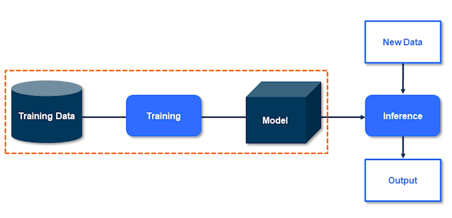{: width='400' height='400'}

We want our model to just learn the general trends. I don't want it to know each and every single data point and memorize it. So we should never memorize the individual pieces of information. Just capture the high level overview of what that data represents. That is pretty much what private AI and that's easy.

So if you don't overfit our models cannot possibly violate any privacy right? Well obviously not because if it were the case I wouldn't have been talking to you today. So let's take a look at a large language model and see how this took place. Diving a bit deeper into the smith we know that knowledge language models are trained on massive amounts of data. And even though they are not really overfitting they still exhibit memorization. As in you can reconstruct some sentences which were actually used during the training and not just reconstruct to a good degree but verbatim.

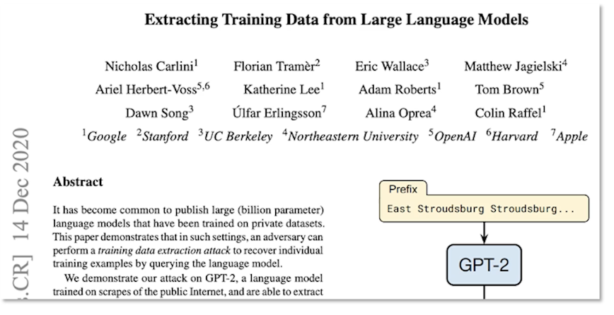{: width='400' height='400'}

Carlini et al published a paper about two years ago now about privacy risks of our darling GPT-2. Of course this model is a bit outdated but I'll go out on a limb and say GPT-3 isn't any better with respect to privacy and overfitting. So here are some examples of what happened. GPT-2 model memorized digits of Pi. So this is clearly memorization but you might argue that this is not really concerning is it? What's the problem in memorizing the digits of Pi? It's not really a bothersome issue.

But GPT-2 also memorized the contact info that appeared exactly once in the whole training data set. This has slightly bit more concerning at least to me and hopefully to some of you as well but then the authors of the paper claim that GPT-2 is a huge model 1.5 billion parameters. It achieves state-of-the-art results but still underfits web text. So if it is underfitting and yet it memorizes the sentence which appears just once and a sensitive information of that your address that's concerning.

So clearly the myth that generalization implies privacy as I already said it is a myth. The primary differences is that generalization and privacy concern themselves and optimized for very different things. Overfitting is pretty much an average case scenario whereas memorization is about the worst-case scenario. So generalization is done to boost accuracy whereas as privacy is to guard the data learned by the model even if it appears just once. So in short the modelling needn't overfit to the privacy. Even memorizing one data point is a privacy violation by itself. In simple terms private AI ensures non-memorization.

So how do we avoid memorization of sensitive information?

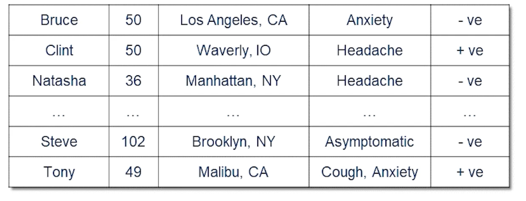{: width='400' height='400'}

Let's consider a toy dataset which is really sensitive. So let's say it's a hospital dataset of patients who have been diagnosed with COVID or rather people who have taken COVID tests.

* we could remove all the names
  * but other details may still be enough for the model to identify a person based on their details
* bucketing some details/features helps to anonymize the data
  * for example 1)Under 30, 2)30-60 3) over 60
  * may need to put multiple features into buckets to prevent accidental identification
* for remaining uniqueness removal may be warranted, or duplication
  * Not every patient has a cough for instance or not every patient is asymptomatic.

This is called key anonymity

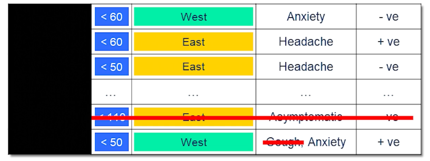{: width='400' height='400'}

This is one of the first and was widely used approach to preserving privacy of sensitive data and it is very intuitive because you're anonymizing you're not really revealing sensitive information about any individual.

It seems to do the trick but what is the problem in this?

* It's a bit too subjective especially for privacy experts who are considered about worst-case scenario.
  * what columns are sensitive? Is it name? Is it age? Is it location? Is it something else? Who knows?
* we duplicated certain records.
  * what did they duplicated? How many similar records is sufficient?
* Finally all the techniques listed above don't provide any guarantee of anonymity

Differential privacy tries to address these short comings. 

### Differential Privacy

Let's first define privacy in the context of differential privacy.

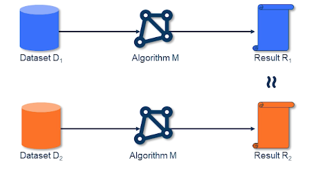{: width='400' height='400'}

* Suppose we have a dataset D1 that is input to an algo M1 and results in R1
* pluck some random datapoint from D1, and remove it
  * Now we have D2 = D2 - {x} and we will pass this into our Algo M1 to get R2
* now we compare R1 and R2
  * if they are similar then we may say that the privacy of x is preserved
* What do we mean by similar?
  * it means that the output doesn't meaningfully change irrespective of whether your data was looked at or not

The mathematical formulation 

$$
\forall adjacent(D_1, D_2), \forall x, PR[M(D_1) = x ] \leq e^\epsilon Pr[M(D_2)=x]
$$

* ie the ratio between the two probability distribution is smaller than some epsilon
* this mechanism is called Epsilon Differentially Private

So let's see how we achieve this in practice.

And as the title says of course it is by adding some noise. Say that our COVID positive patients in the hospital database. And the attacker asks from the hospital for research purposes as to how many patients are COVID positive. The hospital doesn't want to disclose this information as it's the accurate information. But they understand that this is important for research and they want to give a rough count but not just roughly anything. They want to be able to mathematically help the researchers. So how do they do that? They add some noise. Let's say the sampling noise from other plus distribution of scale one by three. So scale of one by three corresponds to n Epsilon of three. And the samples are noise added to the real count which is and then supply resultant count to the researcher. The resulting count can then be the average of two and depending on what the randomized noise type of sample is. And the target contests for short is what's the number is. In the sense that preserves the privacy. But if the attacker gets a lot of issues a lot of search queries then the get a sense that the actual count is about . But then that leads to price leakage which I'll come to later.

So how much noise to add? This depends on how much one person affects the database, aka sensitivity of the mechanism. So for taking the COVID district sample again say you have gotten your COVID test on exactly once. Then removing your records will differ the count by at most one because you correspond to just one data point. However if you have gotten this to say times then just removing one record would not really preserve your privacy. But if I remove all your records that will change the count by 10. So to mask your presence I would have to add more noise. But then I can't just add noise only for you. I'll have to add it for everyone. So the noise that I add would be a lot more and it will skew the results a lot more.

This is important. The noise is not just a magic number it is related to the dataset. And it depends on how much one record or one unit it could be a person it could be a data point affects the privacy and the dataset. That's the question.

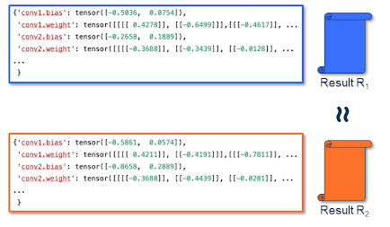{: width='400' height='400'}

In this case the mechanism is about generating a model. So instead of adding noise to the count we add noise at the place where have we learned from the data. Learning from data and SGD is through gradients that we use to then update the model parameters. So if at all we were to capture those gradients and then add noise to that that should suffice and we will guarantee some privacy. So we just do that.

We add noise to the gradients and right now we now have a DP mechanism. This is also called DP-SGD it's just that simple.

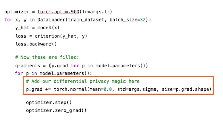{: width='400' height='400'}

There's one important point that I want to mention and highlight is that once this noising is done privacy has been introduced. You can then go ahead and do any data independent prosperous singles your model your parameters and what have you and the result will still be private because the noise has already been added. There is a very vigorous mathematical proof which either not included in this lecture but you can definitely go ahead and read it. But that is extremely important and a very useful property of DB which is worth keeping in mind.

### Stochastic Gradient Descent

Concerned about the worst case scenario and do not want a single record to be memorized.
Problem with this is gradient descent updates are aggregated over a batch and the normal gradient of each sample is unbounded. So removing one sample form the dataset does not change the gradient to the same degree as removing any other sample. 

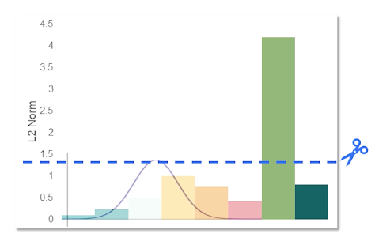{: width='400' height='400'}

To preserve the privacy, we have to add the noise equivalent to the most contributing gradient. Doing so, of course, hurts the performance because the norms of other gradients due to other data samples are not as much. One simple way to address this instead is to just clip the gradients as we generally do to achieve generalization and then add noise. 

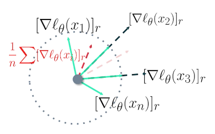{: width='400' height='400'}

Let's see things in a slightly different way (Same meaning but different visualization)

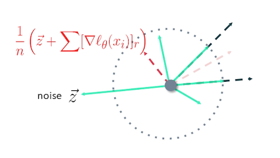{: width='400' height='400'}

We can clip them, aggregate them, and then add some noise, and go on to update the model. 

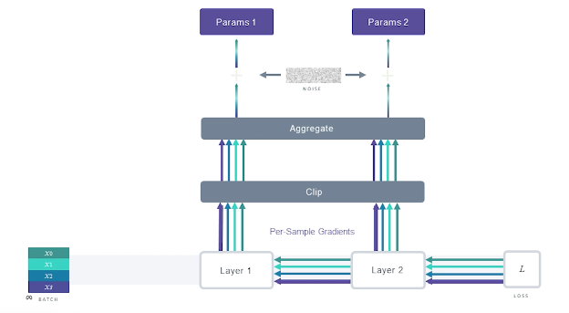{: width='400' height='400'}

In backward step with DP-SGD, we do things slightly differently, essentially during back propagation we clip the gradient when updating the parameters.

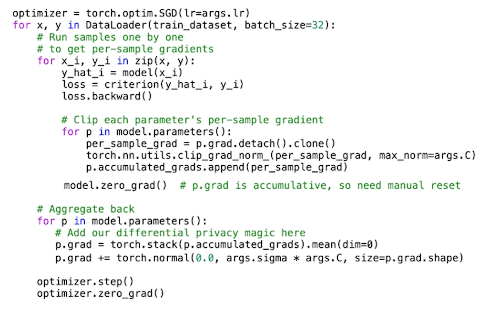{: width='400' height='400'}

This is the SGD in code with differential privacy magic. This code is not optimized but there is a vectorized version out there for you to go explore.

### DP-SGD in Practice

Let's look at how the different parameters affect essentially private training.

EPOCHS
* Epochs generally decrease privacy. As the number of epochs increases your privacy and other decrease. And you can think of this as your modern query about the same sample multiple times. I was looking at the same sample multiple times to learn from it and even though it is receiving a noisy answer, with enough number of queries it will end up closer and closer to the actual value and thus memorize the real value of the higher probability.
* So similar to our example that the hospital and dataset where the person was asking for the number of COVID positive patients and the hospital was adding noise to the value of hundred before returning the value. If the attacker had asked the hospital over and over again with the same question asking about the number of COVID positive patients the hospital would of course add some noise to the actual value and return the number.
* But over many queries an attacker could figure out that the true value is close to and over infinite number of queries even precisely see what the actual number was. And this is what it means to have high number of epochs as well. So in general a higher number of epochs decreases privacy.

Batch Size

* Generally bigger batch sizes means better privacy. We add the same amount of noise based on the max norm of one sample to the whole batch irrespective of the batch size. Recall that we clip the gradients of the whole batch first, we aggregate, and then add noise. So the larger the batch size intuitively it's better for privacy.
* However your privacy accounting could be very different. So what's sample accountings? There is a higher privacy cost with larger batches because it grows in the order of square root of batch size. This is the RDP that many differential privacy accountant. So in practice I would recommend to leave a different combinations of batch sizes and noise multipliers for a desired privacy cost and see what works best for you.

Noise & Clipping

* This is a no-brainer more noise needs some more privacy more aggresive to the bank means more privacy again because you are really burning all the gradients to the same load but if anybody is guessed and there's no prize for this. You will get terrible performance with lots of noise and lot of flooding. So this is where we have to really balance.
* So how do we do this? Are there any issues with convergence? Yeah absolutely models may not converge due to noisy gradients. So I would just say play with noise multiplier and clipping and see what you are confident with. Typically noticed in smaller models where convergence is not happening. Not so much in deeper models because they have a lot more parameters. However deeper models need more noise. So it's just part of your experimentation.
  * Smaller models may not converge due to noisy gradients
  * Deeper models may still be ok as the need more noise

Memory Usage
* How does DP-SGD affect your memory usage? This is crucial and important. We compute possible gradients which increases the memory footprint. In standard SGD libraries like pytorch and TensorFlow they don't really capture the gradients of every single sample, they do it for the whole batch, and they aggregated and the computed in an aggregated way. But we have to calculate for sample gradients clip it and then aggregate. So since we have to capture these first sample gradients this increases our memory footprint and to counter this we typically use lower batch sizes but as discussed before batch sizes may or may not increase your privacy cost depending on your accountant.
* Another option to do this would be to use virtual batches. Apart from smaller batch you can use virtual batches where you keep your memory footprint low but artificially increase the batch size in the sense that you capture both sample gradients one virtual batch at a time clip it aggregate it store that in memory and do a couple of more batches. And once you have sufficient samples to reach your ideal batch size then aggregate and noise it. So that way you don't really have to keep track for sample gradients for the whole batch for just one parameter, p, sub batch at a time.

Module Compatibility

* So this is another important point. Not all modules are compatible with differential privacy. So Batch Norm is a very good example. So what is Batch Norm? Basically depends on every other sample in the batch denormalize and since privacy is concerned about a single data point. If you are looking at other samples in the same batch you are forgoing privacy of those data points. Batch norm is not really compatible with DPAs nothing to do with the library the module itself is not compatible and that is one of the so-called downsides but it's not too bad. You can always use other normalization techniques. Group Norm for instance Instance Norm, Layer Norm. All these are very much supported by DP and they're compatible. It has been shown that they don't really affect the model performance so much.

Pretrained Large NLP models

* How about NLP when we have huge models with a lot of layers. One of the common practice is to freeze the lower layers and only fine-tune the upper layers and most of us take the model as this because it has been trained on Open Web data which is open to everyone and hence this does not have any sensitive information. But then let's say you want to fine-tune an open-source off the shelves large language model on say your hospital data. Freeze the model is just fine-tune your upper layers using your dataset with DP and that should be good enough because the layers that have already been trained doesn't really get a bit and intense doesn't do it from the data and evidence doesn't disclose any private information.

### What's Next?

This is still a budding domains so there are many open questions. And I'm hoping that this lecture probably inspires some of you to look deeper into this and potentially contribute to this field. The important is known to us for a long time and it's becoming more and more of that and a lot of regulations also outside.

What other questions?

* how do we learn to learn with DP? I mean as you solve DP does introduce some noise does have some cost as we'll see it slipping on the performance.
* So differentially private model performance is not as good as a non DP so can be learned with DP or are there any better architectures?
* Are there any activation function or loss function so optimizations that are friendlier with DP.
* Smaller models. Naturally we have fewer parameters and because we have fewer pattern meters so we have to add less noise and hence they provide better privacy candies.
* TanH activation seems to perform better than ReLU activations in DP setting. So trying out these different architectures and activation functions and whatnots could definitely be one of the approaches.

Alternatives to DP-SGD: PATE, DP-FTRL

And the last one is figured out binarization. So DP has looked at the worst-case scenario of guaranteeing privacy for every single sample. But in practice is it really that bad? How bad is the model? I mean there are definitely papers which have attack models and reconstructed back the samples that were use for training. But what if we can have a higher epsilon but show that our model is resistant to a data.

There are a lot of people talking about detecting memorization but black-box attack vs white-box attack. They helped addressing two questions. One is showing that differential privacy is definitely worth it. I mean it's so easy to adapt models that you better have DP while training your models. And second one is also to show that here your model is differentially private. Yes the epsilon seems to higher and higher epsilon means higher probability to strengthen your price. So low privacy guarantee. But then it's not necessarily too bad because all the students that aren't really generating any or revealing any information.

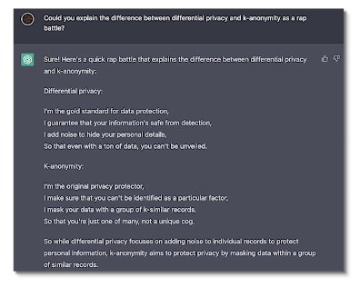{: width='400' height='400'}

But I do want to leave you with one final thing. ChatGPT is all the rage these days and I just passed it to give you a rap battle between differential privacy and key anonymity. And this is what it spit out. I'm so impressed by the accuracy of the definitions as well as the creative ingenuity. I couldn't resist from sharing this with you. So I'll share this and with that I say thank you and have a wonderful rest of your day.

<!--  -->