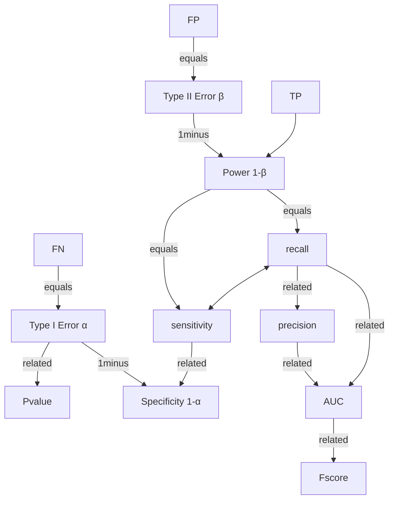

## Objective

This is not a post on metrics or explaining what they are, but sharing my personal way of interpretation and how i memorize / associate different metrics 

## Pre-req 

Understanding of metrics and how it is being used in Data Science :grin:. 

## False Positive

Sometimes it is easy to forget what does `False Positive` or `False Negative` means,

Just remember, your model's job is always to predict `True` or `False`. If it is true, it means your model is correct. If it is false, your model is wrong. 

The second part is simply the labels. Thus False Positive is your model is wrong at marking something positive. False negative is your model is wrong at marking something negative. 

$$\underbrace{True/False}_{\text{prediction}}\text{  } \underbrace{Positive/Negative}_{\text{labels}}$$

So when you have a `False Positive` data point, the ground truth is `Negative`. So the population of all `Negative` class is `True Negative` and `False Positive`. 

Similarly, when you have a `False Negative` data point, the ground truth is `Positive`. So the population of all `Positive` class is `True Positive` and `False Negative`. 

## Hypothesis testing

The null hypothesis is always the negative class. 

`N`ull $\implies$ `N`o evidence $\implies$ `N`egative.

With that, 

|                             |                  Null is true                  |                 Null is false                  |
| :-------------------------: | :--------------------------------------------: | :--------------------------------------------: |
| Decision:   Don't reject |    True Negative (TN)   Correct Decision    | False Negative (FN)   Type II error $\beta$ |
|    Decision:   Reject    | False Positive (FP)   Type I Error $\alpha$ |   True Positive  (TN)   Correct Decision    |

It is helpful to think of these metrics in the context of healthcare. A patient goes for a medical checkup and we assume the patient to be healthy (null hypothesis). The alternative is he is tested positive for illness. 

`False` represents a bad decision made, it means an error was made. In hypothesis testing the `N`ull hypothesis always comes first, and the patient is wrongly classified as being tested positive. So rejection of the null hypothesis is a `Type I Error` in the case of a `False Positive` while `False Negative` is known as `Type II Error` - Fail to detect the patient is sick when the patient is actually sick. 

### Mapping

This is my mental map of how I relate all the metrics

### Story time

By default, a patient goes to a hospital for checkup, the default assumption (null hypothesis) is that the patient is healthy until proven other wise with tests. 

When the patient goes for checkup, there are 4 scenarios that can happen:

1. He is healthy and the tests reflects that he is healthy (do not reject null)
2. He is healthy and the tests reflects that he is NOT healthy (wrongly reject null) - Type I Error
3. He is not healthy and the tests reflects he is not healthy (rightfully reject null)
4. He is not healthy and the tests reflect that he is healthy (failed to reject null) - Type II error

As a patient, you always prefer the first case over the second, and second over the third, and third over the forth - the last thing you want is an illness undetected. 

In the type 1 error, you would go for a `SP`ecificity test. Since you are already diagnosed with illness, further positive diagnosis would further justify you `IN`. (Think of this as further testing for double confirmation that you are sick). If the additional tests returns negative, you are declared negative. 

`SPIN` : `SP`ecific test `P`ositive rule `IN` disease. 

In the type 2 error, you would go for more `S`e`N`sitive tests. Think of this as seeking additional tests to detect any illness you might possibly have. If the additional tests returns positive, you are declared sick. Hence `Sensitive` is sometimes referred as `Recall`. 

`SNOUT`: `S`e`N`sitive tests `N`egative rule `OUT` disease.

### Formulas

|                                         Metric                                         |           Formula           |                               Description                                |
| :------------------------------------------------------------------------------------: | :-------------------------: | :----------------------------------------------------------------------: |
|             Type I Error $\alpha$,   p-value,   False Positive Rate              |     $\frac{FP}{FP+TN}$      |       How many patients detect as sick that are actually not sick        |
| True Negative Rate,     Specificity ,   1 - Type I Error $\alpha$,     `SPIN` |     $\frac{TN}{TN+FP}$      |        How many patients detected not sick are actually not sick         |
|                    Type II Error $\beta$,   False Negative Rate                     |     $\frac{FN}{FN+TP}$      |        How many patients detected not sick that are actually sick        |
|      True Positive Rate ,  Power,   Recall ,  Sensitivity,   `SNOUT`       |     $\frac{TP}{TP+FN}$      | How many sick patients you manage to detect sick that are actually sick. |
|                  Positive Predictive Value (PPV),        Precision                  |     $\frac{TP}{TP+FP}$      |      Among all tests that are marked sick, how often is it correct?      |
|                  False Discovery Rate        ,            1 - PPV                   |     $\frac{FP}{TP+FP}$      |     Among all the tests that are marked sick, how often is it wrong?     |
|                            Negative Predictive Value (NPV)                             |     $\frac{TN}{TN+FN}$      |    Among all tests that are marked healthy, how often is it correct?     |
|                      False Omission Rate     ,        1 - NPV                       |     $\frac{FN}{TN+FN}$      |     Among all tests that are marked healthy, how often is it wrong?      |
|                                Accuracy ,  PPV + NPV                                | $\frac{TP+TN}{TP+FP+TN+FN}$ |                   How many of your tests are correct?                    |

### F-score 

$$F_{\beta} = (1+\beta^2) \frac{\text{precision} \cdot \text{recall}}{(\beta^2 \cdot \text{precision}) + \text{recall}} $$

In the case of $F_1$ score, $\beta=1$:

$$\begin{align}
F_1 &= (1+1) \frac{\text{precision} \cdot \text{recall}}{(1 \cdot \text{precision}) + \text{recall}}\\
&= 2 \frac{\text{precision} \cdot \text{recall}}{\text{precision} + \text{recall}}
\end{align}
 $$

## Resources

The following links are my go-to if i need to remember/refresh about a particular metric. 

[Understanding what is AUC](https://www.youtube.com/watch?v=OAl6eAyP-yo)

[F1-score vs AUC vs PR AUC](https://neptune.ai/blog/f1-score-accuracy-roc-auc-pr-auc)

[Stanford 229 metrics cheatsheet](https://stanford.edu/~shervine/teaching/cs-229/cheatsheet-machine-learning-tips-and-tricks)